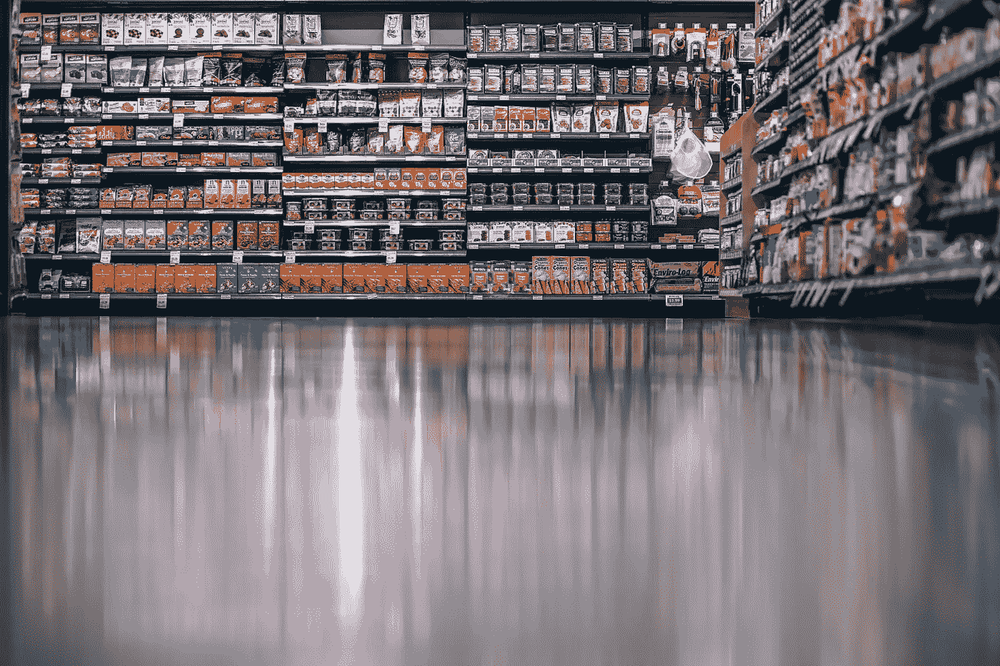

# OpenCV 中使用模板匹配识别空闲货架空间

> 原文：<https://medium.com/analytics-vidhya/identifying-empty-shelf-spaces-using-template-matching-in-opencv-6be8d4caa80e?source=collection_archive---------5----------------------->

## 查找丢失产品的位置:



图片来自 [Pixabay](https://pixabay.com/?utm_source=link-attribution&utm_medium=referral&utm_campaign=image&utm_content=3105629) 的 Igor Ovsyannykov

假设你是一名在 Trader Joe's 工作的员工，被要求在商店里走动，检查需要重新进货的货架。不幸的是，你不能简单地使用你的手持库存扫描仪来查看一个被购买的产品是从哪里被取走的。超市有时会有多个区域存放特定的产品，因此很难跟踪购物者从哪个位置取走产品。最重要的是，报告库存的空货架空间可能很耗时，并且总是存在人为缺陷的可能性。这就是通过计算机视觉识别空货架空间可能派上用场的地方。

# TL；速度三角形定位法(dead reckoning)

我们创建两个唯一的模板，遍历图像以找到足够相似的多维数组。相似性基于我们的可配置阈值。 [**Jean Rovani**](https://sicara.ai/blog/en/author/jean-rovani) **的** [**模板匹配**](https://www.sicara.ai/blog/en/object-detection-template-matching) **博客和代码在这个项目中对我帮助很大，让我可以实现 OpenCV 的 *matchTemplate* 函数的模板。**

# 模板匹配

有几种方法可以通过计算机视觉来实现这一点，其中一些比另一些更好，然而，对于这个博客，我们将尝试使用*模板匹配*。以下是 OpenCV 自己对它的定义:

> 模板匹配是一种在更大的图像中搜索和找到模板图像的位置的方法。OpenCV 为此提供了一个函数[**cv . match template()**](https://docs.opencv.org/master/df/dfb/group__imgproc__object.html#ga586ebfb0a7fb604b35a23d85391329be)。它简单地在输入图像上滑动模板图像(如在 2D 卷积中)，并在模板图像下比较输入图像的模板和补片。

模板匹配的第一步是创建我们的模板。

当看上面的照片时，我们可以立即识别出中间顶部 2 个货架有空的空间。在最上面的货架上，我们可以确定有 3-5 件白色袋子产品需要重新进货。在第二个货架上，我们可以看到大约有 2 种产品需要重新进货。

**注意:**由于阴影和不同的背景颜色，空的顶层搁板看起来与第二层搁板不同。因此，我们将使用 2 个模板。

首先，让我们用 Python 加载下图:

```
import cv2
import matplotlib.pyplot as plt
import numpy as npimg = cv2.imread("/content/drive/MyDrive/Computer Vision/new_shelf.jpg")
plt.figure(figsize = (20,15))
plt.imshow(img)
```

下面是创建我们特定模板的代码(注意 *template_2* 由于更小的空白区域而变得更窄):

```
template_1 = img[60:270, 1890:2010]
plt.imshow(template_1)template_2 = img[300:500, 1825:1905]
plt.imshow(template_2)
```


模板 1(顶部中间搁板)


模板 2(第二个中间搁板)

如果你愿意，你可以试试模板的大小，我发现这些最合适。此外，如果你想知道为什么模板颜色看起来与原始图像不同，这是因为 *CV2* 将图像加载为 *BGR* 而不是 *RGB。*

# 匹配过程

现在我们有了模板，我们可以开始匹配过程。为此，我们首先将模板存储为一个具有不同属性的类，如 label (1，2)和 color(以区分我们为不同模板绘制的矩形框)。**又来了，巨大的喊单** [**让·罗瓦尼**](https://sicara.ai/blog/en/author/jean-rovani) **齐** [**模板匹配**](https://www.sicara.ai/blog/en/object-detection-template-matching) **博客及代码:**

```
*******************************************************************/
* Title: template_defenition.py
* Author: Jean Rovani
* Date: 2020
* Code version: 3rd revision
* Availability: [https://gist.github.com/jrovani/012f0c6e66647b4e7b844797fa6ded22#file-template_definition-py](https://gist.github.com/jrovani/012f0c6e66647b4e7b844797fa6ded22#file-template_definition-py)
*******************************************************************/DEFAULT_TEMPLATE_MATCHING_THRESHOLD = 0.85class Template:
    def __init__(self, label, template, color, matching_threshold=DEFAULT_TEMPLATE_MATCHING_THRESHOLD):
        self.label = label
        self.color = color
        self.template = template
        self.template_height, self.template_width = self.template.shape[:2]
        self.matching_threshold = matching_thresholdimage = cv2.imread("/content/drive/MyDrive/Computer Vision/shelf_new.jpg")templates = [
    Template(label="1", template = template_1, color=(0, 0, 255)),
    Template(label="2", template = template_2, color=(0, 255, 0))
]
```

接下来，我们遍历我们的图像，并存储每个满足或超过阈值要求(本例中为 0.85)的数组的数据。

```
*******************************************************************/
* Title: plot_bounding_boxes.py
* Author: Jean Rovani
* Date: 2020
* Code version: 6th revision
* Availability: [https://gist.github.com/jrovani/099f80a5ee75657ff7aa6ed491568f04#file-plot_bounding_boxes-py](https://gist.github.com/jrovani/099f80a5ee75657ff7aa6ed491568f04#file-plot_bounding_boxes-py)
*******************************************************************/detections_1 = []
detections_2 = []
for template in templates:
    template_matching = cv2.matchTemplate(
        template.template, image, cv2.TM_CCOEFF_NORMED
    )
match_locations = np.where(template_matching >= template.matching_threshold)
for (x, y) in zip(match_locations[1], match_locations[0]):
        match = {
            "TOP_LEFT_X": x,
            "TOP_LEFT_Y": y,
            "BOTTOM_RIGHT_X": x + template.template_width,
            "BOTTOM_RIGHT_Y": y + template.template_height,
            "MATCH_VALUE": template_matching[y, x],
            "LABEL": template.label,
            "COLOR": template.color
        }
        if match['LABEL'] == '1':
          detections_1.append(match)
        else:
          detections_2.append(match)
```

现在我们已经有了检测的所有数据，让我们使用 *cv2.rectangle* 函数来看看它们在原始图像上的样子:

```
image_with_detections = image.copy()
for temp_d in [detections_1, detections_2]:
  for detection in temp_d:
      cv2.rectangle(
          image_with_detections,
          (detection["TOP_LEFT_X"], detection["TOP_LEFT_Y"]),
          (detection["BOTTOM_RIGHT_X"], detection["BOTTOM_RIGHT_Y"]),
          detection["COLOR"],
          2,
      )
plt.figure(figsize = (20,15))
plt.imshow(image_with_detections)
```


模板匹配重复

我们有发现了。这里的问题是*检测*列表存储了重复项。要解决这个问题，我们只需确保只使用不与另一个矩形重叠的矩形:

## 消除重复检测

```
#Sorting detections by BOTTOM_RIGHT_X coordinate
detections_1 = sorted(detections_1, key = lambda i: i['BOTTOM_RIGHT_X'])
detections_2 = sorted(detections_2, key = lambda i: i['BOTTOM_RIGHT_X'])det_wo_dupl_1 = [detections_1[0]]
det_wo_dupl_2 = [detections_2[0]]
check = 1
min_x_1 = templates[0].template.shape[1]
min_x_2 = templates[1].template.shape[1]for d in range(1, len(detections_1)):
  min_x_check = detections_1[d]["BOTTOM_RIGHT_X"] - detections_1[d-check]["BOTTOM_RIGHT_X"]
  if min_x_check > min_x_1:
    det_wo_dupl_1.append(detections_1[d])
    check = 1
  else:
    check += 1check = 1
for d in range(1, len(detections_2)):
  min_x_check = detections_2[d]["BOTTOM_RIGHT_X"] - detections_2[d-check]["BOTTOM_RIGHT_X"]
  if min_x_check > min_x_2:
    det_wo_dupl_2.append(detections_2[d])
    check = 1
  else:
    check += 1det_wo_dupl = det_wo_dupl_1 + det_wo_dupl_2
print(len(det_wo_dupl))
```

## 绘制过滤的检测

```
image_with_detections = image.copy()
min_x = templates[0].template.shape[1]for detection in det_wo_dupl:
    cv2.rectangle(
        image_with_detections,
        (detection["TOP_LEFT_X"], detection["TOP_LEFT_Y"]),
        (detection["BOTTOM_RIGHT_X"], detection["BOTTOM_RIGHT_Y"]),
        detection["COLOR"],
        20,
    )
plt.figure(figsize = (20,15))
plt.imshow(image_with_detections)
```


无重复的模板匹配

绝对看起来好多了。

# 模板匹配缺点

1.  有人可能会争辩说，实际上应该有 5 个矩形显示在顶层货架上，因为其中一个袋子似乎有点倾斜/移动。使用模板匹配，很难发现这一点。
2.  我们需要不同大小的多个模板来捕捉这个图像中所有的空货架区域。
3.  如果只有模板匹配，我们将如何处理下面的空白？


# 结论

尽管模板匹配对于我们的用例来说工作得很好，对于许多其他用例来说也是一个很好的计算机视觉过程，但它可能不是这个场景的最佳选择。对于这样的问题，我们需要一种算法来学习理解一个空白区域的周围产品。这将允许更大的灵活性，因为它将能够处理不同大小/颜色的空白区域。

Ronel Sylvester 是 Predmatic 的 ML 工程师，在音频分类、深度学习、计算机视觉/图像处理和预测方面拥有丰富的经验。Predmatic 是一家基于数据科学和人工智能的咨询公司，提供高影响力和可扩展的业务解决方案。