# python 中的梯度下降及其示例

> 原文：<https://medium.com/analytics-vidhya/if-we-have-any-function-and-we-want-find-the-extremum-of-that-function-whether-it-is-minima-or-3dd53d89ea40?source=collection_archive---------1----------------------->

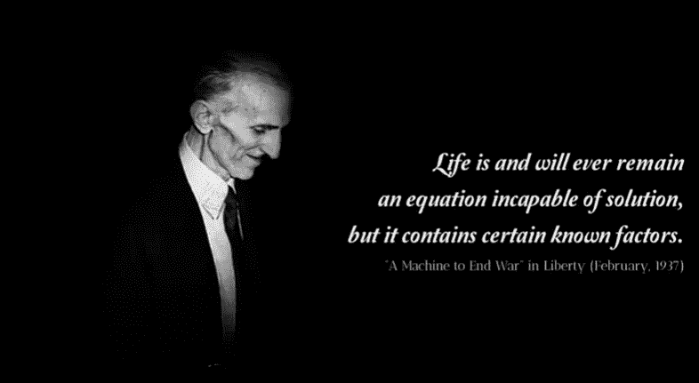

如果我们有任何函数，我们想找到这个函数的极值，不管它是最小值还是最大值，我们使用梯度下降优化技术。所以在这篇博客中，我们将看到 python 中的梯度下降及其变体。这篇博客假设你已经知道一点关于导数和线性回归的知识

让我们有函数 y=f(x)=x**2+3

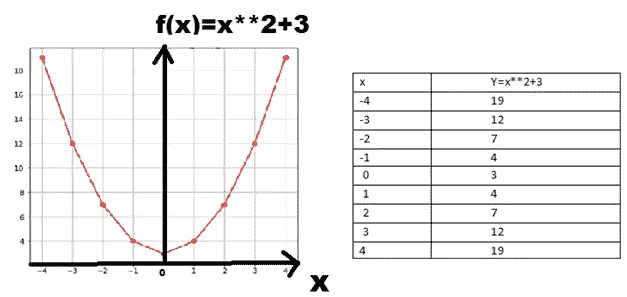

现在我们可以看到，最小值出现在 x=0 时。现在，如果我们想找到任何函数的最小值，我们对变量(x)求导，然后使它等于 0。

Y= x**2 +3

dy/dx=d(x**2+3)/dx

dy/dx=2x

2x=0 #等于零

X=0

所以当 x=0 时，我们会找到这个函数的最小值。

Y=0**2+3=3

所以 3 是我们在这里能得到的最小值。

函数可以有多个局部最小值或最大值，但它只能有一个全局最小值或最大值。

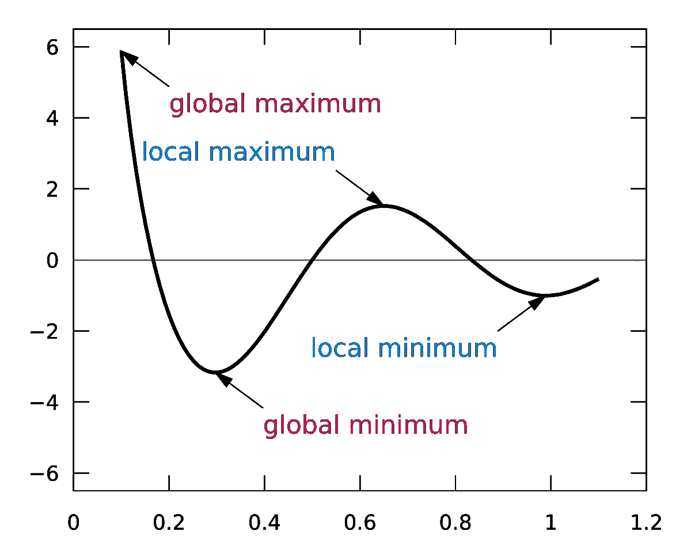

但有时函数可能很复杂，所以如果你想找到最小值和最大值，仅仅通过求导等于零(dy/dx=0)并不总是可行的。比如说。F(x)=log (1+ exp(ax))现在解这个方程并不简单，所以梯度下降法可以解决这个问题。

# **梯度下降:**

梯度下降是迭代算法。首先我们猜测变量(x)是什么。

F(x)=x**2 在这个方程中，唯一的变量是 x，这个函数也可以有多个变量。为了便于理解，我仅举一个简单的例子**。**

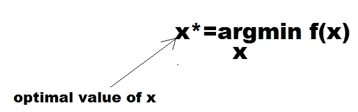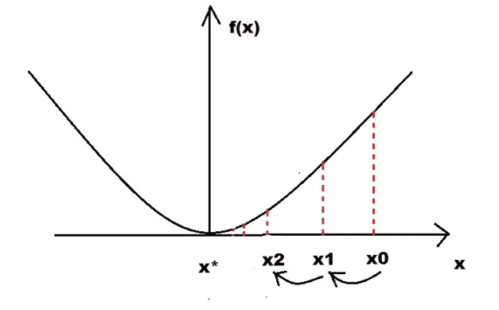

所以 x*是最佳值，我们可以得到函数的最小值。最初你随机选择 x0 点。然后我们试图找到比 x0 更接近 x*的 x1。

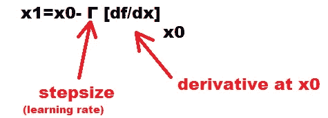

上述方程称为更新函数。其中，γ(gamma)是步长，而[df/dx]xo 是 x0 处的导数，因此我们得到 x1。所以我们继续这样做，直到达到我们的最佳点 x*。

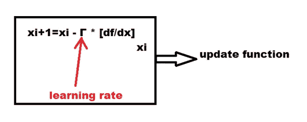

对于第一次迭代，它进行大的跳跃，然后跳跃的大小随着迭代而减小。这也取决于学习速度，它会有多大的跳跃。我们必须选择合适的学习速度。

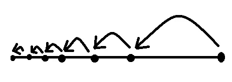

所以我们知道直线 y= mx+ c 的函数，这个函数也是我们用于线性回归的函数。为了便于理解，我们将设计一个函数，为了便于计算，我将忽略偏差项(截距)。

所以让 y_pred=w * x 让这里我们取值 w=0.5，实际上我们必须计算 w 的值，但是这里我们是为了理解的目的而设计实验。

假设给定一个人的身高，我们就得预测体重。我们有 10 名学生

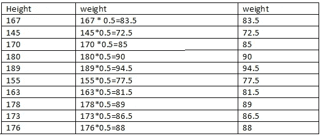

所以我们有了身高，如果我们知道 w，我们就可以预测体重。所以我们必须计算最佳 w*，它可以减少实际值和预测值之间的误差。我们知道线性回归的公式。

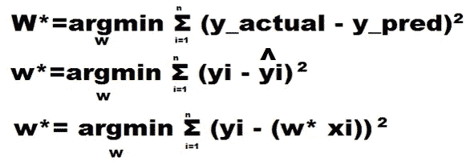

而我们可以通过梯度下降找到最优 w*。

# **为什么随机梯度下降？**

在上面的等式中，如果数据集很大，例如我们的数据集大小以百万计，那么对于权重的每次更新，我们必须遍历所有的数据点并计算数百万次导数，所以这在计算上非常昂贵，所以这里随机梯度下降非常有用，这是梯度下降的一种变体。实际上梯度下降有三种变体。

设 n =数据点的总数

**1】随机梯度下降**:批量=1

2] **小批量梯度下降**:批量=k(其中 1 < k < n)

3] **批量梯度下降**:批量= n

**1】随机梯度下降(SGD):** 在 SGD 中，权重更新发生在处理每个数据点之后，因此反向传播发生在处理每个数据点之后。

现在，在每次迭代中，我们使用 1 个点，计算梯度并更新权重。

让 n=1000

所以批量=1

像这样，我们需要多少次迭代来遍历整个数据集？

1000/1=1000

现在我们执行 1000 次迭代，称为一个时期。

**2】迷你比赛梯度下降:**

n=1000

迷你批量=k=5 ( k 应为:1 < k < n )

now at each iteration we use 5 data points calculate the average gradient and update the weight .

like this how many iteration do we need to traverse the whole dataset?

1000/5=200

Now we perform 200 iteration and its called one epoch.

**3】批量梯度下降:**

N=1000

批量=1000

现在，在每次迭代中，我们使用 1000 个点，计算平均梯度并更新权重。

像这样，我们需要多少次迭代来遍历整个数据集？

1000/1000=1

这不过是梯度下降。当批量大小=数据点的数量时，它只是梯度下降。

随机梯度下降比批量梯度下降收敛更快。可能会比较吵，但是收敛比较快。


让我们看看 python 中的代码

首先，我们创建了数据集。x =人的身高，y =人的体重

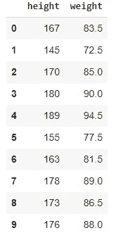

然后我们有了成本函数。

计算每个点的导数

# **批量梯度下降或常规梯度下降**

这里我取学习率非常小γ= 0.000001，因为我的数据集大小非常小 n=10。通常我们把学习率定在 0.01 或 0.001 或 0.1 左右。

```
optimal value is 0.48597498598079936
```

我们可以看到它是如何向最优 w 收敛的，这里是 0.5，我们已经接近它了，这里是 0.458585858686

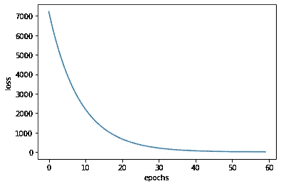

# **随机**梯度下降

```
optimal value w is  0.4999999999999996
```

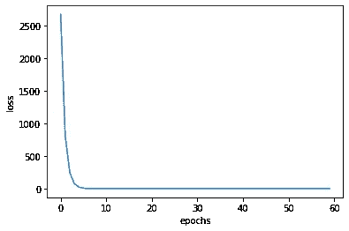

# 小批量梯度下降

```
optimal value w is  0.4999314426019738
```

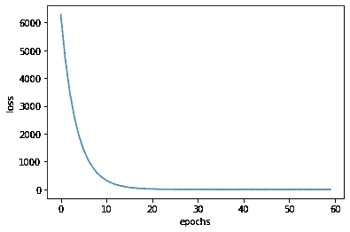

# **比较梯度下降的所有变量**

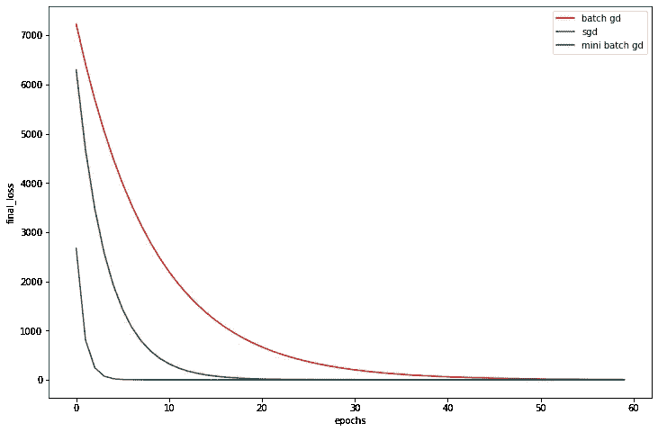

# **结论:**

我们可以看到，尽管 sgd 可能有噪声，但它比常规梯度下降收敛得更快。我们可以将小批量梯度下降视为批量梯度下降和随机梯度下降的平均值。

# **参考:**

[](https://www.appliedaicourse.com/) [## 应用课程

### 我们知道转行是多么具有挑战性。我们的应用人工智能/机器学习课程被设计为整体学习…

www.appliedaicourse.com](https://www.appliedaicourse.com/)