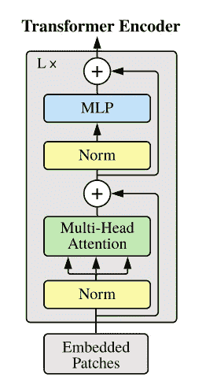

# 图解视觉变形金刚

> 原文：<https://medium.com/analytics-vidhya/illustrated-vision-transformers-165f4d0c3dd1?source=collection_archive---------8----------------------->

# 介绍

自从 2017 年推出 Transformer 以来，在自然语言处理(NLP)领域取得了巨大的成功。几乎所有的 NLP 任务都使用了变形金刚，并且取得了巨大的成功。与 rnn 和 LSTMs 相比，Transformer 有效的主要原因是它处理长期依赖性的能力。在 NLP 中获得成功后，有各种各样的方法将其用于计算机视觉任务。Dosovitskiy 等人的论文[一幅图像相当于 16x16 个字:用于图像识别的变形金刚](https://arxiv.org/abs/2010.11929)提出使用变形金刚，并在各种计算机视觉任务中取得了一些很好的结果。

Vison Transformer (ViT)在训练模型时使用了非常大的数据集。在 ImageNet(纸张将 ImageNet 标记为中型数据集)等数据集上进行训练时，模型的准确性低于 ResNets。这是因为转换器缺乏归纳偏差，如翻译等变和局部性，因此当在不充分的数据上训练时，它不能很好地概括。

# 视觉转换器概述

*   将图像分割成小块
*   提供这些补片的线性嵌入序列，作为 transformer(展平图像)的输入。在这里，图像补片被视为与令牌相同的方式(如在 NLP 任务中)
*   向每个补丁嵌入添加位置嵌入和可学习嵌入`class`(类似于 BERT)
*   通过 Transformer encoder 传递这些(补丁+位置+ `class`)嵌入，并获得每个`class`令牌的输出值
*   将`class`的表示通过 MLP 头，得到最终的类预测。

# 方法

**来源:** [**谷歌 AI 博客**](https://ai.googleblog.com/2020/12/transformers-for-image-recognition-at.html)

上图描述了视觉转换器的概况。如图所示，给定图像，图像被分割成小块。这些图像碎片被展平，并作为一系列标记传递给转换器编码器。与面片嵌入一起，位置嵌入也作为输入传递给转换器编码器。在这里，位置嵌入与面片嵌入一起添加，以保留位置信息。

# 如何将一幅图像转换成一系列矢量，并输入到 transformer 编码器中？

让我们通过拍摄大小为 256 * 256 * 3 的 RGB 图像来解码上图。第一步是从输入图像创建大小为 16 * 16 的面片。我们可以创建总共 16 * 16 = 256 个补丁。将输入图像分割成小块后，另一个步骤是线性放置所有分割的图像。该图显示第一个补片位于最左侧，最右侧位于最右侧。然后，我们线性投影这些小块以获得$1 * 768$矢量表示。这种表示被称为补丁嵌入。补丁嵌入的大小变成$256 * 768$(因为我们总共有 256 个补丁，每个补丁表示为$1 * 768$向量。

接下来，我们预先考虑可学习嵌入`class`令牌和位置嵌入以及补丁嵌入，使得大小为 257 * 768 美元。这里，位置嵌入用于保留位置信息。将图像转换成矢量表示后，我们需要按顺序发送图像，因为转换器不知道补丁的顺序，这与 CNN 不同。因此，我们需要手动添加一些关于补丁位置的信息。

# 视觉转换器的组件

由于 Vision Transformer 基于标准的 Transformer 架构，唯一的区别是它用于图像任务，而不是文本，这里使用的组件几乎相同。在这里，我们讨论视觉转换器中使用的组件及其重要性。

> *边注:如果你想深入钻研《变形金刚》，那么 Jay Alammar 的* [*这里的*](https://jalammar.github.io/illustrated-transformer/) *是个不错的起点。*

# 补丁嵌入

正如论文的名字“一个图像相当于 16 * 16 个单词的变形金刚”，论文的主要要点是将图像分解成小块。给定图像，它被重塑成 2D 展平补丁。

# 可学习嵌入`class`

可学习的嵌入被添加到嵌入的补丁中。在变换器编码器输出端的这个嵌入类的状态用作表示 y。这个分类头在预训练和微调期间被附加。

# 位置嵌入

位置嵌入和一个`class`令牌一起被添加到补丁嵌入中，然后这个令牌被输入到转换器编码器中。

# 变压器编码器

transformer 编码器是一种标准的 transformer 编码器架构，如最初的 transformer [论文](https://arxiv.org/abs/1706.03762)所示。该编码器采用嵌入的补丁(补丁嵌入、位置嵌入和`class`嵌入)。变压器编码器包括交替层的多头自我关注和 MLP 块。在每个块之前使用层归一化，在每个块之后使用剩余连接。

# 使用混合架构

以前，图像补片用于形成输入序列，形成输入序列的另一种方法可以是 CNN(卷积神经网络)的特征图。这里，从 CNN 图中提取的补丁被用作补丁嵌入。来自报纸:

> *作为原始图像补片的替代，输入序列可以由 CNN 的特征图形成。在这个混合模型中，面片嵌入投影 E(等式。1)应用于从 CNN 特征图提取的面片。作为一种特殊情况，面片可以具有 1×1 的空间大小，这意味着输入序列是通过简单地展平特征图的空间维度并投影到变换器维度而获得的。*

# 参考

*   [一幅图像相当于 16 * 16 个字:用于大规模图像识别的变形金刚](https://arxiv.org/pdf/2010.11929.pdf)
*   [ViT 博客—阿曼·阿罗拉](https://amaarora.github.io/2021/01/18/ViT.html)
*   [艾夏](https://theaisummer.com/vision-transformer/)

*原载于 2021 年 7 月 27 日*[*https://nepalprabin . github . io*](https://nepalprabin.github.io/2021/07/27/illustrated-vision-transformers.html)*。*