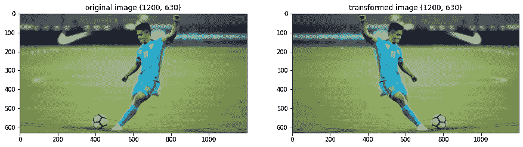

# 图像增强

> 原文：<https://medium.com/analytics-vidhya/image-augmentation-9b7be3972e27?source=collection_archive---------1----------------------->

## 改进深度学习模型

[https://miro.medium.com/max/1400/0*0Je9h2iT9m7ribFJ.png](https://miro.medium.com/max/1400/0*0Je9h2iT9m7ribFJ.png)

这篇博客是关于图像增强的 **2 部分博客系列**的一部分。它分为:-

**A 部分**:介绍图像增强，各种增强技术，以及通过可用库的实现。

**B 部分**:建立并训练 PyTorch 模型，分析使用图像增强对性能的影响。

如果你是深度学习领域的新手，在某个时间点你可能听说过图像增强的话题。本文将讨论什么是图像增强，并在三个不同的 python 库中实现它，即 Keras、PyTorch 和 augmentation(专门用于图像增强)。因此，第一个问题出现了什么是图像增强或一般的数据增强。

# 什么是图像增强？

> 增加是在尺寸或数量上变得更大的行为或过程。

在深度学习中，深度网络需要大量的训练数据才能很好地泛化，达到很好的准确率。但在某些情况下，图像数据不够大。在这种情况下，我们使用一些技术来增加我们的训练数据。它人工创建训练数据，使用随机旋转、移位、剪切和翻转(我们将在后面讨论其中一些)等技术处理给定的数据。

> 图像增强是为训练我们的深度学习模型生成新图像的过程。这些新图像是使用现有的训练图像生成的，因此我们不必手动收集它们。

# 不同的图像增强技术

各种技术可用于图像增强以输入模型，例如:

**空间增强**

*   缩放比例
*   种植
*   轻弹
*   旋转
*   翻译

**像素增强**

*   聪明
*   对比
*   浸透
*   顺化(越南城市)

# 深度学习中的数据增强

在深度学习中，数据增强是一种常见的做法。所以每个深度学习框架都有自己的增强方法，甚至是一个完整的库。例如，让我们看看如何使用 Keras、PyTorch 和 Albumentations 中的内置方法来应用图像增强。

[https://www . kreedon . com/WP-content/uploads/2018/07/sunil . jpg](https://www.kreedon.com/wp-content/uploads/2018/07/sunil.jpg)

# 1.喀拉斯。

Keras ImageDataGenerator 类提供了一种快速简单的方法来增加您的图像。它提供了许多不同的增强技术，如标准化、旋转、移动、翻转、亮度变化等等。您可以在它的官方文档页面上找到更多信息。然而，使用 Keras ImageDataGenerator 类的主要好处是它被设计成提供实时数据扩充。这意味着当你的模型处于训练阶段时，它会生成增强图像。

**使用 ImageDataGenerator** 进行图像增强
ImageDataGenerator 类确保模型在每个时期接收图像的新变化。但是它只返回转换后的图像，而不将它们添加到原始图像库中。事实上，如果是这样的话，那么模型将会多次看到原始图像，这肯定会超出我们的模型。
imagedata generator 的另一个优点是它需要更少的内存使用。这是因为没有使用这个类，我们一次加载所有的图像。但是在使用它的时候，我们是批量加载图片的，这样可以节省很多内存。

支持一系列技术和像素缩放方法。我们将集中讨论图像数据的五种主要类型的数据增强技术；具体来说:

*   图像通过 *width_shift_range* 和 *height_shift_range* 参数移动。
*   图像通过*水平翻转*和*垂直翻转*参数翻转。
*   通过 *rotation_range* 参数进行图像旋转
*   通过 *brightness_range* 参数的图像亮度。
*   通过 *zoom_range* 参数进行图像缩放。

例如，可以构造 ImageDataGenerator 类的实例。

*将生成如下所示的随机增强图像，然后将其提供给模型。*

使用 ImageDataGenerator 生成的随机图像增强

# 2.Pytorch

PyTorch 是一个基于 Python 的库，有助于构建深度学习模型并在各种应用程序中使用它们。但这不仅仅是另一个深度学习库。这是一个科学计算包。

使用 PyTorch 的主要优势是我们可以对选定的图像单独应用图像增强技术。

从导入图像开始，我们将定义一个 imshow()函数来可视化一个实际的和转换后的图像

***缩放:*** 在缩放或调整大小时，图像被调整到给定的尺寸(例如图像的宽度可以增加一倍。)

缩放图像

***裁剪:*** 在裁剪中，选择图像的一部分，例如，在给定的例子中，返回中间裁剪的图像。

裁剪图像

***翻转* :** 翻转时，图像水平或垂直翻转。

水平翻转图像

# 像素扩增

像素增强或颜色抖动通过改变图像的像素值来改变图像的颜色属性。

## 变换的合成

一起组成几个变换。此转换不支持 touchscript。它只是将提供给它的所有变换组合在一起。所以所有的变换。一个接一个地应用于输入。

# 3.蛋白沉积

Albumentations 是一种计算机视觉工具，可以提高深度卷积神经网络的性能。Albumentations 是一个 Python 库，用于快速灵活的图像增强。它有效地实现了各种各样的图像变换操作，这些操作针对性能进行了优化，同时为不同的计算机视觉任务提供了简洁而强大的图像增强接口，包括对象分类、分割和检测。

***翻转* :** 翻转时，图像可以水平翻转，也可以垂直翻转。

水平翻转的图像。

***shift scale rotate*:**翻转时，图像可以在给定范围内任意缩放和旋转。

## 在白蛋白中合成增强剂

Compose 接收到一个列表，其中包含多个增强，例如:A.RandomCrop、A.HorizontalFlip、A.RandomBrightnessContrast 等，在这些增强的帮助下，我们可以在一次运行中执行各种增强技术。让我们看一个使用白蛋白库构建增强例子。

在上面的代码中，我们使用了使用随机裁剪和随机颜色抖动的合成增强。

使用合成增强创建的图像

# 摘要

在本教程中，您发现了如何在训练深度学习神经网络时使用图像数据增强。

具体来说，我们了解到:

*   图像数据扩充用于扩展训练数据集，以提高模型的性能和泛化能力。
*   Keras、PyTorch、Albumentation 深度学习库中支持图像数据增强。

感谢您的贡献。

# 参考

1.  [https://keras.io/api/preprocessing/image/](https://keras.io/api/preprocessing/image/)
2.  [https://machine learning mastery . com/how-to-configure-image-data-augmentation-when-training-deep-learning-neural-networks/](https://machinelearningmastery.com/how-to-configure-image-data-augmentation-when-training-deep-learning-neural-networks/)
3.  [https://iq.opengenus.org/data-augmentation/](https://iq.opengenus.org/data-augmentation/)
4.  [https://albumentations.ai/](https://albumentations.ai/)