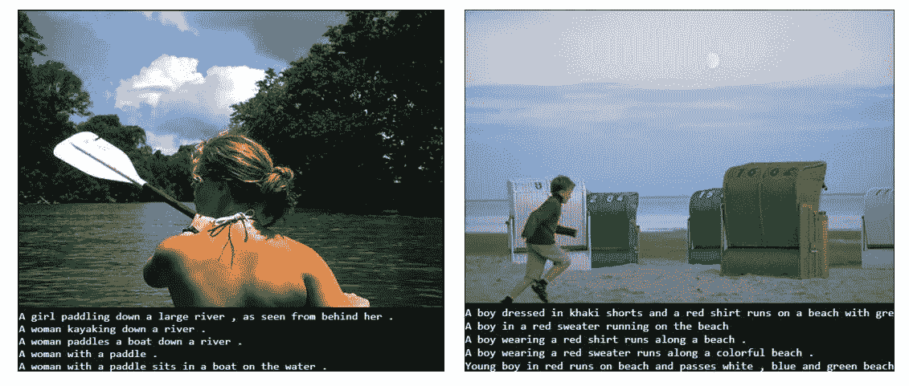
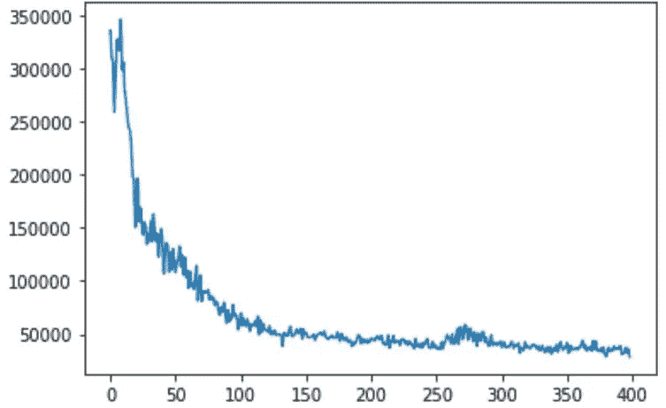
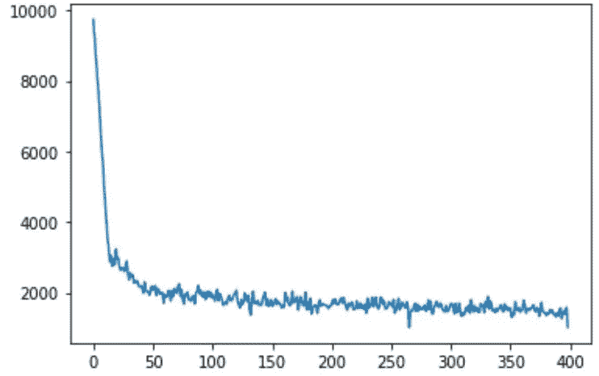
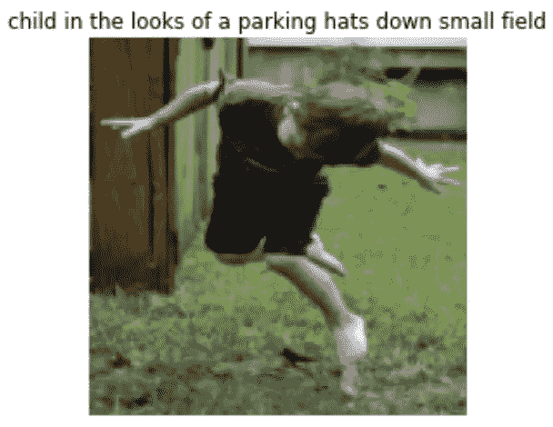

# 图像字幕:盲人的眼睛

> 原文：<https://medium.com/analytics-vidhya/image-captioning-an-eye-for-blind-6d402f180c08?source=collection_archive---------6----------------------->

这项研究的目的是设计一个变分自动编码器来模拟图像以及相关的标签或字幕。

实现是[这里的](https://cainvas.ai-tech.systems/notebooks/details/?path=rakash4730/Image_Caption_Generator.ipynb)。

**关于数据集**

在这个模型中，所使用的数据集是从 Flickr8k 数据集提取的，该数据集由 8，000 幅图像组成，每幅图像都配有五个不同的标题，并提供了对突出实体和事件的清晰描述。

在这里，我们的数据集继承了相同的属性，但只包含 1，000 幅图像。数据集由[阿努杰·加尔格](https://www.kaggle.com/keenwarrior/small-flicker-data-for-image-captioning)准备，可以在 Kaggle 上找到。这帮助我们将数据集的大小从 1GB 减少到近 133Mb。该数据集中的图片选自六个不同的 Flickr 群组，往往不包含任何知名的地点或人物。这些图像是人工选择的，用来描绘各种场景和情况。

**数据预处理**

在这个项目中，数据预处理是最耗时的部分，此外，可以假设，这个项目中几乎 90–95%的工作都是数据预处理。在这里，我使用 PyTorch，我应该更好地将它称为图像预处理，而不是数据预处理，因为我们的数据是以图像的形式出现的，然而任何传达一些事实或信息的东西都被称为数据，所以讽刺的是我们又将它称为数据预处理。

如果有人想提高数据预处理技能，这个数据集是这个世界上最好的尝试之一。此外，提高该数据集可用性的因素之一是其随规模扩展的能力。

现在，按照这里预处理的第一步，我们定义了一个函数来读取这个数据集并检查它的实体。

带标题的图像

第一，你可以对数据集有一个基本的概念，它实际上是什么样子的，就像上面的两张图片一样，这个数据集有不同的图片，每张图片有 5 个标题。

此外，在该数据的预处理中，使用了不同的编码和解码技术，并且由于该数据集是基于基于句子的图像描述的，所以这里还使用了 NLTK(自然语言工具包)。

为了保证更好的可读性，每个函数的定义都遵循了面向对象的编程方法。现在，让我们讨论一下数据集预处理中使用的函数。

**构建数据集词汇**

词汇被认为是存在于我们的文本语料库中的一组独特的词。每当为 NLP 处理原始文本时，几乎所有事情都是围绕词汇表进行的。

**编码器**

这里，卷积神经网络(CNN)可以被认为是一个编码器，其中输入图像被提供给 CNN 以提取特征。然后，在编码器的情况下，通常，CNN 的最后隐藏状态被连接到解码器。

**解码器**

解码器是一种递归神经网络(RNN ),在单词级别进行语言建模。对于解码器，第一步是从编码器接收编码输出。

**字幕生成器**

此外，我们定义了一个递归神经网络，以生成基于图像的句子。

**VAE 字幕**

这一部分是项目的主干。在这里，我们简单地调用了上述 5 个函数，即 vocab、编码器、解码器和字幕生成器，并将它们传递给一个名为“VAECaptioner”的新类。这个类是我们项目的基础模型，因为它包含了所有基于句子的图像字幕所需的函数。

**定义损失函数**

损失函数决定了特定算法模拟给定数据的能力。如果预测与实际结果相差太多，损失函数将会增加，反之亦然。逐渐地，通过使用一些优化函数，损失函数可以学习减少预测中的误差。

**绘制损失图**

*   失败

培训 _ 损失

*   标题 _ 损失

标题 _ 损失

**预测**

下面是根据 test_set 图像进行的随机预测

由模型完成的样本预测