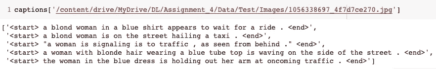
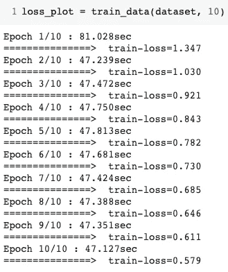
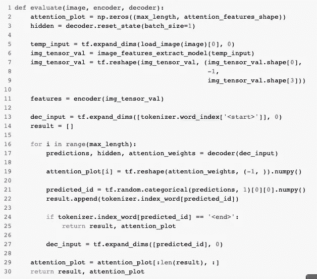
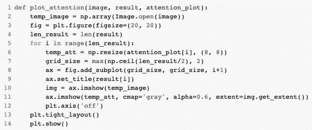
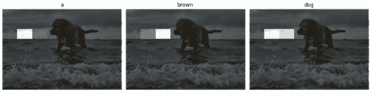
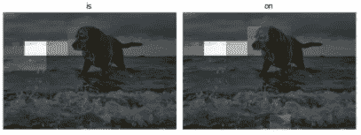
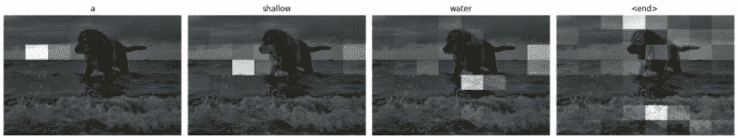

# 使用深度学习的编码器-注意力-解码器技术的图像字幕

> 原文：<https://medium.com/analytics-vidhya/image-captioning-using-encoder-attention-decoder-technologies-of-deep-learning-c3443505eb85?source=collection_archive---------8----------------------->

> 今天我们将学习如何解决著名的为图像添加字幕的深度学习问题。在讨论解决方案之前，请确保你们对 ***编码器-解码器架构*** 和什么是**注意有基本的了解。** PS:如果你没有这些方面的知识，随时可以从各种网上资源中一窥端倪。

让我们先通过想象我得到的一些最终结果来引起你的兴趣。


预测描述:一只棕色的狗在浅水区

令人惊讶的是，在插入这张图片后，媒体问我关于标题的问题，我只是复制粘贴标题😌我的模型预测的。这里字幕以一个<end>标记结束，这是解码器停止在这个<end>标记后生成文本所必需的。</end></end>

> 我要提出的架构的动机，摘自 [***展示、出席、讲述:视觉注意的神经图像字幕生成***](https://arxiv.org/pdf/1502.03044.pdf) ***。*** 我将使用*软关注*与 *VGG-16 编码器*和 *GRU (RNN 变种)*层进行解码。

让我们深入到编码部分；

> 导入库

```
!pip install nltk==3.5
from nltk.translate.meteor_score import meteor_score
from nltk.translate.bleu_score import sentence_bleu
import random
from sklearn.model_selection import train_test_split
import datetime
import time
from PIL import Image
import collections
import random
from keras.models import load_model
import os
import cv2
import matplotlib.pyplot as plt
import joblib
import pandas as pd
import tensorflow as tf
from tensorflow import keras
from keras.applications.vgg16 import VGG16
from keras.applications.vgg19 import VGG19
from keras.models import Model
import numpy as np
import nltk
nltk.download('stopwords')
nltk.download('wordnet')
nltk.download('words')
from nltk.corpus import words
from nltk.corpus import stopwords
from nltk.stem.porter import PorterStemmer
from nltk.stem import WordNetLemmatizer
from keras.preprocessing.text import Tokenizer
from keras.preprocessing.sequence import pad_sequences
```

> 预处理

预处理部分完全取决于你所拥有的数据，一般来说对于预处理，要注意以下几个关键点:

1.  将您所有的培训、验证和测试数据存储在一个文件夹中。此外，在这个文件夹中，您可以有不同的文件夹用于训练、验证和测试图像。
2.  您必须有训练图像标题。
3.  预处理之后，必须有一个包含所有图像路径的字典作为键，这些图像的标题作为值。

注意:如果单个图像有多个标题，请将其存储在具有相应图像路径的列表中。



字典示例

> 最后，为了方便起见，我还会提供 github 的链接。

经过预处理后，我们必须将数据加载到张量中进行训练。预处理和数据加载是特定的，将数据转换为数据。无论如何，我会在 Github repo 中提供我的数据文件夹。

# 编码器-注意-解码器(显示出席告诉)

```
# Setting hyper-parameters for modelsBATCH_SIZE = 64
BUFFER_SIZE = 1000
embedding_dim = 256
units = 512
vocab_size = top_k + 1
num_steps = len(img_name_train) // BATCH_SIZE
features_shape = 2048
attention_features_shape = 49
```

现在让我们创建编码器、解码器和注意力的类别。

> 编码器类别

```
class CNN_Encoder(tf.keras.Model): def __init__(self, embedding_dim):
      super(CNN_Encoder, self).__init__()
      self.fc = tf.keras.layers.Dense(embedding_dim)

   def call(self, x): 
      x = self.fc(x)
      x = tf.nn.relu(x) 
      return x
```

> 注意类

```
class BahdanauAttention(tf.keras.Model): #Soft Attention
  def __init__(self, units):
    super(BahdanauAttention, self).__init__()
    self.W1 = tf.keras.layers.Dense(units)
    self.W2 = tf.keras.layers.Dense(units)
    self.V = tf.keras.layers.Dense(1) def call(self, features, hidden):
    hidden_with_time_axis = tf.expand_dims(hidden, 1) attention_hidden_layer = (tf.nn.tanh(self.W1(features) +         
                              self.W2(hidden_with_time_axis))) score = self.V(attention_hidden_layer)
    attention_weights = tf.nn.softmax(score, axis=1) context_vector = attention_weights * features
    context_vector = tf.reduce_sum(context_vector, axis=1) return context_vector, attention_weights
```

> 解码器类别

```
class RNN_Decoder(tf.keras.Model):
  def __init__(self, embedding_dim, units, vocab_size):
    super(RNN_Decoder, self).__init__()
    self.units = units
    self.embedding = tf.keras.layers.Embedding(vocab_size,    embedding_dim)

    self.gru = tf.keras.layers.GRU(self.units,
                                   return_sequences=True,
                                   return_state=True,                       recurrent_initializer=’glorot_uniform’)

    self.fc1 = tf.keras.layers.Dense(self.units)
    self.fc2 = tf.keras.layers.Dense(vocab_size)
    self.attention = BahdanauAttention(self.units) def call(self, x, features, hidden):
    context_vector, attention_weights = self.attention(features, hidden) x = self.embedding(x)
    x = tf.concat([tf.expand_dims(context_vector, 1), x], axis=-1)
    output, state = self.gru(x)
    x = self.fc1(output)
    x = tf.reshape(x, (-1, x.shape[2])) 
    x = self.fc2(x) return x, state, attention_weights def reset_state(self, batch_size):
    return tf.zeros((batch_size, self.units))
```

> 为了使用所有这些体系结构，我们必须编写一个训练函数来有效地训练模型:

```
# defining loss function, optimizer, encoder = CNN_Encoder(embedding_dim)
decoder = RNN_Decoder(embedding_dim, units, vocab_size)optimizer = tf.keras.optimizers.Adam()
loss_object = tf.keras.losses.SparseCategoricalCrossentropy(from_logits=True, reduction=’none’)def loss_function(real, pred): mask = tf.math.logical_not(tf.math.equal(real, 0))
  loss_ = loss_object(real, pred) mask = tf.cast(mask, dtype=loss_.dtype)
  loss_ *= mask return tf.reduce_mean(loss_)
```

> 培训功能

```
@tf.function
def train_step(img_tensor, target): loss = 0
  hidden = decoder.reset_state(batch_size=target.shape[0])
  dec_input = tf.expand_dims([tokenizer.word_index[‘<start>’]] * target.shape[0], 1) with tf.GradientTape() as tape: features = encoder(img_tensor)
    for i in range(1, target.shape[1]): predictions, hidden, _ = decoder(dec_input, features, hidden)
      loss += loss_function(target[:, i], predictions) dec_input = tf.expand_dims(target[:, i], 1) total_loss = (loss / int(target.shape[1])) trainable_variables = encoder.trainable_variables +
                        decoder.trainable_variables gradients = tape.gradient(loss, trainable_variables) optimizer.apply_gradients(zip(gradients, trainable_variables)) return loss, total_loss
```

> 呼叫列车功能

```
def train_data(dataset, EPOCHS=10): loss_plot = []

  for epoch in range(EPOCHS):
    start_time = time.time()
    total_loss = 0 for (batch, (img_tensor, target)) in enumerate(dataset): batch_loss, t_loss = train_step(img_tensor, target)
      total_loss += t_loss if batch % 100 == 0:
        average_batch_loss = batch_loss.numpy()/int(target.shape[1]) loss_plot.append(total_loss / num_steps)
    end_time = time.time()
    print(‘Epoch {0:d}/{1:d}’.format(epoch+1, EPOCHS), “: {0:.3f}sec”.format((end_time — start_time)))
    print(‘===============> train-loss=%.3f’ % (total_loss/num_steps))

  return loss_plot
```

对于训练，只需调用 train_data()，如下图:



呼叫列车功能

如果你活到现在…..伟大的😎

您的编码器和解码器模型已经创建，现在我们可以进行一些评估。



评估功能



绘制注意力权重

这些函数将在输入图像和标题文本上绘制注意力权重。

> 上面给出了一个预测字幕的例子，让我们对同一幅图像的注意力权重进行可视化



白色方框表示注意力权重。该模型分配给该图像用于预测字幕。



就到此为止吧！人们也可以检查 BLEU 分数或流星，但那是不太感兴趣的，如果你也想学习编码它们，只需关注我的 ***GitHub 回购链接是*** [***这里***](https://github.com/deepankarkansal/Image-Captioning) ***。***

> 代码实现: [***帕拉克提瓦里***](https://www.linkedin.com/in/palak-2810-tiwari/) ， [***迪潘卡尔坎萨尔***](https://www.linkedin.com/in/deepankar-kansal-255911152/)

# ***参考文献***

1.  [***展示、出席、讲述:视觉注意的神经图像字幕生成***](https://arxiv.org/pdf/1502.03044.pdf)
2.  [***用深度神经网络构建编解码器:走向现实***](https://arxiv.org/pdf/1808.02401.pdf)