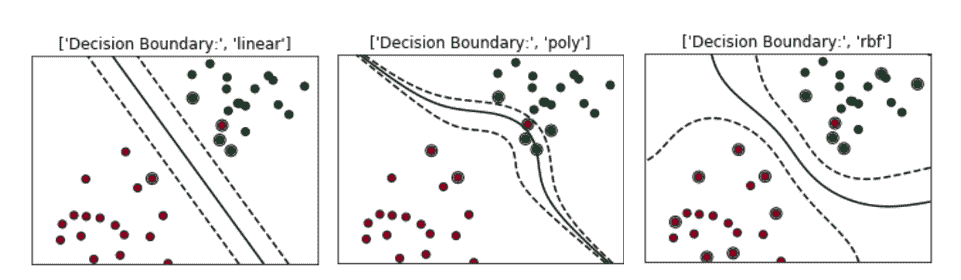
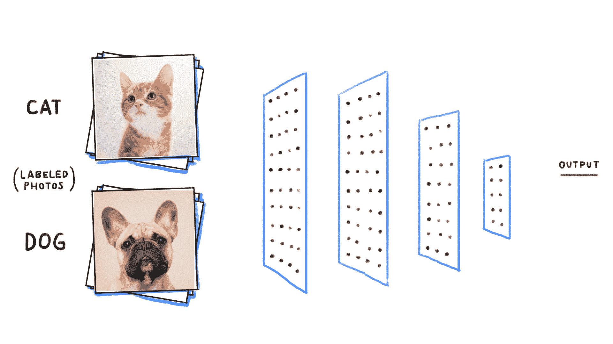
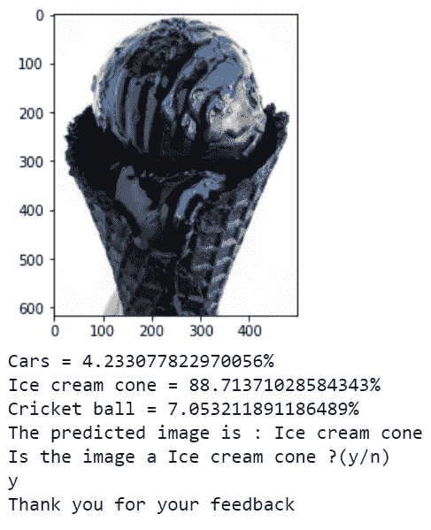

# 使用机器学习-支持向量机(SVM)的图像分类

> 原文：<https://medium.com/analytics-vidhya/image-classification-using-machine-learning-support-vector-machine-svm-dc7a0ec92e01?source=collection_archive---------0----------------------->

## 计算机编程语言


照片来源:分析 Vidhya

# 介绍

**机器学习**是人工智能的一种应用，它允许计算机以自我学习的模式运行，而无需显式编程。这是一个非常有趣和复杂的话题，可能会推动技术的未来。

机器学习有很多应用，图像分类就是其中之一。为了分类图像，这里我们使用 SVM。Scikit-learn 是一个用于 Python 编程语言的免费软件机器学习库，支持向量机(SVM)包含在 Scikit-learn 中。

# 使用的工具

→ Python 语法
→用于数据帧的熊猫库
→来自 sklearn(又名 scikit-learn)库的支持向量机(SVM)
→GridSearchCV
→用于读取图像的浏览库
→用于可视化目的的 matplotlib

首先，让我们理解概念并深入编码部分😉

# **支持向量机(SVM)**

“支持向量机”(SVM)是一种受监督的机器学习算法，可用于分类或回归挑战。但多用于分类问题。在这个 SVM 算法中，我们将每个数据项绘制为 n 维空间中的一个点(其中 n 是您拥有的要素的数量)，每个要素的值是特定坐标的值。然后，我们通过找到能够很好地区分这两类的超平面来执行分类。

SVM 中的一些关键参数是:
→ **Gamma** :定义单个训练样本的影响达到导致有偏差结果的值的程度。

**→ C :** 控制误算成本
小 C —使误分类成本低
大 C —使误分类成本高

→ **内核:** SVM 算法使用一组被定义为内核的数学函数。
核的类型有:线性、RBF(径向基函数)、多项式核



更多关于 SVM 的信息可以从[这里](https://scikit-learn.org/stable/modules/svm.html)了解。

# **电脑是如何读取图像的？🤔**

图像分类的主要任务是读取输入图像，计算机看到的图像完全不同:


计算机将图像视为像素阵列，如果图像的大小为 200 X 200，则阵列的大小将为 200 X 200 X 3，其中第一个 200 是宽度，第二个 200 是高度，接下来的 3 个是 RGB 通道值。数组中的值范围从 0 到 255，描述了每个点的像素亮度。

# **GridSearchCV**

它是一个库函数，是 sklearn 的 model_selection 包的成员。它有助于遍历预定义的超参数，并使您的估计器(模型)适合您的训练集。因此，最后，您可以从列出的超参数中选择最佳参数。

理论讲够了，我们从编码部分开始。

# **流程**

通过输入数据和期望输出数据训练模型是机器学习的方式之一。
要创建这样一个模型，必须经历以下几个阶段:

1.取输入
2。模型构造
3。模特培训
4。模型测试
5。模型评估

**输入:**读取 3 种不同类别的图像(汽车、冰淇淋蛋筒、板球),并按以下方式标记为 0、1、2:

```
import pandas as pd
import os
from skimage.transform import resize
from skimage.io import imread
import numpy as np
import matplotlib.pyplot as pltCategories=['Cars','Ice cream cone','Cricket ball']flat_data_arr=[] #input arraytarget_arr=[] #output arraydatadir='/content/drive/MyDrive/ML' 
#path which contains all the categories of imagesfor i in Categories:

    print(f'loading... category : {i}') path=os.path.join(datadir,i) for img in os.listdir(path): img_array=imread(os.path.join(path,img)) img_resized=resize(img_array,(150,150,3)) flat_data_arr.append(img_resized.flatten()) target_arr.append(Categories.index(i)) print(f'loaded category:{i} successfully')flat_data=np.array(flat_data_arr)target=np.array(target_arr)df=pd.DataFrame(flat_data) #dataframedf['Target']=targetx=df.iloc[:,:-1] #input data y=df.iloc[:,-1] #output data
```

由于 SVM 接收相同大小的输入，所有图像在输入到 SVM 之前都需要**调整**到固定大小。df 是使用 pandas 创建的数据帧，x 和 y 分别是输入和输出数据

**模型构建:**本项目案例中，模型为支持向量机。
模型构建的算法是这样的:
1。创建支持向量分类器:
→ svc=svm。SVC()
2。借助 GridSearchCV 和参数网格，创建一个模型:→model=GridSearchCV(svc，parameters_grid)

```
from sklearn import svmfrom sklearn.model_selection import GridSearchCVparam_grid={'C':[0.1,1,10,100],'gamma':[0.0001,0.001,0.1,1],'kernel':['rbf','poly']}svc=svm.SVC(probability=True)model=GridSearchCV(svc,param_grid)
```

**模型训练:**数据分为两类:训练数据和测试数据。训练数据用于训练模型，而测试数据用于测试训练好的模型。
为了将数据分割成训练和测试，使用来自 sklearn 库的 **train_test_split()** 。
使用训练数据训练模型，方式如下
→ model.fit(training_data，expected_output)

```
from sklearn.model_selection import train_test_splitx_train,x_test,y_train,y_test=train_test_split(x,y,test_size=0.20,random_state=77,stratify=y)print('Splitted Successfully')model.fit(x_train,y_train)print('The Model is trained well with the given images')# model.best_params_ contains the best parameters obtained from GridSearchCV
```

**模型测试:**现在使用测试数据以这种方式测试模型
→Model . predict(testing _ data)

可以使用来自 sklearn.metrics 的 **accuracy_score()** 方法来计算模型的准确性

```
y_pred=model.predict(x_test)print("The predicted Data is :")print(y_pred)print("The actual data is:")print(np.array(y_test))print(f"The model is {accuracy_score(y_pred,y_test)*100}% accurate")
```

最后，在**模型评估**阶段，生成的模型可用于评估新数据。



```
url=input('Enter URL of Image :')img=imread(url)plt.imshow(img)plt.show()img_resize=resize(img,(150,150,3))l=[img_resize.flatten()]probability=model.predict_proba(l)for ind,val in enumerate(Categories): print(f'{val} = {probability[0][ind]*100}%')print("The predicted image is : "+Categories[model.predict(l)[0]])
```

最终输出将是这样的:



这个项目的全部代码可以在:
[https://github.com/ShanmukhVegi/Image-Classification](https://github.com/ShanmukhVegi/Image-Classification)找到

# **结论:**

在这项工作中，我组装并训练了 SVM 模型来分类冰淇淋甜筒、板球和汽车的图像。我使用 GridSearchCV 找出了 SVM 分类图像的最佳参数，并测量了模型的准确性。

# **资源:**

[](https://scikit-learn.org/stable/modules/svm.html) [## 1.4.支持向量机-sci kit-学习 0.24.1 文档

### 在高维空间有效。在维数大于…的情况下仍然有效

scikit-learn.org](https://scikit-learn.org/stable/modules/svm.html) [](https://scikit-learn.org/stable/modules/generated/sklearn.model_selection.GridSearchCV.html) [## sklearn.model_selection。GridSearchCV-scikit-学习 0.24.1 文档

### 对估计量的特定参数值进行穷举搜索。重要成员是适合的，预测。GridSearchCV…

scikit-learn.org](https://scikit-learn.org/stable/modules/generated/sklearn.model_selection.GridSearchCV.html) [](https://scikit-learn.org/stable/modules/grid_search.html) [## 3.2.调整估计器的超参数-sci kit-了解 0.24.1 文档

### 超参数是在估计器中不直接学习的参数。在 scikit-learn 中，它们被作为…

scikit-learn.org](https://scikit-learn.org/stable/modules/grid_search.html)