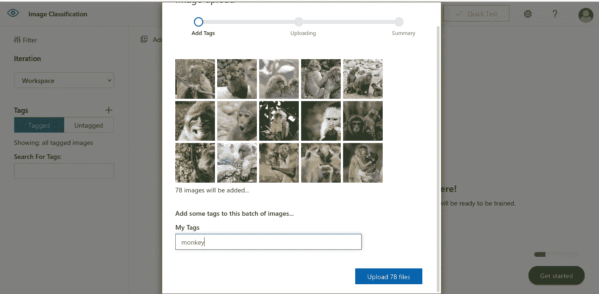

# 使用 Azure 自定义视觉服务进行图像分类

> 原文：<https://medium.com/analytics-vidhya/image-classification-with-azure-custom-vision-service-3ded17505348?source=collection_archive---------5----------------------->

在本文中，我们将看到如何使用 Azure 自定义视觉服务来执行图像分类任务。今天，我们使用由三种不同类型动物的图像组成的数据集；猴子，猫和狗。您可以从[这里](https://drive.google.com/drive/folders/1rOyY23yBiIgXIWJvYg5qhkNdsF2ew6Q0?usp=sharing)将数据集文件夹下载到您的 PC。

该数据集中的所有图像均取自 Kaggle 中的[猴、猫、狗检测数据集。](https://www.kaggle.com/tarunbisht11/yolo-animal-detection-small)

作为先决条件，您需要 Azure 订阅才能继续执行该任务。如果您还没有帐户，您可以按照这些指南免费创建一个 Azure 帐户。

*   https://azure.microsoft.com/en-us/free/ azure 免费账户
*   学生的蔚蓝[https://azure.microsoft.com/en-us/free/students/](https://azure.microsoft.com/en-us/free/students/)

现在，让我们看看如何使用 Azure Custom Vision 和我们的动物数据集来训练图像分类模型，该模型可以预测新图像的类别。

首先，登录[微软 Azure 门户](https://portal.azure.com)。现在，我们将在 Azure Portal 中创建新资源。点击**从 Azure 门户创建资源**。

在搜索栏中输入“自定义视觉”，并从搜索结果中选择**自定义视觉**。然后点击**创建**按钮继续。

现在，我们将配置我们的自定义视觉资源。在**创建**页面，转到**基础**选项卡，填写以下参数。确保在**创建选项**中选择了**两个**选项。

先给**项目详情**如下。

*   **订阅**:选择你拥有的 Azure 订阅。在这里，我选择了“学生版 Azure”订阅。
*   **资源组**:如果您之前已经创建了一个资源组，您可以在这里选择它。如果没有，点击**创建新的**，以您喜欢的名称创建一个新的资源组。这里，我给出了“RG1”作为资源组名。
*   **Name** :在这里，您可以为将要创建的自定义视觉资源指定任何首选名称。该名称必须是唯一的，没有被任何其他用户使用过。因此，如果它说你给的名字已经被使用，尝试用不同的词的另一个名字。这里，我给出了“Learn-Azure-Custom-Vision”作为资源名。

接下来，我们将填写下面的**培训资源**部分。

*   **训练地点**:在这里，您可以选择任何可用的地区进行训练。我选择了“美国东部”地区。
*   **培训定价等级**:在这里，您可以从提供给您的定价等级中选择一个定价等级。如果可用，请选择免费层“免费 F0”。

然后，我们将填充**预测资源**部分，如下所示。

*   **预测位置**:该位置必须与您给定的训练位置相同。因此，我选择了“美国东部”地区作为预测位置。
*   **预测定价等级**:您也可以在这里从可用的定价等级中选择一个定价等级。我选择了自由层“自由 F0”。

现在，我们已经给出了创建自定义视觉资源所需的所有参数。然后，点击**查看+创建**按钮，您将能够看到您之前输入的所有参数。

确认所有给定参数正确后，点击**创建**按钮，继续创建定制视觉服务。然后，您的定制视觉服务将在验证后开始创建。在这里，您可能需要等待一段时间，直到部署过程完成。当您的自定义视觉服务部署完成时，您将收到通知。之后，您可以点击**转到资源**按钮，查看您创建的服务的详细信息。

现在，您已经成功创建了自定义视觉服务资源。所以我们打算用它来做我们的图像分类项目。为此，您必须登录[定制视觉门户](https://www.customvision.ai/)。

在那里，点击**新项目**图标并给出以下参数。

*   **名称**:在这里，给你的项目起一个你喜欢的名字。我已经给它定为“图像分类”。
*   **描述:**这里给出一个可以帮助你识别项目任务的小描述。我已经给它作为“分类动物图像与 Azure 自定义视觉服务”。
*   **资源:**在这里，您必须选择您最初创建的自定义视觉服务。对我来说就是“学习-Azure-Custom-Vision[F0]”。回想一下，这是您在创建自定义 vision 资源时给出的唯一名称。
*   **项目类型**:这里选择**分类**作为项目类型。
*   **分类类型**:这里选择**多类(每幅图像一个标签)**作为分类类型。
*   **域**:选择**通用【A2】**作为项目的域。

给出上述所有项目细节后，点击**创建项目**，可以看到项目已经创建。

然后，我们将训练图像添加到我们的新项目中。在**训练图像**部分，点击**添加图像**。这将允许您从 PC 上选择文件并上传。

我们必须添加三种不同类型的图像。首先我要上传猴子的照片。因此，选择火车/猴子文件夹中的所有图片进行上传。然后，我们必须给我们的图像加一个标签。在这里，将**猴子**输入到**我的标签**框中。

现在，点击**上传{文件数}文件**按钮，等待上传过程完成。上传完成后，点击**完成**按钮。

就像我们对猴子文件夹所做的一样，上传 train/dogs 文件夹，标签为 **dog** 。上传 train/cats 文件夹，标签为 **cat** 。

现在我们已经上传了所有的训练图像，并准备好训练我们的图像分类模型。点击**训练**按钮开始训练。然后还要选择培训类型。这里选择**快速训练**作为训练类型，点击**训练**按钮继续。

在这里，我们将不得不等待一段时间，直到训练结束。迭代 1 训练完成后，我们可以在**性能**选项卡下看到精度、召回率和 AP 分数。

现在我们有了一个经过训练的图像分类模型。所以让我们用一张新的图片来测试我们的模型。点击**快速测试**按钮开始测试。

点击**浏览本地文件**按钮，从测试文件夹中选择一个图像。在这里，我从 test/monkey 文件夹中选择并打开了一个文件。现在，您将能够在每个标签下看到给定测试图像的预测概率。在我的例子中，标签猴获得了最高的概率 87.6%。因此，我们的测试图像被归入猴子类别。

您可以尝试使用其他测试图像，并查看我们的图像分类模型给出的结果。如果你去**预测**标签，看到所有你输入测试的图像。

单击任何图像，您将能够再次看到之前为该测试图像获得的预测结果。

现在，我们已经使用 Azure 自定义视觉服务成功完成了一个图像分类任务。如果您不希望进一步使用它，请确保[删除您在 Azure 门户中创建的自定义视觉资源](https://docs.microsoft.com/en-us/azure/azure-arc/data/delete-azure-resources)。因此，您可以避免从您创建的资源的 Azure 信用中花费任何意外的成本。

在这里，我列出了我为完成我们的任务而遵循的参考资料。如果你想了解更多，也可以尝试探索这些资源。

*   [https://docs . Microsoft . com/en-us/learn/modules/classify-images-with-custom-vision-service/](https://docs.microsoft.com/en-us/learn/modules/classify-images-with-custom-vision-service/)
*   [https://Microsoft learning . github . io/AI-102-AI engineer/Instructions/17-image-classification . html](https://microsoftlearning.github.io/AI-102-AIEngineer/Instructions/17-image-classification.html)
*   [https://docs . Microsoft . com/en-us/azure/cognitive-services/custom-vision-service/](https://docs.microsoft.com/en-us/azure/cognitive-services/custom-vision-service/)

快乐学习！