# 使用 tf.keras 进行影像分类(入门教程)

> 原文：<https://medium.com/analytics-vidhya/image-classification-with-tf-keras-introductory-tutorial-7e0ebb73d044?source=collection_archive---------7----------------------->

## 了解用于图像分类的 tf.keras 的基础知识

TensorFlow 是最受欢迎的开源机器学习框架之一，它在机器学习的兴起中发挥了至关重要的作用，特别是在工业中，这要归功于它丰富的生态系统，从用于在手机中部署模型的 *TensorFlow Lite、*，到用于在生产中服务 TensorFlow 模型的 *TensorFlow Serving、*。它是由 Google 开发和支持的。 [*tf.keras*](https://www.tensorflow.org/api_docs/python/tf/keras) 是一个建立在 TensorFlow 之上的高级框架，它的设计方式使得我们可以只使用几行代码来开发和训练机器学习模型。

在本教程中，我们使用的是 *tf.keras* 。

首先，让我们导入相关的库、子包、模块和类。

现在，让我们从数据集 URL 下载花的数据集(3700 左右)。花的数据集有五个不同的类，每种花一个，每种类型的花保存在不同的文件夹中，其名称作为文件夹的名称。

让我们通过进入 *roses* 文件夹来看一张样本图片。

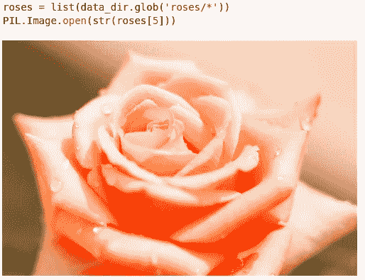

难怪，我们这里有一朵美丽的玫瑰，花瓣上滴着水珠。:)

现在回到机器学习。让我们为训练创建参数。批次大小是一批中要拍摄的图像数量。图像高度和宽度给出了用于训练和预测的图像尺寸。

这里，我们使用了 80%的数据进行训练，20%的数据进行验证。 *tf.keras* 使得使用其 API 创建训练和验证数据集变得更加容易。

*数据集的 class_names* 属性(训练或验证)给出了类名列表，该列表稍后用于根据最大索引值( *z* 值或*概率*值)识别类。让我们看看花卉分类示例中的所有类。

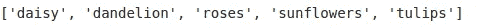

类别名称

让我们用一个 3x3 的拼贴画来想象这些图像。

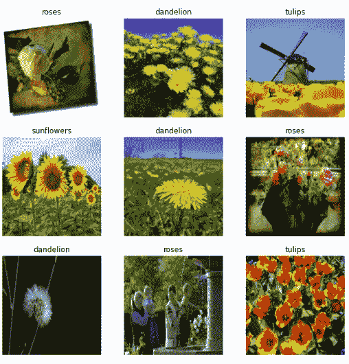

让我们在加载数据时使用两种方法—缓存和预取。在训练的第一个时期将图像加载到内存中之后，缓存会将图像保存在内存中。这确保了数据集在训练模型时不会成为瓶颈。训练时预取重叠数据预处理和模型执行。

让我们在范围[0，1]内标准化 RGB 值，因为神经网络更喜欢使用重新调整层的较小值。

现在，我们使用 *keras* 的*顺序* API 创建模型。API 按顺序添加这些层，因为我们只是将这些层一层一层地堆叠起来，所以*顺序* API 服务于我们的目的。我们使用卷积层和池层组，然后是完全连接的层。

让我们编译模型，看看我们模型的总结。该概要给出了所使用的层的类型、所使用的层数、可训练参数的数量以及中间输出的形状。

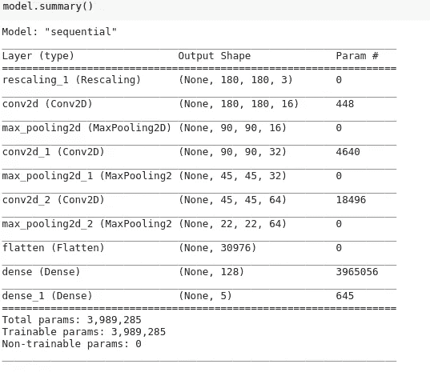

有了 10 个纪元，我们来训练模型。

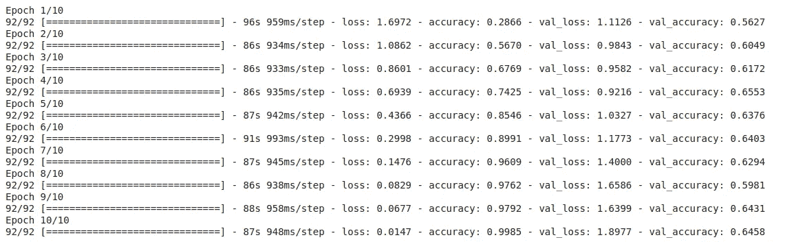

普通图像识别模型的历史

正如我们在这里看到的，训练精度线性增加并接近完美值，而验证精度徘徊在 0.6 左右。因此，训练和验证准确性之间的差距正在扩大。这是过度拟合的标志。当模型非常适合训练数据，但无法概括我们试图建立的模式时，就会发生过度拟合。让我们用一对图表来直观地展示培训和验证指标。

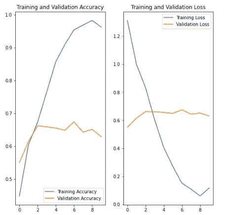

10 个时期的培训和验证指标

如果我们想要对看不见的数据进行很好的概括，则需要减小训练准确度和验证准确度之间的巨大差距，这是过度拟合的标志。为了最小化过拟合，我们使用两种方法——数据扩充和剔除。

过拟合的原因之一是训练数据数量少。当数据集很小时，模型从明显的噪声(在现实世界中经常看到)中学习。扩充数据集的一种方法是使用不同的变换技术(如旋转、翻转、移动、缩放、裁剪等)来变换现有数据。

**数据扩充代码:**

使用 tf.keras 进行数据扩充

让我们看几个变换图像的例子。

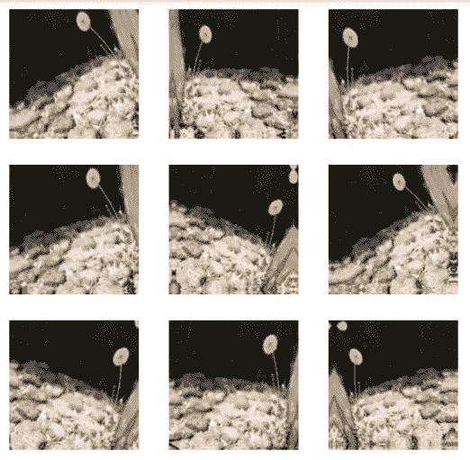

随机变换的图像

现在，让我们在模型中使用辍学技术。Dropout 在定义它的层中随机删除节点。我们删除了 20%的节点*，所以我们使用 *0.2* 作为*删除*层的参数。*

*使用数据增加和减少的模型创建已经完成。让我们编译模型并训练它。正如我们在模型摘要中看到的，增加了增强层和下降层。由于培训需要 10/15 分钟，具体取决于培训的硬件，我们何不在此期间喝杯茶呢？*

*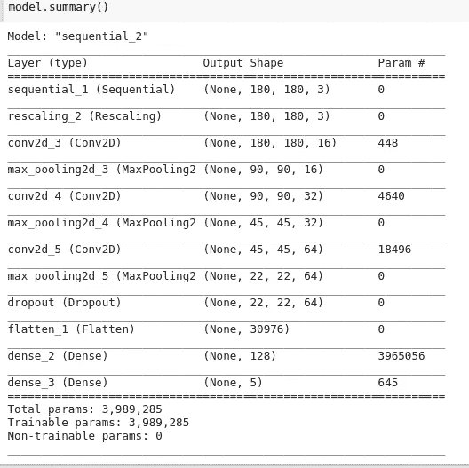**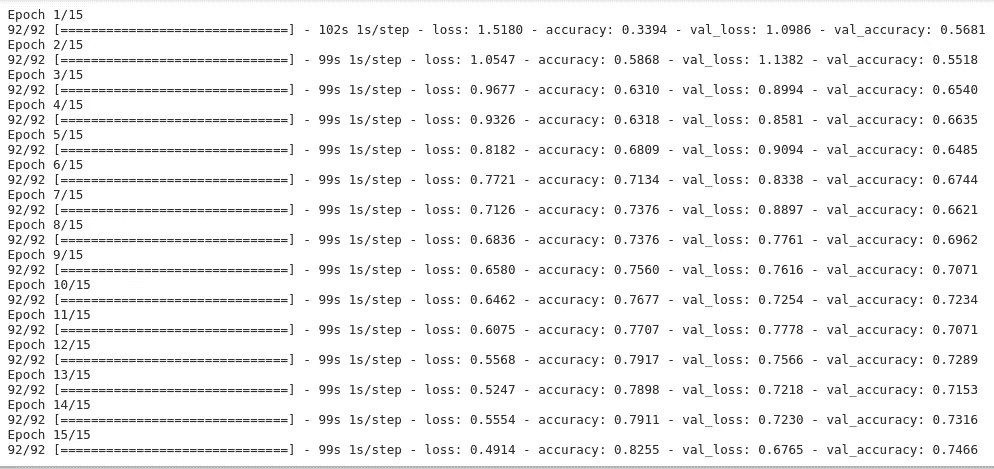*

*应用数据扩充和删除后的培训历史*

*从历史上可以看出，在进行数据扩充和应用剔除后，过拟合有所减少。精度差距的缩小表明过度拟合的减少。让我们绘制类似的度量图。*

*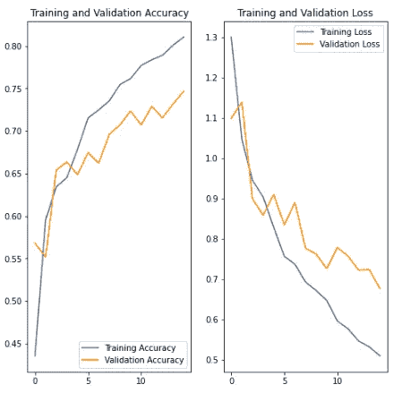*

*看到训练图和验证图一起出现是一个幸福的时刻。开心，开心:)*

*这是一个关于使用 *tf.keras.* 创建机器学习模型的温和介绍*

*创建模型后，我们需要在现实世界的数据中测试它。让我们从网上随机获取一幅向日葵的图像(你可以自己搜索并用你的 url 替换 *image_url* )并测试我们的模型是否预测正确。*

*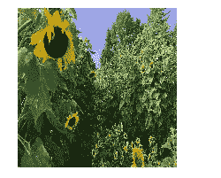*

*我们用来测试模型的向日葵图片*

*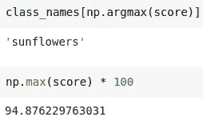*

*预测及其概率*

*耶，我们的模型预测它为“**向日葵**”，概率约为 95%。很酷，不是吗？*

*谢谢你坚持到最后。本文之后将会有其他关于计算机视觉的 TensorFlow 教程。敬请期待！*