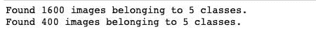
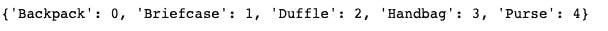
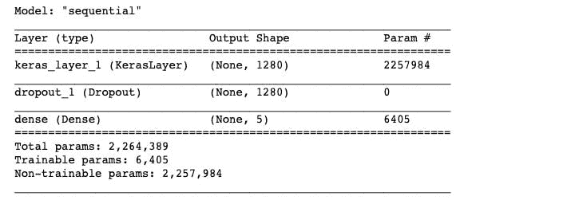
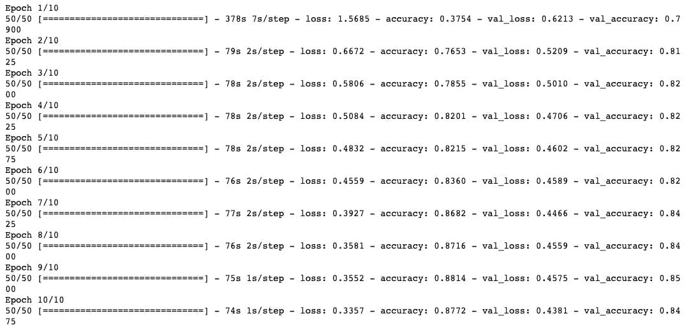
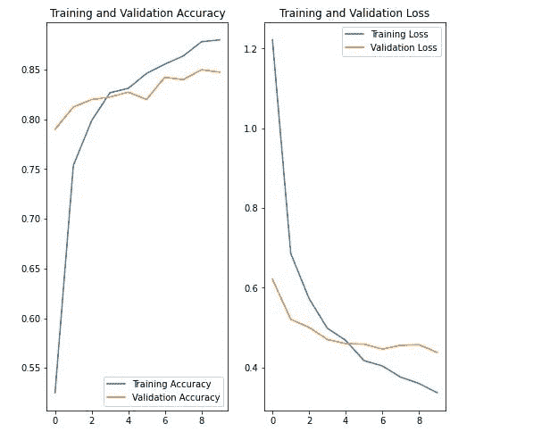
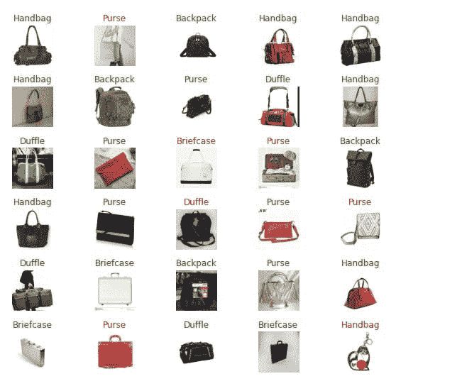

# 基于迁移学习的图像分类

> 原文：<https://medium.com/analytics-vidhya/image-classification-with-transfer-learning-37d2a2d9ab41?source=collection_archive---------23----------------------->

迁移学习是将一个预先训练好的模型重新用于另一个类似的用途。这种方法出现在各种机器学习应用中，尤其是在数据集相对较小的情况下。

在这个项目中，我使用迁移学习从零开始构建了一个图像分类模型。当我说从头开始时，数据集是我的自定义数据集，我用 IDT 工具和我自己的自定义类废弃了它。你可以在这里阅读这个工具[。](/analytics-vidhya/custom-image-dataset-a98d09d81c76)

# 问题陈述:

大多数人倾向于对包和手提行李进行分类。在这个项目中，我选择了 5 个类，即:背包、公文包、行李袋、手提包和钱包。

# 数据收集和清理:

就像我之前说的，我用 IDT 工具从网上抓取图片，然后清理数据，这是所有过程中最乏味的。总的来说，数据集包含 2000 个图像，每个类分为 400 个图像，由我手动清理。我删除了重复图片和带有相关关键字的图片，但与目标图片没有关联。

# 数据预处理:

在执行 Keras 的图像数据生成器功能之前，我重新缩放了图像并执行了 20%的验证分割。

然后我得到了类别标签和索引。

# 模型构建:

使用 Tensorflow hub，我导入了一个预训练模型，这是 mobilenet 的第二个版本，因为它具有可扩展性。

我使用 Adam optimizer 编译了该模型，学习率为 0.001，分类交叉熵损失和“度量”准确性。

# 模型培训:

我用 10 个纪元来训练这个模型。

然后我用 matplotlib 绘制了模型训练的图形。

# 模型预测:

在查看了“验证批”形状和“预测结果”形状后，我用绿色的正确标签和红色的不正确标签显示了模型的预测。

# 结论:

在项目文件夹中，还有两个模型没有经过迁移学习和查看它们的图表就完成了，它们过度拟合了。该项目被发现[在这里](https://github.com/Nwosu-Ihueze/bag_classifier)，我将欢迎对这个项目的反馈。你可以在 [LinkedIn](https://www.linkedin.com/in/rosemary-nwosu-ihueze/) 上和我联系。感谢您的阅读