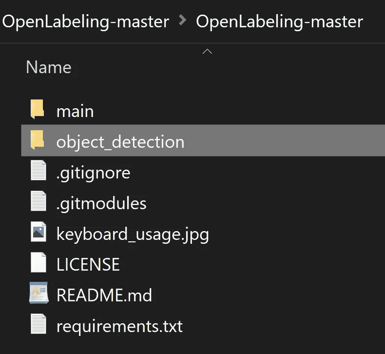
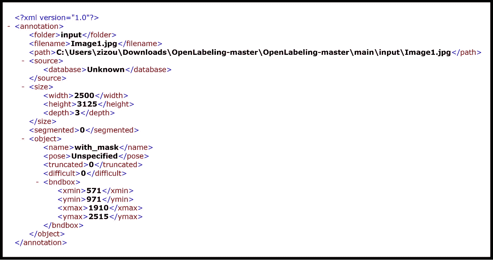
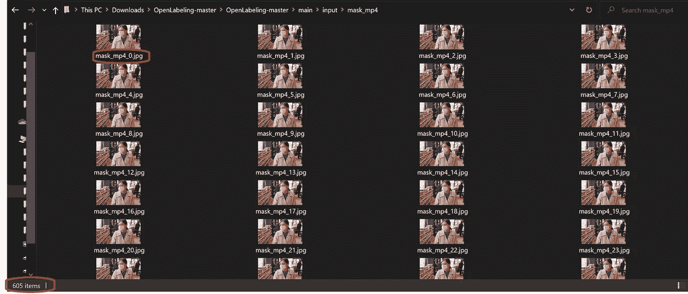
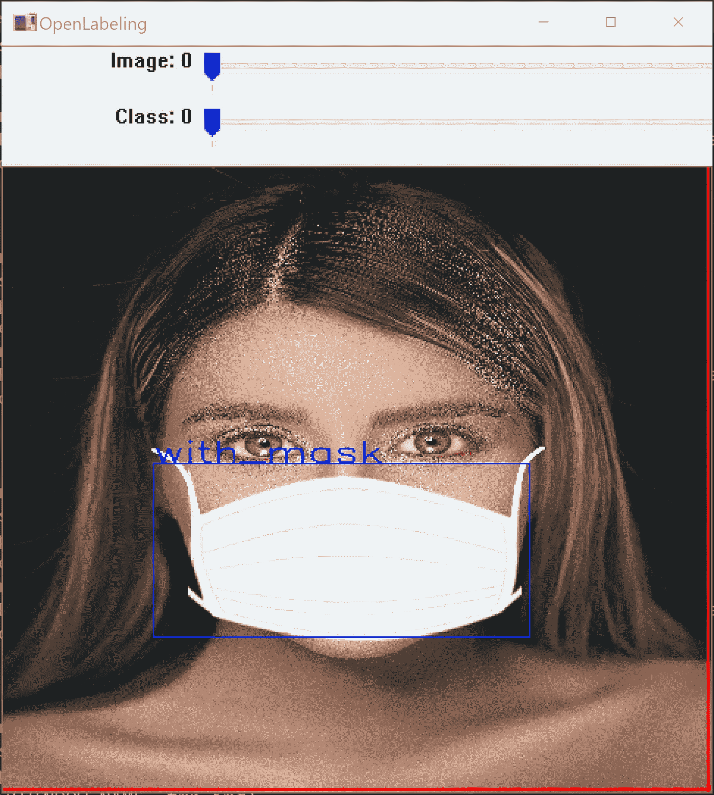

# 数据集标注/注释

> 原文：<https://medium.com/analytics-vidhya/image-dataset-labeling-annotation-bec3390eda2d?source=collection_archive---------1----------------------->


## (初学者教程)

# 我在 YouTube 上的视频！

## 第一部分

## 第二部分

## 第三部分

在机器学习中，数据标注是识别原始数据(图像、文本文件、视频等)的过程。)并添加一个或多个有意义和信息丰富的标签来提供上下文，以便机器学习模型可以从中学习。例如，标签可能会指示照片中是否包含一只鸟或一辆车，录音中说了哪些话，或者 x 光片中是否包含肿瘤。包括计算机视觉、自然语言处理和语音识别在内的各种用例都需要数据标记。

构建计算机视觉系统时，首先需要标记图像、像素或关键点，或者创建完全包围数字图像的边界(称为边界框)，以生成训练数据集。例如，您可以按质量类型(如产品与生活方式图像)或内容(图像本身的实际内容)对图像进行分类，或者您可以在像素级别对图像进行分割。然后，您可以使用这些训练数据来构建计算机视觉模型，该模型可用于自动对图像进行分类、检测对象的位置、识别图像中的关键点或分割图像。


图片来自 [pjreddie](https://pjreddie.com/darknet/yolo/) YOLO 站点

我图像数据集标注可能是训练机器学习模型的整个过程中最繁琐的部分。为我们的数据集收集图像，然后注释每张图像看起来是一项艰巨的任务。令人欣慰的是，我们现在有许多软件工具，使我们能够轻松地完成这项任务，节省大量的时间和精力。

**数据标注**一般指标注数据的过程。数据注释和数据标签通常可以互换使用，尽管它们可以根据行业或用例而有所不同。

带标签的数据突出显示了数据特征或属性、特性或分类，这些数据特征或属性、特性或分类可用于分析有助于预测目标的模式。例如，在自动驾驶汽车的计算机视觉中，数据标签员可以使用逐帧视频标签工具来指示街道标志、行人或其他车辆的位置。

有许多类型的注释技术，如**边界框**、**语义分割、界标、多边形、长方体、**、**和**、**折线。**

在本文中，我将使用**边界框**来解释图像注释的过程，以帮助您开始训练机器学习模型的过程。

# 贴标过程

为了演示图像标注过程，我将使用一个名为 **OpenLabeling** 的标注工具，它作为一个 python 脚本从包含输入图像目录和一个文本文件的位置运行，该文件中写有所有必需的类的名称。我们可以使用这个工具来标记图像和视频中的对象。

在这里，我将解释图像和视频的标记过程。这将使您更好地理解标注任何数据集的基础知识。

## (但首先✅Subscribe 到我的 YouTube 频道👉🏻【https://bit.ly/3Ap3sdi 😁😜)

本教程的内容如下:

```
**A) Labeling Images using OpenLabeling tool's main.py script.
B) Labeling Videos using OpenLabeling tool's main.py script.
C) Auto-Labeling images or videos using a pre-trained model's frozen inference graph in main_auto.py script.
D) Other labeling tools and dataset sources.**
```

在我们开始标记之前，到 OpenLabeling 工具的 Github [**这里**](https://github.com/techzizou/OpenLabeling) 下载它的 zip 文件并解压。导航至***open labeling-master***文件夹。



正如你在 OpenLabeling 工具的 [Github](https://github.com/Cartucho/OpenLabeling/blob/master/requirements.txt) 页面上看到的，我们需要在我们的系统上安装“***requirements . txt”***文件中的这四个模块。


从包含***requirements . txt***文件的文件夹中运行以下任一命令，如下图所示。这将自动安装运行 ***main_auto.py*** 脚本所需的所有这 4 个模块。 ***main.py*** 脚本只需要安装 NumPy 即可。

`**python -mpip install -U -r requirements.txt**`

运筹学

`**pip install -r requirements.txt**`


****** 如果您没有 pip，请访问 pip 文档网站** [**此处**](https://pip.pypa.io/en/stable/installing/#installing-with-get-pip-py) **了解如何安装它。**

# 第(一)节

## 标记图像

遵循以下 5 个步骤来标记图像中的对象。

## 步骤(1)

导航到 ***主*** 文件夹。清空 ***输入*** 文件夹和***class _ list . txt***中的内容。 ***主*** 文件夹的内容应该如下图所示。


## 第二步 **)**

打开 class_list.txt，写下你的类的名字。(每行一个，类别的单词之间没有任何空格，例如:vehicle_license_plate)。我正在处理两个类(即“带 _ 掩码”和“不带 _ 掩码”)。


class_list.txt

## 第三步 **)**

把你所有的图像放在**的*输入*的**文件夹中

**注:**垃圾入=垃圾出。选择和标记图像是最重要的部分。尽量找质量好的图片。数据的质量在很大程度上决定了结果的质量。

## 第四步 **)**

打开命令提示符，导航到 **OpenLabeling** 工具的 ***main*** 文件夹中的当前目录，该文件夹包含***class _ list . txt***文件，您的 ***input*** images 文件夹，以及 ***main.py*** 脚本。

接下来，运行 **main.py** 脚本。这就在 ***输出*** 文件夹中创建了***YOLO _ 黑暗网*** 和 ***帕斯卡 _VOC*** 文件夹。txt "和"。xml”与输入图像同名的文件。这些”。txt "和"。xml "文件为空。一旦您标记了图像，它们将在其中保存标签数据。


**运行 main.py 脚本**

这将创建如下所示的 ***输出*** 文件夹:


**运行 main.py 脚本后创建的输出文件夹**

***输出*** 文件夹的内容看起来如下所示。


输出文件夹的内容


**运行 main.py 脚本后创建的 PASCAL_VOC 和 YOLO_darknet 文件**

## 让我们看一个输入图像的例子(Image1.jpg)


来自 [Pexels](https://www.pexels.com/photo/close-up-photo-of-woman-biting-her-lower-lip-2878373/?utm_content=attributionCopyText&utm_medium=referral&utm_source=pexels) 的[阿里·帕扎尼](https://www.pexels.com/@alipazani?utm_content=attributionCopyText&utm_medium=referral&utm_source=pexels)的原始照片

如上述步骤所述，从包含输入图像文件夹和类文件的位置运行 main.py python 脚本后，您将看到如下所示的 OpenLabeling 工具 GUI。


**打开贴标工具 GUI**

## 第五步 **)**

通过绘制对象的边界框来标记图像。


**标注为 Image1.jpg**

现在我们已经标记了图像，输出的 YOLO _ 黑暗网和帕斯卡 _VOC 文件将保存标签数据。它们的输出如下所示:

## YOLO 格式标签文本文件


**Image1.txt**

如您所见，YOLO 标签文件包含 5 个值。第一个值是 class_list.txt 文件中提到的类索引 id 的值。

索引从 0(零)开始。所以这里的 0 值意味着它是第一个类，即“with_mask”。文件中剩余的 4 个值是对象坐标和边界框的高度和宽度。

标签文件将包含所有 5 个参数的标准化值，因此它们的值将在 0 到 1 之间。一个对象的标签如下所示。

`**<object-class> <x_center> <y_center> <width> <height>**`

其中:

*   `**<object-class>**` -从`**0**`到`**(classes-1)**`的对象的整数
*   `**<x_center> <y_center> <width> <height>**` -相对于图像宽度和高度的浮动值，将在 0.0 到 1.0 之间
*   比如:`**<x> = <absolute_x> / <image_width>**`或者`**<height> =** **<absolute_height> / <image_height>**`
*   注意:`**<x_center> <y_center>**` -是矩形的中心(不是左上角)

## 标记为 XML 文件的 PASCAL_VOC 格式



**Image1.xml**

PASCAL_VOC XML 文件包含如图所示的值。它包含这里提到的边界框的 4 个坐标的值，如 **xmin，ymin，xmax，ymax** 。(*xmin-左上，ymin-左上，xmax-右下，ymax-右下)*

它还包含输入图像文件的名称和图像中对象类的名称。如果图像包含多个对象类，XML 文件也将有多个类和多个值，用于写入它们各自的坐标。

## **参见下面多类图像的示例。**

## Image2.jpg


来自 [Pexels](https://www.pexels.com/photo/cheerful-woman-with-kids-putting-on-face-masks-4472980/?utm_content=attributionCopyText&utm_medium=referral&utm_source=pexels) 的[赖爷 Subiyanto](https://www.pexels.com/@ketut-subiyanto?utm_content=attributionCopyText&utm_medium=referral&utm_source=pexels) 的原始照片

**注意:**使用键盘上的& D 在图像间切换。使用键盘上的 W &在类别之间切换。


**在一幅图像中标记多个类别(Image2.jpg)**

上面标记的图像的输出 YOLO _ 黑暗网和帕斯卡 _VOC 标签文件如下所示:

## YOLO 格式标签文本文件


**Image2.txt**

YOLO 格式标签文件包含多个对象标签，每个标签占一个新行。所有的值代表与前面提到的相同的参数。

## 标记为 XML 文件的 PASCAL_VOC 格式


**Image2.xml**

PASCAL_VOC 标签文件还包含多个对象类和每个对象类的不同坐标。所有的值代表与前面提到的相同的参数。

**注意:在运行 main.py 脚本后，不要更改输入图像文件的名称，因为创建的 XML 文件将包含输入文件夹中的图像文件的名称以及注释和类名。如果由于某种原因必须更改输入图像的名称，请在运行 main.py 脚本之前这样做。**

# (B)节

## 标记视频

遵循以下 5 个步骤来标记视频中的对象。

## 步骤(1 **)**

导航到 ***主*** 文件夹。清空 ***中的内容，输入*** 文件夹和***class _ list . txt***。 ***主*** 文件夹的内容应该如下图所示。


## 第二步 **)**

打开 class_list.txt，写下你的类的名字。(每行一个，类别的单词之间没有任何空格，例如:vehicle_license_plate)。我正在处理两个类(即“带 _ 掩码”和“不带 _ 掩码”)


class_list.txt

## 第三步 **)**

把你的视频放在 ***输入*** 文件夹中。您也可以将多个视频同时放入 ***输入*** 文件夹中。我的视频被命名为“**mask.mp4**”。

视频由 [Pavel Danilyuk](https://www.pexels.com/@pavel-danilyuk?utm_content=attributionCopyText&utm_medium=referral&utm_source=pexels) 从 [Pexels](https://www.pexels.com/photo/woman-pushing-a-shopping-cart-full-of-toilet-papers-4318387/?utm_content=attributionCopyText&utm_medium=referral&utm_source=pexels) 拍摄

**注:**垃圾进=垃圾出。选择和标记图像是最重要的部分。尽量找一个质量好的视频。数据的质量在很大程度上决定了结果的质量。

## 第四步

**打开命令提示符，导航到 **OpenLabeling** 工具的 ***main*** 文件夹中的当前目录，该文件夹包含***class _ list . txt***文件，your ***input*** 文件夹，以及 ***main.py*** 脚本。**

****

****main.py 命令用法****

**接下来，使用以下命令运行 ***main.py*** 脚本:**

```
**python main.py -t 2 -i input -o output --tracker KCF -n 50**
```

**其中 **t** 是边界框的厚度， **KCF** 是跟踪器的类型， **n** 是一次要自动标记的帧数。**

**你不必每次都提到输入和输出路径。它的默认值是**和* ***输出*** 文件夹中的***主*** 目录下的*。* 边界框的厚度默认值为 2。***

***我用过 **KCF** 追踪器。DASIAMRPN t racker 是最好的，但它需要安装 PyTorch 等其他模块。要安装 **DASIAMRPN** tracker，请点击此[链接](https://github.com/Cartucho/OpenLabeling#user-content-run-project)跳转到 OpenLabeling 的 GitHub 页面上的该部分。***

******

******main.py*** 脚本创建如下所示的 ***输出*** 文件夹。***

******

*****运行 main.py 脚本后创建的输出文件夹*****

***该脚本首先将视频转换为单独的帧，如下图所示。正如你所看到的，视频已经被转换成 605 帧。***

******

***这将在 ***输入*** 文件夹中创建一个与视频同名的文件夹。***

******

***这个 ***mask_mp4*** 文件夹包含刚刚创建的所有 605 帧图像，其名称后面跟有视频的帧号。所以对于我们的视频 mask.mp4**第一张图片是 **mask_mp4_0.jpg** 最后一张是 **mask_mp4_604.jpg*******

************

***该脚本还创建了**YOLO _ 黑暗网**、**帕斯卡 _VOC** 和**。跟踪器的**文件夹中的**输出的*文件夹中的*包含了。txt "和"。与创建的视频图像文件同名的“xml”文件。这些”。txt "和"。xml "文件为空。一旦您标记了图像，它们将在其中保存标签数据。*****

***输出文件夹的内容如下所示:***

******

***输出文件夹的内容 r***

******

*****运行 main.py 脚本后创建的 PASCAL_VOC 和 YOLO_darknet 文件*****

*****open labeling 图形用户界面如下所示。*****

******

## ***第五步 **)*****

***给第一帧中的对象加标签，然后按键盘上的 P 键。***

******

***标记对象并按下 **P** 后，脚本使用我们标记的图像中的对象运行跟踪器，然后根据第一帧中的对象自动标记接下来的 50 帧。由于我们在命令中将帧数( **n** ) 指定为50，因此它会自动标记 50 帧。您可以根据一个视频中的总帧数将其设置为您想要的任何值。如果您将多个视频放入输入文件夹，其中每个视频中的对象可能位于不同的位置，自动标记将在特定视频的最后一帧后停止。因此，从下一帧开始，也就是下一个视频的第一帧，您必须再次对其执行相同的自动标记过程。***

******

***您可以稍后手动检查所有自动标记的图像，以查找任何错误标记或未标记的图像。***

*****注意:不要更改在运行 main.py 脚本后创建的输入视频或其图像文件的名称，因为创建的 XML 文件将包含输入文件夹中的视频图像文件的名称以及注释和类名。如果由于某种原因必须更改输入视频帧图像的名称，请在运行 main.py 脚本之前进行更改。*****

# ***(C)节***

## ***在 main_auto.py 脚本中使用预训练模型的冻结推理图自动标记图像或视频***

******main_auto.py*** 脚本让你自动标记对象，如果你已经有一个训练模型的冻结推理图。假设一个物体有 10，000 张图片。你为一个对象标记了 2000 张这些图像，然后使用这些标签来训练深度学习对象检测模型。***

***现在，您可以使用在 ***main_auto.py*** 脚本中训练这样一个模型时创建的推理图来自动标记剩余的 8000 个未标记的图像。 ***main_auto.py*** 脚本基本上使用推理图对这 8000 张图像进行对象检测，并自动标记这些图像中的对象。***

***我使用 **TensorFlow** 为戴面具的人训练了一个物体检测器模型。我用的预训练模型是 **ssd_mobilenet_v2_coco。**我还在训练期间创建了一个冻结的推理图，我将用它来自动标记一个全新的掩码数据集。请遵循以下步骤。***

## ***步骤(1)安装 TensorFlow***

***首先，我们需要在系统上安装 TensorFlow。如果你有 pip，在命令提示符下运行`**pip install tensorflow**` 安装 TensorFlow。***

******main_auto.py*** 脚本中的***TF _ object _ detection***模块只对 TensorFlow **1.x** 有效。对于 TensorFlow **2.x，**你需要做一些改动，我稍后会解释。***

## *****步骤(2)** 对代码进行修改***

***在 ***main_auto.py*** 脚本中做如下修改:***

*****第 29 行(**如果你在 Windows 上 **)*****

```
***#from** 
sys.path.insert(0,"..")
**#to**
sys.path.insert(0,"../object_detection")*
```

*****第 30 行*****

```
***#from**
from object_detection.tf_object_detection import ObjectDetector
**#to**
from tf_object_detection import ObjectDetector*
```

## ***第 47 行***

```
***#from**
graph_model_path = "../object_detection/models/ssdlite_mobilenet_v2_coco_2018_05_09/frozen_inference_graph.pb"
**#to the path of your frozen infererence graph**
graph_model_path = "frozen_inference_graph.pb"*
```

***我已经把我的自定义训练模型的冻结推理图放在 ***main*** 文件夹中，旁边是 ***main.py*** 和 *main_auto.py。****

***如果您正在标记预训练模型中的一个对象类(coco 有 80 个类)，您可以简单地下载预训练模型，将其放在一个名为 ***models*** 的文件夹中，该文件夹位于 ***object_detection*** 文件夹中，并在 graph_model_path 行中给出其冻结的推理图的路径。(有关这方面的更多信息，请参见 OpenLabeling 的 Github 上的[这一](https://github.com/Cartucho/OpenLabeling#user-content-how-to-use-the-deep-learning-feature)部分)。但是，由于我正在标记自定义对象(即遮罩)，我将使用我的自定义训练模型的冻结推理图。***

## ***第 327 行***

```
***#from**
new_path = img_path.replace(INPUT_DIR, new_path, 1)
**#to** 
new_path = os.path.join(new_path,os.path.basename(os.path.normpath(img_path)))*
```

***进行上述更改，以便将标记为**的文本**和 **XML** 文件写入***YOLO _ 黑暗网*** & ***帕斯卡 _VOC*** 文件夹中。因此，如果您想要查看和编辑新的自动标记数据集，只需运行 ***main.py*** 脚本。***

*****注意**:重要的一点是，我们在 ***main_auto.py*** 脚本中导入的***TF _ object _ detection . py***脚本仅适用于 Tensorflow 1.x，即不兼容 Tensorflow 版本 2 及更高版本。由于现在大多数人都使用 TF 2.x，建议在***TF _ object detection . p*y**脚本中更新你的代码。***

******

***对于 Tensorflow 2.0 及以上版本，打开***open labeling _ master***文件夹内***object _ detection***文件夹中的***TF _ object _ detection . py***脚本，进行如下修改。***

*****仅对 TensorFlow 2.x 进行这些更改。如果你有 TensorFlow 1.x 可以跳过这些。*****

## ***第 9 行***

```
***#from** 
tf.Session
**#to** 
tf.compat.v1.Session*
```

## ***第 16 行***

```
***#from** 
tf.GraphDef()
**#to**
tf.compat.v1.GraphDef()*
```

## ***第 18 行***

```
***#from**
tf.gfile.GFile
**#to** 
tf.compat.v2.io.gfile.GFile*
```

## ***第 25、33 和 34 行***

```
***#from**
tf.get_default_graph() 
**#to**
tf.compat.v1.get_default_graph()*
```

*****注:**我已经把我更新的 ***main_auto.py*** 和***TF _ object _ detection . py***脚本上传到这个[链接](https://github.com/techzizou/OpenLabeling/tree/master/update)这里的 ***update*** 文件夹里面了。***

## ***步骤(3)编辑“class_list.txt”文件***

***打开***class _ list . txt***文件，按照训练深度学习模型时在***label _ map . Pb txt***文件中所做的相同顺序 id 号写入类的名称。***

*****注意:**标签地图 id 0 为背景标签预留。因此，您可以将 class_list.txt 中索引 id 为 0 的第一行写为“未使用”。我用 class_list.txt 标记了我的 1370 图像数据集，如下所示:***

******

## ***步骤(4)编辑“config.ini”文件***

***打开 ***config.ini*** 文件，将*`**OBJECT_SCORE_THRESHOLD**`**更改为物体检测所需的最低精度。******

******此外，如果您的系统上安装了 CUDA 和 CUDNN 并配置了支持 CUDA 的 GPU 设备，则将`**CUDA_VISIBLE_DEVICES=’’**`更改为`**CUDA_VISIBLE_DEVICES=0**` 。使用 GPU 显然会加快对象检测和标记过程。如果你的系统上没有 CUDA，你仍然可以使用 ***main_auto.py*** 脚本来标记图像。******

## ******步骤(5)运行“main_auto.py”脚本******

## ******对于图像******

********输入图像的示例********

************

******Image1.jpg******

******将图像放入输入文件夹，并运行以下命令:******

```
******python main_auto.py -i input -o output -t 2**#you dont have to mention input and output paths. It takes default values of these which are *input and output* folders*.* #the dafault value for thickness of the box is 2****
```

******一旦运行上述命令， ***main_auto.py*** 脚本将运行跟踪器，使用训练好的模型的推理图对所有新图像执行对象检测，并自动标记这些图像中的对象。******

******自动标记过程结束后，运行 ***main.py*** 脚本来查看和编辑这些新标记的图像。使用以下命令:******

```
******python main.py******
```

************

******您现在可以手动检查所有自动标记的图像，以查找任何错误标记或未标记的图像。******

## ******对于视频******

******您可以使用上述相同的方法，通过使用您的训练模型的冻结推理图来自动标记视频中的对象。******

******只需将一个或多个视频放入输入文件夹，并运行我们用于图像的相同命令。它将首先将视频转换成单独的帧图像，如上文**部分(B)** 所述。然后脚本使用推理图自动标记它们。我用了和之前一样的视频(***【mask.mp4】***)。******

******来自 Pexels 的[帕维尔·丹尼柳克](https://www.pexels.com/@pavel-danilyuk?utm_content=attributionCopyText&utm_medium=referral&utm_source=pexels)的视频******

******运行 **main_auto.py** 脚本:******

```
******python main_auto.py -i input -o output -t 2**#you dont have to mention input and output paths. It takes default values of these which are *input and output* folders*.* #the dafault value for thickness of the box is 2.****
```

*********main_auto.py*** 脚本将视频转换为 605 个单独的帧图像，对它们运行对象检测，然后自动标记它们。用了不到 2 分钟的时间将视频转换成 605 帧，并使用我定制的训练模型的推理图自动标记每帧图像。******

************************

******同样，要查看和编辑新的自动标签图像中的标签，运行 ***main.py*** 脚本:******

```
******python main.py****** 
```

************

******您现在可以手动检查所有自动标记的图像，以查找任何错误标记或未标记的图像。******

# ******第(D)节******

## ******其他标注工具和数据集源******

******您可以使用其他工具进行贴标，如 **labelImg** 软件，这是一款非常流行的贴标工具。它的 GUI 看起来如下所示。******

************

********标签图形用户界面********

******要了解更多关于 **labelImg** 工具以及如何安装它，请访问其 [GitHub](https://github.com/tzutalin/labelImg#labelimg) 页面。******

******现在有许多标签工具，它们有更多的功能和非常用户友好的界面。******

********查看各种标签工具的链接:********

******[](https://github.com/heartexlabs/awesome-data-labeling) [## heartex labs/awesome-数据标签

### labelImg 是一个图形化的图像注释工具和标签对象…

github.com](https://github.com/heartexlabs/awesome-data-labeling) [](https://lionbridge.ai/articles/image-annotation-tools-for-computer-vision/) [## 24 款最佳计算机视觉图像注释工具| Lionbridge AI

### 图像注释是在图像中手动定义区域并为这些区域创建基于文本的描述的过程

lionbridge.ai](https://lionbridge.ai/articles/image-annotation-tools-for-computer-vision/) 

## 数据集源

您可以从下面提到的网站下载许多对象的数据集。这些网站还包含许多种类的对象的图像以及它们的多种格式的注释/标签，例如 YOLO _ 黑暗网文本文件和帕斯卡 _VOC XML 文件。

*   [通过谷歌打开图像数据集](https://storage.googleapis.com/openimages/web/index.html)
*   [Kaggle 数据集](https://www.kaggle.com/datasets)
*   [Roboflow 公共数据集](https://public.roboflow.com/)
*   [可视化数据数据集](https://www.visualdata.io/discovery)

在谷歌的开放图像数据集上，你可以下载多种格式和各种类型的注释/标签，如检测或分割。请参阅以下车轮检测和分割类型标记图像的图片。


侦查


分割

# 我的文件

你可以从下面的链接下载我编辑的 ***main_auto.py*** 和***TF _ object _ detection***脚本。这些文件兼容 TensorFlow 2 及以上版本。

[](https://github.com/techzizou/OpenLabeling/tree/master/update) [## techzizou/OpenLabeling

### 用于计算机视觉应用的标签图像和视频- techzizou/OpenLabeling

github.com](https://github.com/techzizou/OpenLabeling/tree/master/update) 

# 如果你觉得这篇文章有帮助，请订阅我的 YouTube 频道或考虑在帕特里翁/ BuyMeACoffee🖖上支持我

 [## 给我买杯咖啡！

### 嘿，👋我正在创建技术博客和视频。你现在可以给我买杯咖啡来支持我的频道了！

www.buymeacoffee.com/techzizou](https://www.buymeacoffee.com/techzizou)  [## 订阅模式

### Patreon 正在为新一代创作者赋能。支持和参与艺术家和创作者，因为他们活出自己的…

www.patreon.com/techzizou](https://www.patreon.com/techzizou) 

# 信用

## 参考

[亚马逊网络服务网站](https://aws.amazon.com/sagemaker/groundtruth/what-is-data-labeling/)

[云工厂遗址](https://www.cloudfactory.com/data-labeling-guide)

## 标签工具

**若昂·卡图乔的开口贴标**工具。查看它的 GitHub 页面，了解更多关于它的特性。点击下面的链接:

[](https://github.com/Cartucho/OpenLabeling) [## Cartucho/OpenLabeling

### 多种注释格式的图像标注:该项目是为以下论文开发的，请考虑…

github.com](https://github.com/Cartucho/OpenLabeling) 

这里提到的**标签工具可以在下面的链接中找到:**

[](https://github.com/tzutalin/labelImg#labelimg) [## 佐他林/标签

### LabelImg 是一个图形化的图像注释工具。它是用 Python 写的，使用 Qt 作为它的图形界面…

github.com](https://github.com/tzutalin/labelImg#labelimg) 

## 屏蔽数据集源

我使用这 2 个数据集通过 MobileNet 训练了一个定制的深度学习模型，然后从训练好的定制模型中创建了一个**freezed _ inference _ graph**。

*   [般若 Github](https://github.com/prajnasb/observations)
*   [X-张洋 Github](https://github.com/X-zhangyang/Real-World-Masked-Face-Dataset)

更多掩膜数据集

*   约瑟夫·纳尔逊·罗博弗洛
*   Prasoonkottarathil ka ggle(20000 张图片)
*   [ashishjangra 27 ka ggle](https://www.kaggle.com/ashishjangra27/face-mask-12k-images-dataset?select=Face+Mask+Dataset)(12000 张图片)
*   安德鲁·卡格尔

## 视频源

*   [https://www.pexels.com/](https://www.pexels.com/)

## 别忘了留下👏

## 祝您愉快！！！✌

## ♕·特奇佐·♕******