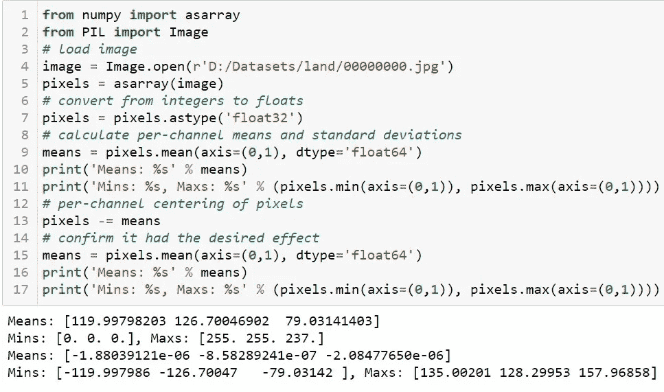
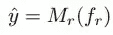

# 图像去噪

> 原文：<https://medium.com/analytics-vidhya/image-denoise-d8e1ba362495?source=collection_archive---------5----------------------->

嘈杂与干净

# 内容:

1.  **概述**
2.  **关于数据。**
3.  **丧失功能。**
4.  **绩效指标。**
5.  **加载数据**
6.  **数据预处理。**
7.  **图像增强**
8.  **人为噪音**
9.  **自动编码器**
10.  **UNETs**
11.  里登网
12.  **结果。**
13.  端到端管道。
14.  **样本输出。**
15.  **部署。**
16.  **APP 链接**
17.  **未来工作。**
18.  **参考文献。**

**1—概述:**图像噪声是图像中亮度或颜色信息的随机变化，通常是电子噪声的一个方面。它可以由扫描仪或数码相机的图像传感器和电路产生。图像噪声也可能源自胶片颗粒和理想光子探测器不可避免的散粒噪声。图像噪声是图像捕捉的一种不希望的副产品，它模糊了想要的信息。研究论文:关于图像去噪的深度学习，RIDNET，统计方法为了比较图像去噪技术，我们将使用不同类型的深度学习技术来去除这些噪声，即图像去噪。我们将使用带有人工噪声的自定义图像数据集。

**2 —关于数据:**我们有 3559 张大小为 1530x1024 的 RGB 图像(训练+验证)取自互联网，图像中没有任何噪点。可以使用任何图像数据，没有太多限制。

**3 —损失函数:**为了开始解决深度学习问题，我们首先需要的是为我们的问题陈述建立一个合适的损失函数。在这篇博客中，作者解释了可用于深度学习的不同类型的损失函数。

*   **均方误差:**均方误差是实际值和预测值的均方差。如果差异很大，模型将惩罚它，因为我们正在计算平方差。数学上:

均方误差(mean square error)

*   **平均绝对误差(MAE):** 模型相对于测试集的平均绝对误差是测试集中所有实例的单个预测误差绝对值的平均值。数学上:

新加坡金融管理局

*   **Kullback Leibler 散度损失:**它也被称为相对熵，是一个概率分布如何不同于第二个概率分布的度量，这在自动编码器模型中尤其有用。数学上:

KLD

**4 —性能指标:**评估你的机器学习算法是任何问题陈述的必要部分。你的模型可以让你对结果有一个清晰的理解，并增加可解释性。

*   **PSNR:** 这是一个工程术语，指信号的最大可能功率与影响其表现保真度的破坏性噪声功率之间的比率。因为许多信号具有非常宽的动态范围。统计学家采用这种技术来评估图像中的噪声。PSNR 值越高，表示图像过滤越好。

**5 —加载数据:**首先我们需要加载图像，为此我们可以采用多种方式:

*   **图像数据生成器:**为了使我们的工作变得简单，我们可以使用 TensorFlow/Keras 中的预定义函数，我们只需给出图像所在的目录。这种方法使用起来非常简单，而且非常内存友好，因为它在运行时加载批处理数据。

图像数据发生器

*   **数据加载器:**我们也可以使用许多库来单独加载图像，并使用 for 循环迭代其他图像，并将图像存储到 list/array。这种方法非常耗费内存和计算资源。

数据加载器

*   **自定义生成器:**如果我们在使用手动加载数据时遇到内存不足的问题，我们可以编写自己的生成器函数来在运行时生成图像，类似于 Keras 的图像数据生成器。类似的好处如 Keras

**发电机**

**6 —数据预处理:**这对于你解决的任何问题都是一项至关重要的任务，如果数据状态不佳，那么我们的模型训练就不会有效。为了处理图像，我们可以使用以下技术—

*   **像素归一化:**RGB 图像的每个像素值为 0–255，如果我们在模型训练中使用该图像，那么我们的模型将会不稳定，为了克服这一点，我们对图像进行归一化，使得所有像素值的范围在 0–1 之间，这使得我们的模型稳定。数学上:

正常化

*   **中心像素值:**像素值的分布以零值为中心。可以在标准化之前或之后执行居中。将像素居中，然后进行归一化，这意味着像素值将靠近 0.5 居中，并且在 0-1 的范围内。归一化后居中意味着像素将具有正值和负值，在这种情况下，图像将无法正确显示。像素中心有两种类型:

**一、全局居中:**计算并减去所有颜色通道的平均像素值。

**全局居中**

**二。局部居中:**计算并减去每个颜色通道的平均像素值。

**局部定心**

**7 —图像增强:**我们可以使用图像增强技术来增加训练数据的大小，这可以提高模型性能。

*   **水平和垂直移动:**对图像的移动意味着在保持图像尺寸不变的情况下，向一个方向移动图像的所有像素。这意味着图像中的一些像素将被剪切掉，并且图像中将有一个区域需要指定新的像素值。示例:

**水平和垂直移动**

*   **水平和垂直翻转:**图像翻转是指分别在垂直或水平翻转的情况下反转像素的行或列。通过翻转图像使我们的模型更加健壮，也就是说，即使我们旋转或翻转它，它也可以对图像进行分类。示例:

**水平和垂直翻转**

*   **随机缩放增强:**缩放增强随机地放大图像，并且或者在图像周围添加新的像素值，或者分别内插像素值。通过缩放图像使我们的模型更加鲁棒，即，即使我们只显示图像的很小一部分，它也可以对图像进行分类。示例:

**随机变焦放大**

**8 —人工噪声:**由于我们使用的是自定义数据集，即无噪声图像，我们必须在图像中添加一些人工噪声。我们将从一个图像中生成许多有噪声的图像，是的，我们是图像增强的一种，但也做一些特征工程:

*   **全噪声图像:**我们简单的给我们的图像添加噪声，这样做可以让模型处理全噪声图像。

全噪声码

全噪声图像

*   **部分噪声:**我们将噪声应用到图像的某个部分，这样做将使模型处理部分噪声图像。

位置噪声

*   **像素修改:**在这种技术中，我们随机抽取一个小的像素样本，然后用 0 和 1 替换它们，即黑白或添加一些噪声。

像素级别

部分噪声

**9 —自动编码器:** **自动编码器:**它是一个神经网络，将目标值设置为等于输入值。自动编码器用于将我们的输入缩减为更小的表示形式。如果有人需要原始数据，他们可以从压缩数据中重建它。示例架构。

自动编码器

*   **关于层:**我来详细解释一下每一层。

**一、输入层:**输入层是整个 CNN 的输入。在图像处理的神经网络中，它一般表示图像的像素矩阵。它是整个神经网络中的主要层，没有它，就不会有数据流入神经网络。

输入层

**二。卷积层:**该层采用一个输入矩阵/张量 X，并与另一个矩阵 K(或内核)进行逐元素乘法，其中 K 的值被初始化为零、均匀或任意随机分布，K 将总是在使用反向传播训练模型时更新，直到损失最小。

卷积 2D

卷积运算

**三世。Max Pool:** Max Pooling 是一个卷积过程，内核提取其卷积区域的最大值。Max Pooling 只是对 CNN 说，如果这是振幅方面可用的最大信息，我们将只结转该信息。

马克斯·普尔·2D

最大池操作

**四世。上采样:**上采样层是一个没有权重的简单层，它将输入的维度加倍。当在传统卷积层之后重建图像/数据时，这种层非常有用。

向上取样

上采样操作

**10 — UNET:** 架构对称，由两大部分组成，左边部分称为收缩路径，由一般卷积过程构成；右边部分是扩展路径，由转置卷积层构成。我们可以使用 segmentation_models 库来构建这个模型。

UNET

**架构:**它由两个 3×3 卷积(无填充卷积)的重复应用组成，每个卷积之后是一个整流线性单元(ReLU)和一个 2×2 最大池操作，步长为 2，用于下采样。在每个下采样步骤，我们将特征通道的数量增加一倍。扩展路径中的每一步都包括特征图的上采样，随后是将特征通道数量减半的 2×2 卷积(“上卷积”)，与收缩路径中相应裁剪的特征图的连接，以及两个 3×3 卷积，每个卷积之后是 ReLU。由于每次卷积都会丢失边界像素，因此裁剪是必要的。在最后一层，使用 1×1 卷积将每个 64 分量特征向量映射到期望数量的类别。网络总共有 23 个卷积层。要实现输出分割图的无缝分块，选择输入分块大小很重要，这样所有 2x2 最大池操作都可以应用到 x 和 y 大小相等的图层。

UNET

**11 — RIDNET:** 带特征关注的真实图像去噪(RIDNET)是一种深度卷积神经网络，它对包含人工噪声的图像表现更好，但对真实噪声图像可能表现不佳。为了提高去噪算法的实用性，研究人员提出了一种采用模块化结构的 RIDNETs。在这种情况下，我们使用残差结构上的残差来缓解低频信息的流动，并应用特征注意力来利用通道依赖性。

该架构由三个模块组成:

**一、特征提取:**它只由一个卷积层组成，从有噪图像中提取初始特征。

**特征提取**

**二世。EAM:** 初始特征然后传递给主特征学习残差上的残差分量即增强注意模块(EAM)这些层通过内核扩展提供了一个宽广的感受域。

**EAM**

**三世。重构模块:**层的输出特征传递给重构模块，重构模块由一个卷积层组成。

**重建模块**

(第二次世界大战时希腊的)民族解放阵线(Ethniko Apelevtherotiko Metopo)ˌ电动计算机(Electric Accounting Machine)ˌ工程管理手册(Engineering Administration Manual)

**架构:**

RIDNET

RIDNET 摘要

**12 —结果:**这里，方法 1 定义图像上的简单全噪声，方法 2 定义图像上不同位置的噪声，如上所述的像素修改。

结果

**13 —端到端管道:**现在我们采用性能最佳的模型，创建一个易于使用的数据管道功能。

**14 —样本输出:**

样本预测 1

样本预测 2

部署:对于部署，我使用了 AWS 和 Streamlit。这个网络应用程序可以接受图像作为网址或图像从衍生上传。一些示例输出:

使用 URL

使用图像上传

**16- APP 链接:**[https://share . streamlit . io/ismailsiddiqui 011/image _ 降噪 _app/main/app.py](https://share.streamlit.io/ismailsiddiqui011/image_denoise_app/main/app.py)

**17 —未来工作:**

*   为了进一步提高模型的性能，我们可以通过向模型添加更多的层来进行实验。
*   还可以添加更多数据来提高性能。
*   为了更进一步，我们可以实现超级采样/超级分辨率来消除模糊。

18 **—参考文献:**

*   **应用人工智能—**[https://www.appliedaicourse.com](https://www.appliedaicourse.com/)
*   **机器学习掌握—**[http://machinelearningmastery.com](http://machinelearningmastery.com/)
*   **ARVIX—**[**https://arxiv.org/**](https://arxiv.org/)
*   **论文代码—**[**https://paperswithcode.com/**](https://paperswithcode.com/)