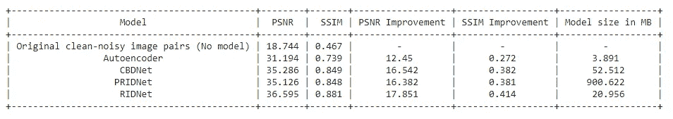

# 基于深度学习的图像去噪

> 原文：<https://medium.com/analytics-vidhya/image-denoising-using-deep-learning-dc2b19a3fd54?source=collection_archive---------0----------------------->

图像去噪

# 内容

1.  商业问题
2.  为什么要深度学习？
3.  业务限制
4.  绩效指标
5.  数据集概述
6.  探索性数据分析
7.  现有方法
8.  尝试深度学习模型
9.  结果
10.  模型量化
11.  使用简化共享进行部署
12.  结论
13.  潜在的改进
14.  链接到 Github 和 LinkedIn
15.  参考

# 商业问题

真实世界中捕捉到的图像带有噪声。这些噪声可能由于许多原因而出现，例如电信号不稳定、相机传感器故障、照明条件差、长距离数据传输中的错误等。这可能会降低捕获图像的质量，并可能导致信息丢失，因为原始像素值会因噪声而被随机值替换。因此，当涉及到低级视觉任务和图像处理时，需要从图像中去除这些噪声。从图像中去除这种噪声的过程被称为图像去噪。

因此，当前的任务是开发一种解决方案，从图像中去除这些噪声，从而提高图像质量并保留图像中的相关信息。

# 为什么要深度学习？

几十年来，图像去噪一直是一个有趣的研究领域。多年来，许多技术和思想已被引入图像去噪。这些技术大多假设图像中的这些噪声是高斯噪声或脉冲噪声。

**高斯噪声**-PDF 等于正态分布的噪声。即这些噪声可以采用的像素值是高斯分布的。

**脉冲噪声** -由图像信号中尖锐和突然的干扰引起。它通常作为图像中的黑白像素出现。

但是这个假设并不完全适用于照片中的真实噪音。真实世界的噪声(也称为**盲噪声**)更加复杂多样。由于这个原因，大多数去噪技术在从图像中去除真正的噪声方面表现不佳。

因此，为了解决现实世界噪声图像的去噪问题，需要使用更先进的技术。这就是深度学习发挥作用的地方，实验证明，训练卷积盲去噪深度学习网络比其他传统图像去噪技术好得多。这就是我们使用深度学习进行图像去噪任务的原因。

# 业务限制

解决这个问题时要考虑的两个主要约束是

1.  对真实世界的噪声图像进行去噪，以接近地面真实图像。
2.  没有延迟限制。当务之急是尽可能接近真实情况地对图像进行去噪，即使这需要合理的时间。

考虑到这些限制，我将为图像去噪任务建立深度学习模型。

# 绩效指标

通常使用两个著名的指标来检查图像质量。

a)峰值信噪比(PSNR)[[**1**](https://www.ni.com/en-in/innovations/white-papers/11/peak-signal-to-noise-ratio-as-an-image-quality-metric.html)**]:**它是信号的最大可能功率与有害噪声的功率之比，affects 其表示的质量。由于信号的取值范围很广，PSNR 通常用对数分贝标度来表示。
数学上 PSNR 可以表示为

峰值信噪比方程

其中 MSE 由下式给出

均方误差方程

**B)结构相似性指数(SSIM)【**[**2**](/srm-mic/all-about-structural-similarity-index-ssim-theory-code-in-pytorch-6551b455541e)**】:**It**通过主要关注来自场景的结构信息并识别从参考和样本场景提取的信息之间的差异来测量两个给定图像之间的相似性。人们认为，人类的视觉感知系统就是这样工作的。因此，这是一个很好的衡量图像质量的指标。**

**该度量提取三个特征，即**亮度、对比度和结构。基于这些特征完成两幅图像之间的比较。****

**可以在上面给出的参考文献中找到对该度量的进一步数学理解。**

# **数据集概述**

**我采用了两个公开可用的数据集用于图像去噪任务，如下所示:**

1.  ****智能手机图像去噪数据集(SIDD)[**[**3**](https://www.eecs.yorku.ca/~kamel/sidd/dataset.php)**】**:-它由 320 个干净-有噪声的图像对组成。**
2.  ****真实微光图像降噪数据集(RENOIR)[**[**4**](http://adrianbarburesearch.blogspot.com/p/renoir-dataset.html)**】**:-它由 221 个干净-有噪声的图像对组成。**

**我已经合并了这些数据集，并把它们混在一起。因此，对于我们的任务，我们总共得到 541 个干净的有噪声的图像对。然后，我将数据集按比例(80:20)分成训练和测试图像。因此，我们总共有 432 对训练图像和 109 对测试图像。**

# **探索性数据分析**

**让我们通过对图像数据集执行彻底的 EDA 来更好地理解它们。我们可以查看像像素分布、图像对的 PSNR 和 SSIM 值等图，并查看干净图像和有噪声图像之间的差异。**

****可视化少量干净-有噪声的图像对****

********

**干净的噪声图像对**

**可以看出，在有噪声的图像中有大量的噪声，地面真实图像显示了相应的没有噪声的干净图像。**

****图像的平均像素分布****

****

**图像的平均像素分布**

**对于大多数图像(干净的和有噪声的)，平均像素值在 20-75 之间。这意味着，大多数图像具有暗到中等的亮度。只有少数图像具有高平均像素值或高亮度。**

****通过绘制直方图分析少量干净-噪声图像对的像素分布:****

****

**干净图像及其相应噪声图像的像素分布**

**与干净的图像相比，有噪声的图像似乎具有更平滑的像素强度分布。此外，与干净图像的相应像素值相比，噪声图像中的许多像素取零像素值。这意味着噪波用深色替换了许多实际像素值。**

****分析图像的 PSNR 和 SSIM 值****

****

**所有干净-噪声图像对的 PSNR 值的 PDF 和直方图**

**大多数干净-噪声图像对的 PSNR 值在 25-30 之间。因此，一个好的去噪模型应该给出大于 30db 的干净-有噪声图像对的平均 PSNR 值。**

****

**所有干净-噪声图像对的 SSIM 值的 PDF 和直方图**

**大多数干净-噪声图像对的 SSIM 值在 0.1-0.7 之间。因此，一个好的去噪模型应该为干净-有噪声的图像对给出大于 0.7 的平均 SSIM 值。**

****创建补丁****

**我们将把这些图像分割成小块。实验表明，将图像分割成小块并使用这些小块进行训练可以提高去噪的模型性能。**

****

**将图像分割成小块。**

**这就是修补的作用。它根据给定的补丁大小将图像分割成不同的补丁。我们将绘制一些干净的有噪声的图像块，并将它们可视化。**

****

**清除有噪声的图像补丁**

**在有噪声的图像块中有大量的噪声，这就是我们试图消除的。由于数据集图像具有不同的大小，为了保持每个图像的固定数量的补丁，我们必须将每个图像的大小调整为固定值。因此，我们将所有图像的大小调整为 1024 x 1024 的固定大小，并创建大小为 256 x 256 的面片。这将为每个图像提供 4x4=16 个补丁。**

**在创建补丁之后，我们为训练图像获得了 6912 个图像补丁，为测试图像获得了 1744 个图像补丁。我们将使用这些训练和测试图像块进行建模。**

# **现有方法**

**正如所讨论的，图像去噪的任务几十年来一直是一个有趣的研究领域。多年来，许多技术被用于解决这个问题。其中一个著名的技术是应用过滤器来消除噪音。有许多滤波器可用于图像去噪。这些滤波器中的大多数都是针对图像中存在的噪声类型的。一种著名的滤波器被称为**非局部均值(NLM)算法。****

**NLM 滤波器通过图像块中所有像素的平均值来替换图像的每个像素值，并根据这些像素与目标像素的相似程度进行加权。这使得滤波后的清晰度更高，图像中的细节损失更少，并且与许多其他传统滤波器相比，在图像去噪中表现良好。**

**查看下面的视频，了解 NLM 算法的更详细的解释。**

**基于 NLM 滤波的图像去噪**

**现在，在我们开始使用深度学习模型去噪之前，让我们看看这个简单的滤波器在图像去噪中的表现。我们将从我们的数据集中选取一些图像块，并对它们应用 NLM 滤波器进行去噪，并将这些去噪后的图像可视化。这将有助于我们理解使用深度学习等更高级技术进行去噪任务的必要性。**

****

**基于 NLM 滤波的图像去噪**

**可以看出，NLM 滤波器可以在一定程度上消除图像的噪声。但是它平滑了地面真相图像中存在的许多细节，导致了本应保留的重要信息的丢失。此外，当噪声太高时，NLM 不能提供好的结果。**

**因此，需要使用更先进的技术，如深度学习来完成图像去噪任务。**

# **输入数据管道**

**现在我们已经有了从 SIDD 和雷诺阿数据集的干净-嘈杂图像对中获取的训练和测试图像片，我们已经为建模做好了准备。我们总共有 6912 和 1744 个训练和测试图像块，块大小为 256×256。**

**X _ train _ image _ patches . shape =(6912，256，256，3) —地面实况影像 y _ train _ image _ patches . shape =(6912，256，256，3) —噪声影像 X _ test _ image _ patches . shape =(1744，256，256，3) —地面实况影像 y _ test _ image _ patches . shape =(1744，256，256，3)—噪声影像**

**我将创建一个输入数据管道，将这些图像补片作为模型训练的输入。我将使用 **Keras 定制数据生成器**来构建输入管道。**

**在将它加载到定制生成器之前，**通过将每个像素除以 255** 来对训练和测试补丁进行归一化。输入数据管道将以批处理大小= 32 的批处理方式将数据加载到模型中。给予模型的输入形状将是(32，256，256，3)。**

# **尝试深度学习模型**

**随着深度学习技术的进步，现在可以从图像中去除真实噪声，使得去噪后的图像非常类似于地面真实图像，而细节损失最小。**

**近年来，许多深度学习架构已经被开发用于图像去噪任务。其中，我将实施四种最先进的深度学习架构来解决这个问题，如下所示:**

1.  **自动编码器(基线模型)**
2.  **CBDNet**
3.  **PRIDNet**
4.  **RIDNet**

## **自动编码器**

**这是一个简单的**编码器-解码器网络[******】**，具有 3 个卷积层，随后是用于编码器单元的 max-pooling 和用于解码器单元的 3 个去卷积层。来自解码器的输出然后被提供给具有 3 个滤波器的卷积层，以保持相似的输入和输出形状。这是一个简单的架构，将用作基线模型。****

****用于训练模型的**损失函数**是**均方误差(MSE)** 。该模型被训练 15 个时期，并且它给出 0.0011 的训练和测试损失。****

****************

****自动编码器模型结果****

****尽管这种简单的结构可以减少噪声，但是预测的图像缺乏清晰度。去噪前，测试数据上 PSNR 和 SSIM 的平均得分分别为 18.74 和 0.47 。自动编码器模型在相同的测试数据上分别给出了 31.19 的 **PSNR 得分和 0.74 的**SSIM 得分。这意味着，该模型运行良好，我们可以将这些分数作为基准值来比较其他模型的性能。****

## ****CBDNet —卷积盲去噪网络[ [6](https://arxiv.org/pdf/1807.04686v2.pdf)****

****CBDNet 架构带有 2 个子网络。首先是噪声估计子网络(CNNe-估计噪声图像中的噪声水平图)，接着是非盲去噪子网络(CNNd-去噪噪声图像)。网络架构如下所示****

********

****CBDNet 架构****

****在最初的研究论文中，他们使用真实的噪声图像和综合添加的噪声图像来训练这个模型。他们使用噪声模型将噪声综合添加到图像中。由于我们正在使用的数据集已经有干净-有噪声的图像对，我没有考虑综合地添加噪声到图像中。所以，我没有采用制造噪音的模型来构建网络。此外，本文中使用的损失函数如下:****

******损失=均方误差(MSE)+(λx 全变分正则化)**
其中全变分正则化防止去噪图像的过度平滑，λ是超参数。****

******与研究论文相比，CBDNet 实施中的修改:******

1.  ****没有添加合成噪声到图像数据集，因为我们有真正的噪声图像对。****
2.  ****将损失函数视为均方误差。****

****该模型被训练 30 个时期，并且它给出 0.00044 的训练损失和 0.000453 的测试损失。****

****************

****CBDNet 模型结果****

****可以看出，与自动编码器模型相比，模型性能有了很大的提高。预测的去噪图像更加清晰，而自动编码器则不是这种情况。该模型在测试数据上给**的平均 PSNR 分数为 35.256，平均 SSIM 分数为 0.848。******

## ****PRIDNet —金字塔实像去噪网络[ [7](https://arxiv.org/pdf/1908.00273v2.pdf)****

****网络架构如下所示:****

********

****特征图的通道数显示在它们下面，对于“sRGB”模型，它在括号中，而对于“原始”模型，它没有括号。符号||表示连接。****

****该网络分为三个阶段，解决了许多基于 CNN 的去噪网络从未真正解决的三个主要问题。****

******A)通道注意力模块(CAM):** 大多数基于 CNN 的去噪网络对所有通道特征给予同等的重视。但实际上，有些噪声比其他噪声更重要，应该给予更多的权重。PRIDNet 通过在其网络中实施频道注意模块来实现这一点，该模块将根据估计的噪声水平向频道添加 different 权重。****

********

****频道关注模块架构****

****CAM 使用全局平均池压缩输入信息 U，然后进行两次卷积，第一次激活 ReLU，第二次激活 sigmoid。该计算将为您提供 different 通道的权重𝜇，然后乘以输入信息 u，从而重新校准通道重要性。这个阶段被称为**噪声估计阶段。******

******B)五层金字塔模块:**传统的基于 CNN 的去噪网络使用固定的接收场，该接收场捕获图像中噪声的全局信息，但无法捕获不同的信息。PRIDNet 通过使用 different 缩放接收场解决了这一问题，该接收场还将捕捉图像中的各种噪声信息。结果表明，这种实现有助于从强噪声中去除 suffer 图像的噪声。****

********

****五层金字塔结构****

****在这里，输入要素地图被下采样到 different 大小，因此我们可以使用 different 尺度的接收场，从而捕捉全局和多样化的信息。这些下采样的特征被提供给池层，随后是 U-Net 架构，然后被上采样到原始大小，并且输出被连接在一起。图像中显示了过滤器的数量及其尺寸。这个阶段被称为**多尺度去噪阶段。******

******C)核选择模块:**在传统的基于 CNN 的去噪网络中，多尺度特征通常使用逐元素求和或通过级联它们来组合。这意味着来自 different 尺度的信息被同样对待，这不能自适应地表达多尺度特征。为了防止这种情况，PRIDNet 引入了一种核选择模块，该模块对级联多尺度特征的每个通道使用 different 大小的核。****

********

****内核选择模块架构****

****我们从多尺度去噪阶段获得的多尺度级联输出(U)被给予核大小为 3、5、7 的三个并行卷积，然后被求和。然后，使用全局平均池对其进行压缩，之后进行 2 次卷积，以给出应用 softmax 激活的 3 个向量𝜶,𝜷,𝛄。然后，将这些向量与最初 3 个并行卷积的输出相乘，得到 V’，V”，V”’，并相加，得到最终的去噪输出图像 V = V’+V”+V”’。这个阶段被称为**特征融合阶段。******

****此外，为了避免信息丢失，在整个网络中，每一级的输出都与前一级的输入连接在一起。****

****该模型以 MSE 作为损失函数被训练 30 个时期，并且它给出 0.000449 的训练损失和 0.000457 的测试损失。****

****************

****PRIDNet 模型结果****

****该模型似乎给出了与 CBDNet 几乎相同的视觉效果。该模型在测试数据上给出了平均 PSNR 分数 35.126 和平均 SSIM 分数 0.848 的**。**根据研究论文，PRIDNet 模型在训练更多的历元时在性能上超过 CBDNet 模型。但是 PRIDNet 模型的缺点是需要训练大量的参数，并且模型规模很大。尽管如此，与 CBDNet 相比，它在模型性能上并没有显著的改进。****

## ****RIDNet —残差图像去噪网络[ [8](https://arxiv.org/pdf/1904.07396v2.pdf)****

****网络架构如下所示:****

********

****卷积层的不同绿色表示不同的膨胀，而卷积层的较小尺寸意味着核是 1 × 1。第二行显示了每个 EAM 的架构。****

****该网络由以下三个主要模块组成:****

******A)特征提取模块:**它只由一个卷积层组成，从有噪输入中提取初始特征。我在卷积层使用了 64 个内核大小为 3 的过滤器。****

******B)残差模块上的特征学习残差:**它由一个称为增强注意模块(EAM)的网络组成，该网络使用残差结构上的残差，具有局部跳过和短跳过连接。EAM 的初始部分通过核膨胀和分支卷积使用宽感受野，从而从输入图像中捕获全局和多样的信息。使用两个卷积的残差块，后面跟着三个卷积的增强残差块(ERB ),学习附加特征。最后，它被给予特征关注块，该特征关注块给予重要特征更多的权重。****

****我们可以通过增加 EAM 区块的数量来增加 RIDNet 网络的深度。然而，在研究论文中，他们将网络限制在 EAM 的四个街区。****

******C)重构模块:**最终 EAM 块的输出被提供给重构模块，该重构模块再次仅由一个卷积层组成，该卷积层给出去噪图像作为输出。****

****研究论文中使用的损失函数是平均绝对误差(L1 损失)，但我将使用均方误差(L2 损失)。****

****该模型以 MSE 作为损失函数被训练 25 个时期，并且它给出 0.000321 的训练损失和 0.000334 的测试损失。****

****************

****RIDNet 模型结果****

****从视觉上看，该模型似乎也给出了与 PRIDNet 和 CBDNet 相似的性能。该模型在测试数据上给出的**PSNR 平均得分为 36.595，SSIM 平均得分为 0.881。******

# ****结果****

****我们将根据 PSNR 和 SSIM 评分比较所有模型的性能，并将模型大小纳入考虑范围，以决定最佳模型。****

********

****结果****

****与 CBDNet 和 PRIDNet 模型相比，RIDNet 模型具有更好的 PSNR 和 SSIM 评分以及更小的模型规模。因此，我们将最终确定 RIDNet 模型作为图像去噪任务的最佳模型。****

******RIDNet 模型在少量噪声图像上的性能:******

********************************

****RIDNet 模型去噪少量噪声图像****

# ****模型量化****

****模型量化是一种转换技术，它可以减小模型大小，同时还可以改善 CPU 和硬件加速器的延迟，而模型精度几乎不会下降。它通过降低用于表示模型参数的数字的精度来工作，默认情况下，这些数字是 32 位浮点数。这导致更小的模型尺寸和更快的计算。****

****当您使用 **TensorFlow Lite 转换器[**[**9**](https://www.tensorflow.org/lite/convert/)**】**将已经训练好的浮点 TensorFlow 模型转换为 TensorFlow Lite 格式时，可以对其进行量化。****

********

****量化前后 RIDNet 模型性能和大小。****

********

****使用原始 RIDNet 和量化 RIDNet 模型预测噪声图像。****

****在模型量化之后，模型的大小从 20.956 MB 减小到 6.877 MB，而模型性能没有任何显著下降。但不幸的是，量化模型的预测时间急剧增加。这是因为预测是在图像补片上完成的，然后这些补片被合并以给出最终的去噪输出。因此，对于每个补丁，TensorFlow lite 版本需要调用模型，从而花费更多时间。****

# ****使用简化共享进行部署****

****为了给读者提供更好的用户体验，我使用 Streamlit 部署了该模型，这是一个用于机器学习和数据科学项目的开源应用框架。****

****可以在此处访问部署的模型:****

****[https://share . streamlit . io/sharath Solomon/image 降噪/main/model.py](https://share.streamlit.io/sharathsolomon/imagedenoising/main/model.py)****

****创建的 web 应用程序有两个选项。****

1.  ****预测样本图像:有一些样本图像已经上传到应用程序，你可以选择看看模型的表现如何。选择列出的任何样本图像，并获取其去噪输出。****
2.  ****上传一个嘈杂的图像:用户也可以上传一个嘈杂的图像，并获得其降噪输出。****

****这里有一个视频展示了部署的模型是如何进行预测的。****

****web 应用程序在 CPU 上运行，因此预测时间大约需要 10 秒。使用 GPU 可以将预测时间减少到毫秒级。****

# ****结论****

1.  ****CBDNet 和 PRIDNet 模型给出了可比较的性能。根据研究论文，PRIDNet 模型在经过大量时期的训练后，其性能优于 CBDNet 模型。但是 PRIDNet 模型的缺点是需要训练大量的参数，并且模型规模很大。尽管如此，与 CBDNet 相比，它并没有给模型性能带来显著的改进。****
2.  ****与 CBDNet 和 PRIDNet 相比，RIDNet 模型是较新的技术。它还在 PSNR 和 SSIM 值方面显著提高了模型性能。另一个优点是，与其他模型相比，参数数量和模型大小更少。****
3.  ****与像 PRIDNet 这样需要训练大量参数的复杂网络相比，像 RIDNet 这样的简单网络证明可以显著提高图像去噪性能。这意味着，与简单的网络相比，复杂的模型不一定能更好地解决问题。****

# ****潜在的改进****

****图像去噪是一个活跃的研究领域，并且正在开发许多令人惊奇的架构来对图像去噪。最近，研究人员正在使用 **GANs** 对图像进行去噪处理，事实证明这种方法能产生惊人的效果。****

****此外，**图像恢复**是另一个活跃的研究领域，试图恢复受损图像，如去模糊图像、图像去模糊等。多年来，已经开发了许多高级深度学习架构来解决这个问题，这些网络在图像去噪任务中也工作得很好。根据 www.paperswithcode.com**[**[**10**](https://paperswithcode.com/sota/image-denoising-on-sidd)**]的说法，与仅为图像去噪目的而设计的模型相比，像 HINet、Uformer32、MIRNet** 这样的图像恢复模型为图像去噪任务提供了更好的性能。****

# ****链接到 GitHub 和 LinkedIn****

****您可以在我的 [**Github 资源库**](https://github.com/sharathsolomon/ImageDenoising) **中找到这个案例研究的完整代码。**请随时通过 [**LinkedIn**](https://www.linkedin.com/in/sharath-solomon-0a5436112/) 或通过**sharath.solomon@outlook.com**的电子邮件与我联系****

# ****参考****

1.  ******峰值信噪比(PSNR):**[https://www . ni . com/en-in/innovations/white-papers/11/Peak-Signal-to-Noise-Ratio-as-an-image-quality-metric . html](https://www.ni.com/en-in/innovations/white-papers/11/peak-signal-to-noise-ratio-as-an-image-quality-metric.html)****
2.  ******结构相似指数(SSIM):**[https://medium . com/SRM-mic/all-about-Structural-Similarity-Index-ssim-theory-code-in-py torch-6551 b 455541 e](/srm-mic/all-about-structural-similarity-index-ssim-theory-code-in-pytorch-6551b455541e)****
3.  ******智能手机图像去噪数据集(https://www.eecs.yorku.ca/~kamel/sidd/dataset.php)******
4.  ******真实微光图像降噪数据集(RENOIR):**[http://adrianbarburesearch . blogspot . com/p/RENOIR-Dataset . html](http://adrianbarburesearch.blogspot.com/p/renoir-dataset.html)****
5.  ******自动编码器:**[https://keras.io/examples/vision/autoencoder/](https://keras.io/examples/vision/autoencoder/)****
6.  ******CBDNet 研究论文:**[https://arxiv.org/pdf/1807.04686v2.pdf](https://arxiv.org/pdf/1807.04686v2.pdf)****
7.  ******PRIDNet 研究论文:**【https://arxiv.org/pdf/1908.00273v2.pdf ****
8.  ****【RIDNet 研究论文:[https://arxiv.org/pdf/1904.07396v2.pdf](https://arxiv.org/pdf/1904.07396v2.pdf)****
9.  ******Tensorflow Lite 转换器:**[https://www.tensorflow.org/lite/convert/](https://www.tensorflow.org/lite/convert/)****
10.  ******https://paperswithcode.com/sota/image-denoising-on-sidd**SIDD[图像去噪](https://paperswithcode.com/sota/image-denoising-on-sidd)****
11.  ******应用人工智能课程:**[https://www.appliedaicourse.com/](https://www.appliedaicourse.com/)****