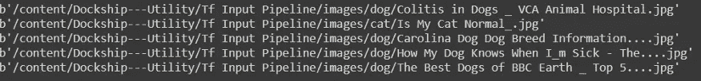

# 使用张量流的图像输入管道

> 原文：<https://medium.com/analytics-vidhya/image-input-pipeline-using-tensorflow-c9f729ead09f?source=collection_archive---------6----------------------->



关于如何使用 tf.data API 为图像数据集创建输入管道的简单方法

# 介绍

嘿大家好，

这是我上一篇文章的延伸，也是将获得的知识应用于图像数据集的动手实践指南(理论部分)。

我们使用的数据集是一个简单的数据集，最常用于演示目的——狗和猫的数据集(参考链接)。然而，在这里您也可以使用一个非常好的扩展来为您创建数据集。

# 创建数据集

因此，我已经形成的数据集可以使用名为“ [Fatkun 批量下载图像](https://chrome.google.com/webstore/detail/fatkun-batch-download-ima/nnjjahlikiabnchcpehcpkdeckfgnohf?hl=en)”的扩展来创建。要使用，请遵循以下步骤:

`**-> install the application**`

`**-> open the images page**`

`**-> Start the application**`

`**-> Hit Current Tab & Hit the download button**`。

*确保将图像下载到单独的文件夹中，如果没有，建议将它们分别放入文件夹中:*


单独的文件夹

# 正在加载数据集

现在在输入管道中，我们有了 `**tf.data.Dataset.list_files(filepath)**`，它将帮助我们*从目录中加载文件路径*。

因此，我们可以将数据加载为:

>我们从 **GitHub** 加载数据

```
# loading from github
!git clone ‘https://github.com/DevloperHS/Dockship---Utility.git'
```

**注意:我一直在使用 collab 并从 GitHub 导入我的文件，所以路径可能会改变，但整体结构将保持不变:)**

>导入模块

```
# importing modulesimport tensorflow as tf
import numpy
```

>加载文件

```
image_ds = tf.data.Dataset.list_files('/content/Dockship---Utility/Tf Input Pipeline/images/*/*', shuffle = 'False')# view the files
for i in image_ds.take(5):
print(i.numpy())
```


仅包括文件路径

可以看出，现在`**image_ds**`只包含文件路径，不包含实际文件。但是过一会儿，我们将看到如何加载实际的图像。

# 预处理

任何图像分析的一般步骤都是将原始数据预处理成可以理解的东西，在这一节中，我们将了解如何对数据集应用一些预处理步骤。

## 洗牌

一般来说，为了保持我们的数据集中没有偏见，我们对数据集进行混洗。这可以通过使用`*shuffle()*`方法实现，如下所示:

```
image_ds = image_ds.shuffle(200)#view files
for i in image_ds.take(5):
    print(i.numpy())
```


混洗数据集

## 剧烈的

为了创建模型所需的数据，我们需要将数据集分为训练和测试两部分。通常，我们使用`train_test_split`，但是当我们在`tensorflow`中工作时，它提供了一个简单的解决方法，如下所述

我们可以得到数据集的`len`，我们想要保留用于训练的`**multiply the percentange of data by that length**`，并使用`take()`和`skip()`方法来执行到`train_ds`和 `test_ds`的拆分，如下所示:

```
'''
- use `take` to keep that much of data- use `skip` to pass the take ammount of data'''# get length of iamge dataset in img_cout
img_count = len(image_ds)
img_count# define train size
train_size = int (img_count*0.8)  # 80% of data 
train_size# perform the split
train_ds = image_ds.take(train_size)
test_ds = image_ds.skip(train_size)print(len(train_ds))
print(len(test_ds))
```


训练集的长度


测试集的长度

## 绘图

映射是指一次性在整个数据集上应用一些过程或自定义函数。可以使用`map()`方法使用。

这里我们将编写几个函数，这些函数将从数据集中加载标签、整个图像，并对它们进行缩放 。每个功能的详细信息如下:

`**load_labels(file_path)**` -该函数将接受`*file_path*`并通过使用`tf.strings.split(file_path, separator)[n]`返回标签，其中分隔符将是`os.path.sep`:-将文件路径分隔成其组件。

```
#get labels fndef get_labels(file_path):
    import os 
    return tf.strings.split(file_path , os.path.sep)[-2]
```

> *注意:我们没有使用* `*split("/")[n]*` *作为 tf.data.dataset 是一个张量对象，而不是一个列表或字符串，所以我们需要小心处理，请记住使用传统方法会导致错误* **。**

`**process_image(file_path**)` -负责的主要功能:

*   **使用`tf.io.read_file(file_path)`加载数据**
*   **加载标签**使用 `get_labels()`我们之前定义的函数，
*   **使用`tf.image.decode_img_type(img) # optional`解码图像**，
*   **使用 `tf.image.resize(file , [dimension])`调整**的大小
*   返回 ***图像和标签*** 。

```
def process_img(file_path):
    label = get_labels(file_path)
    img = tf.io.read_file(file_path)
    img = tf.image.decode_jpeg(img)
    img = tf.image.resize(img, [224,224])
    return img , label
```

`**re_scale(img, labels)**`:该函数确保图像数组的所有值在(0-1)和标签之间按原样缩放。

```
def re_scale(img, labels):
    return img/255 , labels
```

最后，将**图*图*图**应用到每个功能可以这样完成:

```
# processing image using fn
train_ds = train_ds.map(process_img)
test_ds = test_ds.map(process_img)# viewing files 
for img, label in train_ds.take(3): # only 3 elementd 
    print('*** Image', img.numpy()[0][0])  # 1st row
    print('*** Label', label.numpy())
```


已处理数据集-未缩放

```
# here our file_path is train_ds itself as it hols all the file paths for training set train_ds = train_ds.map(scale)# viewing files
for img, label in train_ds.take(3):
    print('img: ', img.numpy()[0][0])
    print('labels', label.numpy())
```


已处理数据集-缩放

> 因为这篇文章只是为了演示和目的，所以我不包括整个列车&部署管道。此外，这个 API 可以做许多预处理，但不包括我为常见情况演示的那些。

## 最后的话

*说到这里，我们的文章就到此为止了。我建议你练习编码部分，因为它会很有趣，还会增加你的知识基础。这里使用的所有材料都在参考资料部分提供。如果您对任何代码有任何疑问，请在下面留下* ***评论*** *，如果您喜欢，也请务必分享***。**

# *参考*

*   *有关输入管道的更多信息，请访问[https://www.tensorflow.org/api_docs/python/tf/data/Dataset](https://www.tensorflow.org/api_docs/python/tf/data/Dataset)*
*   *代码笔记本:[笔记本](https://colab.research.google.com/drive/1mZWO8YRQV1t39bEJeTgnslj8ms3IdTzo?usp=sharing)*
*   *参考视频:[代码基础](https://youtu.be/VFEOskzhhbc)*