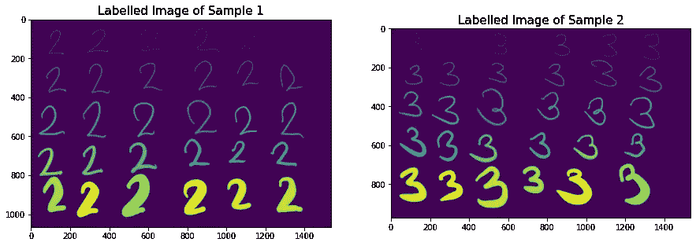

# 图像处理和机器学习

> 原文：<https://medium.com/analytics-vidhya/image-processing-and-machine-learning-492c0b2f9153?source=collection_archive---------10----------------------->

使用图像处理技术创建机器学习数据集


(图片由作者提供)

图像处理已被应用于许多领域，从计算机视觉到文本检测、对象检测等等。

它的一个应用是，你利用你的图像处理技术为你的机器学习算法创建一个样本数据集。

在本文中，我们将展示如何使用简单的图像处理技术作为机器学习模型的管道。

假设你有一个随机图像，其中有一个你想要预测的对象，我们如何提取必要的特征和信息，以用作我们机器学习模型的训练数据？

为了展示这一点，让我们加载一些简单的用户生成的图像。

对于本文，我使用了以下库:

```
import matplotlib.pyplot as plt
import numpy as np
import pandas as pd
from skimage.io import imread, imshow
from skimage.color import rgb2gray
from skimage.measure import label, regionprops
from skimage.filters import threshold_otsu
import warnings 
warnings.filterwarnings('ignore')
```

## 图像处理部分

我们加载样本图像:

```
#read image
sample1 = imread('number2.png')
sample2 = imread('number3.png')
#convert to gray scale
sample1_g = rgb2gray(sample1)
sample2_g = rgb2gray(sample2)fig, ax = plt.subplots(1, 2, figsize=(15,15))
ax[0].imshow(sample1_g, cmap='gray')
ax[0].set_title('Sample 1',fontsize=15)
ax[1].imshow(sample2_g, cmap='gray')
ax[1].set_title('Sample 2',fontsize=15)
plt.show()
```


图 1:示例图片(图片由作者提供)

图 1 显示了我们的示例图像，这是一个用户定义的手写图像，包含数字 2 和数字 3。我们将尝试分割这些数字，并提取不同的参数，以便输入到机器学习模型中。

为了开始我们的流水线，为了容易地从图像中提取特征，我们应该将整个图像二值化。我们可以用 Otsu 的方法，

```
#binarizing using otsu
thresh1 = threshold_otsu(sample1_g)
sample1_b = sample1_g < threshthresh2 = threshold_otsu(sample2_g)
sample2_b = sample2_g < thresh2fig, ax = plt.subplots(1, 2, figsize=(15,5))
ax[0].imshow(sample1_b,cmap='gray')
ax[0].set_title('Binarized Image of Sample 1',fontsize=15)
ax[1].imshow(sample2_b, cmap='gray')
ax[1].set_title('Binarized Image of Sample 2',fontsize=15)
plt.show()
```


图 2:二值化图像(作者提供的图像)

请注意，我们能够通过衰减图像中的数字来完美地二值化图像。

下一步我们将标记这些白色物体。对于这个步骤，我们可以使用不同的斑点检测。为了使它更容易，我们可以使用一个连接的组件函数来隔离每个数字。为此，我们可以使用 scikit-image 中的预定义标记函数。

```
#using label to isolate each image
sample1_la = label(sample1_b)
sample2_la = label(sample2_b)fig, ax = plt.subplots(1, 2, figsize=(15,5))
ax[0].imshow(sample1_la)
ax[0].set_title('Labelled Image of Sample 1',fontsize=15)
ax[1].imshow(sample2_la)
ax[1].set_title('Labelled Image of Sample 2',fontsize=15)
plt.show()
```



图 3:带标签的图片(作者提供的图片)

请注意，在图 3 中，我们能够标记和检测图像中的每个连接组件。不断变化的颜色意味着它能够检测到每个独特的数字。

为了检查这一点，我们可以简单地使用 region props 函数来确定所看到的图像总数。视觉上，我们应该能够得到每个样本 30 个数字。

```
sample1_r=regionprops(sample1_la)
sample2_r=regionprops(sample2_la)print('Number of Data in Sample 1: ',len(sample1_r))
print('Number of Data in Sample 2: ',len(sample2_r))
```

样本 1 中的数据数量:30

样本 2 中的数据数量:30

确实！我们成功地检测到了每个样本图像中的每个样本数。

我们还可以直观地展示我们是如何检测和分离它们的。一些有用的代码如下:

```
fig, ax = plt.subplots(1, 4, figsize=(15,10))
ax[0].imshow(sample1_la,cmap='gray')
ax[0].set_title('Labeled Images',fontsize=15)
for x,y in enumerate(sample1_r[:3]):
    ax[x+1].imshow(y.image,cmap='gray')
    ax[x+1].set_title('Sample 1_'+ str(x+1),fontsize=15)
plt.show()
```


图 4:从样本 1 中提取的样本(图片由作者提供)


图 5:从样本 2 中提取的样本(图片由作者提供)

图 4 和图 5 显示，我们可以完美地检测和分离每个编号的样品，而不会相互重叠。

既然我们能够分割对象/数字，现在是提取特征的时候了！

我们可以使用区域属性函数的不同参数从图像中提取不同的测量值。我们可以从每个分割图像中提取面积、周长和其他可能的测量值，并将其放入熊猫数据框中。代码示例如下:

```
properties = ['area','convex_area','bbox_area','major_axis_length', 
               'minor_axis_length', 'perimeter', 'equivalent_diameter', 'solidity', 'eccentricity','target']df1 = pd.DataFrame(columns=properties)
count=0
proper = []
proper = []y= int(0)
for x in sample1_r:
    proper.append([x.area,x.convex_area,x.bbox_area,x.major_axis_length,
                  x.minor_axis_length,x.perimeter,x.equivalent_diameter,x.solidity,x.eccentricity,y])
    df1.loc[count] = proper[0]
    count +=1
    proper = []

y= int(1)
for x in sample2_r:
    proper.append([x.area,x.convex_area,x.bbox_area,x.major_axis_length,
                  x.minor_axis_length,x.perimeter,x.equivalent_diameter,x.solidity,x.eccentricity,y])
    df1.loc[count] = proper[0]
    count +=1
    proper = []

df1.head(5)
```


图 Dataframe 的样本头(图片由作者提供)

我们可以在图 6 中的样品头上看到，我们能够提取每张图像的数值测量值。这些测量基于像素值和从区域属性中导出的边界框。我们还输入了一个目标，0 代表数字 2，1 代表数字 3。

## 机器学习部分

现在，我们能够创建一个简单的数据框，包含每个图像和目标的测量值。我们已经可以用它作为我们机器学习模型的数据集。一个机器学习代码如下:

我们将数据和目标设置为变量:

```
X = df1.drop('target', axis=1)
y = df1['target'].astype(int)
```

因为我们看到来自区域道具的图像测量对于每个参数都有很大的不同，所以我们应该将它通过一个缩放器函数，为此，我们可以使用标准缩放器作为缩放器函数。

```
from sklearn.preprocessing import StandardScaler
ssscaler = StandardScaler()
X_scaled = ssscaler.fit_transform(X)
```

缩放后，我们应该将数据分成训练和测试，以查看模型是否可以使用参数很好地概括。

```
from sklearn.model_selection import train_test_split 
X_train, X_test, y_train, y_test = train_test_split(X, y,stratify=y)
```

分割后，我们将其输入机器学习模型。对于本文，我们将使用最大深度为 15、估计值为 500 的随机森林分类器。

```
RF = RandomForestClassifier(max_depth=15,n_estimators=500) 
RF.fit(X_train,y_train)
```

在将训练集拟合到模型之后，我们应该得到我们的分类器模型的准确性。

```
acc_train = RF.score(X_train,y_train)
acc_test = RF.score(X_test,y_test)print('Train Accuracy at ',acc_train)
print('Test Accuracy at ',acc_test)
```

结果显示了 80% 的**测试准确性，考虑到我们的机会标准仅为 62.5%左右，这已经很好了。**

# 摘要

作为本文的结论，我们能够使用不同的图像处理技术为我们的机器学习模型创建一个样本数据集。我们能够使用分段和标记功能来创建可用于简单分类器模型的不同参数。由此可见，图像处理技术可以作为一种从图像中提取不同参数的方法。

敬请关注更多文章！