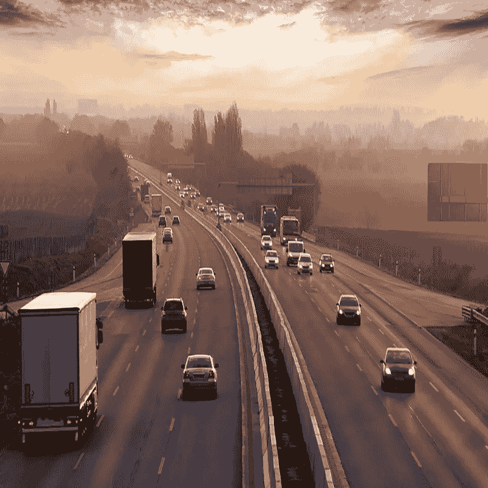

# 使用 OpenCV 的图像处理、计算机视觉、机器学习

> 原文：<https://medium.com/analytics-vidhya/image-processing-computer-vision-machine-learning-with-opencv-cdde5cd24267?source=collection_archive---------17----------------------->

# 什么是 OpenCV

OpenCV 是一个巨大的开源库，用于计算机视觉、机器学习和图像处理。OpenCV 支持多种编程语言，如 Python、C++、Java 等。它可以处理图像和视频来识别物体、人脸，甚至是人的笔迹。当它与各种库集成时，比如 Numpy，这是一个针对数值运算高度优化的库，那么你的武器库中的武器数量就会增加，也就是说，在 Numpy 中可以做的任何操作都可以与 OpenCV 结合。

# OpenCv 简介

OpenCV 是最流行的计算机视觉库之一。如果你想在计算机视觉领域开始你的旅程，那么彻底理解 OpenCV 的概念是至关重要的。

## 安装 OpenCv

OpenCV 可以使用 pip 命令安装。

> pip 安装 opencv-python

## 导入 OpenCv

> 导入 cv2
> 
> 这是我们将在整个博客中处理的原始图像。

让我们从使用 OpenCV 读取图像的简单任务开始。

## 读取图像

> `**import**` `cv2`
> 
> `# Reading the image using imread() function`
> 
> `image **=**` `cv2.imread('image.png')`
> 
> `# Extracting the height and width of an image`
> 
> `h, w **=**` `image.shape[:2]`
> 
> `# Displaying the height and width`
> 
> `print("Height = {}, Width = {}".format(h, w))`

现在我们将集中于提取单个像素的 RGB 值。
注意——OpenCV 按照 BGR 顺序排列频道。因此第 0 个值将对应于蓝色像素，而不是红色像素。

## **提取像素的 RGB 值**

> `# Extracting RGB values.`
> 
> `# Here we have randomly chosen a pixel`
> 
> `# by passing in 100, 100 for height and width.`
> 
> `(B, G, R) **=**` `image[100, 100]`
> 
> `# Displaying the pixel values`
> 
> `print("R = {}, G = {}, B = {}".format(R, G, B))`
> 
> `# We can also pass the channel to extract`
> 
> `# the value for a specific channel`
> 
> `B **=**` `image[100, 100, 0]`
> 
> `print("B = {}".format(B))`

## **提取感兴趣区域**

> `# We will calculate the region of interest`
> 
> `# by slicing the pixels of the image`
> 
> `roi **=**`T3`: 500, 200`

## **调整图像大小**

> `# resize() function takes 2 parameters,`
> 
> `# the image and the dimensions`
> 
> `resize **=**`

这种方法的问题是不能保持图像的纵横比。所以我们需要做一些额外的工作来保持一个合适的纵横比。

> `# Calculating the ratio`
> 
> `ratio **=**`T12`**/**`
> 
> `# Creating a tuple containing width and height`
> 
> `dim **=**` `(800, int(h *****` `ratio))`
> 
> `# Resizing the image`
> 
> `resize_aspect **=**` `cv2.resize(image, dim)`

## **旋转图像**

> `# Calculating the center of the image`
> 
> `center **=**` `(w **//**` `2, h **//**` `2)`
> 
> `# Generating a rotation matrix`
> 
> `matrix **=**`
> 
> `# Performing the affine transformation`
> 
> `rotated **=**` `cv2.warpAffine(image, matrix, (w, h))`

## **画一个长方形**

这是一个就地操作。

> `# We are copying the original image,`
> 
> `# as it is an in-place operation.`
> 
> `output **=**` `image.copy()`
> 
> `# Using the rectangle() function to create a rectangle.`
> 
> `rectangle **=**` `cv2.rectangle(output, (1500, 900),`
> 
> `(600, 400), (255, 0, 0), 2)`

它接受 5 个参数

*   图像
*   左上角坐标
*   右下角坐标
*   颜色(BGR 格式)
*   线条宽度

## **显示文本**

这也是一种就地操作

> `# Copying the original image`
> 
> `output **=**` `image.copy()`
> 
> `# Adding the text using putText() function`
> 
> `text **=**` `cv2.putText(output, 'OpenCV Demo', (500, 550),`
> 
> `cv2.FONT_HERSHEY_SIMPLEX, 4, (255, 0, 0), 2)`

它接受 7 个参数

1.  图像
2.  要显示的文本
3.  左下角坐标，文本应该从这里开始
4.  字体
5.  字体大小
6.  颜色(BGR 格式)
7.  线条宽度