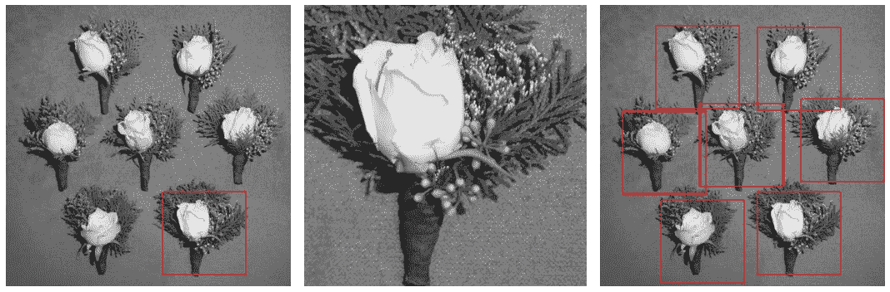
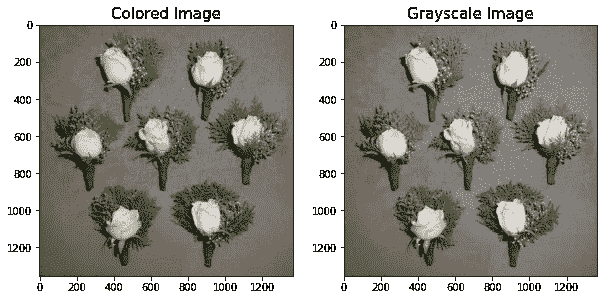
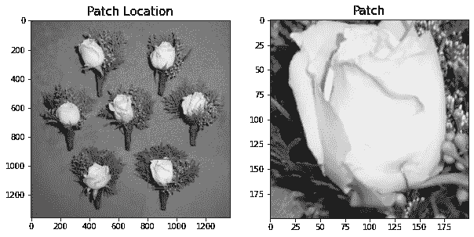
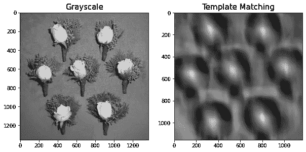
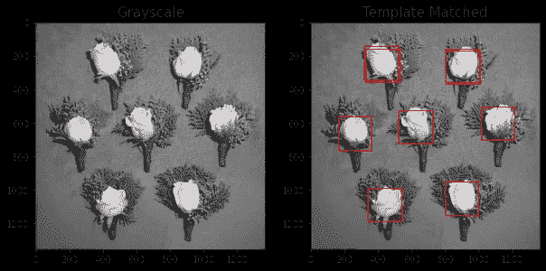
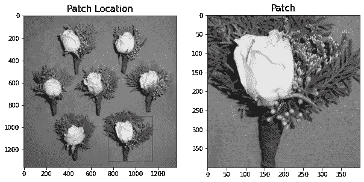
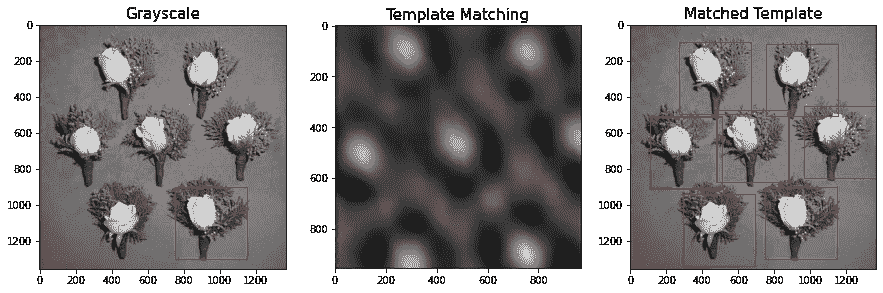

# 图像处理—模板匹配

> 原文：<https://medium.com/analytics-vidhya/image-processing-template-matching-aac0c1cbe2c0?source=collection_archive---------2----------------------->

准备…就绪..匹配！



(图片由作者提供)

在我们以前的文章中，我们已经讨论了几种可以用来在图像中创建不同的分割和转换的图像技术。

这一次，我们来谈谈一种同样可以用于目标跟踪的图像处理技术。

如上所述的另一种有用的处理技术是所谓的模板匹配。

## 模板匹配

模板匹配指的是图像处理，通过给定一个基准模板进行比较，我们在源图像中找到相似的模板。

模板匹配的过程是通过将源图像的每个像素值一次一个地与模板图像进行比较来完成的。当与模板图像比较时，输出将是相似性值的数组。

为了能够查看在图像上找到的相似模板，我们可以在模板匹配的结果阵列中找到峰。

为了更好地理解这一点，让我们展示一些例子:

让我们加载一个示例图像:

```
import numpy as np
from skimage.io import imshow, imread
from skimage.color import rgb2gray
import matplotlib.pyplot as pltsample = imread('flowers2.png')
sample_g = rgb2gray(sample)fig, ax = plt.subplots(1,2,figsize=(10,5))
ax[0].imshow(sample)
ax[1].imshow(sample_g,cmap='gray')
ax[0].set_title('Colored Image',fontsize=15)
ax[1].set_title('Grayscale Image',fontsize=15)
plt.show()
```



图 1:样本图像(作者提供的图像)

对于这篇文章，我们将使用我们的小花束旧样本。我们可以看到，我们有 7 个小花束，对于这个例子，我们将通过使用一个花束作为模板，尝试看看我们的算法是否可以检测到其他 6 个花束。

要进行模板匹配，我们应该首先确定我们将使用哪个补丁或模板。下面是补丁分配的示例代码:

```
from matplotlib.patches import Rectanglefig, ax = plt.subplots(1,2,figsize=(10,10))
ax[0].imshow(sample_g,cmap='gray')
ax[0].add_patch(Rectangle((800, 950), 200, 200, edgecolor='r', facecolor='none'));
ax[0].set_title('Patch Location',fontsize=15)#Showing Patch
patch = sample_g[950:1150, 800:1000]
ax[1].imshow(patch,cmap='gray')
ax[1].set_title('Patch',fontsize=15)
plt.show()
```



图 2:模板/补丁图片(图片由作者提供)

对于试验，让我们首先使用白色花朵作为补丁，在这里我们将比较源图像/样本图像的其余部分。

现在我们已经找到了一个补丁。我们已经可以将源图像和补丁/模板图像传递给模板匹配算法。

Scikit-Image 库中已经有一个名为 match_template 的已定义函数。我们可以利用这一点来简化我们的过程。

```
from skimage.feature import match_template
sample_mt = match_template(sample_g, patch)fig, ax = plt.subplots(1,2,figsize=(10,10))
ax[0].imshow(sample_g,cmap='gray')
ax[1].imshow(sample_mt,cmap='gray')
ax[0].set_title('Grayscale',fontsize=15)
ax[1].set_title('Template Matching',fontsize=15);
```



图 3:执行模板匹配(作者图片)

图 3 显示了模板匹配算法的结果。注意到图表中的亮点了吗？这些实际上是从模板匹配中得到的相似性值。

使用来自模板匹配结果的相似性值，我们可以绘制源图像中与我们的模板图像具有高相似性的部分。

```
from skimage.feature import peak_local_maxfig, ax = plt.subplots(1,2,figsize=(10,10))
ax[0].imshow(sample_g,cmap='gray')
ax[1].imshow(sample_g,cmap='gray')patch_width, patch_height = patch.shape
for x, y in peak_local_max(sample_mt, threshold_abs=0.6):
    rect = plt.Rectangle((y, x), patch_height, patch_width, color='r', 
                         fc='none')
    ax[1].add_patch(rect)ax[0].set_title('Grayscale',fontsize=15)
ax[1].set_title('Template Matched',fontsize=15);
```



图 4:绘制峰值(图片由作者提供)

图 4 显示了检测到的模板，它们与我们的模板图像非常相似。从视觉事实来看，我们已经可以说我们只用一个模板图像就成功地检测并找到了白花。

结果还取决于您选择使用的阈值。不同的阈值会产生不同的结果。

现在让我们尝试一个更大的补丁！



图 5:补丁#2(图片由作者提供)

图 5 显示我们已经选择了一个匹配更大的补丁或模板来使用。这一次，我们使用整个花束作为模板图像。让我们看看我们是否也能发现其他的花束。



图 6:模板匹配结果(图片由作者提供)

图 6 显示，事实上，我们能够检测到一个花束的模板并将其与不同的花束进行匹配。

# 摘要

在这篇文章中，我们展示了如何利用图像处理来帮助物体检测和物体识别。通过所示的例子，我们能够通过仅使用花束之一作为模板来成功地检测所有的小花束。

模板匹配可以用作为机器学习模型和深度学习模型进行对象检测的管道。

敬请关注更多文章！