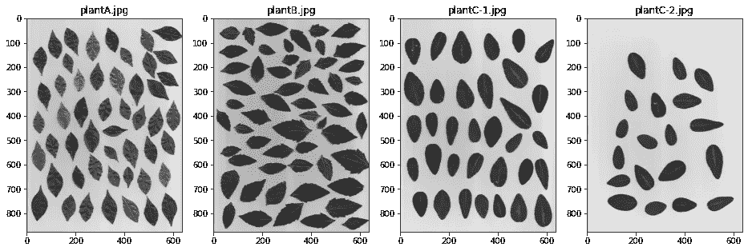
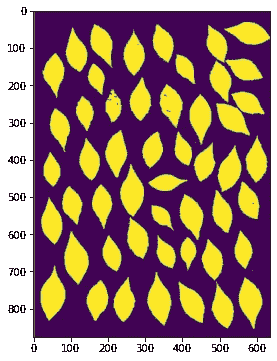
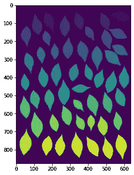
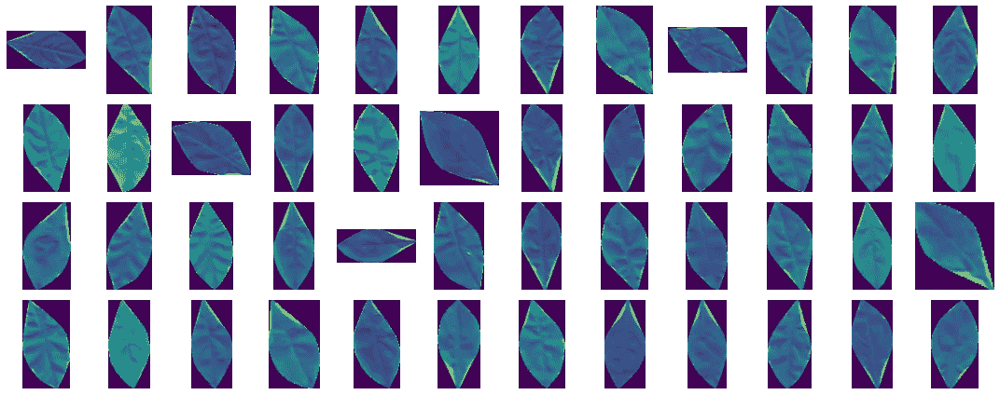
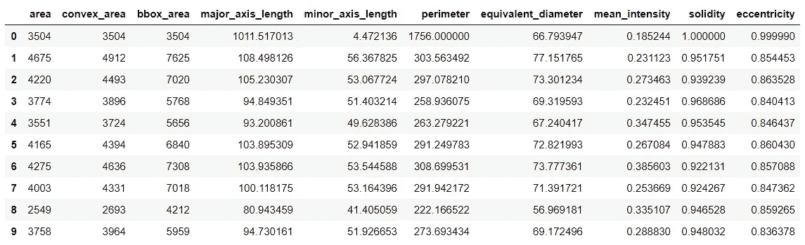
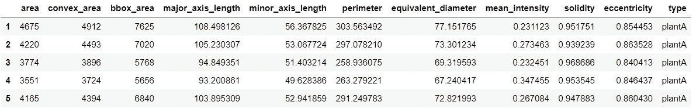
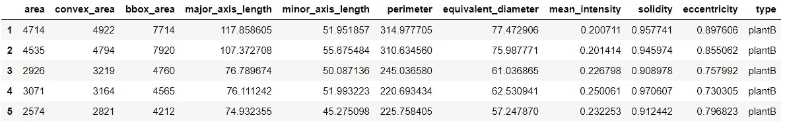
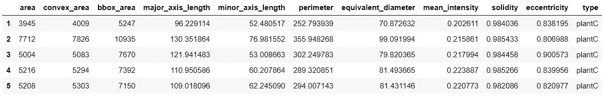
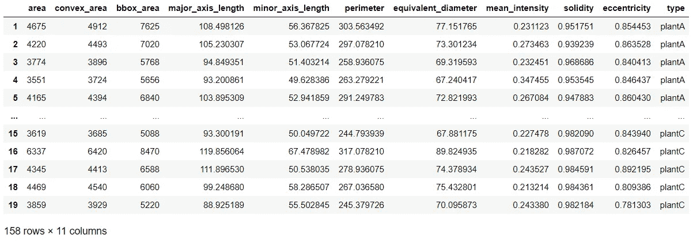
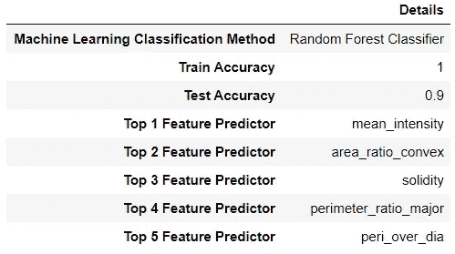

# Python 图像处理:在机器学习中的应用

> 原文：<https://medium.com/analytics-vidhya/image-processing-with-python-applications-in-machine-learning-17d7aac6bc97?source=collection_archive---------3----------------------->

## 如何使用图像处理技术为机器学习算法准备数据？


照片由 [Avinash Kumar](https://unsplash.com/@ashishjha?utm_source=medium&utm_medium=referral) 在 [Unsplash](https://unsplash.com?utm_source=medium&utm_medium=referral) 上拍摄

在这篇文章中，我们将逐步学习如何预处理和准备图像数据集，以提取可用于机器学习算法的可量化特征。

我们开始吧。

像往常一样，我们导入诸如`numpy`、`pandas`和`matplotlib`之类的库。此外，我们从`skimage`和`sklearn`库中导入特定的函数。

```
import matplotlib.pyplot as plt
import numpy as np
import pandas as pd
from glob import glob
from skimage.io import imread, imshow
from skimage.color import rgb2gray
from skimage.measure import label, regionprops, regionprops_table
from skimage.filters import threshold_otsu
from skimage.morphology import area_closing, area_opening
from sklearn.model_selection import train_test_split
from sklearn.ensemble import RandomForestClassifier
```

我们的目标是从每个样本中提取信息，用于我们的机器学习算法。让我们一步一步地解决这个问题吧！

# **步骤 1:执行探索性数据分析(EDA)**

在构建机器学习算法时，EDA 始终是必不可少的一部分。首先，您应该能够熟悉数据——它的结构、格式和细微差别。这对于确保您将概念化的项目方法适合手头的数据集是至关重要的。

对于这个项目，我们将使用的数据集是一组白色背景的干燥植物叶片标本*(图像使用许可由 Gino Borja，AIM 授予)*。该数据集中有三类植物叶子，例如 plantA、plantB 和 plantC。

```
filepaths = glob('dataset/*.jpg')
fig, axis = plt.subplots(1,len(filepaths), figsize=(16,8))
for x, ax in zip(filepaths, axis.flatten()):
    ax.imshow(imread(x))
    ax.set_title(x.split('\\')[1])
print("The shape of the image is:", imread(filepaths[0]).shape)>> The shape of the image is: (876, 637, 3)
```



(原图由 *Gino Borja，AIM* 提供)

请注意，每一类叶子都有其独特的特征。PlantA 的特征是其叶体上的卷曲，PlantB 的特征是其叶的粗糙边缘，PlantC 的特征是其叶的圆形。

此外，请注意，即使数据是灰度的，图像仍然包含三个通道。然而，进一步检查，我们可以注意到，这三个渠道仅仅是彼此的副本。因此，我们可以通过分割数组或使用`rgb2gray`函数来删除其他通道。

# **步骤 2:应用图像二值化**

根据 EDA 的发现，我们现在可以利用`rgb2gray`函数将图像的三个通道转换为一个通道。之后，我们可以执行图像阈值处理来提取图像中的必要信息——在本例中是树叶。由于图像数据集是背景-前景图像的典型例子，我们可以利用 Otsu 的方法对图像进行阈值处理。

```
leaf = imread(filepaths[0])
gray_leaf = rgb2gray(leaf)thresh = threshold_otsu(gray_leaf)
binarized = gray_leaf < thresh
imshow(binarized)
```



(原图由 *Gino Borja，AIM* )

# **步骤 3:应用形态学运算**

现在，你可能会问，如果图像看起来是干净的，为什么我们需要应用形态学操作？仍然执行形态学操作来去除图像中的噪声是一个很好的做法，尤其是在具有大量像素的图像中。请记住，单个像素噪声可能无法用肉眼看到，但它会影响您的图像分析！

为了最小化物体形状的失真，我们将使用`area_closing`和`area_opening`形态学操作。我们应用`area_closing`函数来填充感兴趣对象区域内的任何孔洞。在此数据集中，如果叶区域有损伤、卷曲或纤维，且其像素强度与叶身不同，`area_closing`可能特别有用。之后，我们应用了`area_opening`功能来去除图像背景中的噪声。

```
closed = area_closing(binarized)
opened = area_opening(closed)
imshow(opened)
```


(原图由 *Gino Borja 拍摄，AIM* )

# **第四步:使用连通分量标记每个区域**

清洗数据集后，我们将利用连通分量的`label`函数来识别图像的所有区域。然后，我们可以使用`regionprops`函数从图像中的每个区域提取属性。

```
label_im = label(opened)
regions = regionprops(label_im)
imshow(label_im)
```



(原图由 *Gino Borja，AIM* 提供)

注意每个区域有不同的颜色。每种颜色代表图像中的一个区域。这些区域分组的编号是从左到右，然后从上到下。此外，我们应该记住，label 函数的结果数组中的第零个区域总是图像的背景。最后，在过滤区域时，我们将使用 if-else 语句。if-else 语句中的两个条件是:不包括背景区域和面积可忽略的区域。

现在，让我们试着分别看看这些区域！

```
masks = []
bbox = []
for num, x in enumerate(regions):
    area = x.area
    convex_area = x.convex_area
    if num!=0 and x.area >= 100: 
        masks.append(regions[num].convex_image)
        bbox.append(regions[num].bbox)    
count = len(masks)fig, axis = plt.subplots(4, int(count/4), figsize=(15,6))
for ax, box, mask in zip(axis.flatten(), bbox, masks):
    image  =  gray_leaf[box[0]:box[2], box[1]:box[3]] * mask
    ax.imshow(image)
    ax.axis('off')
```



(原图由 *Gino Borja 拍摄，AIM* )

# **第五步:获取每个区域的属性**

现在，可视化区域对于反检查图像处理步骤是否有效非常有用。然而，我们的目标是从这些区域中提取关键特征和属性！我们可以使用`regionprops_table`函数轻松做到这一点，其中我们可以指定从区域中提取的属性。在这个数据集中，我们将使用以下可量化的属性:
1。`area` —该区域的像素数。
2。`convex_area` —凸包图像的像素数，它是包围该区域的最小凸多边形。
3。`bbox_area` —包围盒的像素数。
4。`major_axis_length` -椭圆长轴的长度与区域具有相同的归一化第二中心矩。
5。`minor_axis_length` —椭圆短轴的长度与区域具有相同的归一化第二中心矩。
6。`perimeter` —对象的周长，使用 4-连接将轮廓近似为通过边界像素中心的线。
7。`equivalent_diameter` —与区域面积相同的圆的直径。
8。`mean_intensity` -该区域的平均强度值。9。`solidity` —区域像素与凸包图像像素的比率。
10。`eccentricity` —与区域具有相同二阶矩的椭圆的偏心率

```
properties = ['area','convex_area','bbox_area',
              'major_axis_length', 'minor_axis_length', 
              'perimeter', 'equivalent_diameter',
              'mean_intensity', 'solidity', 'eccentricity']
pd.DataFrame(regionprops_table(label_im, gray_leaf, 
                               properties=properties)).head(10)
```



(图片由作者提供)

# **第六步:将所有步骤合并成一个功能**

既然我们已经建立了步骤，并且检查了提取的数据是好的，我们现在可以将所有之前的步骤自动化到一个功能中。这对于快速提取机器学习算法中需要的特征特别有用。

```
def get_properties(name):
    filepaths = glob('dataset/{}*.jpg'.format(name))
    properties = ['area','convex_area',
                 'bbox_area','major_axis_length', 
                 'minor_axis_length', 'perimeter',  
                 'equivalent_diameter', 'mean_intensity',  
                 'solidity', 'eccentricity']
    dataframe = pd.DataFrame(columns=properties)
    for file in filepaths:
        grayscale = rgb2gray(imread(file))
        threshold = threshold_otsu(grayscale)
        binarized = grayscale < threshold         
        closed = area_closing(binarized, 1000)
        opened = area_opening(closed, 1000)
        labeled = label(opened)
        regions = regionprops(labeled)
        data = pd.DataFrame(regionprops_table(labeled, grayscale,
                            properties=properties))
        data = data[(data.index!=0) & (data.area>100)]
        dataframe = pd.concat([dataframe, data])
    return dataframe
```

# **第七步:收集特征数据框**

使用创建的`get_properties`函数，我们现在可以收集图像中每个区域的特征和属性！一旦收集了属性，不要忘记输入这些属性的标签分类-这将作为机器学习算法的基础事实。

让我们提取 plantA 的数据帧。

```
plantA = get_properties('plantA')
plantA['type'] = 'plantA'
print("The shape of the dataframe is: ", plantA.shape)
plantA.head()>> The shape of the dataframe is:  (50, 11)
```



(图片由作者提供)

现在，对于 plantB。

```
plantB = get_properties('plantB')
plantB['type'] = 'plantB'
print("The shape of the dataframe is: ", plantB.shape)
plantB.head()>> The shape of the dataframe is:  (55, 11)
```



(图片由作者提供)

最后，对于 plantC。

```
plantC = get_properties('plantC')
plantC['type'] = 'plantC'
print("The shape of the dataframe is: ", plantC.shape)
plantC.head()>> The shape of the dataframe is:  (53, 11)
```



(图片由作者提供)

现在我们已经收集了数据集中每个对象的属性，让我们将这些信息合并到一个数据帧中！

```
df = pd.concat([plantA, plantB, plantC])
```



(图片由作者提供)

# **步骤 8:应用特征工程**

从提取的特征中，我们可以通过导出新的特征来进一步扩展特征。这可以通过将提取的特征的比率放在一起很容易地完成。让我们试试这个！

```
df['ratio_length'] = (df['major_axis_length'] / 
                      df['minor_axis_length'])
df['perimeter_ratio_major'] = (df['perimeter'] /  
                               df['major_axis_length'])
df['perimeter_ratio_minor'] = (df['perimeter'] /
                               df['minor_axis_length'])
df['area_ratio_convex'] = df['area'] / df['convex_area']
df['area_ratio_bbox'] = df['area'] / df['bbox_area']
df['peri_over_dia'] = df['perimeter'] / df['equivalent_diameter']final_df = df[df.drop('type', axis=1).columns].astype(float)
final_df = final_df.replace(np.inf, 0)
final_df['type'] = df['type']
```

通过这样做，我们能够将我们的数据框架扩展到 17 个特性！

# **步骤 9:拆分训练和测试集**

下一步是从图像数据上提取和导出的特征的数据帧中分割数据。这对于确保机器学习模型将具有一组“看不见的”数据以确保训练不会过拟合或欠拟合是至关重要的。我们使用`sklearn.model_selection`库中的`train_test_split`函数来完成这项工作。此外，我们也不会使用任何数据不平衡处理技术，因为每个类的实例数量彼此大致相等。

```
X = final_df.drop('type', axis=1)
y = final_df['type']X_train, X_test, y_train, y_test = train_test_split(X, y, 
                                         test_size=0.25, 
                                         stratify = y, 
                                         random_state=1337)
```

# **步骤 10:训练随机森林分类器模型**

使用训练数据集，我们现在可以训练机器学习分类器模型。我们将使用随机森林分类器，因为众所周知，尽管它的算法很简单，但它可以产生很高的准确性。请注意，由于随机森林模型是基于树的模型，我们不需要缩放数据集。但是，如果您将使用其他机器学习模型，则必须缩放数据集的要素。

```
RF = RandomForestClassifier(max_depth=6, n_estimators=100)
RF.fit(X_train, y_train)
y_pred_RF= RF.predict(X_test)df = pd.DataFrame()cols = ['Machine Learning Classification Method',
        'Train Accuracy', 
        'Test Accuracy', 
        "Top 1 Feature Predictor",
        "Top 2 Feature Predictor",
        "Top 3 Feature Predictor",
        "Top 4 Feature Predictor",
        "Top 5 Feature Predictor"]df.loc['Machine Learning Classification Method', 
       'Details'] = 'Random Forest Classifier'
df.loc['Train Accuracy', 'Details'] = RF.score(X_train, y_train) 
df.loc['Test Accuracy', 'Details'] = RF.score(X_test, y_test)importances = (X.columns[np.argsort(RF.feature_importances_)][-5:])
df.loc['Top 1 Feature Predictor', 'Details'] = importances[4]
df.loc['Top 2 Feature Predictor', 'Details'] = importances[3]
df.loc['Top 3 Feature Predictor', 'Details'] = importances[2]
df.loc['Top 4 Feature Predictor', 'Details'] = importances[1]
df.loc['Top 5 Feature Predictor', 'Details'] = importances[0]display(df)
```



(图片由作者提供)

随机森林分类器产生的**测试准确率为 90.00%** 。对不同叶子进行分类的主要特征是它们的`mean_intensity`、`area_ratio_convex`、`solidity`、`perimeter_ratio_major`和`peri_over_dia`。

回到我们在 EDA 中的最初发现，我们可以解释为什么`mean_intensity`是第一大预测因子，因为我们之前已经发现植物可以通过其叶子的卷曲来识别。抖动很容易反映在物体的像素强度上。

此外，面积和凸起面积之间的比率是前 2 个预测因素，因为我们已经确定 plantB 具有粗糙的边缘，而 plantC 具有圆形的边缘。因此，plantB 自然会有一个较低的数字，而 plantC 会有一个大约等于 1 的`area_ratio_convex`。

太棒了，对吧？一个既准确又可解释的模型！至此，我希望您能够认识到图像处理技术对于实现更具解释性的机器学习算法的重要性！

# **总之**

我们已经探索了如何使用图像处理技术来准备和预处理图像数据集，以实现机器学习算法。使用`regionprops_table`功能，我们能够从图像中提取有价值的和可量化的特征。最后，我们开发了一个分类器模型，实现了高精度，同时也是可解释的。

*想了解更多？在此* [*链接*](https://github.com/jephraim-manansala/iip-machine-learning) *查看我的 GitHub 库！*