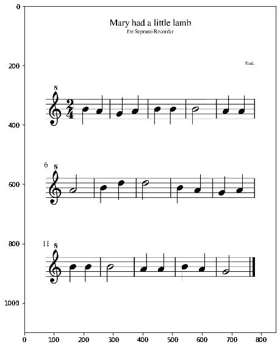

# 用 Python 处理图像:机器学习中的应用第二部分

> 原文：<https://medium.com/analytics-vidhya/image-processing-with-python-applications-in-machine-learning-part-2-c13ac25f7f6f?source=collection_archive---------14----------------------->

## 如何使用图像处理技术为机器学习算法准备数据？


照片由 [Marius Masalar](https://unsplash.com/@marius?utm_source=medium&utm_medium=referral) 在 [Unsplash](https://unsplash.com?utm_source=medium&utm_medium=referral) 上拍摄

在这篇文章中，我们将逐步学习如何预处理和准备图像数据集，以提取可用于机器学习算法的可量化特征。将使用诸如二值化、模板匹配、形态学操作和斑点检测之类的技术。这是对我在[上一篇文章](https://jephraim-manansala.medium.com/image-processing-with-python-applications-in-machine-learning-17d7aac6bc97)中使用的图像处理技术的补充。

我们开始吧。

像往常一样，我们导入诸如`numpy`、`pandas`和`matplotlib`之类的库。此外，我们从`skimage`、`sklearn`和`imblearn`库中导入特定的函数。

```
import numpy as np
import pandas as pd
import matplotlib.pyplot as plt
from matplotlib.patches import Rectangle
from skimage.io import imread, imshow
from skimage.feature import match_template, peak_local_max
from skimage.measure import label, regionprops
from skimage.morphology import erosion, dilation
from skimage.feature import blob_dog, blob_log, blob_doh
from skimage.util import invert
from sklearn.model_selection import train_test_split
from sklearn.ensemble import RandomForestClassifier
from imblearn.over_sampling import RandomOverSampler
```

我们的目标是在乐谱上正确标注音高和音符。我们将不得不从每个音符中提取可量化的信息，作为我们机器学习算法的输入。让我们一步一步地解决这个问题吧！

# **步骤 1:执行探索性数据分析(EDA)**

我们应该永远记住，EDA 是任何数据科学项目的重要组成部分。在开发机器学习管道之前，我们需要熟悉数据——这包括其结构、格式和细微差别。这对于确保将要概念化的项目方法适用于手头的数据集至关重要。

对于这个项目，我们将使用童谣“玛丽有一只小羊羔”的乐谱*(musescore.com 的原始图像)*

```
music = imread('music-sheet.png')
imshow(music);
```



*(musescore.com 原创图片)*

请注意，我们只得到一张乐谱的一幅图像。该图像是单通道灰度图像，这意味着我们只需要将图像二值化。另外，请注意，每个音符上都有一个特定的符号和位置。这意味着要开发的机器学习流水线应该对音乐符号和所述符号的位置进行分类。最后，注意乐谱上的每一行都有一个 G 谱号。我们可以用它作为每条线的参考点。

# **步骤 2:应用图像二值化**

根据 EDA 的发现，我们可以通过执行图像阈值处理来提取图像中的必要信息。为此，我们将把中点以上的所有值设置为 255，同时把中点以下的所有值设置为 0。

```
music[music<120]=0
music[music>=120]=255
```

# **步骤 3:使用模板匹配的图像分割**

为了帮助简化图像分析，我们应该将图像分割成每一段音乐，并移除不必要的对象。从 EDA 中，我们已经观察到在每条音乐线上有一个 G 谱号。我们可以使用这个对象作为每个音乐行的参考点，并使用模板匹配*(对象检测)*技术。如果你不熟悉这个技巧，请查看我在[之前的帖子](https://jephraim-manansala.medium.com/image-processing-with-python-object-detection-using-template-matching-fa82b8c94fbd)！

```
template = music[285:405, 70:140]
imshow(template);
```


*(musescore.com 原创图片)*

现在，让我们尝试将这个模板图像定位到输入图像！

```
result = match_template(music, template)
imshow(result, cmap='viridis');
```


*(musescore.com 原创图片)*

注意到生成的互相关图像上的黄色斑点了吗？这表示图像模板匹配输入图像的区域。我们可以看到，该技术成功地确定了 G 谱号在输入图像中的位置。从这里，我们可以使用匹配模板的坐标分割图像，并添加一系列值来封装整个五线谱线。

```
imshow(music)
template_height, template_width  = template.shape
music_lines = []for y, x in peak_local_max(result, threshold_abs=0.8):
    rect = plt.Rectangle((x+55, y), 
                         template_width+600, 
                         template_height, 
                         color='r', 
                         fc='none')
    plt.gca().add_patch(rect);

    music_lines.append(music[y:y+template_height, 
                             x+55:x+template_width+600+55])
```


*(musescore.com 原创图片)*

注意到我们没有在图像片段上封装 G 谱号了吗？这是因为我们不再需要这个符号来确定每个音符的音符和音高。通过检测 G 谱号，它已经达到了自动封装乐谱每一行的目的。

# **步骤 4:应用形态学运算**

下一步是从产生的分段音乐线中移除五线谱线，以专注于音符及其位置。我们可以通过对图像应用形态学操作来做到这一点。请注意，我们将使用一个垂直结构元素来移除图像上的水平线。

```
element = np.array([[0,1],
                    [0,1],
                    [0,1],
                    [0,1]])
imshow(element);
```


*(musescore.com 原创图片)*

使用垂直结构元素，我们现在可以对图像应用膨胀和腐蚀操作。

```
def remove_lines(image_used):
    dilated_image = dilation(image_used, element)
    eroded_image = erosion(dilated_image, element)

    plt.figure(figsize=(15,3))
    plt.imshow(eroded_image, cmap='gray');
    plt.axis('off')
    return eroded_imageline1 = remove_lines(music_lines[0])
line2 = remove_lines(music_lines[1])
line3 = remove_lines(music_lines[2])
```


*(musescore.com 原创图片)*

注意背景是白色的，物体是黑色的？这表示背景具有最大值 *(255)* ，而对象具有最小值 *(0)* 。因为这种倒置，我们将需要倒置形态学操作的功能。我们将不得不在腐蚀*(恢复剩余物品的原始形状)*之前应用扩张*(移除五线谱线)*，而不是先应用腐蚀。

# **步骤 5:执行斑点检测**

现在，五线谱线已经移除，我们现在可以应用斑点检测来识别音符的位置。如果你还不熟悉这项技术，请检查这个[链接](https://jephraim-manansala.medium.com/image-processing-with-python-detecting-blobs-in-digital-images-edebfd22328c)！

```
def blob_detection(eroded_image):
    blobs = blob_dog(invert(eroded_image), 
                     min_sigma=15, max_sigma = 20, threshold=0.70)fig, ax = plt.subplots( figsize=(15,3))
    ax.imshow(eroded_image, cmap='gray')
    ax.axis('off')
    for blob in blobs:
        y, x, area = blob
        ax.add_patch(plt.Circle((x, y), area*np.sqrt(2), color='r', 
                                fill=False)) blobs = [(xaxis, yaxis) for yaxis, xaxis, z in blobs]
    blobs = sorted(blobs, key=lambda x: x[0])
    return blobs
blobs1 = blob_detection(line1)
blobs2 = blob_detection(line2)
blobs3 = blob_detection(line3)
```


*(musescore.com 原创图片)*

对于这一步，我选择了使用高斯差分而不是连通分量进行斑点检测，因为我试图识别的对象没有完全连通*(特别是 2 拍音符)*。此外，斑点检测算法将足以在该步骤中识别斑点，因为我们仅需要每个音符的质心的坐标来适当地单独分割音乐符号。

# **步骤 6:音高评估器**

现在，我们可以根据斑点检测中收集的坐标，从图像片段边界上的相对位置来确定每个音符的音高。我们通过在每个音符的质心范围上创建 if-else 语句来实现这一点。偏差范围`dev`也被创建，以便当音符没有正确地在五线谱线上居中时，算法具有灵活性。

*提示:当定义每个音符的值的范围时，使用* `*matplotlib*` *中的* `*axhline*` *功能在图像上创建一条水平线会更容易估计。*

```
def define_pitch(number, dev=4):
    if int(number) in range(11-dev, 11+dev):
        return "A"
    elif int(number) in range(19-dev, 19+dev): 
        return "G"
    elif int(number) in range(28-dev, 28+dev): 
        return "F"
    elif int(number) in range(36-dev, 36+dev): 
        return "E"
    elif int(number) in range(45-dev, 45+dev): 
        return "D"
    elif int(number) in range(53-dev, 53+dev): 
        return "C"
    elif int(number) in range(61-dev, 61+dev): 
        return "B"
    elif int(number) in range(69-dev, 69+dev): 
        return "A"
    elif int(number) in range(78-dev, 78+dev): 
        return "G"
    elif int(number) in range(86-dev, 86+dev): 
        return "F"
    elif int(number) in range(95-dev, 95+dev): 
        return "E"
    elif int(number) in range(104-dev, 104+dev): 
        return "D"
    elif int(number) in range(113-dev, 113+dev): 
        return "C"
```

测试创建的函数，我们得到了以下结果。

```
imshow(music_lines[1])
plt.axhline(69);
print([define_pitch(x[1]) for x in blobs2])>> ['A', 'B', 'D', 'D', 'B', 'A', 'G', 'A']
```


*(musescore.com 原创图片)*

请注意，这个函数之所以有效，是因为我们在算法中固定了图像分割的长度和宽度。在`define_pitch`功能中设置的像素坐标值对其他图像分割设置不起作用。

# **步骤 7:使用连接组件检索对象属性**

既然我们已经确定了图像上每个音乐符号的质心，现在我们可以单独分割这些符号。然后我们可以应用`regionprops`函数来提取每个符号的关键特征和属性。我们将提取符号的以下属性:

1.  `area` —区域的像素数。
2.  `convex_area` —凸包图像的像素数，它是包围该区域的最小凸多边形。
3.  `major_axis_length`-椭圆长轴的长度与区域具有相同的归一化第二中心矩。
4.  `minor_axis_length`-椭圆短轴的长度与该区域具有相同的归一化第二中心矩。
5.  `perimeter` —对象的周长，使用 4-连接将轮廓近似为通过边界像素中心的线。

以下功能会自动执行这些步骤:

```
def properties(regions):
    area= np.sum([x.area for x in regions])
    convex_area = np.sum([x.convex_area for x in regions]) 
    perimeter = np.sum([x.perimeter for x in regions]) 
    major_axis= np.mean([x.major_axis_length for x in regions]) 
    minor_axis = np.mean([x.minor_axis_length for x in regions]) 
    return {'area': area, 
            'convex_area': convex_area,
            'perimeter': perimeter,
            'major_axis': major_axis,
            'minor_axis': minor_axis}def blob_properties(eroded_image, blobs):
    fig, ax = plt.subplots(1, len(blobs), figsize=(15,2.5))props = {}
    for num, data in enumerate(blobs):
        columns=int(data[0])
        rows=int(data[1])
        new_image = eroded_image[:, columns-15:columns+20]

        label_im = label(invert(new_image))
        regions = regionprops(label_im)

        props[num] = properties(regions)

        ax[num].imshow(new_image, cmap='gray')
    return pd.DataFrame(props).Tprops1 = blob_properties(line1, blobs1);
props2 = blob_properties(line2, blobs2);
props3 = blob_properties(line3, blobs3);
```


*(musescore.com 原创图片)*

既然我们已经收集了每个音乐符号的属性，我们需要手动将每个符号标记到其适当的类别*。注意，我们不需要标注所有的符号。我们只需要足够的数据，这样算法就可以知道哪个是哪个。*

```
*one_beat = pd.concat([props1.iloc[[1,2,3,4,5,6,8,9]], 
                      props2.iloc[[1,2,4,5,6,7]], 
                      props3.iloc[[0,1,3,4,5,6]]], axis=0)
one_beat['class'] = '1'
two_beat = pd.concat([props1.iloc[[7]], 
                      props2.iloc[[0,3]], 
                      props3.iloc[[2,7]]], axis=0)
two_beat['class'] = '2'
timesig = props1.iloc[[0]*2]
timesig['class'] = 'timesig'
end = props3.iloc[[8]*2]
end['class'] = 'end'df = pd.concat([one_beat, two_beat, timesig, end])
df.sample(10)*
```

**

*(图片由作者提供)*

*注意，我们增加了`timesig`和`end`对象中的项目数量。我们这样做是为了表示训练集和测试集中的所有对象*(在后面的步骤中)*。*

# ***步骤 8:应用特征工程***

*从提取的特征中，我们可以通过导出新的特征来进一步扩展特征。我们通过将提取的特征的比率放在一起来做到这一点。让我们试试这个！*

```
*def feature_engineering(df):
    df['ratio_length'] = df['minor_axis'] / df['major_axis']
    df['perimeter_ratio_major'] = df['perimeter'] / df['major_axis']
    df['perimeter_ratio_minor'] = df['perimeter'] / df['minor_axis']
    df['area_ratio_convex'] = df['area'] / df['convex_area']
    df['area_ratio_major'] = df['area'] / df['major_axis']
    df['area_ratio_minor'] = df['area'] / df['minor_axis']
    df['area_ratio_peri'] = df['area'] / df['perimeter']
    df['convex_ratio_major'] = df['convex_area'] / df['major_axis']
    df['convex_ratio_minor'] = df['convex_area'] / df['minor_axis']
    df['convex_ratio_peri'] = df['convex_area'] / df['perimeter']
    return df
final_df = feature_engineering(df)
final_df['class'] = df['class']*
```

*通过这样做，我们能够将我们的数据框架扩展到 15 个特性！*

# ***步骤 9:拆分训练和测试集***

*下一步是从图像数据上提取和导出的特征的数据帧中分割数据。这对于确保机器学习模型将具有一组“看不见的”数据以确保训练不会过拟合或欠拟合是至关重要的。我们使用`sklearn.model_selection`库中的`train_test_split`函数来完成这个任务。*

```
*X = final_df.drop('class', axis=1)
y = final_df['class']X_train, X_test, y_train, y_test = train_test_split(X, y, 
                                                    test_size=0.3, 
                                                    stratify = y)*
```

# ***步骤 10:数据不平衡处理***

*分割数据集后，我们可以注意到每个类中对象实例的数量并不相等。这可能是一个问题，因为这可能导致在机器学习算法上偏向多数类。为了解决这个问题，我们使用 RandomOverSampler 来应用数据不平衡处理，以确保每个类中的实例数量是相等的。*注意，其他数据不平衡处理技术也可用于此(如 RandomUnderSampler、SMOTE 或 AdaSyn)。**

```
*oversample = RandomOverSampler()
X_train, y_train = oversample.fit_resample(X_train, y_train)*
```

# ***步骤 11:训练随机森林分类器模型***

*使用训练数据集，我们现在可以训练机器学习分类器模型。我们将使用随机森林分类器，因为众所周知，尽管它的算法很简单，但它可以产生很高的准确性。请注意，由于随机森林模型是基于树的模型，我们不需要缩放数据集。但是，如果您将使用其他机器学习模型，则必须缩放数据集的要素。*

```
*RF = RandomForestClassifier(max_depth=5, n_estimators=500)
RF.fit(X_train, y_train)
y_pred_RF= RF.predict(X_test)df = pd.DataFrame()cols = ['Machine Learning Classification Method',
        'Train Accuracy', 
        'Test Accuracy', 
        "Top 1 Feature Predictor",
        "Top 2 Feature Predictor",
        "Top 3 Feature Predictor"]df.loc['Machine Learning Classification Method', 
       'Details'] = 'Random Forest Classifier'
df.loc['Train Accuracy', 'Details'] = RF.score(X_train, y_train) 
df.loc['Test Accuracy', 'Details'] = RF.score(X_test, y_test)importance = X.columns[np.argsort(RF.feature_importances_)][-3:]
df.loc['Top 1 Feature Predictor', 'Details'] = importance[2]
df.loc['Top 2 Feature Predictor', 'Details'] = importance[1]
df.loc['Top 3 Feature Predictor', 'Details'] = importance[0]display(df)*
```

**

*(图片由作者提供)*

*随机森林分类器产生了 100%的测试准确度。对不同叶子进行分类的主要特征是它们的`perimeter_ratio_minor`、`convex_area`和`convex_ratio_minor`。我们可以看到，由于音乐符号的不同形状，凸面积、周长和短轴是主要特征。例如，`1-beat note`的凸面 _area 更大，因为它覆盖的面积更大，而`2-beat note`的周长更大，因为它有很多区域。*

*太棒了，对吧？同样，这是一个既准确又可解释的模型！现在，剩下唯一要做的就是显示预测的音符分类和音高。*

```
*def blob_labeling(eroded_image, blobs):
    fig, ax = plt.subplots(1, len(blobs), figsize=(15,2)) for num, data in enumerate(blobs):
        columns=int(data[0])
        rows=int(data[1])
        new_image = eroded_image[:, columns-15:columns+20]

        label_im = label(invert(new_image))
        regions = regionprops(label_im)

        dataset = pd.DataFrame([properties(regions)])
        final_df = feature_engineering(dataset)

        note = RF.predict(final_df)
        if (note[0] == '1') | (note[0] == '2'):
            pitch = define_pitch(rows)
        else:
            pitch = ''
        title = str(pitch + " " + str(note[0])) ax[num].imshow(new_image, cmap='gray')
        ax[num].axis('off')
        ax[num].set_title(title)props1 = blob_labeling(line1, blobs1);
props2 = blob_labeling(line2, blobs2);
props3 = blob_labeling(line3, blobs3);*
```

**

**(musescore.com 原创图片)**

# ***总之***

*我们已经探索了如何使用图像处理技术来准备和预处理图像数据集，以实现机器学习算法。使用`regionprops`函数，我们从图像中提取了有价值的、可量化的特征。此外，我们已经表明，预处理技术，如二值化，模板匹配，形态学操作，和斑点检测可以用来实现我们的目标。*

*从这个例子中，我希望你能体会到每种技术如何被用来操纵图像使之对我们有利，以及它如何能使我们创建机器学习管道的过程自动化！*

**想了解更多信息？在此* [*链接*](https://github.com/jephraim-manansala/iip-machine-learning-2) *查看我的 GitHub 库！**