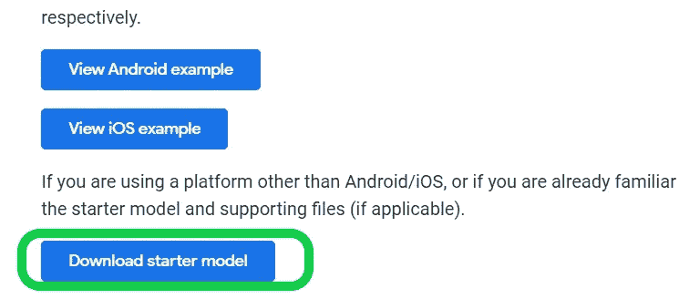
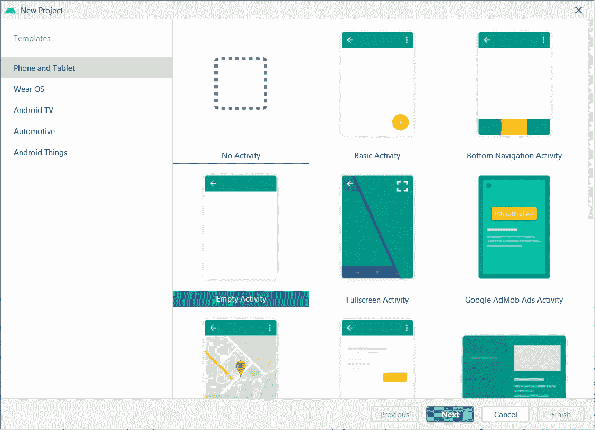
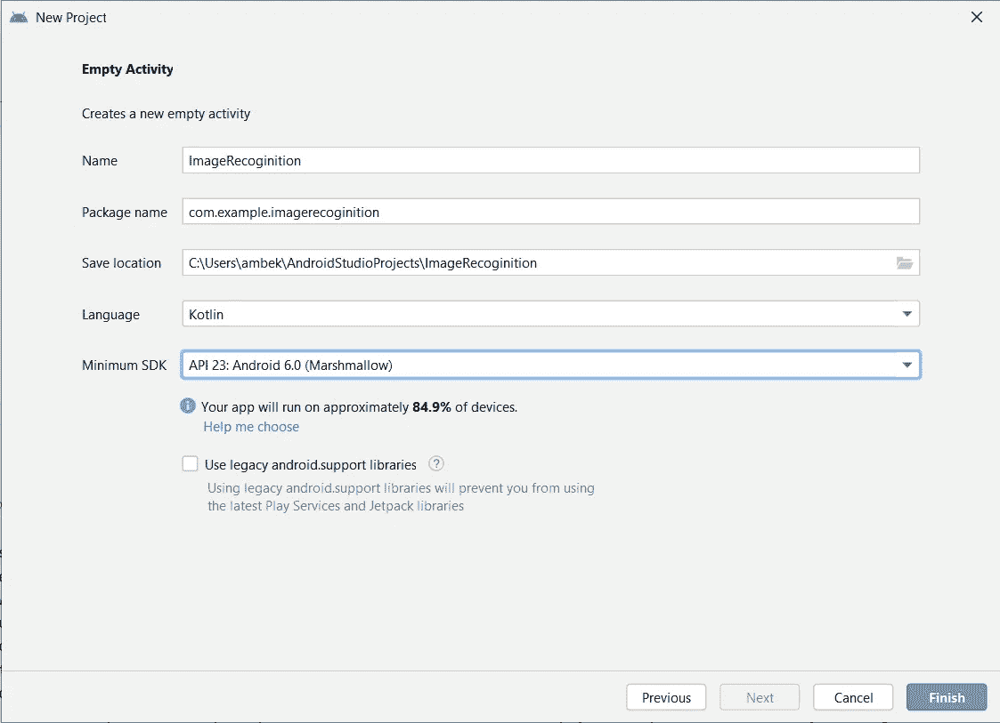
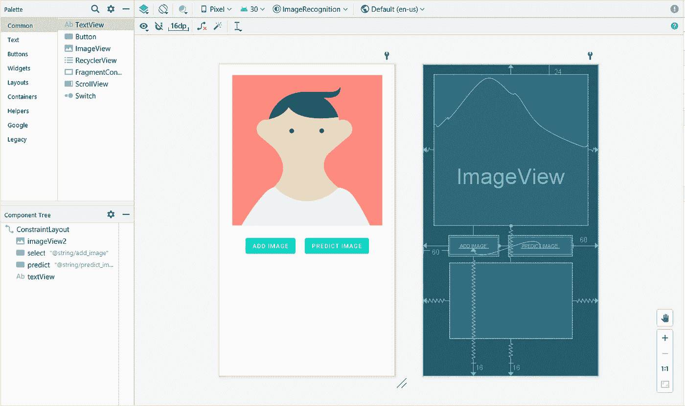
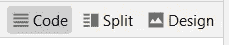
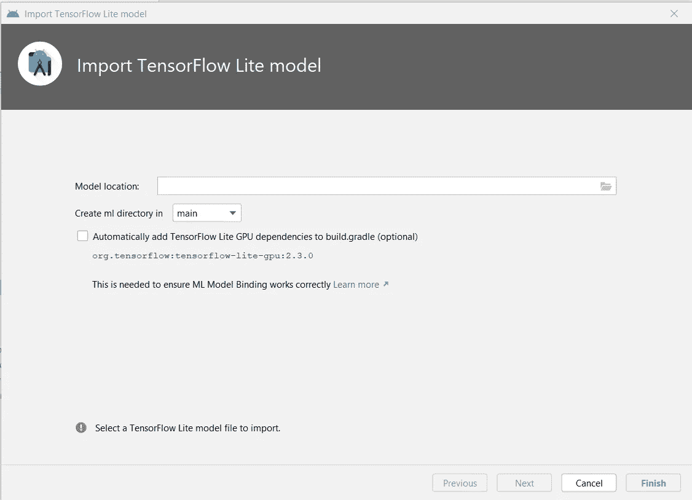
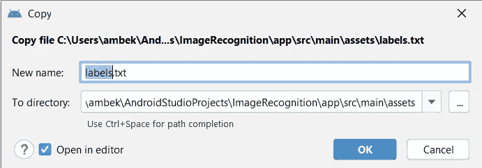
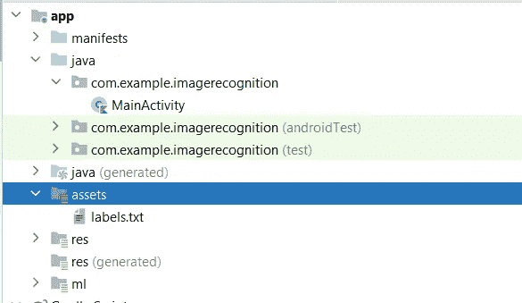
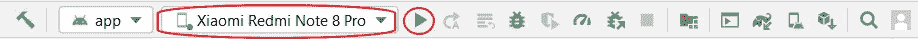
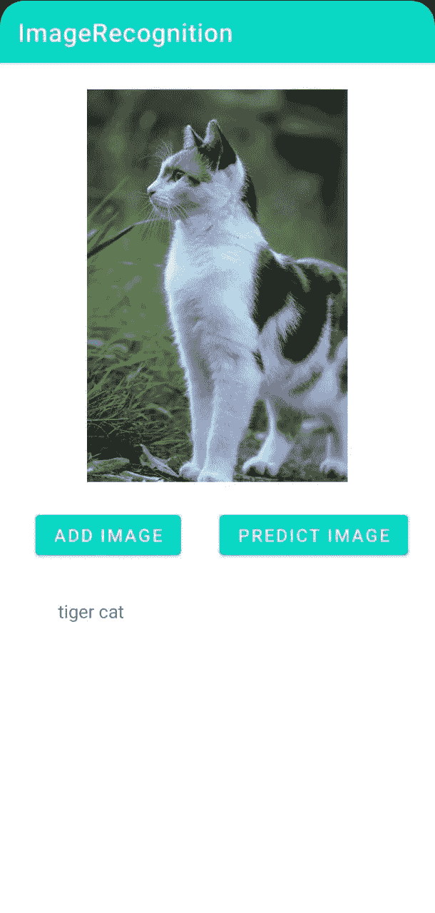

# 使用 TensorFlow 模型的图像识别/分类 Android 应用程序|简单快速的实施| Kotlin

> 原文：<https://medium.com/analytics-vidhya/image-recognition-classification-android-app-using-tensorflow-model-easy-and-fast-e3e00bc0b3ab?source=collection_archive---------2----------------------->

**简介:**

图像识别是计算机视觉的一部分，并且识别和检测数字视频或图像中的对象或属性的过程有助于识别图像中的地点、标志、人、对象、建筑物和若干其他变量。用户通过应用程序、社交网络和网站分享大量数据。此外，配有摄像头的移动电话正在创造无限的数字图像和视频。大量的数字数据正被企业用来为访问这些数据的人们提供更好、更智能的服务。

在这里，你将学习如何创建一个基于 kotlin 语言的 android 应用程序。我们将在我们的 android 应用程序中实现 TensorFlow 预训练分类模型，然后对选定的图像进行分类。

基本要求:

> [*安卓工作室。*](https://developer.android.com/studio?gclsrc=aw.ds&gclid=Cj0KCQjw3f6HBhDHARIsAD_i3D-67jAQL0AtFojvK1e7vIKcSvFY05DImffCs5EoQ_jvhW1zBo7TAloaApzHEALw_wcB)
> 
> *编程基础知识，android studio 一知半解*
> 
> *Tenser 流动图像分类模型文件*
> 
> *仿真器或智能手机(运行应用程序)*

下载[图片分类| TensorFlow Lite](https://www.tensorflow.org/lite/examples/image_classification/overview) 模型。



解压缩下载的文件，你会得到两个扩展名为。tflite 和。txt 文本文件包含数据的标签。

打开您的 android studio 并启动新项目选择空活动，现在给出您的项目的正确位置并声明项目的名称，确保选择语言为 Kotlin，并根据您的选择设置最低 SDK，这将显示您可以在多少百分比的设备上运行您的应用程序。然后单击完成。



让我们首先设计前端。xml 文件，您只需拖放您想要显示的项目。我们将有一个图像视图，文本视图和添加图像和预测图像按钮。给每个视图适当的约束。



您可以在蓝图视图中看到所有约束。在我们的设计中，有一个文本视图将显示位于两个按钮正下方的预测图像的结果。

转到屏幕右上方的代码选项



对比我的。xml 代码与您的代码

XML 代码:

```
*<?*xml version="1.0" encoding="utf-8"*?>* <androidx.constraintlayout.widget.ConstraintLayout xmlns:android="http://schemas.android.com/apk/res/android"
    xmlns:app="http://schemas.android.com/apk/res-auto"
    xmlns:tools="http://schemas.android.com/tools"
    android:layout_width="match_parent"
    android:layout_height="match_parent"
    tools:context=".MainActivity"> <ImageView
        android:id="@+id/imageView2"
        android:layout_width="361dp"
        android:layout_height="354dp"
        android:layout_marginTop="24dp"
        android:contentDescription="@string/select"
        app:layout_constraintEnd_toEndOf="parent"
        app:layout_constraintHorizontal_bias="0.498"
        app:layout_constraintStart_toStartOf="parent"
        app:layout_constraintTop_toTopOf="parent"
        tools:srcCompat="@tools:sample/avatars" /> <Button
        android:id="@+id/select"
        android:layout_width="wrap_content"
        android:layout_height="wrap_content"
        android:layout_marginStart="60dp"
        android:layout_marginTop="24dp"
        android:layout_marginBottom="16dp"
        android:text="@string/add_image"
        app:layout_constraintBottom_toBottomOf="parent"
        app:layout_constraintStart_toStartOf="parent"
        app:layout_constraintTop_toBottomOf="@+id/imageView2"
        app:layout_constraintVertical_bias="0.0" /> <Button
        android:id="@+id/predict"
        android:layout_width="wrap_content"
        android:layout_height="wrap_content"
        android:layout_marginStart="16dp"
        android:layout_marginEnd="60dp"
        android:text="@string/predict_image"
        app:layout_constraintBaseline_toBaselineOf="@+id/select"
        app:layout_constraintEnd_toEndOf="parent"
        app:layout_constraintHorizontal_bias="1.0"
        app:layout_constraintStart_toEndOf="@+id/select" /> <TextView
        android:id="@+id/textView"
        android:layout_width="288dp"
        android:layout_height="178dp"
        android:layout_marginTop="16dp"
        android:layout_marginBottom="16dp"
        app:layout_constraintBottom_toBottomOf="parent"
        app:layout_constraintEnd_toEndOf="parent"
        app:layout_constraintStart_toStartOf="parent"
        app:layout_constraintTop_toBottomOf="@+id/imageView2" /></androidx.constraintlayout.widget.ConstraintLayout>
```

让我们在项目中导入张量流模型

文件>新建>其他> TensorFlow Lite 模型。然后这个窗口会出现在你的屏幕上



添加适当的模型位置，即提取的位置。tflite 文件，然后单击完成。

现在我们必须为添加标签文件创建一个资产文件。txt 在里面现在就去

文件>新建>文件夹>资产文件夹。txt 文件并粘贴到名为**labels . txt**的资产文件夹中



这是您的项目部分的外观。

现在我们将编写 Kotlin 代码，编写下面的 kotlin 代码

```
package com.example.imagerecognition

import android.content.Intent
import android.graphics.Bitmap
import android.net.Uri
import androidx.appcompat.app.AppCompatActivity
import android.os.Bundle
import android.provider.MediaStore
import android.view.View
import android.widget.Button
import android.widget.ImageView
import android.widget.TextView
import com.example.imagerecognition.ml.MobilenetV110224Quant
import org.tensorflow.lite.DataType
import org.tensorflow.lite.support.image.TensorImage
import org.tensorflow.lite.support.tensorbuffer.TensorBuffer
class MainActivity : AppCompatActivity() {
    lateinit var bitmap: Bitmap
    lateinit var imageView: ImageView
    override fun onCreate(savedInstanceState: Bundle?) {
        super.onCreate(savedInstanceState)
        setContentView(R.layout.*activity_main*)

        imageView = findViewById(R.id.*imageView2*)

        val fileName = "labels.txt"
        val inputString = *application*.*assets*.open(fileName).*bufferedReader*().*use***{it**.*readText*()**}** var townlist = inputString.*split*("\n")

        var textView: TextView = findViewById(R.id.*textView*)

        var select: Button = findViewById(R.id.*select*)
        select.setOnClickListener(View.OnClickListener **{** var intent: Intent = Intent(Intent.*ACTION_GET_CONTENT*)
            intent.*type* ="image/*"

            startActivityForResult(intent, 100)

        **}**)

        var predict: Button = findViewById(R.id.*predict*)
        predict.setOnClickListener(View.OnClickListener **{** var resize: Bitmap = Bitmap.createScaledBitmap(bitmap, 224, 224, true)
            val model = MobilenetV110224Quant.newInstance(this)
            var theBuffer = TensorImage.fromBitmap(resize)
            var byteBuffer = theBuffer.*buffer
// Creates inputs for reference.* val inputFeature0 = TensorBuffer.createFixedSize(*intArrayOf*(1, 224, 224, 3), DataType.*UINT8*)
            inputFeature0.loadBuffer(byteBuffer)

*// Runs model inference and gets result.* val outputs = model.process(inputFeature0)
            val outputFeature0 = outputs.*outputFeature0AsTensorBuffer* var max = getMax(outputFeature0.*floatArray*)
            textView.setText(townlist[max])
*// Releases model resources if no longer used.* model.close()
        **}**)
    }

    override fun onActivityResult(requestCode: Int, resultCode: Int, data: Intent?) {
        super.onActivityResult(requestCode, resultCode, data)

        imageView.setImageURI(data?.*data*)

        var uri: Uri? = data?.*data* bitmap = MediaStore.Images.Media.getBitmap(this.*contentResolver*, uri)
    }
    fun getMax(arr:FloatArray) : Int{
        var index = 0
        var min = 0.0f

        for(i in 0..1000){
            if(arr[i]>min){
                index = i
                min = arr[i]
            }
        }
        return index

    }

}
```

在红色标志出现的地方，点击那个单词，按下 **alt+enter** ，看看要做什么改变，如果它显示添加导入，点击它，之后 android studio 会做你的工作。

现在这一切都完成了，是时候构建 apk 在我们的手机上运行了。

要在您的智能手机中编译和运行此应用程序，首先从您的智能手机的开发人员选项中启用 USB 调试，并选择文件传输。

您的智能手机将出现在这里选择它，并通过点击运行按钮继续运行。



允许应用程序安装在您的设备上，然后应用程序将启动。



这是你的输出将如何通过点击添加按钮添加图像，并点击预测图像会给你在文本视图中的输出。

— — — — — — — — — — — — — — — — — — — — — — — — — — — — — —

直接从我的 [GitHub 库下载这个应用程序。](https://github.com/yashambekar1804)

关注并连接。