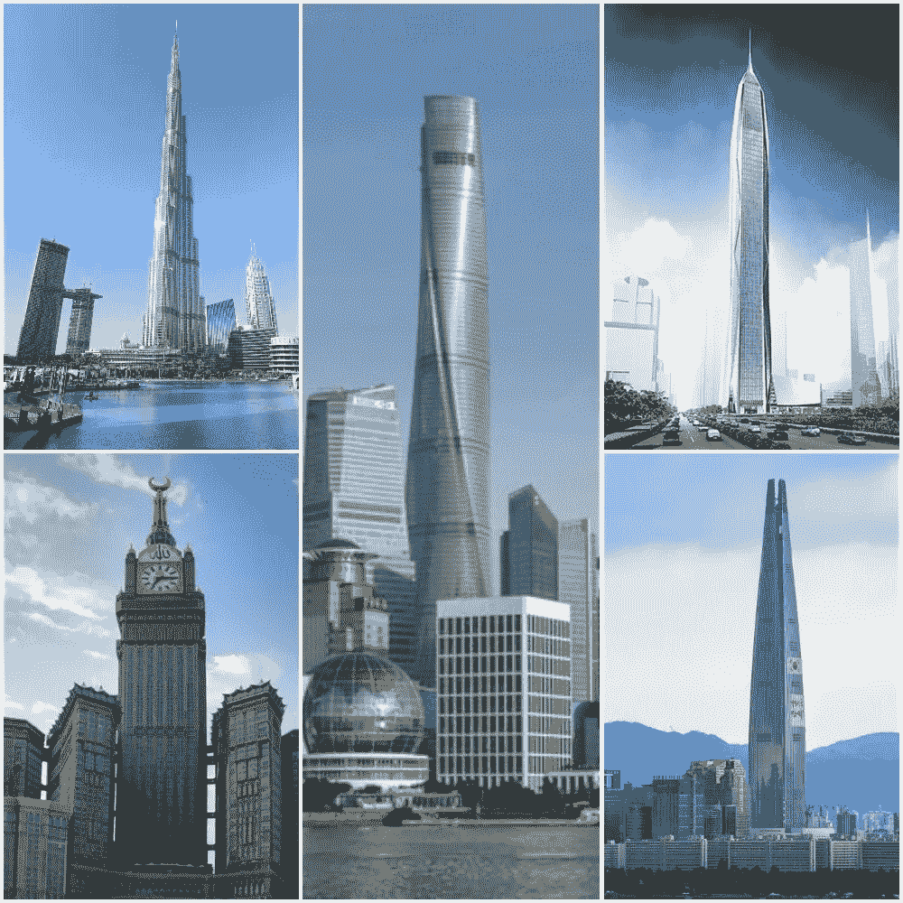

# Python 中使用图像哈希技术的图像搜索引擎

> 原文：<https://medium.com/analytics-vidhya/image-search-engine-using-image-hashing-technique-in-python-e6749dacc8f7?source=collection_archive---------2----------------------->


从[开始，不飞溅](https://unsplash.com/photos/afW1hht0NSs?utm_source=unsplash&utm_medium=referral&utm_content=creditShareLink)

I 图像搜索是一种信息检索方法，基于同样是图像的查询来检索相似的图像。图像搜索广泛应用于取证、监控等领域。

每个现代浏览器都提供图像搜索功能，以检索在查询中具有相似图像的网站。这些搜索引擎由每天处理和索引数十亿张图像的深度学习模型驱动。这些搜索引擎首先通过从深度学习模型中提取特征来索引图像，为了检索图像，它们计算查询图像的特征，并显示基于相似率排序的相似图像。此外，一些引擎通过基于元数据和图像内容来索引图像，从而使用混合方法来搜索图像。

在深度学习流行之前，一些搜索引擎使用哈希技术来索引图像。在本教程中，我们将讨论如何使用图像哈希技术实现图像搜索。

要构建一个搜索引擎，我们必须实现以下步骤

1.  建立一个图像数据库。
2.  使用散列法索引图像。
3.  通过比较查询图像和数据库中图像的哈希值来获取相似的图像。基于散列的相似性分数来获取相似的图像。

# 1.设置图像数据库

图像数据库包含世界上最高的五座[建筑的图像](https://en.wikipedia.org/wiki/List_of_tallest_buildings)图像。对于每个建筑物(迪拜塔、上海中心大厦、Abraj Al-Bait 钟楼、平安金融中心和乐天世界大厦)，图像数据库包含该建筑物的 5 个不同图像，并且数据库中总共有 25 个图像。



# 2.图像索引

为了索引图像，我们使用图像哈希值并将它们存储在数据库中以比较图像。

## 图像哈希

> 图像哈希是为图像提供唯一哈希代码的过程。

因为我们可以将图像编码成唯一的代码，所以该代码可以用于索引图像。所以我们通过比较哈希码和它们的相似性来检索相似的图像。

有各种各样的图像散列算法来对图像进行散列，并且大多数算法都是简单而快速的。一些流行的算法是

*   平均散列法
*   中值散列法
*   感知哈希(pHash)
*   差异散列法
*   块散列法
*   小波散列(wHash)
*   彩色矩散列法

如果你不熟悉图像哈希的概念，可以在这个著名的[博客](http://www.hackerfactor.com/blog/index.php?/archives/432-Looks-Like-It.html)中学习图像哈希。

目前，我们使用[感知哈希](https://en.wikipedia.org/wiki/Perceptual_hashing) (pHash)算法来哈希图像，该算法在将数据从空间域转换到频率域的[离散余弦变换](https://en.wikipedia.org/wiki/Discrete_cosine_transform) (DCT)的基础上计算哈希。

## 感知散列法

pHash 是一种基于图像的 DCT 值计算图像散列的简单算法。该算法包括以下步骤

*   重新缩放图像—将图像重新缩放到 4 的倍数，如 8*8、32*32 等。
*   转换成灰度图像。
*   计算 8*8 或 32*32 图像的 DCT 块。
*   计算平均 DCT 值，不包括(0，0)处的值，因为它会影响计算平均值时的较大偏差。
*   通过比较平均值将条目设置为 0 或 1 来计算二进制 DCT 块(如果值>平均值，则 1 否则为 0)。
*   通过从左到右和从上到下遍历二进制 DCT 块来构造散列。因为值只有 0 或 1，所以对于 8*8 DCT 块，散列可以存储在 64 位整数中。

对于每个图像，我们从上面的 pHash 算法计算图像散列，并将这些散列存储为图像的索引。

在上面的代码片段中， **image_names** 包含了 images 目录中的所有图像路径，对于每个图像，我们计算哈希值并将其存储在 **image_hash_dict** 中以备将来使用。

```
Image namesimages/abraj-al-bait-1.jpg
images/abraj-al-bait-2.jpg
images/abraj-al-bait-3.jpg
images/abraj-al-bait-4.jpg
images/abraj-al-bait-5.jpg
images/burj-khalifa-1.jpg
images/burj-khalifa-2.jpg
images/burj-khalifa-3.jpg
images/burj-khalifa-4.jpg
images/burj-khalifa-5.jpg
images/lotte-1.jpg
images/lotte-2.jpg
images/lotte-3.jpg
images/lotte-4.jpg
images/lotte-5.jpg
images/ping-an-1.jpg
images/ping-an-2.jpg
images/ping-an-3.jpg
images/ping-an-4.jpg
images/ping-an-5.jpg
images/shanghai-tower-1.jpg
images/shanghai-tower-2.jpg
images/shanghai-tower-3.jpg
images/shanghai-tower-4.jpg
images/shanghai-tower-5.jpg
```

***hash _ array _ to _ hash _ hex()***将 1D 二进制数组转换为十六进制字符串值***hash _ hex _ to _ hash _ array()***将十六进制字符串值转换为数据类型为 float 的 1D 二进制数组。

字符串哈希值占用较少的空间，可以灵活地存储在文本或 csv 文件中。这些值可用于索引数据库中的图像。

***" images/Shanghai-tower-1 . jpg "***的哈希值为 **0xb1934cf40a79140b**

有用于计算图像散列的 python 库，如 [ImageHash](https://github.com/JohannesBuchner/imagehash) 和 [Perception](https://github.com/thorn-oss/perception) ，它们提供了不同的散列方法和其他工具来实现图像散列。

# 3.获取相似的图像

现在，对于查询图像，类似的图像被提取为

*   计算查询图像的图像哈希值。
*   因为我们已经在数据库中存储了图像的哈希值，所以将它们的哈希值与查询图像的哈希值进行比较。像汉明距离这样的度量函数可以用来比较哈希值。
*   现在根据度量分数对图像进行分类。
*   显示指标分数高于阈值的图像。

因为我们已经计算了图像散列，所以我们可以通过将散列值与查询图像散列值进行比较来检索相似的图像。

如果查询图像是“images/burj-khalifa-3.jpg ”,为了获得相似的图像，计算所有图像散列相对于查询散列的汉明距离，如

这给出图像的距离分数如下

```
images/abraj-al-bait-1.jpg     0.46875
images/abraj-al-bait-2.jpg     0.609375
images/abraj-al-bait-3.jpg     0.640625
images/abraj-al-bait-4.jpg     0.578125
images/abraj-al-bait-5.jpg     0.5images/burj-khalifa-1.jpg      0.53125
images/burj-khalifa-2.jpg      0.453125
images/burj-khalifa-3.jpg      0.0
images/burj-khalifa-4.jpg      0.390625
images/burj-khalifa-5.jpg      0.4375images/lotte-1.jpg             0.453125
images/lotte-2.jpg             0.53125
images/lotte-3.jpg             0.625
images/lotte-4.jpg             0.4375
images/lotte-5.jpg             0.375images/ping-an-1.jpg           0.453125
images/ping-an-2.jpg           0.609375
images/ping-an-3.jpg           0.484375
images/ping-an-4.jpg           0.484375
images/ping-an-5.jpg           0.453125images/shanghai-tower-1.jpg    0.4375
images/shanghai-tower-2.jpg    0.328125
images/shanghai-tower-3.jpg    0.515625
images/shanghai-tower-4.jpg    0.359375
images/shanghai-tower-5.jpg    0.453125
```

这些分数指示图像与查询图像的相似性。分数越低，它就越类似于查询图像。哈利法塔图像的得分在 0.3-0.5 之间，其他一些图像也在此范围内，因为建筑物具有相似的结构，很难区分结构。

图像哈希结果可能没有深度学习方法准确，但它们实现起来非常快，并且需要更少的存储。图像哈希方法可用于检测大型数据库中的严格重复图像。通过对图像进行一些预处理，并调整 pHash 算法，我们可以获得更好的检索相似图像的结果。