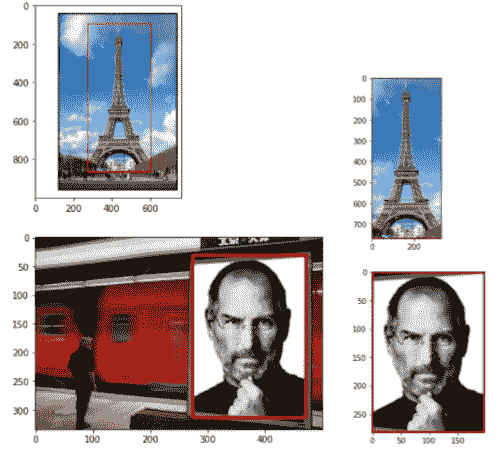
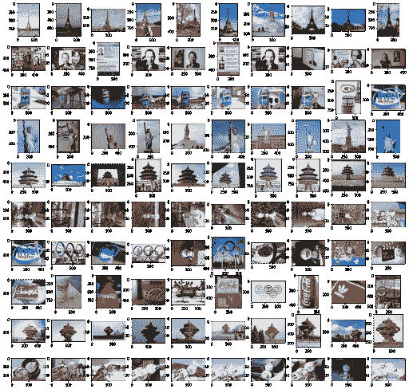

# 图像搜索 CNN 的迁移学习

> 原文：<https://medium.com/analytics-vidhya/image-search-transfer-learning-with-cnn-convolutional-neural-network-76c5fb7b8819?source=collection_archive---------7----------------------->

构建一个图像搜索引擎，根据特定的目标图像从数据库中检索最相似的图像。

# 问题

给定一个查询图像(包含一个特定实例)和一个包含不同内容的图像集合，我们希望从集合中找到包含相同查询实例的图像。

下图是查询图像的两个示例(原始图像+裁剪后的图像)。

查询图像的两个例子。

下图是使用 ResNet 迁移学习的查询结果。因为我有十个查询图像，所以有十行图像，每行包含与查询图像最相似的十个图像。我们可以看到第一行包含埃菲尔铁塔的图片。第二排是[史蒂夫·乔布斯](https://en.wikipedia.org/wiki/Steve_Jobs)的图片，以此类推。在接下来的部分中，我们将看到这个方法是如何实现的。

# 方法

在 [**ResNet**](https://en.wikipedia.org/wiki/Residual_neural_network) 上执行**转移学习。与从头开始训练所需的时间相比，我们可以从成倍缩短的训练时间中受益。此外，它还用于提取特征。**

1.  **从查询图像和集合中的每个图像中提取特征**。
2.  计算查询图像和来自集合的每个图像之间的**相似性(或差异)分数**。
3.  查询结果是来自集合**的按照相似性分数排序**的图像。

(注:下面的代码是用 [PyTorch](https://pytorch.org/) 实现的。)

# 密码

([完整代码@ Github](https://github.com/chiatsekuo/computer_vision_image_processing/tree/main/instance_search) )

我将跳过图像加载和图像预处理部分，因为它们可以根据场景和库以不同的方式实现。

## 特征抽出

首先，导入 PyTorch 所需的库。

注意，在这种情况下，PIL ( [Pillow](https://pypi.org/project/Pillow/) ) python 图像库似乎比 [OpenCV](https://opencv.org/) 更兼容 PyTorch。

tqdm 包允许您通过显示一个动态进度条来跟踪估计的处理时间。

现在，我们可以加载预训练的 ResNet18 模型。

接下来，我们需要将图像转换成我们想要的设置。每个图像的大小应该调整为 256 x 256 像素，因为这是 ResNet18 的默认输入形状。**torch vision . transforms . center crop(size)**基本上是在中心对给定的图像进行裁剪， **size** 是期望的裁剪输出大小。我们还应该用平均值和标准差来归一化张量图像。

**get_vector(image)** 函数返回输入图像的特征。

最后，我们需要遍历集合中的所有图像，并通过计算它们的[欧几里德距离](https://en.wikipedia.org/wiki/Euclidean_distance#:~:text=In%20mathematics%2C%20the%20Euclidean%20distance,being%20called%20the%20Pythagorean%20distance.)(如下面的第 45 行所示)，将查询图像的特征与集合中的每个图像进行比较。