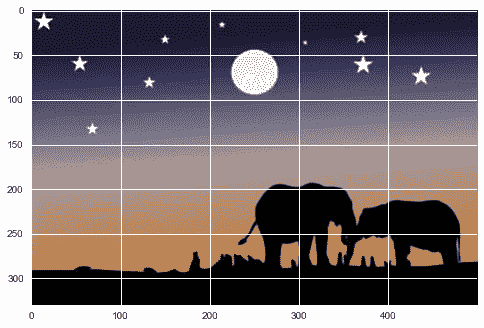

# 基于 K-均值的图像分割

> 原文：<https://medium.com/analytics-vidhya/image-segmentation-using-k-means-4bd79e801785?source=collection_archive---------30----------------------->

*将图像分类成不同的组*


图像分割是将图像分割成多个片段的过程。这背后的主要动机是改变图像的表示以提供更多的信息，或者我们可以只关注那些重要的区域。

## 应用程序

> 它用于医学成像、自动汽车、物体检测、视频监控等等。

> 先决条件是学习 K-Means 算法

[](https://aditrisriv.medium.com/k-means-clustering-3ce2456db7f1) [## k 均值聚类

### 从头开始解释和实现

aditrisriv.medium.com](https://aditrisriv.medium.com/k-means-clustering-3ce2456db7f1) 

让我们先看看最主要的颜色:

```
img = cv2.imread(‘./elephant.jpg’)
plt.imshow(im)
```



原象

```
# Flattening image into 1-d array.
all_pixels = img.reshape((-1,3))
print(all_pixels.shape)dominant_colors = 4
km = KMeans(k=dominant_colors,max_iter=30)
km.fit(all_pixels)c=[]
for i in range(km.k):
    c.append(km.clusters[i]['center'])# We are going to make 1 X 4 subplot each having a single color
i=1
plt.figure(0,figsize=(4,2))colors = []
for each_col in c:
    plt.subplot(1,4,i)
    plt.axis("off")
    i+=1

    colors.append(each_col)
    # Color Switch
    a = np.zeros((100,100,3),dtype='uint8')
    a[:,:,:] = each_col
    plt.imshow(a)
plt.show()
```


主色

> 在此之后，你将能够看到主色！！

```
for i in range(new_image.shape[0]):
 l = int(km.label[i])
 new_image[i] = colors[l]

new_image = new_image.reshape((original_shape))
plt.axis(“off”)
plt.imshow(new_image)
plt.show()
```


> 我们只绘制了图像分割的主要部分。

感谢阅读。