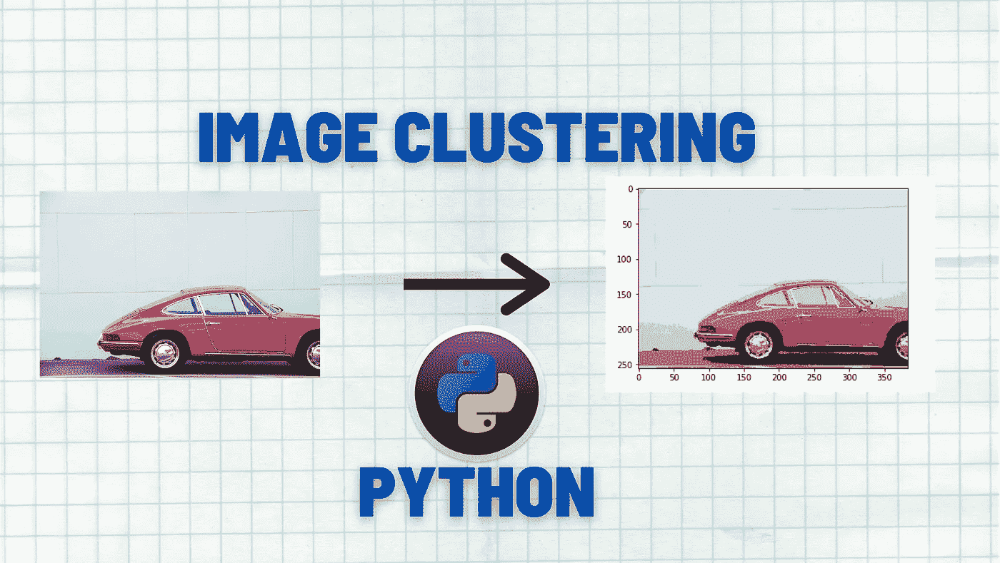
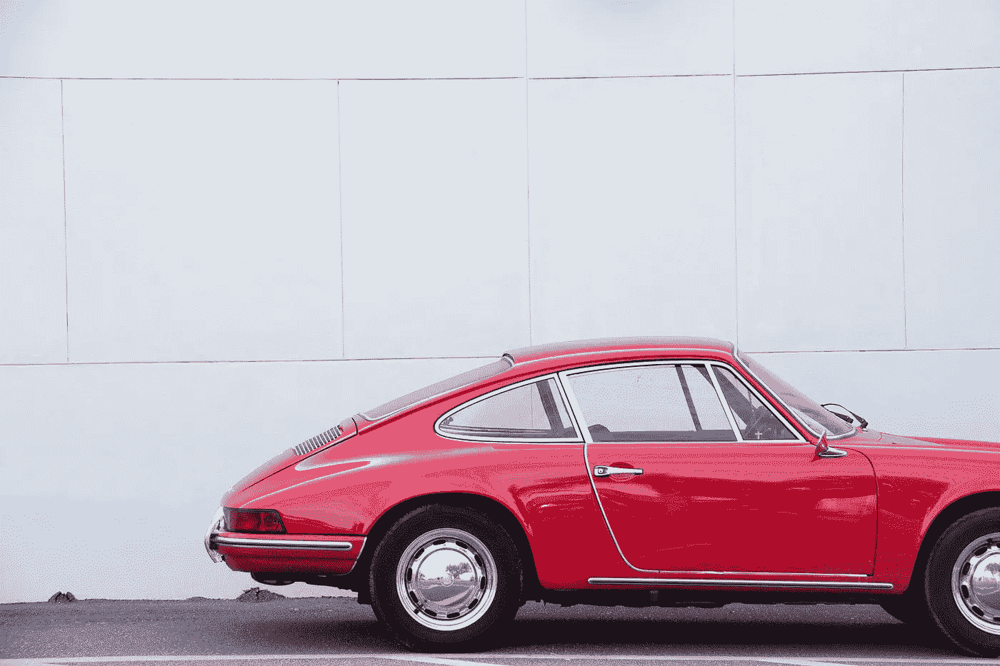
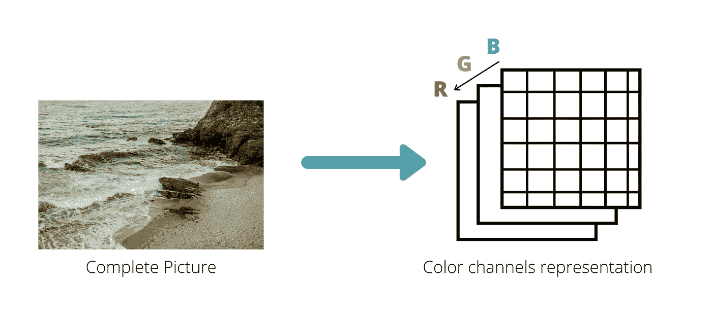
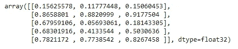
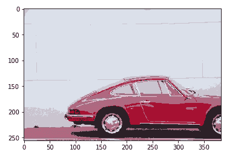

# 使用 K-means 聚类算法的图像分割| Python

> 原文：<https://medium.com/analytics-vidhya/image-segmentation-using-k-means-clustering-algorithm-python-cef588a79a63?source=collection_archive---------1----------------------->



在上一篇文章中，我们看到了如何用 python 从头实现 K 均值算法。我们深入研究了算法的工作原理，并讨论了一些可能的实际应用。在本教程中，我们将看到一个这样的应用。在本教程中，我们将了解如何使用 K-means 聚类来根据像素值将图像分割成多个片段。

**如果你是机器学习或者 K-means 新手，可以在这里** **阅读原文** [。](https://writersbyte.com/datascience/implementing-k-means-clustering-with-k-means-initialization-in-python/)

[](https://writersbyte.com/datascience/implementing-k-means-clustering-with-k-means-initialization-in-python/) [## 实现 K 意味着用 K Means++初始化| Python 进行聚类。- WritersByte

### K-Means 聚类是一种无监督的机器学习算法。无人监管意味着它不需要标签或…

writersbyte.com](https://writersbyte.com/datascience/implementing-k-means-clustering-with-k-means-initialization-in-python/) 

**本文使用的完整代码可以在** [**这里**](https://github.com/Moosa-Ali/K-Means-Image-Clustering/blob/master/K-means%20for%20image%20classification.ipynb) **找到。**

更多 AI 相关文章，点击下方；

[](https://writersbyte.com/) [## ▤作家字节

### 思想，故事和想法。

writersbyte.com](https://writersbyte.com/) 

因为我们已经在原始文章中讨论了所有的本质细节，所以我将保持这篇文章相当简短。

本教程将分为 3 个简短的部分。

**图像文件的预处理步骤。**

**算法的工作原理。**

**结果。**

我们开始吧！！

加载我们的图像将是我们的第一步。

我们将使用以下从 unsplash.com 下载的图片



图片来源:乔希·里纳德([https://unsplash.com/@joshrinard](https://unsplash.com/@joshrinard))

在继续前进之前，如果你喜欢这个内容，考虑给我买一个。

[](http://ko-fi.com/moosaali9906)

我们不能像处理正常数据点一样处理图像，这是因为彩色图像是一个三维矩阵(第三维是 RGB 颜色通道，不增加透视，但这对我们的数学工作很重要)。



图像的维度表示

每个通道由包含通道颜色(红色、绿色或蓝色)信息的像素组成

我们需要把它转换成二维数据。

我们现在在数据框中有了展平的数据。是时候写算法了。该算法将与之前的原始算法保持一致，要深入了解 K-means 聚类，请阅读原始文章[此处](/geekculture/implementing-k-means-clustering-with-k-means-initialization-in-python-7ca5a859d63a)。

该算法针对 **5 个集群**运行；如变量*‘k’*所示。这一次，我们没有等待质心达到稳定值，而是设置了一个阈值来确保我们有最佳的质心。

这样做是因为，对于图像数据，该算法需要很长时间来找到完美的质心，所以我们给它一个小的余量，也就是说，如果新旧质心之间的差在某个范围内，则退出循环并保留最后找到的质心。

> 在这一点上需要注意的是，我们上面写的算法工作起来非常慢，因为速度和效率不是本教程的目标，这里我们只看 K-means 算法的工作。提高算法速度的一种方法是使用“itertuples”函数，而不是“iterrows ”,因为**元组由于其静态内存分配而在遍历中至少快十倍。如果你知道任何其他方法来提高这个算法的效率，请在下面评论。**

稍作等待后，算法已经完成了它的工作，让我们看看最终结果中有哪些质心。

```
centroids = centroids.to_numpy()
print(centroids)
```



找到最终质心

现在我们有了质心，我们需要做的就是画出结果。**绘制以这样的方式完成，即特定簇中的所有像素都被该簇的质心覆盖。**

[](https://writersbyte.com/datascience/ai-for-beginners/) [## 人工智能初学者:人工智能基础- WritersByte

### 你正在浏览你的脸书页面。你看到一则广告“我们的人工智能解决方案将改变你的…

writersbyte.com](https://writersbyte.com/datascience/ai-for-beginners/) [](https://writersbyte.com/datascience/ai-for-beginners-2/) [## 面向初学者的人工智能:机器学习 VS 深度学习

### 在本系列的前一篇文章“人工智能基础”中，我解释了人工智能这个术语

writersbyte.com](https://writersbyte.com/datascience/ai-for-beginners-2/) 

让我们看看最终的图像是什么样的。



最终图像

# 结论

最终图像总共只有 5 种颜色(由于 5 个聚类)，这 5 种颜色代表原始图像中存在的主要颜色。

最终的图像看起来像是来自 Instagram 滤镜的东西。我们可以使用所获得的质心和聚类来为图像创建多个遮罩，并将其分成多个部分，例如，我们可以看到汽车的车身是红色的，但被分成两个不同的色调，我们可以为更少数量的聚类训练算法，然后将汽车的红色车身完全分开，因为它是单个聚类的一部分。

类似地，我们可以通过这种方式找到图像分割的多个用例。

[](http://ko-fi.com/moosaali9906)