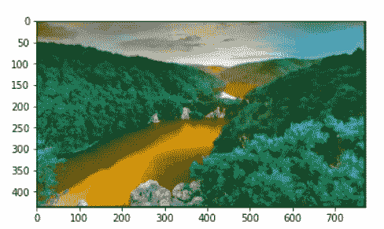
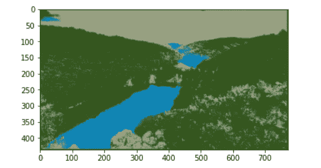
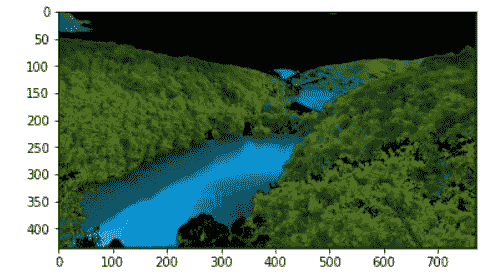

# 从头开始使用 K-均值聚类的图像分割

> 原文：<https://medium.com/analytics-vidhya/image-segmentation-using-k-means-clustering-from-scratch-1545c896e38e?source=collection_archive---------3----------------------->

在 ***数字图像处理中******计算机视觉******图像分割*** 是将一幅数字图像分割成多个片段的过程。分割的目标是简化和/或改变图像的表示，使其更有意义、更易于分析。

*今天，我们将通过 K-means 聚类和 OpenCV 从零开始实现* ***图像分割*** *！我很确定它会像听起来一样令人着迷！*

> 有关 K-均值聚类的概念概述，请参考— [**关于 K-均值聚类您需要知道的一切**](https://tp6145.medium.com/everything-you-need-to-know-about-k-means-clustering-88ad4058cce0)

*我们现在将从头开始执行 K-means 聚类算法的代码演练:*

```
import **numpy** as np
import **matplotlib.pyplot** as pltnp.random.seed(42)**def euclidean_distance**(x1, x2):
    return np.sqrt(np.sum((x1 - x2)**2))**class KMeans():** ** def __init__**(self, K=5, max_iters=100, plot_steps=False):
        self.K = K
        self.max_iters = max_iters
        self.plot_steps = plot_steps *# list of sample indices for each cluster*
        self.clusters = [[] for _ in range(self.K)]
        *# the centers (mean feature vector) for each cluster*
        self.centroids = [] **def predict**(self, X):
        self.X = X
        self.n_samples, self.n_features = X.shape

        *# initialize* 
        random_sample_idxs = np.random.choice(self.n_samples, self.K, replace=False)
        self.centroids = [self.X[idx] for idx in random_sample_idxs] *# Optimize clusters*
        for _ in range(self.max_iters):
            *# Assign samples to closest centroids (create clusters)*
            self.clusters = self._create_clusters(self.centroids)
            if self.plot_steps:
                self.plot() *# Calculate new centroids from the clusters*
            centroids_old = self.centroids
            self.centroids = self._get_centroids(self.clusters)

            *# check if clusters have changed*
            if self._is_converged(centroids_old, self.centroids):
                break if self.plot_steps:
                self.plot() *# Classify samples as the index of their clusters*
        return self._get_cluster_labels(self.clusters) **def _get_cluster_labels**(self, clusters):
        *# each sample will get the label of the cluster it was assigned to*
        labels = np.empty(self.n_samples) for cluster_idx, cluster in enumerate(clusters):
            for sample_index in cluster:
                labels[sample_index] = cluster_idx
        return labels ** def _create_clusters**(self, centroids):
        *# Assign the samples to the closest centroids to create clusters*
        clusters = [[] for _ in range(self.K)]
        for idx, sample in enumerate(self.X):
            centroid_idx = self._closest_centroid(sample, centroids)
            clusters[centroid_idx].append(idx)
        return clusters ** def _closest_centroid**(self, sample, centroids):
        *# distance of the current sample to each centroid*
        distances = [euclidean_distance(sample, point) for point in centroids]
        closest_index = np.argmin(distances)
        return closest_index **def _get_centroids**(self, clusters):
        *# assign mean value of clusters to centroids*
        centroids = np.zeros((self.K, self.n_features))
        for cluster_idx, cluster in enumerate(clusters):
            cluster_mean = np.mean(self.X[cluster], axis=0)
            centroids[cluster_idx] = cluster_mean
        return centroids **def _is_converged**(self, centroids_old, centroids):
        *# distances between each old and new centroids, fol all centroids*
        distances = [euclidean_distance(centroids_old[i], centroids[i]) for i in range(self.K)]
        return sum(distances) == 0 **def plot**(self):
        fig, ax = plt.subplots(figsize=(12, 8)) for i, index in enumerate(self.clusters):
            point = self.X[index].T
            ax.scatter(*point) for point in self.centroids:
            ax.scatter(*point, marker="x", color='black', linewidth=2) plt.show()
   ** def cent**(self):
        return self.centroidsimport **cv2** from **google.colab.patches** import **cv2_imshow**image = cv2.imread("demo_image.png")plt.figure(figsize=(6, 6))
plt.imshow(image)**Out:** <matplotlib.image.AxesImage at 0x7ff5d3fb5b00>
```



```
image = cv2.cvtColor(image, cv2.COLOR_BGR2RGB)
plt.figure(figsize=(6, 6)) 
plt.imshow(image)**Out:** <matplotlib.image.AxesImage at 0x7ff5d3f21780>
```


```
pixel_values = image.reshape((-1, 3))
pixel_values = np.float32(pixel_values)
print(pixel_values.shape)**Out:**
(336592, 3)k = **KMeans**(K=3, max_iters=100)  
y_pred = k**.predict**(pixel_values) 
k**.cent**()**Out:** array([[ 52.33562851,  87.11623383,  30.71857262],
       [ 13.03598499, 134.39547729, 185.26257324],
       [153.30374146, 160.25224304, 128.49607849]])centers = np.uint8(k.cent())
centers**Out:** array([[ 52,  87,  30],
       [ 13, 134, 185],
       [153, 160, 128]], dtype=uint8)y_pred**Out:** array([0., 0., 0., ..., 0., 0., 0.])y_pred = y_pred.astype(int)
np.unique(y_pred)**Out:** array([0, 1, 2])labels = y_pred.flatten()
segmented_image = centers[labels.flatten()]
segmented_image = segmented_image.reshape(image.shape)plt.imshow(segmented_image)
plt.show()
```



```
masked_image = np.copy(image)
masked_image = masked_image.reshape((-1, 3))cluster = 2
masked_image[labels == cluster] = [0, 0, 0]masked_image = masked_image.reshape(image.shape)
plt.imshow(masked_image)
plt.show()
```



> 希望你喜欢并充分利用这篇文章！敬请关注我即将发布的博客！如果你觉得我的内容有帮助/有帮助，请确保**鼓掌**和**跟随**！

***完整代码实现:***

[](https://github.com/tanvipenumudy/Winter-Internship-Internity/blob/main/Day%2011/Day-11%20Notebook-2%20%28Image%20Segmentation%29.ipynb) [## tanvipenumudy/Winter-实习-实习

### 存储库跟踪每天分配的工作-tanvipenumudy/Winter-实习-实习

github.com](https://github.com/tanvipenumudy/Winter-Internship-Internity/blob/main/Day%2011/Day-11%20Notebook-2%20%28Image%20Segmentation%29.ipynb)