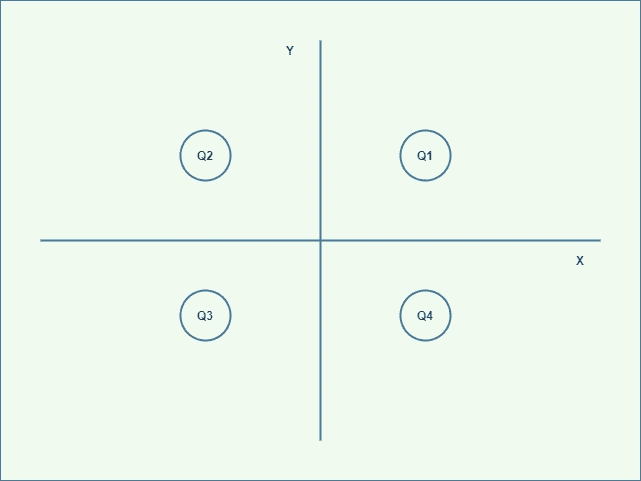
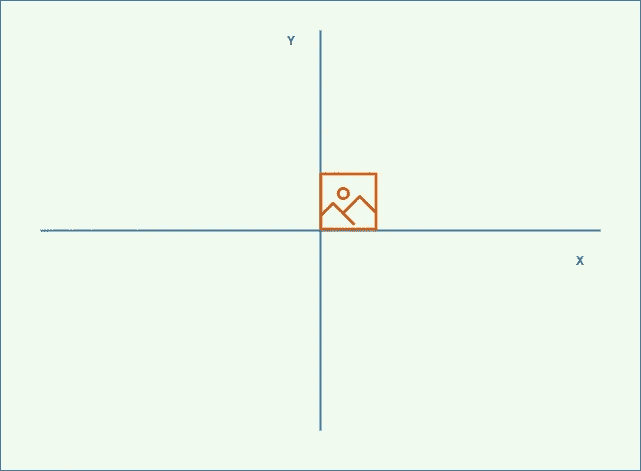
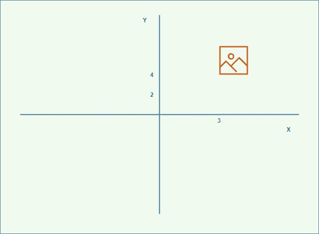
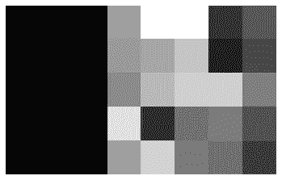
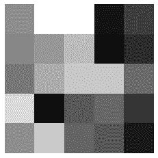
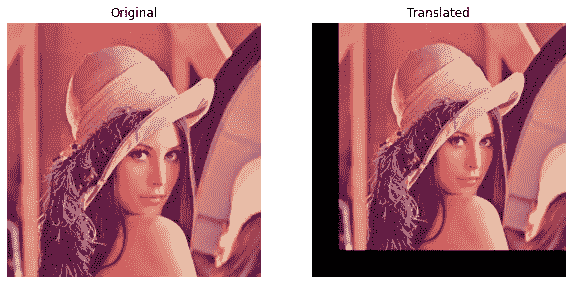
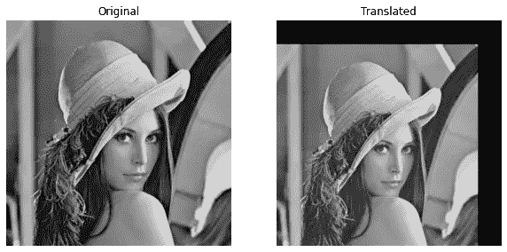

# 从头开始使用 NumPy 进行图像移位

> 原文：<https://medium.com/analytics-vidhya/image-shifting-using-numpy-from-scratch-8bd52663da52?source=collection_archive---------3----------------------->


照片由[詹姆斯·刘易斯](https://unsplash.com/@jamesplewis?utm_source=medium&utm_medium=referral)在 [Unsplash](https://unsplash.com?utm_source=medium&utm_medium=referral) 上拍摄

图像移动只是将图像的每个像素移动到一个新的位置。这是数码相机中用于产生超分辨率图像的像素移位方法。我们可以把一个像素看作是坐标轴上的一个点，可以向任意方向移动。当我们在图像的所有像素上实现这一点时，我们可以说图像发生了偏移。

在这篇博客文章中，当我们使用 NumPy 操作完全移动坐标轴上的点时，我们将尝试移动图像。图像总是被认为是一个`2D`平面，因此我们也将考虑一个以`X`为横轴、`Y`为纵轴的`2D`坐标轴。坐标轴分为`4`象限，即-

*   **Q1** →象限`X`和`Y`都为正。
*   **Q2** →象限，其中`X`为负，`Y`为正。
*   **Q3** →象限`X`和`Y`均为负。
*   **Q4** →象限，其中`X`为正，`Y`为负。



作者图片

我们假设我们的原始图像在原点，即(0，0)。为了形象化这一点，我们可以想象如下的东西



作者图片

现在，假设我们想在坐标(3，4)处移动图像。基本上，图像的原点必须从(0，0)移动到(3，4)，如下所示



作者图片

同样，基于坐标点，我们需要移动图像。让我们从一个`2D`矩阵开始，使用模块 NumPy 从头开始理解和实现，因为图像只是大矩阵。

# 编码时间到了

我们主要使用的软件包有:

*   NumPy
*   Matplotlib
*   OpenCV →它仅用于读取图像(在本文中)。


作者图片

# `Import`包装

# `2D`矩阵

```
>>> import random
>>> 
>>> mat = [[random.randint(5, 100) for i in range(5)] for j in range(5)]
>>> mat = np.matrix(mat)
>>> print(mat)
[[ 46  13  68  54  12]
 [  7  68  32  46  26]
 [ 46  43  58  27 100]
 [ 64  59  76 100  41]
 [ 35  62  56  44   7]]
>>>
```

例如，让我们假设我们在`Q1`移动图像，确定图像必须向左侧向`X`轴移动，向顶部向`Y`轴移动。在这种情况下，图像的大小会增加。基本上，我们根据`x`坐标深度填充图像左侧，根据`y`坐标深度填充图像底部。当我们在剩余的象限`Q2`、`Q3`和`Q4`中移动图像时，必须重复同样的操作。

为此，我们需要使用 NumPy 方法创建一个填充函数。

上述函数用于填充图像。使用的参数如下:

1.  **向量** →填充完成的矩阵。
2.  **如何进行** →这需要四个值来决定图像需要移动的象限。
3.  **深度** →衬垫的深度。

*   下部或底部
*   上部或顶部
*   正确
*   左边的

4.**常量值** →表示`black`颜色，`0`为默认值。

注意—对于右填充和左填充，我们使用方法`hstack()`。同样，对于填充顶部和填充底部，我们使用方法`vstack()`。这两个是 NumPy 方法。

*   **hstack()** →水平堆叠
*   **vstack()** →垂直堆栈

首先，我们创建一个值为零的填充矩阵。基于移动的方向，我们使用这些方法。

我们来测试一下上面的函数。

```
>>> pmat = pad_vector(vector=mat, how='left', depth=3)
>>> print(pmat)
[[  0   0   0  46  13  68  54  12]
 [  0   0   0  7   68  32  46  26]
 [  0   0   0  46  43  58  27 100]
 [  0   0   0  64  59  76 100  41]
 [  0   0   0  35  62  56  44   7]]
>>>
```

我们可以清楚地看到，该函数用深度级别`3`填充了矩阵左侧。如果我们绘制相同的图形(将填充的矩阵转换成图像)，我们会得到-

```
>>> plt.axis("off")
>>> plt.imshow(pmat, cmap='gray')
>>> plt.show()
```



作者图片

而原始图像是-



作者图片

这样，我们可以断定图像向`X`轴的左侧移动，坐标为`x`3。同样的技术也适用于真实图像。让我们尝试复制同样的图像。

我们将有一个函数来读取灰度和 RGB 格式的图像。

让我们制作另一个名为`shifter()`的函数，它实际上沿着`Y`轴移动图像，而不考虑象限。

现在我们有了`shifter()`函数，我们将需要在另一个函数中使用它，这个函数可以在坐标轴的任何地方移动。这里，我们考虑`X`和`Y`轴。

*   当`x`和`y`坐标大于 0 时，填充图像左侧和底部。
*   当`x`大于 0 且`y`小于 0 时，填充图像左侧和顶部。
*   当`x`小于 0 且`y`大于 0 时，填充图像右侧和底部。
*   当`x`和`y`坐标小于 0 时，填充图像右侧和顶部。
*   当`x`和`y`坐标正好等于 0 时，不要干扰图像。

还有一个问题是要转换或移动图像。图像有两种类型—灰度和彩色。对于灰度，不会有任何问题。但是对于彩色图像，我们需要分离 RGB 像素，应用移位函数，然后最终合并像素。因此有了下面的函数。

现在一切都设置好了，让我们测试上面的函数:

**对于彩色图像**

```
translate_this(
    image_file='lena_original.png',
    at=(60, 60),
    with_plot=True
)
```



作者图片

显然，图像被移动到原点(60，60)，即在第一象限(Q1)。

**对于灰度图像**

```
translate_this(
    image_file='lena_original.png',
    at=(-60, -60),
    with_plot=True,
    gray_scale=True
)
```



作者图片

显然，图像移动到原点(-60，-60)，即第三象限(Q3)。

好了，这篇文章就到这里。由此，我们试图理解图像移动过程是如何完成的。

我告辞了。如果你喜欢它，考虑访问我的个人资料，阅读更多关于图像处理。请务必在这里为我买咖啡，或者点击下面的按钮。

[](https://www.buymeacoffee.com/msameeruddin)

支持我