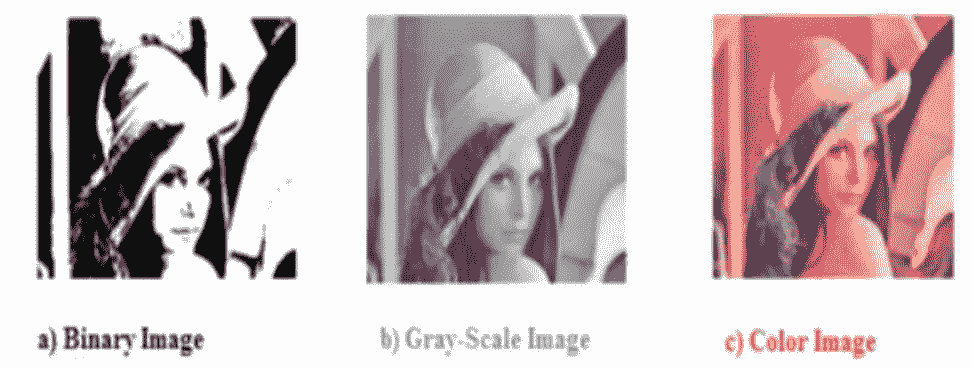
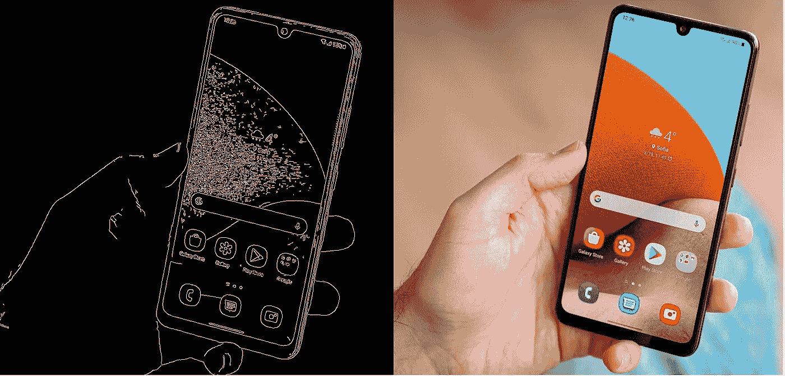
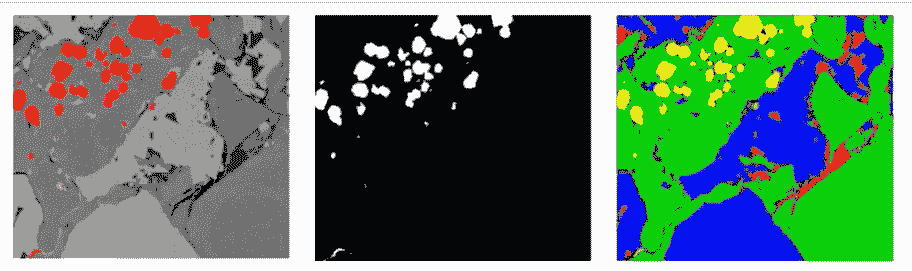
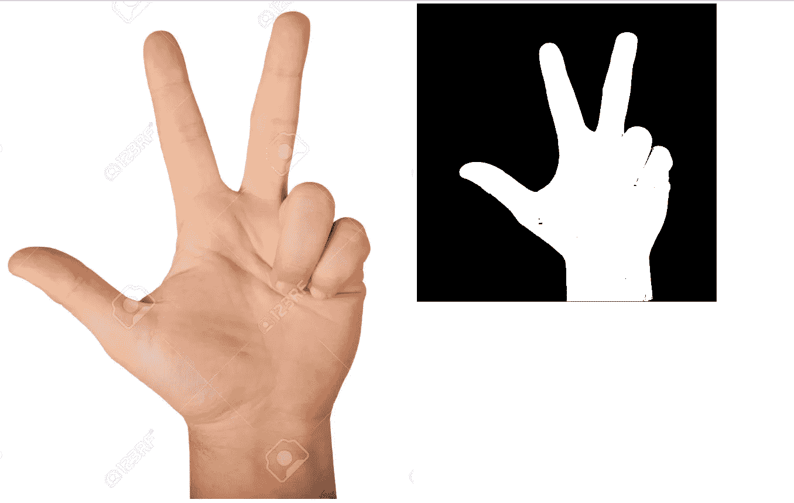

# OpenCV 中的二值化图像简化

> 原文：<https://medium.com/analytics-vidhya/image-simplification-through-binarization-in-opencv-1292d91cae12?source=collection_archive---------0----------------------->

用最简单的术语来说，图像二值化意味着您将图像转换为黑白格式。



原始图像(c)灰度图像(b)和二值图像(a)

大多数计算机视觉程序都是从将图像转换成二进制格式开始的(相信我，在每个计算机视觉应用程序中，你的第一步都是将图像二进制化)。图像越原始，计算机就越容易处理它并理解图像的底层特征(这对正常人的眼睛来说可能相当容易理解)。

# 在 OpenCV 中执行图像二值化的不同方法

可能有多个因素决定如何进行二值化。我不会涵盖所有的技术，但这里是最常见的:

1.  Canny 边缘检测
2.  阈值处理
3.  分段(你可以用它来创建更多的分段，而不仅仅是 2 个黑白分段，但我们将把重点放在二值化上)

> 注意:本文没有深入讨论这些算法是如何工作的。相反，重点是如何在 OpenCV 和 python 中实际完成事情。然而，如果你想看这些算法的基本工作原理，我会放上链接和参考。

# Canny 边缘检测

顾名思义，这种探测器可以探测图像的边缘。该过程检测到的边缘是白色的，而其他所有的都是黑色的。Canny 边缘检测算法使用 5 个步骤来实现它:
降噪、梯度计算、非最大值抑制、双阈值、滞后边缘跟踪。要查看这些步骤的更多细节，请查看第[页](https://towardsdatascience.com/canny-edge-detection-step-by-step-in-python-computer-vision-b49c3a2d8123)。

现在来看如何在 open-cv 中使用它的主要部分。这就是精明方法对你的要求。

```
cv2.Canny(image, lowerThreshold, upperThreshold, apertureSize, L2gradient)
```

你只需要提供你的**原始图像** (RGB 很好，因为 OpenCV 的 canny 方法在内部将其转换为灰度)，一个**下限**和**上限阈值**值。这 3 个参数对于继续使用 canny 方法来说已经足够了。我将简要解释最后两个参数的作用，但是你很难改变它们，它们是可选的。

apertureSize:是用于 Sobel 过滤器的内核大小。该滤波器的工作方式与 CNN 中的卷积滤波器非常相似。默认值为 3X3。

L2Gradient:这指定了寻找梯度大小的方程式。L2gradient 为布尔类型，默认值为 False。

现在让我解释一下**下限和上限阈值**是什么意思。这非常重要，会影响你的输出结果

阈值由 Canny 算法中的步骤 4(阈值)使用。请注意，这些不是像素值，而是最小和最大梯度值。

*例如，如果阈值为[0.1±0.15]，则考虑高于上限(0.15)的边缘像素，并丢弃低于阈值(0.1)的边缘像素。现在，你可能会有一个问题“上下阈值之间的像素怎么办”？只有当它们连接到上阈值中的像素时才被考虑。因此我们得到一个清晰的边缘。*

坦率地说，我很难理解这些价值观。但是这些实际上是一些试着改变的值，你可以在你的代码中根据具体情况进行更新。没有适用于所有人的标准价值观。我看过一些文章，他们说高值应该是小值的 3 倍，但这并不普遍。大多数情况下，我看到人们使用 75，200。你可以试一试，看看是否有帮助，但你总是可以自由地使用给你带来最佳结果的值。但是如果您仍然不确定，您可以使用下面的代码片段(shoutout to pyimagesearch for this)来自动为您计算值:

```
median = np.median(image)
lower = int(max(0, (1.0 - sigma) * median))
upper = int(min(255, (1.0 + sigma) * median))
#lower sigma-->tighter threshold(default value of sigma can be 0.33)
```

所以最后，这就是你的代码在 python 中的样子。这不是很简单却很有效吗？

```
import cv2image = cv2.imread("3.jpg")
edge_image= cv2.Canny(image, lower, upper)
cv2.imshow("edgeDetection", edge_image)
cv2.waitKey(0)
```



原始图像(右)，锐利边缘(左)

# 阈值处理

一种非常简单的技术，其中所有低于阈值的像素将被标记为黑色，而高于阈值的像素将被标记为白色。阈值处理实际上是分割的一个子集(将在下一节讨论)。

*阈值分割是图像分割的一种更简单的形式，它是一种基于对原始图像的像素强度设置阈值来创建二值图像的方法。*

假设您想要基于绿色像素对图像进行阈值处理。因此，您将阈值设置为绿色像素。因此，所有绿色像素在经过阈值处理的图像中将变成白色，其余的则变成黑色。这将被称为您的分段 1(基于绿色像素)。

现在，如果您仍然决定基于红色像素创建另一个分段，您可以继续将阈值设置为红色像素并应用阈值处理。输出将被称为段 2。这就是为什么我们称阈值分割为更简单的分割形式，因为您可以应用多个阈值，这与应用分割技术类似。

点击查看阈值与分割检查[。仅仅介绍部分就足够了，不要进入代码，因为它不是必需的。](https://www.youtube.com/watch?v=8TkligJJCAQ)

在实践中，你会使用更多的分段，而不是阈值。所以在这篇文章中，我将更多地强调细分。但是为了告诉您在 OpenCV 中这是多么简单，我给你一个简单的代码片段

`ret, thresh_image **=** cv2.threshold(img, 120, 255, cv2.THRESH_BINARY)`

阈值是 120 和 255。如果你想深入探究，请查看[这个非常好的解释](https://www.geeksforgeeks.org/python-thresholding-techniques-using-opencv-set-1-simple-thresholding/)。此外，请注意*自适应阈值*将是最常用的情况。所以你可以更仔细地检查一下。

# 分割

如果你浏览了这段 youtube 视频，你可能会看到这张图片



(左起)1。假设你有一个图像，你想二值化它的基础上红点 2。使用阈值技术 3 基于红点对该图像进行二值化。您可以根据不同的阈值重复多个阈值处理，以获得类似于此图的效果。图 2 中已经创建了黄色部分。

我们可以应用分割技术来获得不同的片段，而不是在原始图像上应用多个阈值。这就是细分的意义所在。但是因为我们在本文中关注的主要话题是二值化，所以我们计划只创建一个段。这 1 个分段可以使用阈值技术来创建，但是如果我们有更强大的分段技术，为什么要这样做呢？

理论讲得够多了，但这不是我们在这里的原因。所以还是从代码开始吧。在进行分割时，我们将图像转换为 HSV 图像。我们有 BGR，我们的图像 RGB 编码，以类似的方式，我们有 HSV 编码。

```
hsv = cv2.cvtColor(image, cv2.COLOR_BGR2HSV)
```

然后，我们将 HSV 图像传递给 cv2.inRange 函数，以获得分割的图像。这很简单

```
seg_image= cv2.inRange(hsv, np.array([-10, 50, 100]), np.array([50, 150, 225]))
cv2.imshow("segmentation", seg_image)
```

现在，我们传递给函数的两个数组是什么？这些是最小和最大分割或阈值。但最重要的是，这些值是在 HSV 格式，而不是 RGB 或 BGR 格式。所以你会问我们如何得到 HSV 值。拯救你的另一个片段:

```
#get rgb values from here: https://imagecolorpicker.com/en
rgbColor = np.uint8([[[92,113,165]]])
hsvColor = cv2.cvtColor(rgbColor, cv2.COLOR_BGR2HSV)

upper = np.array([hsvColor[0][0][0] + 10, hsvColor[0][0][1] + 10, hsvColor[0][0][2] + 40])
lower = np.array([hsvColor[0][0][0] - 10, hsvColor[0][0][1] - 10, hsvColor[0][0][2] - 40])
```

使用这个 [URL](https://imagecolorpicker.com/en) 获取图像部分的 BGR 值。如果你已经知道你的细分市场颜色的 BGR 值，你不需要这个网址。您将该值替换为[92，113，165](它是 BGR 而不是 RGB)。代码的其余部分自动给出 HSV 中的最小值和最大值，这些值必须在 inRange 函数中使用。我已经使用了+-10，+-10，+-40 来获得一些大概的最小值和最大值，但是你肯定要改变最终获得的 HSV 值来适应你的需要(*个人经验提示:*我从最小数组做-10，从所有最大数组做+10，看输出。如果分段是完美的，否则通过+或-10 来更新值)。我再强调一下 ***选择正确的阈值是这里最重要也是最棘手的部分，所以不要只满足于 1 个值，要多尝试。***

一旦一切就绪，您将得到一个分段的图像，输出如下所示:



左:原始图像，右:分段图像

# 用哪个？

如果你已经到达这里，你会想知道哪一个最适合你。在计算机视觉和深度学习中，永远没有确定的赢家。你尝试所有的方法，什么能给你带来最好的结果，你就去做吧。所以试一试，然后再决定。但是如果你认为你可以跳过计算机视觉中的图像二值化，事情很快就会变得很困难。