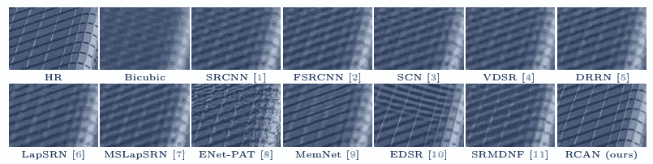
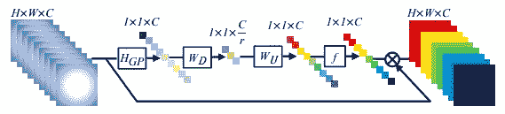

# 使用 RCAN 的图像超分辨率:剩余通道注意网络

> 原文：<https://medium.com/analytics-vidhya/image-super-resolution-using-rcan-residual-channel-attention-networks-82a12d3005a7?source=collection_archive---------23----------------------->

# 摘要

该文提出了一种新的模型结构，该结构由残差中残差(RIR)块组成，每个块具有信道关注度。总管道是 400 层深度卷积网络。更具体地说，该文件建议

*   剩余块中的剩余块，形成 RIR 结构。
*   一个长的和短的跳跃连接，其目的是将低频特征与计算的高频特征一起传送。
*   提出了针对每个残差块的信道注意机制，通过自注意对每个信道信息进行不同的加权。
*   证明了具有高表示能力的非常非常深的网络可以显著提高感知和定量 SR 性能。该模型仅使用 MSE 损失，尽管如下图所示实现了很好的感知性能。

RCAN 的例子

# 模型架构

最重要的是，本文提出了一个 RIR 深度特征提取网络。RIR 由 G 剩余群(RG)和短跳连接组成。然后，每个 RG 由 B 个剩余信道注意块(RCAB)组成。作者认为，这种 RIR 架构允许训练非常深的网络。

根据 ResNet 论文，具有跳跃连接的剩余块被堆叠，以实现具有优越性能的可训练的 1000+层网络。然而，在 SR 中，直到这篇文章才出现这种情况，因为它很难因为深入而获得性能增益。多尺度跳跃连接的 RIR 结构能够训练更深层次的网络。

# 渠道关注

通道自我注意是一种基于图像关注特定通道信息的自我注意机制。本文应用全局平均池和线性层，并在展平的向量上进行最终的 sigmoid 激活，以生成频道式注意力地图。注意力图通过逐元素乘法来应用。在许多问题中，我们没有使用通道式注意力。但是在 SR 中，该模型应该与输入大小成比例，这限制了普通自我注意层对引导注意的使用。

# 剩余信道关注块(RCAB)块

RCAB 模块是模型架构最基本的构建模块。每个 RCAB 块具有两个由通道注意力引导卷积层。它在 RCAB 块级别也有跳过连接。因此，在建议的管道中有三个级别的跳过连接:RCAB 跳过连接、长跳过连接和短跳过连接。

# 结论

本文比较了长跳连接(LSC)、短跳连接(SSC)和通道注意(CA)的效果。如上表所示，多重跳过连接似乎对模型性能非常有益。频道关注也稍微提高了性能。

本文最重要的贡献在于，它通过在多个尺度上利用跳跃连接来训练非常深的 CNN。