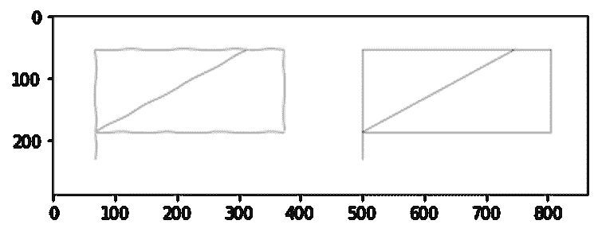
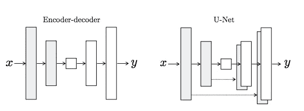
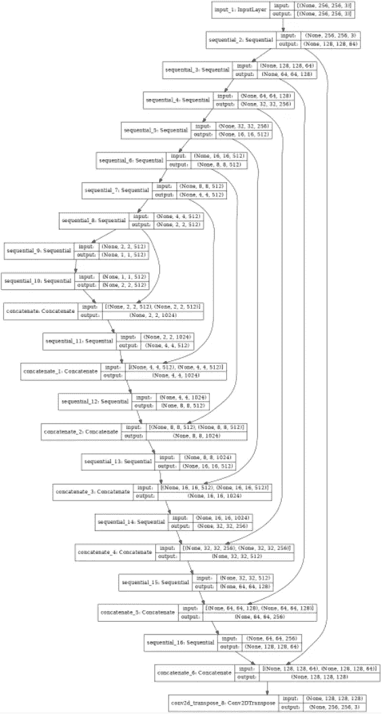
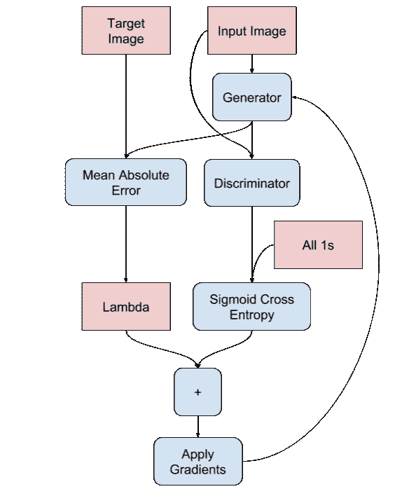
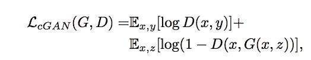
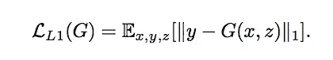
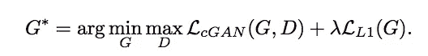
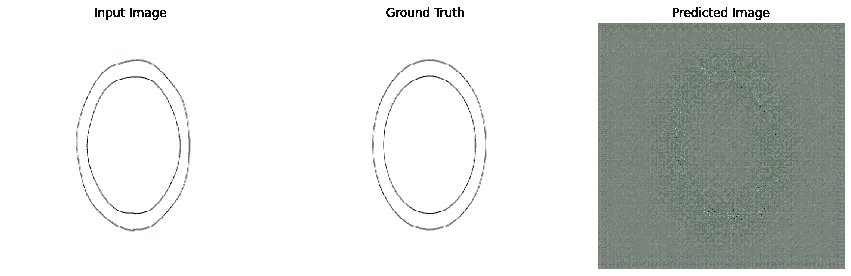
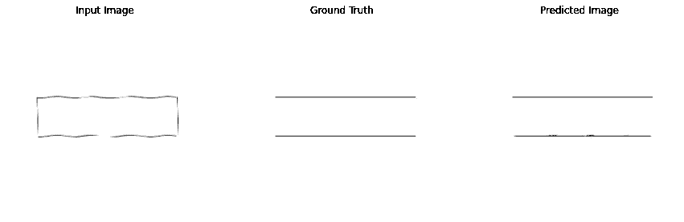
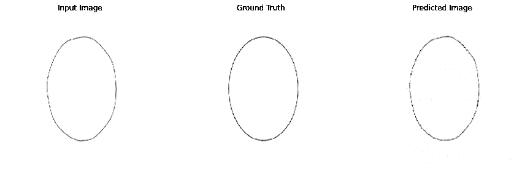

# 图 2 使用 cGAN、Pix2Pix 进行图像翻译…

> 原文：<https://medium.com/analytics-vidhya/image2image-translation-with-cgan-pix2pix-86f2f327fece?source=collection_archive---------6----------------------->

本文重点介绍使用条件 GANs(pix 2 pix)实现图像到图像转换的深度卷积网络。该模型是在 [TensorFlow](https://www.tensorflow.org/tutorials/generative/pix2pix) 的帮助下建立的。

完整的代码和结果可以在[这里](https://github.com/Devesan/pix2pix)找到。

**文章概述:**

一、Pix2Pix cGAN 介绍？

二关于数据集

构建 U-net 生成器和鉴别器

定义损失函数

五.结论

# **一、Pix2Pix cGAN 简介:**

GAN 是生成模型，它学习从随机噪声向量 z 到输出图像 y，G: z → y 的映射。相反，条件 gan 学习从观察到的图像 x 和随机噪声向量 z，到 y，G: {x，z} → y 的映射。在 pix2pix cGAN 中，我们调节输入图像并生成相应的输出图像。cGANs 最初是在[条件生成对抗网](https://arxiv.org/abs/1411.1784)中提出的(Mirza 和 Osindero，2014)

该架构如下所示:

1)一个 U 网生成器

2)卷积 PatchGAN 鉴别器

发生器 G 被训练成产生不能被对抗性训练的鉴别器 D 从“真实”图像中区分出来的输出，鉴别器 D 被训练成尽可能好地检测发生器的“假货”。这个训练过程如图 2 所示。

Pix2Pix GAN 已经在一系列图像到图像的翻译任务中得到验证，例如将地图转换为卫星照片，将黑白照片转换为彩色照片，以及将产品草图转换为产品照片。

# **二关于数据集:**

已经创建了包含超过 3500 张手绘图像及其相应 CAD 图像的数据集。这些图像是从 SketchGraphs 数据集构建的，该数据集可在此处找到[、 **SketchGraphs:一个用于在计算机辅助设计中对关系几何建模的大规模数据集**、](https://github.com/PrincetonLIPS/SketchGraphs#sketchgraphs-a-large-scale-dataset-for-modeling-relational-geometry-in-computer-aided-design)

训练数据集中的每个图像都包含用 shape (288，864，3)连接在一起的两个图像。在数据输入管道中，此图像的大小调整为(256，512，3)。

# **三、建立模型:**

**1)构建一个 U-net 生成器:**

pix2pix cGAN 的生成器是一个*修改的* [U-Net](https://arxiv.org/abs/1505.04597) 。U-Net 由编码器(下采样器)和解码器(上采样器)组成。

*   编码器中的每个块是:卷积->批量归一化->泄漏 ReLU
*   解码器中的每个块是:转置卷积->批量归一化->丢弃(应用于前 3 个块)-> ReLU
*   编码器和解码器之间有跳跃连接(如在 U-Net 中)。

U-net 架构

**发电机:**

u 网生成器

**2)构建 PatchGAN 鉴别器:**

pix2pix 中使用的 PatchGAN 鉴别器是该设计的另一个独特组件。PatchGAN / Markovian 鉴别器的工作原理是将图像中的单个(N x N)斑块分类为“真实与虚假”，而不是将整个图像分类为“真实与虚假”，如 [pix2pix 论文](https://arxiv.org/abs/1611.07004)中所述。作者认为，这加强了更多的约束，鼓励尖锐的高频细节。此外，PatchGAN 的参数更少，运行速度比分类整个图像更快。

鉴别器中的每个模块是:

*   卷积->批量归一化->泄漏 ReLU。
*   最后一层之后输出的形状是(batch_size，30，30，1)。
*   输出的每个 30 x 30 图像块对输入图像的 70 x 70 部分进行分类。
*   鉴频器接收 2 个输入:
*   输入图像和目标图像，它应该分类为真实的。
*   输入图像和生成的图像(生成器的输出)，它应该将其归类为假的。
*   使用 tf.concat([inp，tar]，axis=-1)将这两个输入连接在一起。

# **四定义损失函数:**

**发电机损耗:**

gan 学习适应数据的损失，而 cGANs 学习惩罚与网络输出和目标图像不同的可能结构的结构化损失，如 [pix2pix 论文](https://arxiv.org/abs/1611.07004)中所述。

*   生成器损失是所生成图像的 sigmoid 交叉熵损失和一个的**阵列。**
*   pix2pix 论文还提到了 L1 损失，这是生成的图像和目标图像之间的 MAE(平均绝对误差)。
*   这使得生成的图像在结构上变得与目标图像相似。
*   计算发电机总损耗的公式为 gan_loss + LAMBDA * l1_loss，其中 LAMBDA = 100。这个值是由论文作者决定的。

发电机的培训程序

**鉴别器损耗:**

*   discriminator_loss 函数有两个输入:**真实图像**和**生成图像**。
*   real_loss 是**实像**和一个数组**(因为这些是实像)**的 sigmoid 交叉熵损失。
*   generated_loss 是**生成的图像**和一个零的**阵列(因为这些是假图像)**的 sigmoid 交叉熵损失。
*   总损失是实际损失和产生损失的总和。

条件-对抗损失(生成器对鉴别器)非常普遍地格式化如下:

前面提到的 L1 损失函数如下所示:

结合这些功能会产生:

在实验中，作者报告说他们发现λ参数等于 100 时最成功。所以我们也选择了λ为 100。

**结论:**

使用手绘图像训练模型，以创建具有 16k 步骤的 CAD 图像。

最终的模型可以从拥抱脸下载，这里是模型的结果。

一些结果如下所示。

谢谢你…