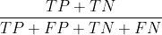
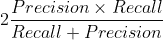

# 不平衡数据

> 原文：<https://medium.com/analytics-vidhya/imbalanced-data-2887d92951fd?source=collection_archive---------2----------------------->

## python 中管理不平衡数据的一些技巧


Elena Mozhvilo 在 [Unsplash](https://unsplash.com/s/photos/balance?utm_source=unsplash&utm_medium=referral&utm_content=creditCopyText) 上的照片

# **简介**

通常情况下，我们要处理的数据集在类之间的分布不均匀，这也称为不平衡数据。为什么要关注这个呢？因为当我们尝试将分类模型应用于这种数据时，它会影响分类器的性能，因为存在代表性不足的数据。在本文中，我们将评估一些用于处理不平衡数据的方法，如评估指标、抽样技术和成本敏感方法。

通过**评估指标**，我们指的是评估模型如何对样本进行分类的方法。我们将在下面更详细地应用和描述的指标是:**准确度、精确度、召回率、F1 分数、G 均值和马修斯相关系数。**

另一方面，通过**采样方法**我们指的是通过平衡类的分布来修改数据结构的技术。换句话说，这些技术中的大多数人为地增加少数样本的数量(过采样)或减少多数样本的数量(欠采样)。我们要应用的方法有: **SMOTE，ADASYN，邻域清洗规则，单侧选择，SMOTEENN 和 SMOTE+Tomek。**

最后但同样重要的是，我们将看到改变分类器每次错误地对代表性不足的类别进行分类时的惩罚方式的效果，而不是修改训练数据的类别分布。这也被称为**成本敏感学习，**它表示模型将增加被错误分类的少数类中的惩罚权重。

# **数据**

使用的数据集是可以在 [UCI](https://archive.ics.uci.edu/ml/datasets/bank+marketing) 找到的银行营销数据，本文使用的完整代码可以在我的 [GitHub](https://github.com/Michelpayan/Imbalanced_data_techniques) 上找到。

```
import pandas as pd
import numpy as np
from sklearn.preprocessing import StandardScaler
from sklearn.metrics import confusion_matrix
from sklearn.metrics import plot_confusion_matrixfrom sklearn.preprocessing import OneHotEncoder
from sklearn.compose import ColumnTransformerfrom sklearn.model_selection import StratifiedKFold
from sklearn.model_selection import train_test_splitfrom imblearn.pipeline import Pipelinefrom sklearn.model_selection import cross_validate
from sklearn.metrics import make_scorer
from sklearn.metrics import fbeta_score, matthews_corrcoef
from imblearn.metrics import geometric_mean_scorefrom sklearn.ensemble import RandomForestClassifier#Sampling methods
from imblearn.over_sampling import SMOTE, ADASYN
from imblearn.under_sampling import NeighbourhoodCleaningRule,OneSidedSelection
from imblearn.combine import SMOTEENN, SMOTETomekdata=pd.read_csv(r'bank-additional\bank-additional\bank-additional-full.csv',sep=";")train, test = train_test_split(data, test_size=0.2, random_state=0, stratify=data[['y']])#As a suggestion in [https://archive.ics.uci.edu/ml/datasets/bank+marketing](https://archive.ics.uci.edu/ml/datasets/bank+marketing), the column "duration" is dropped.
train=train.drop(columns='duration')
test=test.drop(columns='duration')train_x=train.iloc[:,0:-1]
train_y=pd.DataFrame(train['y'])
train_y.y.replace('no',0,inplace=True)
train_y.y.replace('yes',1,inplace=True)test_x=test.iloc[:,0:-1]
test_y=pd.DataFrame(test['y'])
test_y.y.replace('no',0,inplace=True)
test_y.y.replace('yes',1,inplace=True)numerical_ix = train_x.select_dtypes(include=['int64', 'float64']).columns
categorical_ix = train_x.select_dtypes(include=['object', 'bool']).columnskfold = StratifiedKFold(n_splits=10, shuffle=True, random_state=100)scoring = {"Acc":"accuracy",
           'F1': 'f1', 
           'Prec': 'precision',
           'Recall':'recall',
           'MC':make_scorer(matthews_corrcoef),
          'GM':make_scorer(geometric_mean_score)}rf=RandomForestClassifier(random_state=0)
```

# **评估指标**

处理分类问题时最常用的度量之一是准确性，它等于:



然而，当我们处理不平衡数据时，使用准确性来评估分类器的性能可能会产生误导，因为它对模型在多数类上的能力提供了过于乐观的估计。

为了演示这一陈述，让我们在预测不平衡数据集的类之后，可视化混淆矩阵:

```
t0 = [('cat', OneHotEncoder(handle_unknown = "ignore"), categorical_ix)]
col_transform0 = ColumnTransformer(transformers=t0)pipeline = Pipeline(steps=[('prep', col_transform0),('m',rf)])
cv_results_none=cross_validate(pipeline, train_x, train_y.values.ravel(), scoring=scoring, cv=kfold)pipeline.fit(train_x,train_y.values.ravel())
predict_y=pipeline.predict(test_x)
plot_confusion_matrix(pipeline, test_x,test_y,display_labels=["No","Yes"], cmap=plt.cm.Blues) ;
```


通过查看上面的混淆矩阵，我们看到 96%的多数类被正确分类，而 77%的少数类被错误分类。但是，总的准确率是 88.68%。

由于准确性的缺点，在处理不平衡数据时，还有其他流行的评估指标:

***1。Precision:*** 这是一个度量标准，用于计算正类的正确预测百分比。它的计算方法是正确预测的正例数除以预测的正例总数。


**2*。回忆:*** 它计算所有可能做出的肯定预测中，肯定类别的正确预测的百分比。它的计算方法是正确预测的正例数除以可预测的正例总数。


***3。F1 得分:*** it 计算为精度和召回率的调和平均值，给每个相同的权重。它允许使用单个分数来评估模型，同时考虑精确度和召回率。



***4。几何平均值:*** 该度量试图最大化每个类的精度，同时保持这些精度的平衡。它是灵敏度/回忆率和特异性/真阴性率乘积的平方根。


***5。马修斯相关系数:*** 是观测值和预测值标签之间的相关系数，其值在-1 和+1 之间。系数+1 表示完美预测，0 表示不比随机预测好，1 表示预测和观察完全不一致。


# 方法/技术:

下面您将看到本文中用于处理不平衡数据集的每种方法的描述，以及所应用的评估指标的结果:

**1。使用原始数据集(不平衡数据)进行分类:**首先，我们将使用原始数据计算评估指标:

```
results = pd.DataFrame(columns=scoring.keys())
results.loc['No sampling']=  [np.mean(cv_results_none['test_{}'.format(score)]) for score in scoring.keys()] 
results
```


**2。合成少数过采样技术(SMOTE):** 这是一种过采样技术，通过使用 K 最近邻(KNN)算法创建人工示例来增加少数类的数量。基本上来说，该方法采用所有少数样本，计算每个样本的 KNN(默认 K 为 5)，随机选择一个或多个计算的 K 个最近邻，然后取考虑中的样本与其最近邻的差，并将该差乘以 0 到 1 之间的随机数，最后将其添加到考虑中的原始样本。

```
t = [('cat', OneHotEncoder(handle_unknown = "ignore"), categorical_ix), ('num', StandardScaler(), numerical_ix)]
col_transform = ColumnTransformer(transformers=t)pipeline = Pipeline(steps=[('prep', col_transform),('imbalance',SMOTE()) ,('m',rf)])
cv_results_smote=cross_validate(pipeline, train_x, train_y.values.ravel(), scoring=scoring, cv=kfold)results = pd.DataFrame(columns=scoring.keys())
results.loc['SMOTE']=  [np.mean(cv_results_smote['test_{}'.format(score)]) for score in scoring.keys()] 
results
```


**3。自适应合成(ADASYN):** 这是另一种使用 KNN 的过采样技术。然而，ADASYN 并没有像 SMOTE 那样创建相同数量的合成样本，而是计算一个密度分布函数，并将其作为一个标准来决定需要为原始数据的每个少数样本生成的人工样本的数量。换句话说，它根据与其他少数民族样本相比的学习难度，对不同的少数民族类别样本应用加权分布。

```
pipeline = Pipeline(steps=[('prep', col_transform),('imbalance',ADASYN()) ,('m',rf)])
cv_results_adasyn=cross_validate(pipeline, train_x, train_y.values.ravel(), scoring=scoring, cv=kfold)results = pd.DataFrame(columns=scoring.keys())
results.loc['ADASYN']=  [np.mean(cv_results_adasyn['test_{}'.format(score)]) for score in scoring.keys()] 
results
```


**4。邻域清理规则:**这是一种欠采样方法，计算每个多数和少数类的 KNN。当它的 K 个最近邻(默认 K 是 3)属于其他少数类时，它基本上丢弃了多数类的例子。此外，如果为少数类计算的 K 个邻居属于多数类，则属于多数类的那些最近邻居被移除。

```
pipeline = Pipeline(steps=[('prep', col_transform),('imbalance',NeighbourhoodCleaningRule()) ,('m',rf)])
cv_results_ncr=cross_validate(pipeline, train_x, train_y.values.ravel(), scoring=scoring, cv=kfold)results = pd.DataFrame(columns=scoring.keys())
results.loc['NCR']=  [np.mean(cv_results_ncr['test_{}'.format(score)]) for score in scoring.keys()] 
results
```


**5。单边选择:**这种技术方法结合了两种欠采样，即 Tome 链接和压缩最近邻规则，以便从多数类中去除距离判定线或边界线太近和太远的样本。

```
pipeline = Pipeline(steps=[('prep', col_transform),('imbalance',OneSidedSelection()) ,('m',rf)])
cv_results_oss=cross_validate(pipeline, train_x, train_y.values.ravel(), scoring=scoring, cv=kfold)results = pd.DataFrame(columns=scoring.keys())
results.loc['OSS']=  [np.mean(cv_results_oss['test_{}'.format(score)]) for score in scoring.keys()] 
results
```


**6。这种技术是一种过采样和欠采样方法相结合的结果。该方法首先使用 SMOTE 进行过采样，然后使用被称为编辑最近邻规则(ENN)的欠采样技术，该欠采样技术移除其类标签与其三个最近邻中的至少两个的类不同的任何样本。**

```
pipeline = Pipeline(steps=[('prep', col_transform),('imbalance',SMOTEENN()) ,('m',rf)])
cv_results_smeenn=cross_validate(pipeline, train_x, train_y.values.ravel(), scoring=scoring, cv=kfold)results = pd.DataFrame(columns=scoring.keys())
results.loc['SMEENN']=  [np.mean(cv_results_smeenn['test_{}'.format(score)]) for score in scoring.keys()] 
results
```


**7。SMOTE + TOMEK:** 这是过采样方法的另一种组合，在这种情况下是 SMOTE，欠采样是 Tome Links。在为少数类创建合成样本之后，它移除太靠近边界线或少数样本的多数类样本。

```
pipeline = Pipeline(steps=[('prep', col_transform),('imbalance',SMOTETomek()) ,('m',rf)]) cv_results_smt=cross_validate(pipeline, train_x, 
train_y.values.ravel(), scoring=scoring, cv=kfold) results = pd.DataFrame(columns=scoring.keys()) results.loc['SMT']=  [np.mean(cv_results_smt['test_{}'.format(score)]) for score in scoring.keys()] results
```


**8。成本敏感学习:**处理不平衡数据的另一种方法是通过改变 other 中分类器的结构，使其适合处理这种数据。由于模型的目标是最小化误差，相对于负类(多数)，成本敏感学习为来自正类(少数)的样本的错误分类引入了更高的成本。

在下面的代码中，你会看到超参数 *class_weight=balanced。*术语“平衡的”是指模型将调整*“y”*中值的权重，与它们的频率成反比:n _ samples/(n _ classes * NP . bin count(y))。

```
pipeline = Pipeline(steps=[('prep', col_transform0),('m',RandomForestClassifier(class_weight='balanced'))])
cv_results_cost=cross_validate(pipeline, train_x, train_y.values.ravel(), scoring=scoring, cv=kfold)results = pd.DataFrame(columns=scoring.keys())
results.loc['cost_sen']=  [np.mean(cv_results_cost['test_{}'.format(score)]) for score in scoring.keys()] 
results
```


# **方法间的最终比较**

在下表中，您将看到上述所有方法的评估指标:

```
cv_result=[cv_results_none,cv_results_smote,cv_results_adasyn,cv_results_ncr,
         cv_results_oss,cv_results_smeenn,cv_results_smt,cv_results_cost]methods=["No sampling","smote","adasyn","ncr","oss","smeenn","smt","Cost sensitive"]
results = pd.DataFrame(columns=scoring.keys())for i,j in zip(methods,cv_result):
    results.loc[i]=  [np.mean(j['test_{}'.format(score)]) for score in scoring.keys()]results
```


尽管单侧选择产生了最好的准确度分数(89.11%)，但我们可以得出结论，最好地处理这个不平衡数据集的方法是 SMOTEENN，因为它具有最高的 F1 分数(47.94%)、最高的 Matthews 系数(40.88%)和几何平均分数(72.56%)。

这只是对一些用于处理不平衡数据的方法的简单介绍，然而，重要的是要记住，它们不是解决机器学习中问题的理想方法，因为它主要是关于试错。我真的希望你和我一样喜欢阅读这篇文章并从中学习新的东西。

# 参考

阿尔贝托·费尔南德斯、萨尔瓦多·加西亚、米克尔·加拉尔、罗纳尔多·普拉蒂、巴托什·科劳兹克、弗朗西斯科·埃雷拉——从不平衡的数据集中学习——施普林格国际出版公司(2018 年)

巴蒂斯塔，普拉蒂，R. C .，&莫纳德，M. C. (2004)。平衡机器学习训练数据的几种方法的行为研究。 *ACM SIGKDD 探索新闻简报*， *6* (1)，20–29。

何海辉，白，杨，贾亚东，李，等(2008 年 6 月)。ADASYN:用于不平衡学习的自适应合成采样方法。在 *2008 年 IEEE 国际神经网络联合会议(IEEE 世界计算智能大会)*(第 1322-1328 页)。IEEE。

舒拉、鲍耶、K. W .、霍尔、L. O .、凯格尔迈耶、W. P. (2002 年)。SMOTE:合成少数过采样技术。*人工智能研究杂志*， *16* ，321–357。