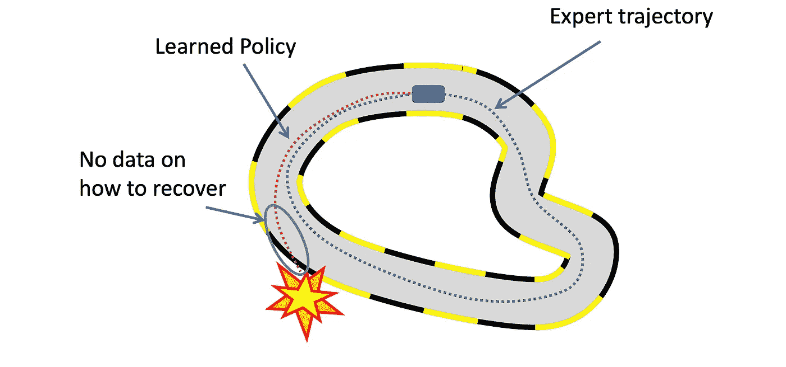

# 谨慎模仿:线下和线上模仿

> 原文：<https://medium.com/analytics-vidhya/imitate-with-caution-offline-and-online-imitation-ee20de054fdb?source=collection_archive---------2----------------------->

## 行为克隆，数据聚合方法:匕首。

[来源](https://www.indiatvnews.com/trending/offbeat-dog-perfectly-mimics-owner-doing-yoga-adorable-video-breaks-the-internet-705813)

# 什么是模仿学习？

正如它本身所表明的，几乎所有的物种包括人类都通过模仿学习，也可以随机应变。一句话就是进化。同样，我们可以让机器模仿我们，向人类专家学习。自动驾驶就是一个很好的例子:我们可以让一个代理从数以百万计的司机演示中学习，并模仿专家司机。

这种从示范中学习也称为模仿学习(IL ),是强化学习和人工智能中的一个新兴领域。人工智能在机器人学中的应用无处不在，机器人可以通过分析人类管理者执行的策略演示来学习策略。

***专家缺席 vs 在场:*** 模仿学习采取两个方向，以专家是否在训练期间缺席或专家是否在场来纠正代理的动作为条件。先说专家不在的第一种情况。

# 培训期间专家缺席

专家缺席基本上意味着代理只能观看专家演示，仅此而已。在这些“专家不在”的任务中，代理试图使用专家演示的固定训练集(状态-动作对),以便学习一个策略并实现一个与专家尽可能相似的动作。这些“专家缺席”任务也可以被称为离线模仿学习任务。

这个问题可以被框架化为通过分类的监督学习。专家演示包含许多训练轨迹，每个轨迹包括一系列观察和一系列由专家执行的动作。这些训练轨迹是固定的，不受代理策略的影响，这种“专家缺席”任务也可以称为离线模仿学习任务。

这个学习问题可以公式化为一个监督学习问题，其中可以通过解决一个简单的监督学习问题来获得一个策略:我们可以简单地训练一个监督学习模型，该模型直接将状态映射到动作，以通过专家的演示来模仿专家。我们称这种方法为“行为克隆”。

由作者生成

现在我们需要一个替代损失函数，它量化了被证明的行为和被学习的政策之间的差异。我们使用最大期望对数似然函数来计算损失。

L2 误差～最大化对数似然

如果我们要解决一个分类问题，我们选择交叉熵，如果是回归问题，我们选择 L2 损失。显而易见，最小化 l2 损失函数相当于最大化高斯分布下的期望对数似然。

# 挑战

参考文献[1]

到目前为止，一切看起来都很好，但是行为克隆的一个重要缺点是一般化。专家只是收集了代理可以经历的无限可能状态的子集。一个简单的例子是，专业汽车驾驶员不会通过偏离路线来收集不安全和有风险的状态，但代理可能会遇到这样的风险状态，因为没有数据，所以它可能没有学会纠正措施。这是因为“**协变量移位**”这是一个已知的挑战，其中在训练期间遇到的状态不同于在测试期间遇到的状态，降低了鲁棒性和通用性。

解决这种“协方差转移”问题的一种方法是收集更多风险状态的演示，这可能会非常昂贵。培训期间的专家在场可以帮助我们解决这个问题，并弥合演示策略和代理策略之间的差距。

# 专家在场:在线学习

本节我们将介绍最著名的在线模仿学习算法 ***数据聚合方法:DAGGER。*** 这种方法对于缩小训练时遇到的状态和测试时遇到的状态之间的差距非常有效，即“**协变量移位**”。

如果专家在学习过程中评估学习者的策略会怎样？专家为来自学习者自身行为的例子提供正确的行动。这正是 DAgger 试图实现的目标。DAgger 的主要优势是专家教学习者如何从过去的错误中恢复过来。

步骤很简单，类似于行为克隆，除了我们根据代理到目前为止所学的知识收集更多的轨迹

1.该策略通过专家示范 D 的行为克隆来初始化，产生策略π1
2。代理使用π1 并与环境交互，以生成包含轨迹
3 的新数据集 D1。D1:我们将新生成的数据集 D1 添加到专家演示中。新演示 D 用于训练策略π2…..

为了利用专家的存在，使用专家和学习者的混合来查询环境和收集数据集。因此，DAGGER 从由学习到的策略诱导的状态分布下的专家演示中学习策略。如果我们设置β=0，在这种情况下，这意味着期间的所有轨迹都是从学习者代理生成的。

## 算法:

DAgger 缓解了**“协方差移位”**的问题(学习者策略诱导的状态分布与初始演示数据中的状态分布不同)。这种方法大大减少了获得令人满意的性能所需的训练数据集的大小。

# 结论

DAgger 在机器人控制方面取得了非凡的成功，也被应用于控制无人机。由于学习者会遇到专家没有演示如何行动的各种状态，因此 DAGGER 等在线学习方法在这些应用中是必不可少的。

在本系列的下一篇博客中，我们将了解 DAgger 算法的缺点，重要的是，我们将强调 DAgger 算法的安全性。

