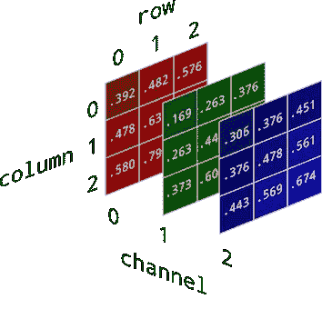
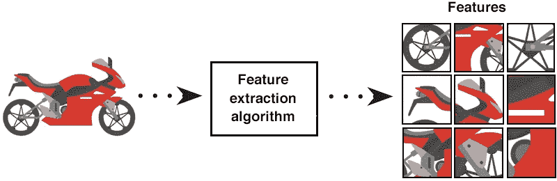
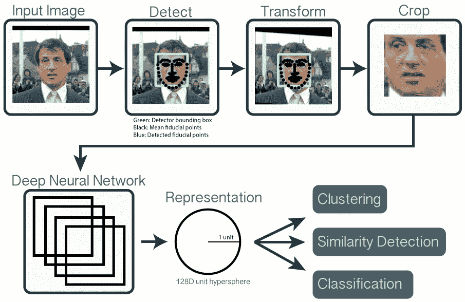
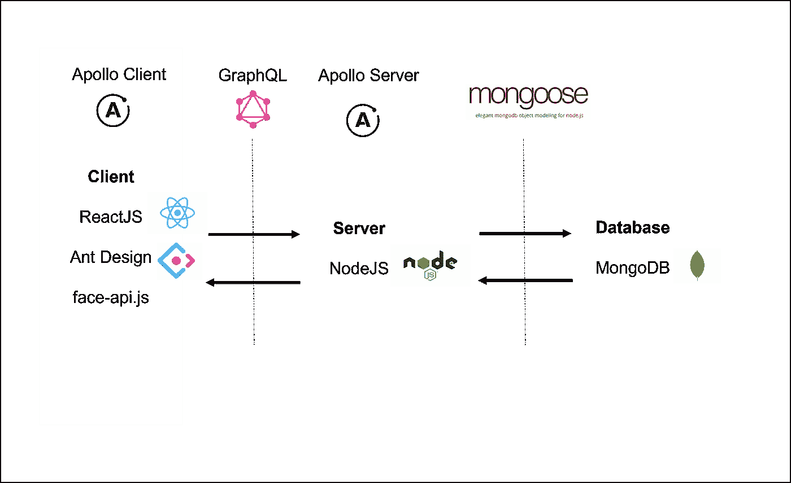

# 用 face-api.js 实现人脸识别考勤系统—第一部分

> 原文：<https://medium.com/analytics-vidhya/implement-a-face-recognition-attendance-system-with-face-api-js-part-i-2d16f32cfe47?source=collection_archive---------4----------------------->

听说过 [**face-api.js**](https://github.com/justadudewhohacks/face-api.js/) 吗？它是一个 Javascript 人脸识别库，使用最先进的深度学习算法，并提供高级 API 来执行诸如年龄预测、性别预测、人脸表情预测、人脸检测、面部标志检测和人脸识别等任务。

# 入门指南

在深入实施之前，让我先概述一下人脸识别过程。基本上，人脸识别包括两个过程:人脸注册和人脸匹配。

1.  面部注册是将面部特征存储到文件系统或数据库中的过程。
2.  人脸匹配是使用分类器或距离度量算法将检测到的特征与数据集中的其他现有特征之间的人脸进行匹配的过程。

# 特征是什么意思？

如果你从来没有任何图像处理、机器学习或深度学习的经验，这有点让人困惑。

想象你有一张彩色照片，它是如何被翻译成数字形式并显示在我们的计算机上的？在色彩模型中，我们有二进制、灰度、RGB、HSV、CMYK 等。从这些颜色模型中，我认为 RGB 是我们最常听到的。3 个通道(红、绿、蓝)的 It 组件。每个通道都是 8 位(0–255)，对于 RGB 颜色模型，总计为 24 位。数字图像中的每个像素都标有每个通道的亮度级别的数字表示(0–255)。

来源:[https://scyllarus . data 61 . CSIRO . au/about/hyperspectral-imaging/](https://scyllarus.data61.csiro.au/about/hyperspectral-imaging/)

数字图像可视化

好了，现在你知道数字图像的属性了。那么，我们如何从这些图像中获取特征呢？

来源:[https://www . educative . io/edpresso/what-is-feature-extraction](https://www.educative.io/edpresso/what-is-feature-extraction)

看上图，想象你要在一幅图像中检测摩托车，能不能根据每个通道像素强度的相似性差异，直接在测试图像和数据集图像之间进行匹配？嗯，如果我们用相同的图像进行测试，这似乎是可行的，但是，当用不同的图像集进行测试时，这并不是一个完美的解决方案。我们生活在三维空间，但我们的视觉却被困在 2D 空间。由于方位、尺寸、分辨率等关系很大，所以执行这种检测是一种复杂的问题。这就是为什么我们需要执行特征提取来从图像中生成**特征表示**。最后，我们可以将这些特征值与数据集中的其他特征值进行匹配。

# 人脸识别概述

回到我们的主题，为了执行人脸识别，首先我们必须执行一个检测算法来找到人脸的位置。接下来，在进行特征提取之前，检测到的人脸需要正确对齐。下一步是从原始图像中裁剪出感兴趣区域(ROI)或人脸区域。然后，应用特征提取来生成特征数据或特征向量表示。最后，应用诸如欧几里德距离或任何分类器之类的匹配算法来寻找检测到的特征和我们的数据集中的特征之间的相似性的最短差异。

来源:https://cmusatyalab.github.io/openface/

# 技术堆栈的简单概述

技术栈

在这个应用程序中，我使用了如上所示的一系列 web 技术。总体架构是客户机-服务器，并链接到 MongoDB。客户端将执行人脸识别的所有过程，如人脸检测、面部标志检测、特征提取和特征匹配。提取的特征被发送到服务器并存储到数据库中。在匹配过程中，所有的特征向量被相应地提取以与检测到的特征向量相匹配。

这部分到此为止。敬请期待下集:[用 face-api.js 实现人脸识别考勤系统——第二部分](/@cheahwen1997/implement-a-face-recognition-attendance-system-with-face-api-js-part-ii-4854639ee4c7)。