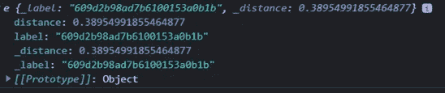
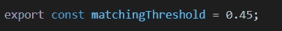
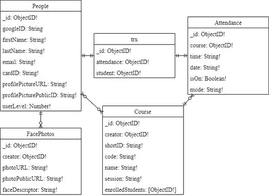

# 用 face-api.js 实现人脸识别考勤系统—第二部分

> 原文：<https://medium.com/analytics-vidhya/implement-a-face-recognition-attendance-system-with-face-api-js-part-ii-4854639ee4c7?source=collection_archive---------3----------------------->

这一集基本上是关于系统的需求和设计。在这一集中，我将简要介绍 face-api.js 中所需的预训练模型、特征向量和系统设计概述。这是[用 face-api.js 实现人脸识别考勤系统的下一部分——第一部分](/@cheahwen1997/implement-a-face-recognition-attendance-system-with-face-api-js-part-i-2d16f32cfe47)。

# 人脸识别所需的深度学习预训练模型 face-api.js

在 face-api 存储库中，有一个名为“weights”的文件夹，其中包含大量预训练模型的权重文件。如前所述，人脸识别的过程包括人脸检测、人脸对齐、特征提取和特征匹配。因此，我们需要 3 个基本的预训练模型来执行任务，如人脸检测、面部标志检测和特征提取。

在人脸检测方面，API 提供了三种人脸检测预训练模型，分别是 MTCNN、SSD MobileNet V1 和 Tiny Face。在这些型号中，我更喜欢 SSD MobileNet V1，因为它比其他型号更强大、更准确。

总共有 8 个所需的权重文件以及相应的所需元数据文件。每个模型都被量化到小于 10 MB 的大小，以提高识别速度。

来源:[https://github . com/justadudewhohacks/face-API . js/tree/master/weights](https://github.com/justadudewhohacks/face-api.js/tree/master/weights)

**人脸检测权重&元数据**

*   *SSD _ mobilenetv1 _ model-shard 1*
*   *SSD _ mobilenetv1 _ model-shard 2*
*   *SSD _ mobilenetv1 _ model-weights _ manifest . JSON*

**面部标志检测权重&元数据**

*   face _ landmark _ 68 _ tiny _ model-shard 1
*   face _ landmark _ 68 _ tiny _ model-weights _ manifest . JSON

**特征提取模型权重&元数据**

*   人脸识别模型 shard1
*   人脸识别 _ 模型-shard2
*   face _ recognition _ model-weights _ manifest . JSON

预训练模型的描述

# 特征向量

在上一集，你还记得我们讨论过什么是正确的功能吗？现在，让我们来谈谈什么是特征向量。为了识别人脸，我们必须对预处理后的人脸区域(裁剪后的&对齐的人脸 ROI)执行特征提取(**降维**)。特征提取后我们得到了什么？是的，它是一系列描述面部特征的数字表示或所谓的特征向量。根据我对研究论文和 API 的调查，面部特征向量有一些替代名称，所以我列出如下。

**面部特征向量的替代名称**

*   面部嵌入
*   面部描述符
*   面孔编码

如果你查阅著名的研究论文，如 [FaceNet](https://arxiv.org/pdf/1503.03832.pdf) 和 [DeepFace](https://www.cs.toronto.edu/~ranzato/publications/taigman_cvpr14.pdf) ，你经常会注意到带有特定维度(128、512、1024、4096 等)的术语**表示**。

DeepFace 的架构(来源:[https://www . cs . Toronto . edu/~ ranz ATO/publications/taigman _ cvpr 14 . pdf](https://www.cs.toronto.edu/~ranzato/publications/taigman_cvpr14.pdf))

FaceNet 的架构(来源:[https://arxiv.org/pdf/1503.03832.pdf](https://arxiv.org/pdf/1503.03832.pdf)[)](https://arxiv.org/pdf/1503.03832.pdf)

根据 face-api.js 提供的文档，api 函数中使用了术语“面部描述符”,它指的是特征向量。特征提取模型是类似 ResNet-34 的体系结构，它将返回 128D 特征向量，这模仿了 FaceNet 的体系结构。

face-api.js 中的特征提取模型文档(来源:[https://github.com/justadudewhohacks/face-api.js/](https://github.com/justadudewhohacks/face-api.js/)

让我们看看特征向量的例子。下面显示了使用人脸图像进行测试时从 API 返回的特征向量。从返回值可以看出，具有 Float32Array 数据类型的**归一化特征向量**共有 128 个值。

特征向量

这是关于特征向量的。这些特征向量是实现人脸识别的关键要素。为了简化工作，我更喜欢将特征向量存储为字符串而不是数组类型。

**在面部注册期间存储特征向量**

*   我们将把这些特征向量存储到我们的数据库中，从 Float32Array 到 string 数据类型。

**人脸匹配时提取特征向量**

*   我们将从数据库中获取这些特征向量，将它们从 string 转换回 Float32Array 数据类型。

**使用欧几里德距离的特征向量之间的相似性比较(L2)**

*   对于匹配过程，API 应用欧几里德距离来测量检测到的特征向量与我们的数据集中的特征向量之间的相似性差异。将确定匹配阈值以在肯定和否定类别之间进行分类。为了抑制假阳性(系统在数据集中用错误的人识别检测到的人脸的情况)，我使用了相对严格的匹配阈值(0.45)。如果你想得到更多的识别结果，你可以根据你的用例在 0.45-0.6 之间调整匹配阈值。

欧几里德距离公式

返回带有 Face ID/标签的最短距离

匹配阈值(具有低于匹配阈值的最短距离的人脸将被标记为相应的 Face ID，否则该人脸将被视为“未知”)

# 系统设计概述

对于考勤系统，我侧重于为教育机构/学院/大学设计。在考勤系统中，有两个用户角色:讲师和学生。讲师可以添加课程、查看课程信息、创建考勤、更改考勤系统、加入考勤室(发生人脸匹配)和查看考勤报告。学生可以注册课程，查看课程信息，上传面部图像(面部注册发生)，加入考勤室和查看考勤报告。

用例图

**基本要求**

1.  出席表格
2.  带时间戳显示的考勤交易(记录最早时间戳)
3.  启用/停用考勤交易
4.  考勤报告

**系统架构**

该系统是一个客户端-服务器架构，包含人脸注册模块、人脸匹配模块、用户模块、考勤模块和课程模块。每个模块都由服务器中的解析器支持，以处理相应的 GraphQL 请求查询。

系统结构

**数据库设计**

总共有 5 个集合，分别是“人物”、“脸照”、“课程”、“考勤”、“Trx”。

诱发反应测定器

# 摘要

这一集差不多就是这样。我们分析了所需的预训练模型、特征向量、需求以及系统设计。在下一集，我们将开始研究编码和实现。