# 用 face-api.js 实现人脸识别考勤系统—第三部分

> 原文：<https://medium.com/analytics-vidhya/implement-a-face-recognition-attendance-system-with-face-api-js-part-iii-4ed3ffc49479?source=collection_archive---------0----------------------->

这是关于代码实现的最后一集，上接[用 face-api.js 实现人脸识别考勤系统—第二部分](/analytics-vidhya/implement-a-face-recognition-attendance-system-with-face-api-js-part-ii-4854639ee4c7)。对于这个应用程序，我将其命名为“Attendlytical ”,这是我从随机标题生成软件中选择的。由于代码复杂，我将主要关注人脸识别过程，而不是应用程序的整体功能。

我们开始吧！

# 数据库管理

首先，请到 https://www.mongodb.com/[注册一个自由层账户，然后创建数据库集群。](https://www.mongodb.com/)

MongoDB 是一个非关系数据库，它以基于文档/类似 JSON 的结构管理数据。在数据库中，我们可以根据需要创建多个集合(在 SQL 中称为表)。

我创建了一个名为“Attendlytical”的集群，如下所示。我们不需要在这里创建集合，因为数据库会自动为我们创建集合。

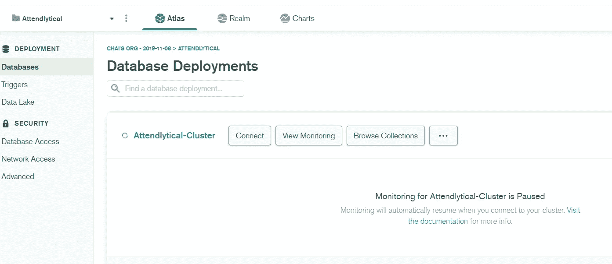

MongoDB 集群—attended lytical

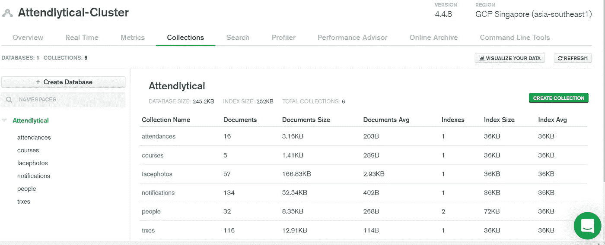

MongoDB 集合示例

# 代码实现

首先，我们需要一个依赖管理器，如 NPM，纱等(我用 NPM)。打开终端，然后使用命令“npx create-react-app client”创建 ReactJS 项目，然后使用“npm i face-api.js”安装 api。

## **人脸识别实用功能准备**

所有选定的预训练模型都需要放在文件夹“public/models”中。

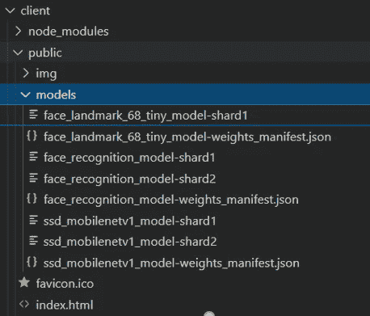

下载的预训练模型模型

在“client/src/faceUtil/index.js”中，有一个函数`loadModels()`加载所有带参考路径的模型。模型文件或元数据文件**的名称不能** **更改**，因为 API 将匹配文件名并相应地加载模型。

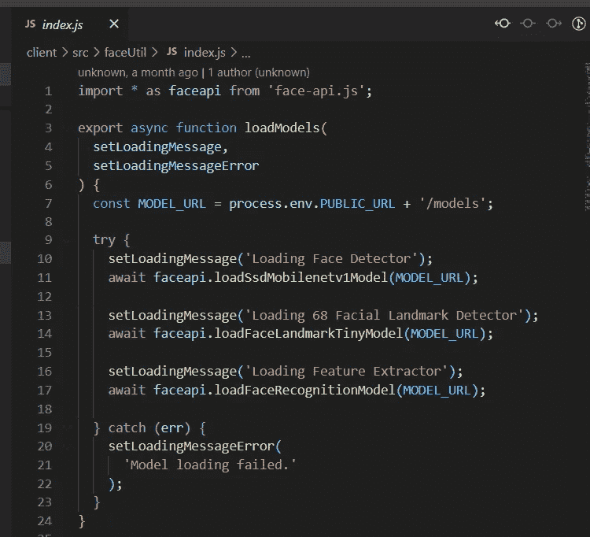

加载模型

为了确定模型是否已经被加载，我们可以从如下所示的 API 中检查参数变量是否被定义或为空值。

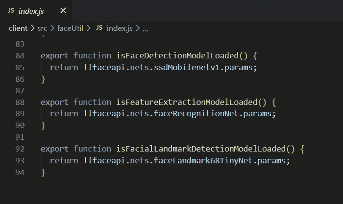

检查加载的模型参数

对于图像采集，使用`faceapi.fetchImage(blob)`函数将图像数据传入 API。

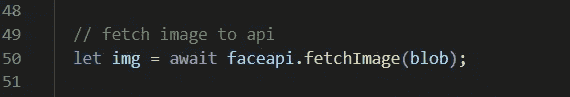

图象采集

> ***设置 SsdMobilenetv1 选项进行人脸检测***

对于人脸检测任务，我们需要设置一个分数阈值来确定正负类之间的关系。人脸检测的得分阈值越高，检测越严格，结果越少，反之亦然。

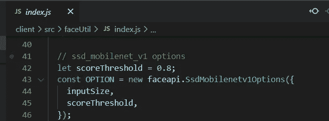

人脸检测 SSDMobileNetV1 选项

> ***创建一个函数取图像源，并将其转换成 128 个特征向量***

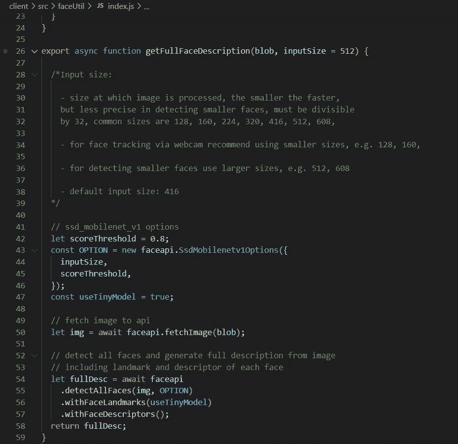

获取完整描述函数

**总体步骤**:`faceapi.fetchImage(blob)`->-

## 人脸注册模块的实现

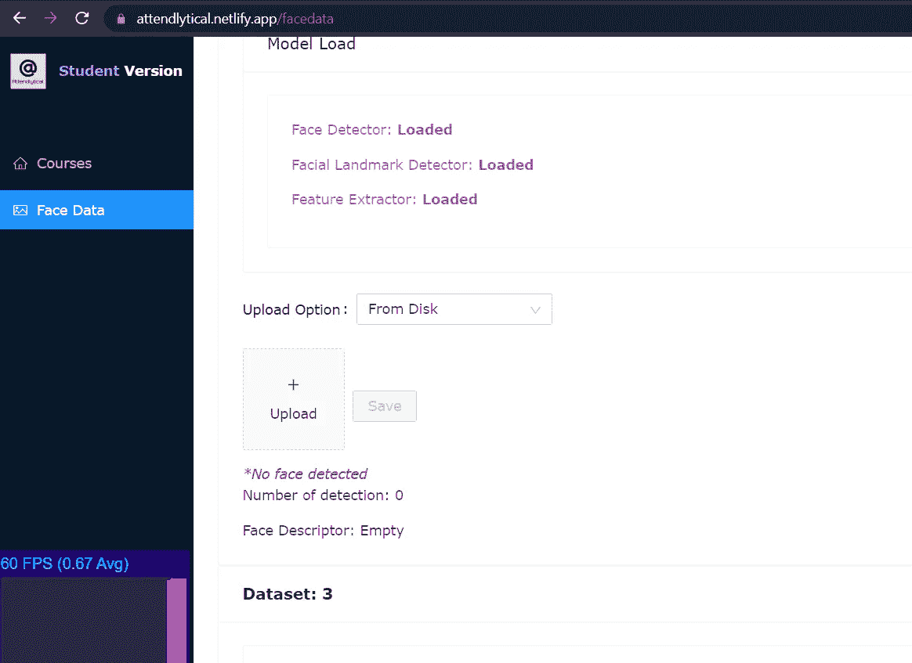

人脸注册界面(学生版>人脸数据部分)

对于面部注册模块，我为用户增加了 2 个选项(从网络摄像头/从磁盘上传)。为简单起见，我将只解释从网络摄像头上传选项，因为每个过程是相同的。

首先，我们需要导入`react-webcam`来帮助我们从网络摄像头中获取视频帧。

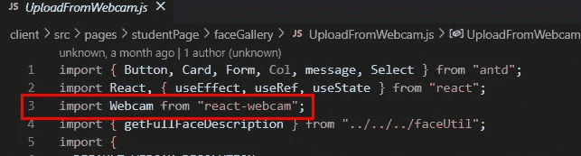

导入 React 网络摄像头

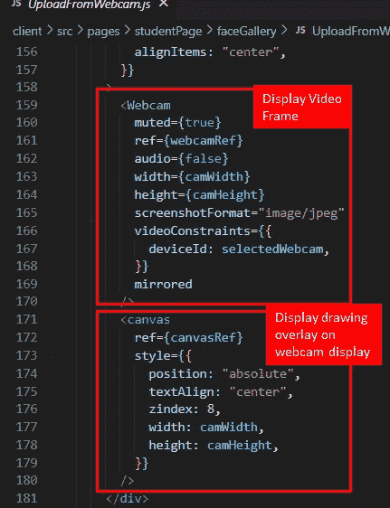

网络摄像头显示屏

`React.useEffect(callback, [dependencies])`是在检测到通过相关状态的一些变化后，在循环中运行的函数。

我们使用`React.useRef()`从所选的网络摄像头中进行了引用。`webcam.current.getScreenshot()`将返回当前帧的 BLOB 值。然后，我们使用创建的人脸识别效用函数`getFullDescriptions`来获得特征向量。如果第一手没有检测到面部，则不会生成任何特征向量。

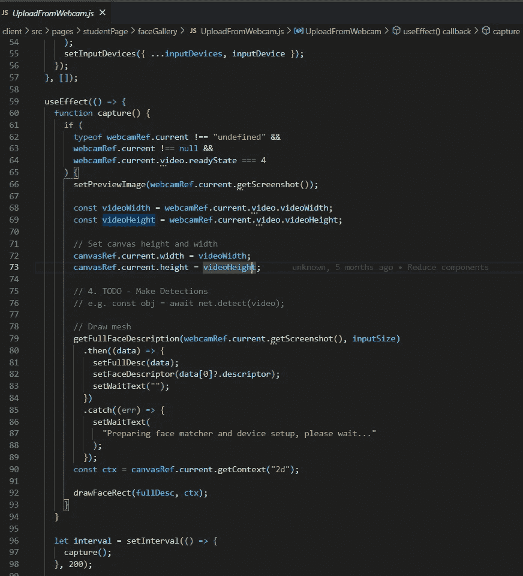

从网络摄像头获取视频帧的整体功能

对于这种情况，我们为每 0.2 秒更新一次视频帧的 useEffect()设置了无限循环。

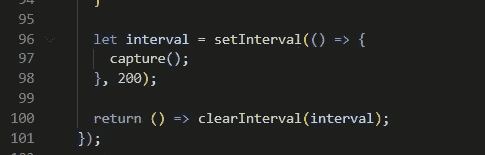

每 0.2 秒更新检索到的视频帧

检索到视频帧后，用户可以将数据提交给服务器。为此，我们将使用来自 Apollo React Hooks 的`useMutation`。

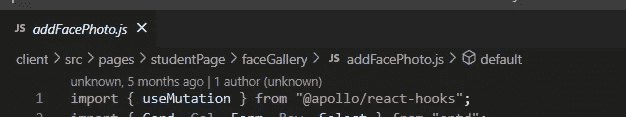

导入使用突变函数来运行 GraphQL 查询

与 REST API 不同，GraphQL 只有 POST 请求。因此，每个操作都需要发送查询供服务器处理。

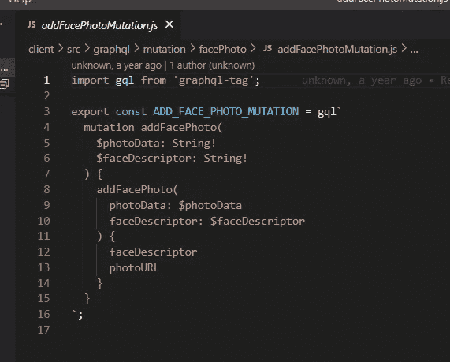

添加人脸照片突变查询

然后，查询被传递给`useMutation()`函数。`addFacePhotoCallback()`是点击提交按钮时调用的函数。

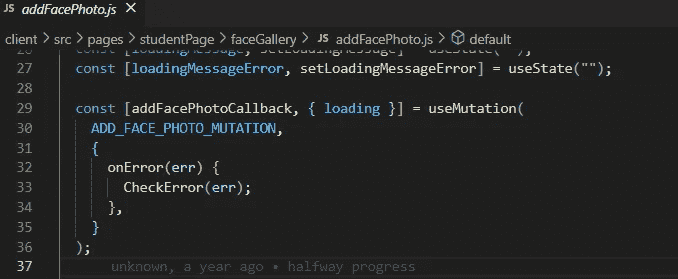

GraphQL 变异函数

由于特征向量是 Float32Array 数据类型，我们需要将它转换成字符串保存到数据库中，以便于读取。成功上传后，将显示“添加面部照片成功”的消息，并刷新数据集图库。

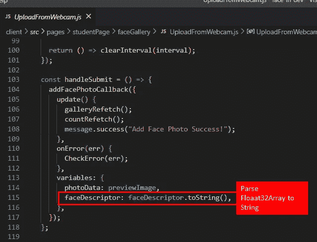

触发添加照片突变的回调函数的函数

> ***大图人脸注册处理***

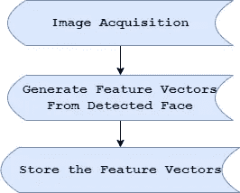

人脸注册步骤

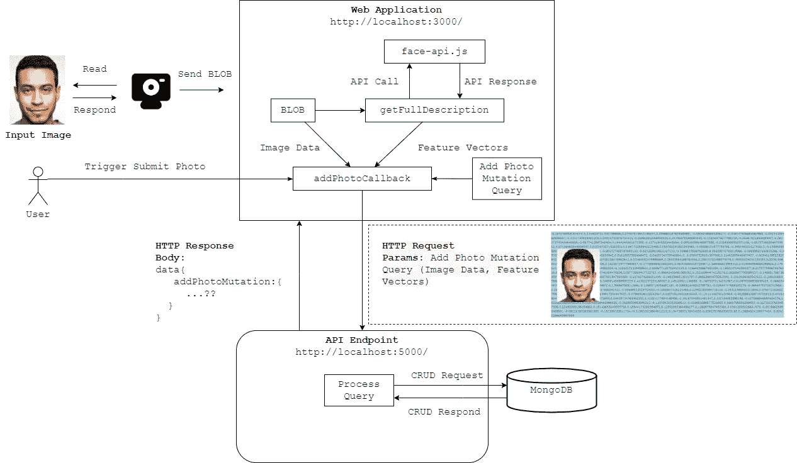

面部注册过程的大图

## 人脸匹配模块的实现

> ***人脸匹配选项***

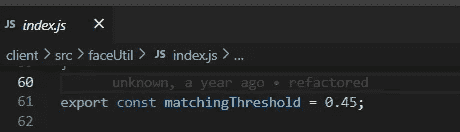

请参考“client/src/faceUtil/index.js”第 61 行，有一个名为匹配阈值的变量。我将阈值设置为 0.45，正如上一集所解释的那样，这是一个非常严格的阈值，您可以通过反复试验来找到适合您需求的阈值。

**确定阈值的两种可能情况:**

a.阈值越高，获得的结果越多，但是如果阈值太松(> 0.6)，对于未知数据集，可能容易出现**假阳性情况。**

b.阈值越低，获得的结果越少，但是如果阈值太严格(< 0.3)，则对于已知数据集可能倾向于**假阴性情况。**

当数据被提取到客户端时，我们需要将 person 的每个特征向量字符串转换为 Float32Array 数据类型。`faceapi.LabelFaceDescriptors (Face_ID, List_of_Feature_Vectors)`用于传递给`faceapi.FaceMatcher(labelledDescriptors, matching_threshold)`以使用欧几里德距离(L2)算法找到最佳匹配。

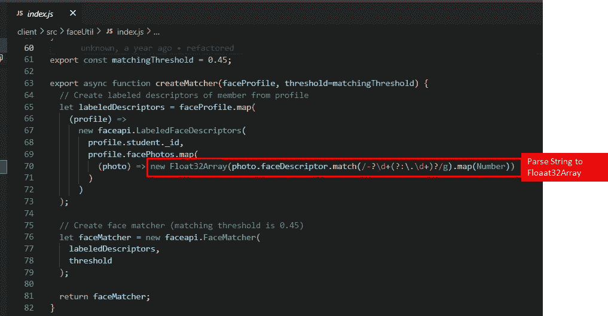

人脸匹配功能

> ***人脸匹配流程***

首先，我们需要使用查询从服务器获取课程中所有参与者的面部数据集。

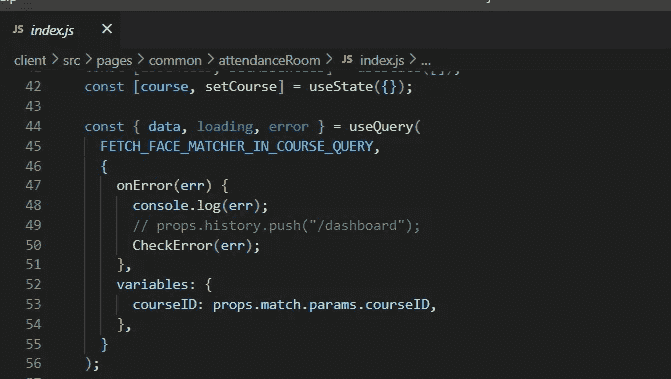

获取数据集

获取数据集的相应查询如下所示。

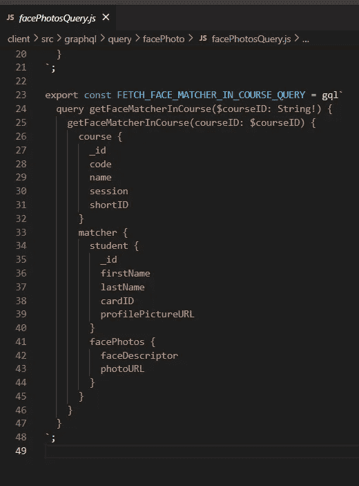

正在提取数据集查询

然后，与人脸注册一样，我们需要使用网络摄像头从视频帧中检测人脸以生成 128D 特征向量。每个特征向量都被传递给`drawRectAndLabelFace(detected_feature_vectors_list, face_matcher, participant_list_full_information, context)`。神奇的事情发生在`faceapi.FaceMatcher(labelledDescriptor, threshold).**findBestMatch(detector_feature_vectors)**`中，用 L2 距离最近的学生的名字和学号在脸上做标记。

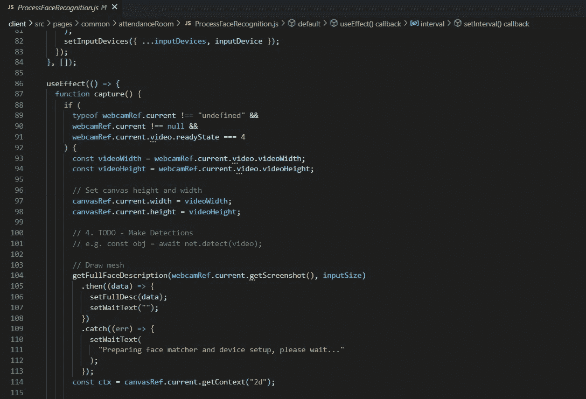

每 0.2 秒检测和识别一次面部循环功能

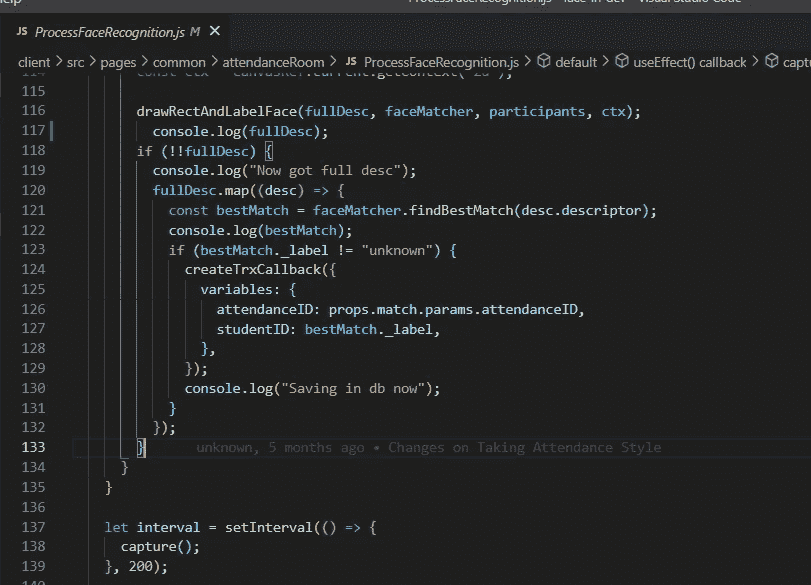

`Trigger drawing function and saving the transaction of the recognized face into database`

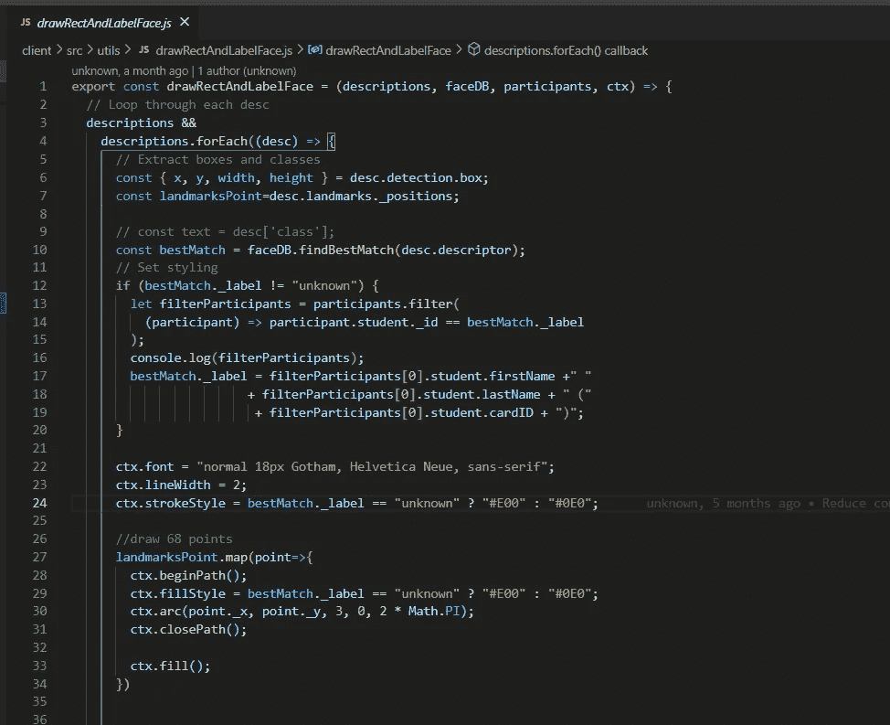

绘制并标记已识别的人脸

> ***将考勤交易(trx)存入数据库***

现在，我们已经标记了被认可的学生，下一步我们需要将事务存储到数据库中。如果检测到的标签不是“未知”的情况，我们希望使用`createTrxCallback()`将相应的出勤 ID 和学生 ID 存储到数据库中，并使用 2 个变量将数据传递给服务器。

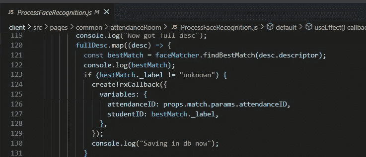

创建事务处理回调

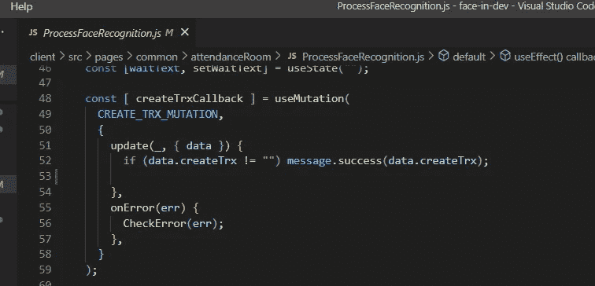

创建事务变异

相应的创建 trx 突变查询如下所示。

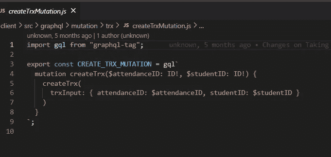

创建事务处理变异查询

> ***大图人脸匹配流程***

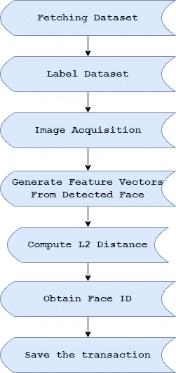

人脸匹配步骤

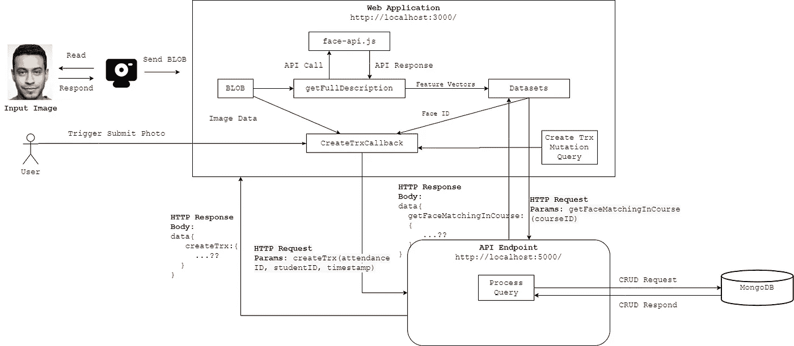

人脸匹配模块大图

# 用户界面

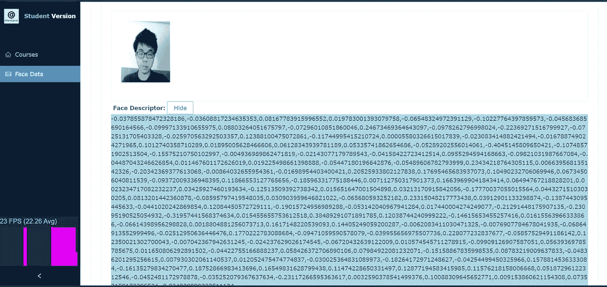

面部数据页面(面部注册)

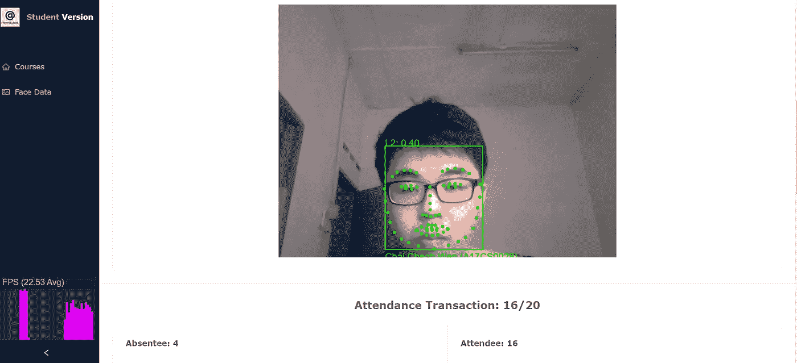

考勤室页面(人脸匹配)

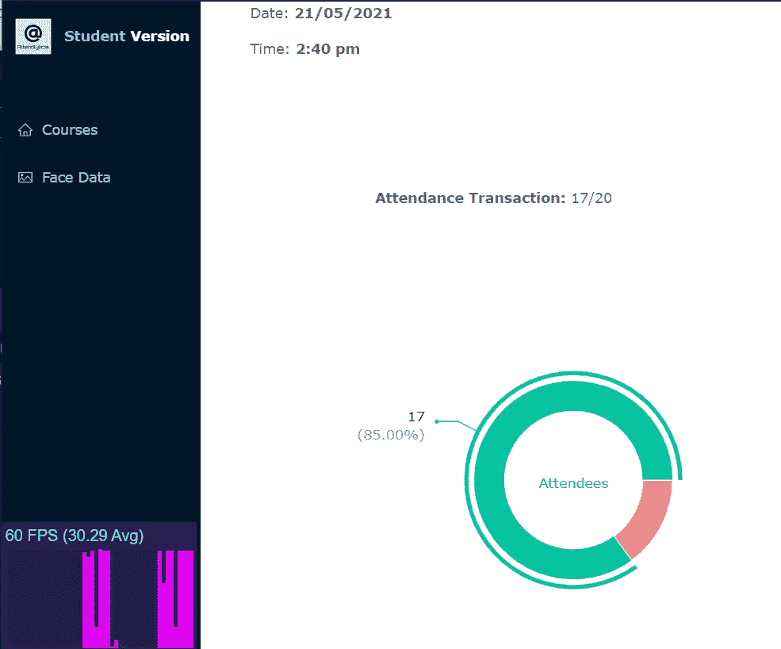

考勤记录

# 结论

我想我已经介绍了很多实现方法，代码相当混乱，因为系统中涉及了很多模块。因此，我将更多地关注人脸识别，并解释人脸注册和人脸匹配的简化流程。

请看一下我的 Github 库:[https://github.com/CodeShareCW/Attendlytical](https://github.com/CodeShareCW/Attendlytical)代码参考。

另外，如果你对整个系统感兴趣，请看看 https://attendlytical.netlify.app/[的应用程序。](https://attendlytical.netlify.app/)