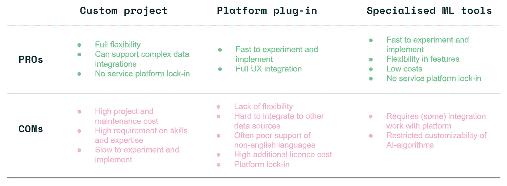

# 在服务中心实施人工智能驱动的票证分类，而无需倾家荡产

> 原文：<https://medium.com/analytics-vidhya/implement-ai-driven-ticket-triage-in-the-service-centre-without-breaking-the-bank-a3dd69b33aea?source=collection_archive---------14----------------------->

## 一个实际的案例研究，探索票证分类实施选项和使用 Aito.ai 平台的实际机器学习实施。


克里斯汀·沃克在 [Unsplash](https://unsplash.com/@kwook?utm_source=unsplash&utm_medium=referral&utm_content=creditCopyText) 上拍摄的照片

服务中心是自动化的成熟场所，有可学习的示范结果和大量可帮助起步的资源。自动化的好处在客户服务团队、IT 支持以及任何基于传入票证或服务请求的工作中显而易见。

首先也是最重要的一点是，客户的满意度和忠诚度会随着更快的响应而提高。同时，通过去除重复的和机器一样的任务，团队成员的工作可以变得更有意义而不那么枯燥。有动力的团队，更好的结果。第三，自动化推动了可伸缩性，因为团队能够满足不断增长的客户/用户群的需求，而无需线性增加资源需求。

分类的基本原则是查看收到的新票据，并为其分配正确的**类别**、**紧急度**和**其他信息**，这些信息对于正确的代理快速有效地处理票据至关重要。

## 实施选项

假设你已经决定从完全手动的分诊转移到基于机器学习的解决方案，有多种方法可以实现这些结果，每种方法都有利弊。可供选择的主要方法有:

*   *定制数据科学项目。* 雇佣一个团队，该团队将使用最先进的 ML 工具和性能最佳的算法为您量身定制解决方案。
*   *使用票务平台提供的插件。今天，大多数企业服务平台通过插件支持一些机器学习功能，但通常只在最高许可层可用。*
*   使用专门的 ML 工具完成工作。
    作为上述两种选择之间的中间地带，众多的机器学习工具可以与大多数服务平台集成，并以很高的价格提供灵活性。

下表列出了上述每个选项的主要优缺点。



不同实施方案的利弊比较(作者自己的工作)

根据我的经验，有一个基本问题是什么是优先的:灵活性与成本和速度。

如果您想要的不仅仅是一个服务中心解决方案，并且希望集成负载而不是票务分流(成本不是问题)，也许您可以雇佣一个数据科学团队来构建为您量身定制的工具。这里的好处还在于，你可以独立于具有你的人工智能特征的服务平台，并且如果你以后选择，可以将它们带到其他平台。

如果你希望花费尽可能少的时间，并且对你的平台提供商提供的工具的限制感到满意(例如，在语言和特性方面)，那么就使用平台提供的插件。但要做好涨价的准备。例如， [ServiceNow、](https://www.servicenow.com/)的人工智能功能在较高的定价层可用，已知每个代理的额外成本在+50%的范围内。在 [Freshdesk](https://freshdesk.com/pricing) 中，你需要处于最高定价层，即价格比前一层上涨 100%。

如果您手头有一些开发资源，并且想要一个快速灵活的解决方案，并且能够更好地控制成本，那么可以看看市场上的 ML 工具。你还将保留你的人工智能作品的可移植性，而不是被绑定到今天使用的服务平台。

这篇文章的其余部分深入探讨了如何使用 [Aito.ai](https://aito.ai/) 在 IT 服务台实现票证分类，这是一款面向自动化工程师的简单而强大的 ML 工具。

这个案例是与在 [Futurice](https://futurice.com/) 的朋友一起开发的，使用他们来自 [FreshDesk](https://freshdesk.com/eu/) 的 IT 服务单数据作为例子(个人数据自然是隐藏的)。案例只看机器学习特征，以保持合理长度。有大量的[资源](https://developers.freshdesk.com/v2/docs/sample-apps/)可用于与 Freshdesk 集成，甚至一些自动化平台如 [Zapier](https://zapier.com/apps/freshdesk/integrations) 也可以完成这项工作。

## 用 Aito.ai 在 Futurice 进行票务分类

没有唯一正确的方法来做分流。相反，如果你开始定义你的目标，然后才考虑实现目标所需的步骤，那将是最好的。下面的例子代表了 Futurice IT support 采取的步骤，在 Futurice IT support 中，票证数量随着业务的蓬勃发展而增长，因此是时候采取机器学习辅助票证分类的第一步了。

> 通过利用组织知识帮助人们成功是我们的关键价值杠杆。
> 
> —Tuomas syrjnen，数据与人工智能，Futurice 联合创始人

首先进行准备工作。历史门票从 FreshDesk 导出并上传到 UI 中的 [Aito.ai。此外，新的票证会定期导出并添加到 Aito 的数据集中，以保持训练数据的新鲜。Aito 不需要任何额外的步骤，如模型重新训练或部署，但总是基于当前数据的“新鲜”。](https://console.aito.ai/account/authentication)

**首先，根据 FreshDesk 中已经定义的结构对门票进行分类和子分类**。以前，这项工作是手动的，这意味着每张票据都有一个代理联系人进行分类。分类有助于将票据分配到正确的位置、监控和规划流程的改进。对于每个传入的票证，都有一个对 Aito 的[查询，以预测具有置信度值的类别。](https://aito.document360.io/docs/how-to-create-an-aito-query)

```
query = {
    "from": TABLENAME,
    "where": {
        "subject": "Laptop issues",
        "requesterId": "XXXXXXXXXXX",
        "sourceName": "Portal",
        "description": "My computer is restarting at random intervals, even after updates. I think it often happens with sleep mode. What could we try to solve this?"
    },
    "predict": "category",
    "limit": 2
}
```

上述查询为我们获得了该类别的两个最佳预测。

```
{
  "hits": [
    {
 **"$p": 0.739823420970263,
      "feature": "Hardware",
      "field": "category"**
    },
    {
      "$p": 0.06230314322171832,
      "feature": "Mobile Budget",
      "field": "category"
    }
  ],
  "offset": 0,
  "total": 19
}
```

当知道我们有可能(超过 70%的把握)处理与硬件相关的请求时，我们仍然可以进行另一个查询，看看我们是否可以将它分配到一个子类别。查询看起来很熟悉，但是在开始时使用了额外的 from-where 块，将训练数据限制在该类别的票据中。

```
query = {
    "from": {
        "from": TABLENAME,
        "where": { 
            "category": "Hardware" 
        }
    },
    "where": {
        "subject": "Laptop issues",
        "category": "Hardware",
        "requesterId": "XXXXXXXXXXX",
        "sourceName": "Portal",
        "description": "My computer is restarting at random intervals, even after updates. I think it often happens with sleep mode. What could we try to solve this?"
    },
    "predict": "sub-category",
    "limit": 2
}
```

同样，结果给了我们最可能的子类别。它是计算机相关的，可以自信地把这些类别写回票数据。

```
{
  "hits": [
    {
 **"$p": 0.962468610758821,
      "feature": "Computer",
      "field": "sub-category"**
    },
    {
      "$p": 0.024520328466996626,
      "feature": "non-categorised",
      "field": "sub-category"
    }
  ],
  "offset": 0,
  "total": 5
}
```

**其次，我们根据团队中使用的三级紧急程度(1、2、3)来预测票据的紧急程度**。你得到了这个；看看这个查询看起来有多相似，只是有一些变化！:)

```
query = {
    "from": TABLENAME,
    "where": {
        "subject": "Laptop issues",
        "requesterId": "XXXXXXXXXXX",
        "sourceName": "Portal",
        "category": "Hardware",
        "sub-category": "Computer",
        "description": "My computer is restarting at random intervals, even after updates. I think it often happens with sleep mode. What could we try to solve this?"
    },
    "predict": "urgency",
    "limit": 2
}
```

回复给出了最可能的紧急情况，这也很容易写回 FreshDesk 平台，以帮助代理确定其工作的优先级。

```
{
  "hits": [
    {
 **"$p": 0.8908651665320588,
      "feature": "2",
      "field": "urgency"**
    },
    {
      "$p": 0.09132182836330256,
      "feature": "1",
      "field": "urgency"
    }
  ],
  "offset": 0,
  "total": 3
}
```

**第三，我们将寻找过去类似的案例**以及对它们的反应。有许多方法可以进一步发展这一点！例如，如果您的小组在回复请求时使用宏，而不是查找与以前的回复相匹配的宏，您可以查找用于请求的最佳宏，并帮助代理自动完成更多的工作。

团队中还没有使用宏。因此，我们查看了对类似请求的前 3 个宝贵响应，并将它们联系起来，以使代理受益。查询是这样的:

```
query = {
    "from": TABLENAME,
    "where": {
        "subject": "Laptop issues",
        "requesterId": "XXXXXXXXXXX",
        "sourceName": "Portal",
        "category": "Hardware",
        "sub-category": "Computer",
        "description": "My computer is restarting at random intervals, even after updates. I think it often happens with sleep mode. What could we try to solve this?"
    },
    "match": "response",
    "limit": 3
}
```

响应给出了可能的最佳匹配(输出被连接起来，只包含一个以保持其可读性)。

```
{
  "hits": [
    {
 **"$p": 0.4999865856715547,
      "$value": "Hi XXXXX, I had the same issue couple of days back. I suggest you to try the upgrade to the latest MacOS version, Big Sur. It fixed my freezing and restarting issues. Please notice that some issues have been discovered. Upgrade only if you do not rely on an external 4K monitor. Also please read this first: [INTERNAL LINK HIDDEN] Notice that in the latest version of Big Sur 11.2 some issues have been discovered. - External 4K monitors don't work correctly - Stuck at 30Hz or 1080p resolution - USB-C ports failing to recognize external monitors  - No functioning and reliable fix or workaround has been discovered for either problem. Let me know if you want to try out the latest version and I will add you to the group and give you the instructions on how to upgrade :)"**
    },
...
  ],
  "offset": 0,
  "total": 3408
}
```

如果我正在处理这个案子，那会很有帮助，而且肯定会缩短回复的时间。正确的链接已经在那里，不需要单独寻找。

作为最后一步，我们可以尝试分配门票。不过，这里有一个免责声明。这一步比听起来要复杂得多。为机票寻找“正确的”代理带来了关于劳动力和轮班计划的问题(她现在有空吗？)以及保持工作动力。也许你不想一遍又一遍地回答同样的问题，即使你是最擅长的。一些公司会把票分配给正确的队伍或队列。通常，这可以在平台中使用我们已经预测的类别来完成，并且不需要额外的 Aito 查询。

但是我们想在这里增加一点味道。我们希望将哪个代理对类似票据回复最多的信息附加到票据上。如果需要帮助，被分配票证的任何人手头都有这些信息。这又是一个疑问！

```
query = {
    "from": TABLENAME,
    "where": {
        "subject": "Laptop issues",
        "requesterId": "XXXXXXXXXXX",
        "sourceName": "Portal",
        "category": "Hardware",
        "sub-category": "Computer",
        "description": "My computer is restarting at random intervals, even after updates. I think it often happens with sleep mode. What could we try to solve this?"
    },
    "predict": "responder-name",
    "limit": 3
}
```

响应看起来像这样，隐藏了代理的个人详细信息。同样，这很容易添加到票证数据中。

```
{
  "hits": [
    {
 **"$p": 0.590856133747189,
      "feature": "AGENT-Y",
      "field": "responder-name"**
    },
    {
      "$p": 0.19139720520795614,
      "feature": "AGENT-Z",
      "field": "responder-name"
    }
  ],
  "offset": 0,
  "total": 25
}
```

这就结束了分诊等步骤。更准确的术语应该是票证分类和丰富化。使用 Aito.ai 查询提供的信息，团队可以不断自动化和优化操作，而不仅限于这里描述的功能。

我希望您喜欢这个示例，它将帮助您在服务中心自动化之旅中取得成功！你可以通过 [Aito.ai Slack 群](https://aito.ai/join-slack/)或者通过 [Twitter](https://twitter.com/tonni) 联系到我。

*我是 Aito.ai 的首席产品官，这是 RPA 工程师最简单的 ML 工具。本文首发于* [*Aito 的博客*](https://aito.ai/blog/implement-ai-driven-ticket-triage-in-the-service-centre-without-breaking-the-bank/) *。*