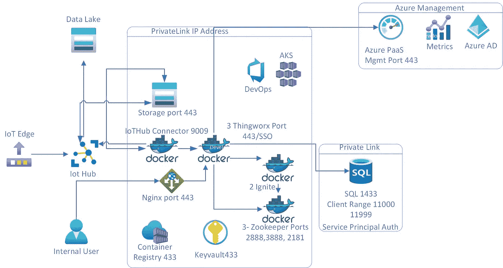

# 在 Azure PaaS 中实现 PTC Thingworx

> 原文：<https://medium.com/analytics-vidhya/implement-ptc-thingworx-in-azure-paas-4ec7270f5c7e?source=collection_archive---------5----------------------->

# 用例

# 在 Azure PaaS 中实施 PTC Thingworx 工业物联网解决方案

*   如何使用 PaaS 组件在 Azure 中部署 thingworx
*   将 AKS 用于应用程序
*   使用 Azure SQL 数据库进行数据库存储
*   使用 Azure 物联网中心进行设备通信和管理
*   将 Azure 存储用于检查点和长期数据存储
*   docker 容器存储在 Azure 容器注册表中
*   在 azure keyvault 中存储机密

# 体系结构

# 设计

*   电力网设计
*   为 AKS 创建专用网络
*   为存储创建专用端点
*   为 Azure SQL 数据库创建私有端点
*   创建私有 DNS
*   确保允许并打开通信防火墙规则
*   Azure 防火墙
*   虚拟机— F16 系列虚拟机，带 16 个 CPU — 32 GB —至少 3 个生产节点
*   将 Azure DevOps 用于代码存储库
*   使用 Azure DevOps for CI/CD 在环境之间进行部署
*   可选的 terraform 也可用于部署

# Azure 组件

*   物联网中心
*   Azure SQL 数据库
*   发展——DTU——最低 200
*   对于质量保证/测试/生产— 16 个 CPU — 32 千兆字节
*   Azure 容器注册表
*   Azure Keyvault
*   Azure 存储— ADLS 第二代
*   蓝色广告
*   Azure 监视器
*   Azure Devops —用于 CI/CD 基础架构部署

# Thingxworx 组件

发展

*   1 个 Nginx 控制器—入口码头集装箱
*   1 个 thingworx 码头集装箱
*   1 点燃容器
*   1 个 IotHub thingworx 连接器
*   1 个动物园管理员节点

生产/质量保证/测试

*   2 Nginx 控制器—入口码头集装箱
*   3 thingworx 码头集装箱
*   2 点燃容器
*   1 个 IotHub thingworx 连接器
*   3 个动物园管理员节点
*   以上配置可容纳多达 100，000 台设备
*   将 ngix 控制器分配给 thingworx URL —基本上是将端口 443 与 nginx ip 和 thingworx IP 相匹配。
*   上面的体系结构显示了它连接到哪个端口

# 如何

*   从 PTC 的下载网站下载 Thingworx 模块
*   [https://support . PTC . com/help/thing worx/platform/r9/en/index . html # page/thing worx % 2f help % 2f installation % 2f ThingWorx docker guide % 2f ThingWorx _ docker _ landing _ page . html % 23](https://support.ptc.com/help/thingworx/platform/r9/en/index.html#page/ThingWorx%2FHelp%2FInstallation%2FThingWorxDockerGuide%2Fthingworx_docker_landing_page.html%23)
*   下载的模块是 zip 文件或 jar 文件
*   创建 docker 映像并上传到 Azure 容器注册表
*   配置 thinkgworx 以连接到 Azure SQL 数据库
*   在 Kubernetes pod 中安装 thingworx 容器
*   在 pod 中安装 NGinx 容器
*   配置 nginx IP 到 thingworx(这是访问 thing worx URL—[https://IP:443/](https://ip/))
*   使用 Azure SQL 信息配置 thinkworx 容器
*   这将在第一次加载时创建模式
*   Thinkworx 使用 SQL 身份验证
*   将创建一个名为 thinkworx 的数据库
*   配置完成后，登录 thingworx URL
*   用 ignite ip 地址和端口配置 thingworx
*   用 Zookeeper ip 地址和端口配置 thingworx
*   配置物联网集线器连接器
*   这是 PTC 创建的容器
*   Thingworx 将创建一个名为 thingworx 的消费者群体
*   为检查点配置存储容器
*   根据 PTC 文档配置物联网集线器设置
*   [https://support . PTC . com/help/thing worx/azure _ connector _ SCM/en/# page/thing worx _ SCM _ azure % 2fa zure _ connector % 2Fc _ azure _ connector _ create _ security _ entities _ for _ connector . html % 23](https://support.ptc.com/help/thingworx/azure_connector_scm/en/#page/thingworx_scm_azure%2Fazure_connector%2Fc_azure_connector_create_security_entities_for_connector.html%23)
*   连接器端口是 9009
*   现在加载并配置所有 thinkworx 型号设置
*   在门户中创建新的物联网集线器设备
*   使用物联网集线器设备连接字符串配置物联网边缘设备。
*   配置边缘设备向物联网集线器发送数据。
*   登录 Thingworx 门户网站，搜索设备，查看属性是否正在更新
*   浏览历史记录，查看是否有新数据可用

# Thingworx 开发

*   所有的开发工作都完成了 thingworx 门户网站
*   Thingworx 门户网站内置了事物建模和仪表板
*   thingworx 需要许可证
*   所有的 thingworx 模块都可以通过他们的门户网站获得
*   需要 PTC 提供的登录信息来访问下载

原文—【PTC/ptcinaks . MD at main balakreshnan/PTC(github.com)