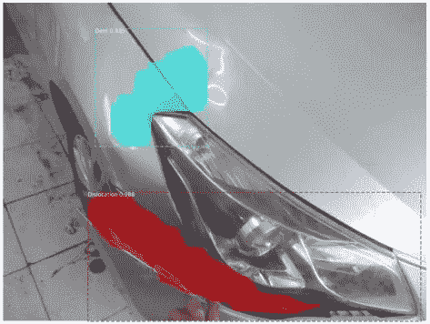
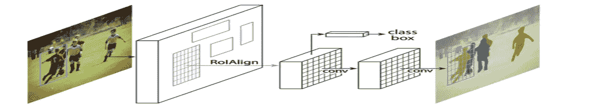
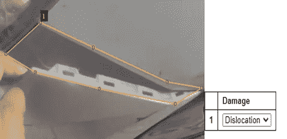
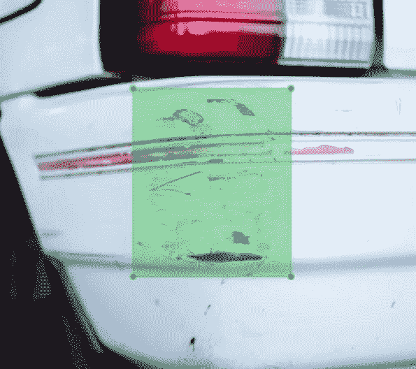

# 实现您自己的掩码 RCNN 模型

> 原文：<https://medium.com/analytics-vidhya/implement-your-own-mask-rcnn-model-65c994a0175d?source=collection_archive---------1----------------------->



在这篇文章中，我将一步一步地介绍如何实现和部署你自己的 Mask RCNN 模型。当我创建自己的部署模型时，我参考了许多在线博客，很少有博客使用带边框和单类分类的图像注释，一些使用带边框注释的图像和多类分类，其他使用带单类分类的多边形注释。这篇文章将为所有这些场景提供代码和解释。该员额的流程如下:

1.  ***Mask RCNN 模式介绍*** *l*
2.  ***关于我的面具 RCNN 型号***
3.  ***第一步:数据收集和清理***
4.  ***第二步:图像标注***
5.  ***第三步:下载要求***
6.  ***步骤 4 a:模型训练(包围盒标注和单类分类)***
7.  ***步骤 4 b:模型训练(包围盒标注和多类分类)***
8.  ***步骤 4 c:模型训练(多边形标注和多类分类)***
9.  ***图像增强***
10.  ***第五步:模型评估***
11.  ***第六步:单幅图像预测***
12.  ***第七步:本地使用 Flask 进行网站部署***

掩模 RCNN 模型总共有 63，749，552 个参数，63，638，064 个可训练参数，和 111，488 个不可训练参数。这是一个很大的参数，不要担心，你不需要了解关于 Mask RCNN 模型的一切就可以实现它，也就是说，我强烈建议你在这里阅读 Mask RCNN 论文。为了实现这个模型，我使用了 [matterport Mask R-CNN](https://github.com/matterport/Mask_RCNN) 。

# 掩模 RCNN 模型简介

Mask RCNN 是一种用于图像分割任务的深度学习模型。我将掩模 RCNN 模型可视化如下:

## 主干网络-实现为 ResNet 101 和特征金字塔网络(FPN)，该网络提取初始特征地图，该地图被向前传播到其他组件。

## 区域建议网络(RPN)—用于从图像中提取感兴趣区域(ROI ),并应用非最大值抑制来选择从 RPN 生成的最合适的边界框或 ROI。

## ROI Align —将感兴趣区域(ROI)包裹成固定的尺寸。

## 完全连接的图层-由两个平行图层组成，一个使用 softmax 进行分类，另一个使用回归进行边界框预测。

## 遮罩分类器—为图像中的每个实例生成二进制遮罩。



掩膜 RCNN 架构，图片来源:[掩膜 RCNN 论文](https://arxiv.org/abs/1703.06870)

# 关于我的 Mask RCNN 模型

我开发了一个掩模 RCNN 模型来检测汽车的四种外部损伤，即划痕、凹痕、破碎和错位。我已经使用步骤 4 a、4 b 和 4 c 训练了我的模型。

我发现如果你想要一个生成精确遮罩的模型，你应该使用用多边形标注的图像，如果你只需要一个精确的边界框，你可以使用边界框标注。

# 步骤 1:数据收集和清理

任何数据科学项目的第一步都是收集数据。你可以使用 BeautifulSoup 收集静态网页的图像数据，或者使用 Selenium 收集交互式网页的图像数据，也可以使用在 [Kaggle](https://www.kaggle.com/datasets) 上提供的开源数据集。如果你想创建一个小数据集，你可以手动从 Google Images 下载图片。收集数据集后，您需要清理不适合您的任务的图像。一件重要的事情是确保你给每张图片命名时都有一个唯一的数字 id 例如:0001.jpg、0002.jpg 等等。

对于边界框注记，数据集目录结构应为:

```
customImages
    |__ annots (all .xml annotation)
    |__ images (all images)
```

对于面注记，数据集目录结构应为:

```
customImages
    |__ train (all training images and annotation file)
    |__ val (all validation images and annotation file)
```

# 步骤 2:图像注释

正如你可能知道的，神经网络是监督学习算法，因此你需要用基本事实来注释你的图像，即在你想要检测的物体周围创建一个边界框或多边形。对于多边形注释，我推荐使用 [VGG 图像注释器](https://www.robots.ox.ac.uk/~vgg/software/via/)，对于边界框注释使用[label mg](https://github.com/tzutalin/labelImg)。



用 VGG 图像注释器进行多边形注释



带标签的边框标注

# 步骤 3:下载需求

首先，您需要克隆 matterport Mask RCNN 存储库。

```
*git clone* [https://github.com/matterport/Mask_RCNN.git](https://github.com/matterport/Mask_RCNN.git)
```

其次，从 Matterport 存储库中，需要安装 Mask RCNN 库。

```
cd Mask_RCNN
python setup.py install
```

对于 Linux/ Mac OS，请使用 sudo 命令。

第三，您需要安装以下软件包来训练模型。

> *numpy*
> 
> *scipy*
> 
> *枕头*
> 
> *cython*
> 
> *matplotlib*
> 
> *scikit-image*
> 
> *张量流> =1.3.0*
> 
> *keras > =2.0.8*
> 
> *opencv-python*
> 
> *h5py*
> 
> *伊姆高格*
> 
> *IPython[全部]*

这可以通过安装 requirements.txt 文件来完成，该文件可以从 matterport 存储库中获得，也可以从我自己的 Mask RCNN [项目存储库](https://github.com/EashanKaushik/car-damage-detecting-MaskRCNN)中获得。

```
pip3 install -r requirements.txt
```

最后，在这里下载 MS COCO 数据集[的掩膜 RCNN 权重。您将在这些预训练的权重上训练您的自定义数据集，并利用迁移学习。](https://github.com/matterport/Mask_RCNN/releases)

既然你都准备好了！！让我们开始训练您的自定义数据集模型。

# 模特培训

数据集类—我们将数据集类功能继承到我们的用户定义类 CustomDataset 中。这使我们能够创建自己的函数来提取边界框、加载遮罩和加载数据集。

load_dataset 函数—此函数负责在数据集中训练我们的模型之前添加类和图像，这是通过使用 self.add_image()添加图像和 self.add_class()添加类来完成的。

```
self.add_image(source, image_id, path, annotation) # bounding box
self.add_image(source, image_id, path, width, height, polygons, num_ids)# polygonself.add_class(source, class_id, class_name)
```

extract_boxes 函数——该函数仅在边界框注释的情况下使用，我们需要提取定义边界框的 4 个值，即 xmin、ymin、xmax 和 ymax，以及图像的高度和宽度。

load_mask 函数-该函数用于边界框注释和多边形注释图像，并用于加载遮罩。请注意，在边界框注释图像的情况下，遮罩将始终是一个框。

image_inference 函数—该函数用于返回给定图像 id 的图像路径。

Config 类——我们继承 Config 类来初始化我们的配置。我们需要一个单独的培训和测试配置。使用以下内容显示配置:

```
config = CustomConfig()
config.display()
```

evaluate_model 函数-该函数在全局命名空间中声明，用于计算模型的平均精度(mAP)。

## 导入库

注意:您只需要使用步骤 4 中的一个子步骤(a、b 或 c)来训练模型。但是，请从步骤 4 a 开始理解代码。您可以在我的[项目库](https://github.com/EashanKaushik/car-damage-detecting-MaskRCNN)的模型训练目录中找到所有的模型训练代码。

## 步骤 4 a:模型训练(包围盒注释和单个类别分类)

## 步骤 4 b:模型训练(边界框注释和多类分类)

## 步骤 4 c:模型训练(多边形标注和多类分类)

既然您已经理解了所有三种场景的代码。你能自己为下面的场景修改上面的代码吗？

> **多边形标注和单类分类**

# 图像增强

图像数据扩充是一种可用于通过在数据集中创建图像的修改版本来人工扩展训练数据集的大小的技术。这可以通过上下左右翻转图像、旋转图像或缩放图像来实现。这可以通过以下方式实现:

```
import imgaug.augmenters as iaamodel.train(train_set,
            test_set,
            learning_rate=config.LEARNING_RATE,
            epochs=15,
            layers='all',
            augmentation = iaa.Sometimes(5/6,iaa.OneOf([
            iaa.Fliplr(1),
            iaa.Flipud(1),
            iaa.Affine(rotate=(-45, 45)),
            iaa.Affine(rotate=(-90, 90)),
            iaa.Affine(scale=(0.5, 1.5))
            ])))
```

# 第五步:模型评估

如果你不能完成 TODO 任务，参考我的[训练笔记本](https://github.com/EashanKaushik/car-damage-detecting-MaskRCNN/blob/main/model-training/master.ipynb)。

# 步骤 6:单幅图像预测

# 步骤 7:在本地使用 Flask 进行网站部署

当你对你的模型的表现感到满意时，下一步就是为用户开发一个与模型互动的网站。本节不解释代码，只提供给你[使用](https://github.com/EashanKaushik/car-damage-detecting-MaskRCNN)。

1.  将您的 _trained_weights.m5 文件放在模型目录中。
2.  将 app/utils.py 中的第 22 行更改为模型权重的名称。
3.  运行 main.py 文件，网站将托管在 [http://127.0.0.1:5000/](http://127.0.0.1:5000/) 上。以下是我开发的 URL 规则，您可以根据自己的喜好添加或删除这些规则。

```
app.add_url_rule('/base','base',views.base)
app.add_url_rule('/','index',views.index)
app.add_url_rule('/damageapp','damageapp',views.damageapp)
app.add_url_rule('/damageapp/damage','damage',views.damage,methods=['GET','POST'])
```

如果不想使用成本评估功能，只需将 app/views.py 第 45 行的 cost_for_damage 变量更改为 False。成本评估功能仅用于视觉目的，并根据蒙版尺寸与图像尺寸的比率来计算成本。

注意:使用我的 GitHub 资源库中的 mcrnn 目录进行部署，因为我已经对原始库做了一些更改。

# 参考

[1] [He，k .，Gkioxari，g .，Dollár，p .，Girshick，R .， *arXiv e-prints* ，2017。](https://arxiv.org/abs/1703.06870)

[2] [通过 matterport 屏蔽 R-CNN 进行对象检测和分割](https://github.com/matterport/Mask_RCNN)。