# 人工神经网络在 Python 中的实现——分步指南

> 原文：<https://medium.com/analytics-vidhya/implementation-of-artificial-neural-network-in-python-step-by-step-guide-556d066f9f5b?source=collection_archive---------0----------------------->

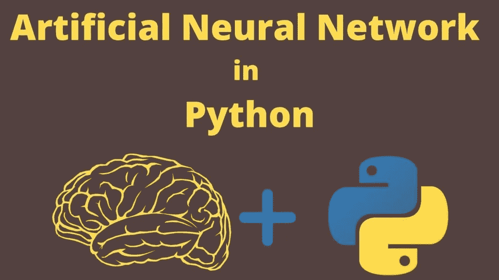

在这篇文章中，我将分享用 Python 实现人工神经网络(ANN)的**。因此，请花几分钟时间了解一下**人工神经网络以及如何用 Python 实现 ANN。****

所以，事不宜迟，让我们开始吧-

# 用 Python 实现人工神经网络

在开始用 Python 实现人工神经网络之前，我想告诉你关于 [**人工神经网络**](https://www.mltut.com/best-deep-learning-courses-on-coursera/) 及其工作原理。

# 什么是人工神经网络？

人工神经网络与人脑非常相似。

人脑由神经元组成。这些神经元是相连的。在人脑中，神经元看起来像这样…

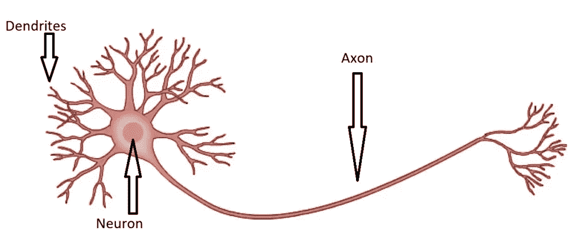

正如你在这张图片中看到的，有**神经元、树突和轴突。**

**你怎么看？**

当你触摸热的表面时，你如何突然移开你的手？。这是发生在你体内的过程。

当你触摸热的表面时。然后你的皮肤会自动向神经元发送信号。然后神经元做出决定**“拿开你的手”**。

这就是关于人类大脑的全部内容。同理，**人工神经网络工作。**

人工神经网络有三层

1.  输入层。
2.  隐藏层。
3.  输出层。

让我们看看这张图片

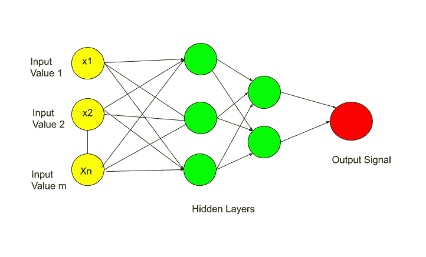

在这张图片中，你看到的所有圆圈都是神经元。人工神经网络**完全连接**与这些神经元。

数据被传送到**输入层**。然后输入层把这个数据传递给下一层，这是一个**隐藏层**。隐藏层执行某些操作。并将结果传递给**输出层**。

所以，这是一个人工神经网络的基本粗略工作流程。在这三层中，执行各种计算。

现在让我们详细了解每一层。所以第一层是**输入层**。

## 输入层

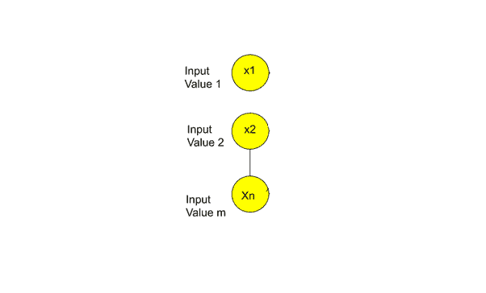

**我想现在你脑子里可能有一个疑问，输入层传递的是什么信号？。**

所以就人脑而言，这些输入信号就是你的感官。这些感官是你能看到、听到、闻到或触摸到的任何东西。例如，如果你触摸一些热的表面，然后突然一个信号被发送到你的大脑。这个信号是人脑的输入信号。

但是，

就人工神经网络而言，输入层包含**个独立变量**。所以自变量**变量 1，自变量 2，自变量 n.**

你需要记住的重要一点是，这些**自变量是针对一个观察值**的。更简单地说，假设有不同的自变量，比如一个人的年龄、薪水和工作角色。所以对一个人或一行，取所有这些自变量。

你需要知道的另一个要点是，你需要对这些自变量进行一些**标准化或规范化**。这取决于具体情况。做标准化或规范化的主要目的是使所有的值都在同一个范围内。我将在实现部分讨论这一点。

现在让我们进入下一层，那就是-

## 输出层-

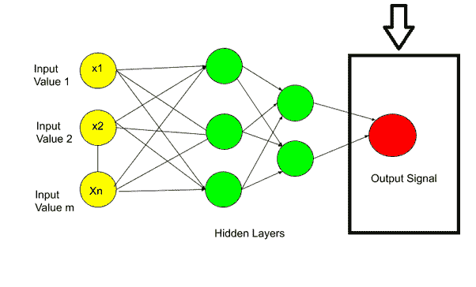

**那么，接下来的问题就是产出值可以是多少？**

答案是输出值可以是-

1.  连续的(比如价格)。
2.  二进制(是/否形式)。
3.  分类变量。

**如果输出值是分类的，那么重要的是，在这种情况下，你的输出值不是 1。它可能不止一个输出值。正如我在图中所示。**

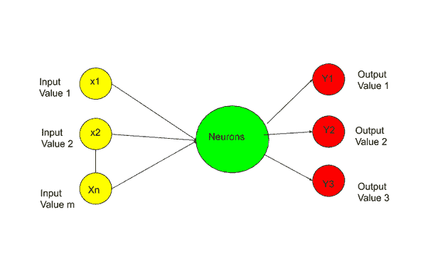

接下来，我将讨论突触。

## 突触-

突触只不过是两层之间的连接线。

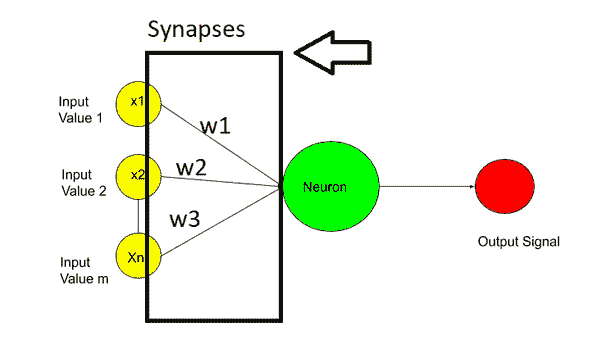

在突触中，权重被分配给每个突触。这些权重对于人工神经网络的工作至关重要。权重是神经网络学习的方式。通过调整权重，神经网络决定什么信号是重要的，什么信号是不重要的。

## 隐藏层或神经元-

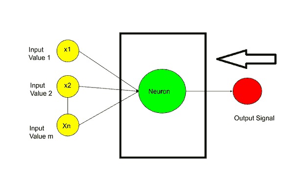

**下一个问题是神经元内部发生了什么？**

**所以在神经元内部，发生了两个主要的重要步骤——**

1.  加权和。
2.  激活功能。

第一步是加权求和，这意味着分配给突触的所有权重都加上输入值。差不多吧-

**【x1 . w1+x2 . w2+x3 . w3+………………..Xn。Wn]**

计算加权和后，将**激活函数**应用于该加权和。然后神经元决定是否将这个信号发送到下一层。

我希望现在你已经理解了人工神经网络的基本工作程序。现在我们来看一下人工神经网络在 Python 中的实现**。**

# 人工神经网络在 Python 中的实现

为了实现，我将使用**流失建模数据集**。可以从 [**Kaggle**](https://www.kaggle.com/mltuts/churn-modelling-data) 下载数据集。人工神经网络既可以用于分类**也可以用于回归**。而这里我们要用 **ANN 进行分类。**

该数据集具有以下特征-

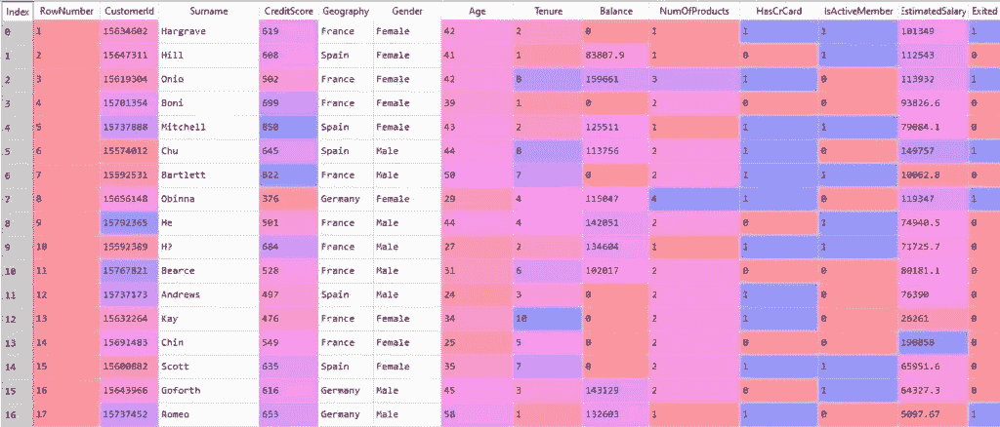

该数据集包含**客户 Id、姓氏、信用评分、地理位置、性别、年龄、任期、余额、产品数量(从银行使用，如信用卡或贷款等)、有无信用卡(1 表示有，0 表示无)、活跃会员(表示客户是否使用银行)、估计工资。**

所以这些都是客户流失建模数据集的独立变量。最后一个特征是**因变量**，即**客户在未来是否退出银行** ( 1 表示客户将退出银行，0 表示客户将留在银行。)

银行使用这些独立变量，分析了客户 6 个月的行为，无论他们离开银行还是留下来，并制作了这个数据集。

现在，银行必须根据这个数据集为新客户创建一个预测模型。这个预测模型必须为任何新客户预测他或她将留在银行还是离开银行。因此，银行可以为预测模型预测将离开银行的客户提供一些特别的服务。

我希望你现在理解了问题陈述。所以用 Python 实现人工神经网络的第一步是**数据预处理**。

## 1.数据预处理

在数据预处理中，第一步是-

## 1.1 导入库-

```
import numpy as np
import matplotlib.pyplot as plt
import pandas as pd
```

NumPy 是一个开源 Python 库，用于执行各种**数学和科学任务。** NumPy 被**用于**处理数组。它还具有在**线性代数、傅立叶变换和矩阵领域工作的功能。**

**Matplotlib** 是一个绘图库，用于创建**图形，在图形中绘制区域，在绘制区域中绘制一些线，用标签装饰图形等。**

**Pandas** 是用于**数据角力和分析的工具。**

所以在第一步中，我们导入了所有需要的库。现在下一步是-

## 1.2 加载数据集

```
dataset = pd.read_csv('Churn_Modelling_dataset.csv')
```

所以，当你在运行这行代码后加载数据集时，你会得到类似这样的数据


正如您在数据集中看到的，有 13 个自变量和 1 个因变量。但是前三个独立变量**行号、客户 Id 和姓氏**对我们的预测没有用。所以下一步我们会剔除这三个自变量。我们还会拆分 X 中的自变量和 y 中的因变量。

## 1.3 将数据集分为 X 和 Y

```
X = pd.DataFrame(dataset.iloc[:, 3:13].values)
y = dataset.iloc[:, 13].values
```

为什么 **dataset.iloc[:，3:13]。数值**？因为 credit_score 的索引值为 3。我们希望从信用评分到估计工资的功能。

当你运行这几行时，你会得到两个独立的表 X 和 y，就像这样-

**自变量(X)-**

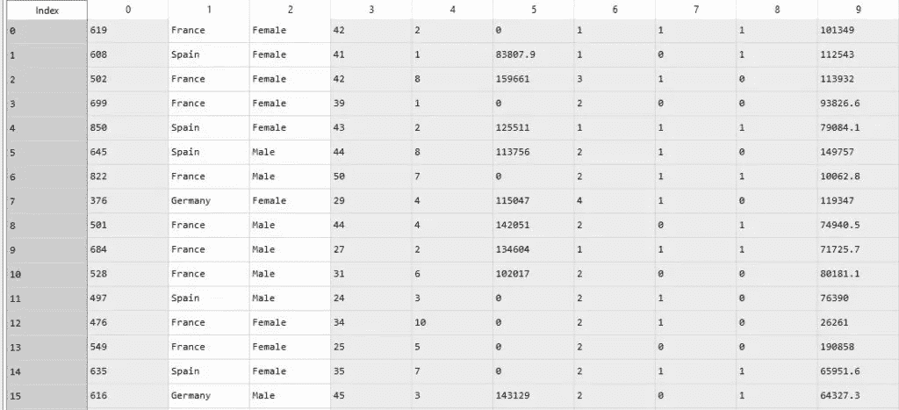

在此图中，您可以看到数据集是从 **Credit_Score 开始到 Estimated_Salary。**

**因变量(Y)**–

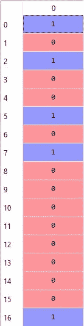

现在，我们已经将数据集分成了 X 和 y 两部分。下一步是-

## 1.4 对分类数据进行编码-

为什么需要编码…？

因为我们可以看到，有两个分类变量——**地理和性别。**所以我们必须将这些分类变量编码成一些标签，如性别的 0 和 1。和一些地理变量热编码。

首先让我们对性别变量执行**标签编码-**

```
from sklearn.preprocessing import LabelEncoder, OneHotEncoder
labelencoder_X_2 = LabelEncoder()
X.loc[:, 2] = labelencoder_X_2.fit_transform(X.iloc[:, 2])
```

为什么我用 2…？

因为性别变量的索引值为 2。

所以在对性别变量进行标签编码后，男性和女性被转换成 0 和 1，就像这样

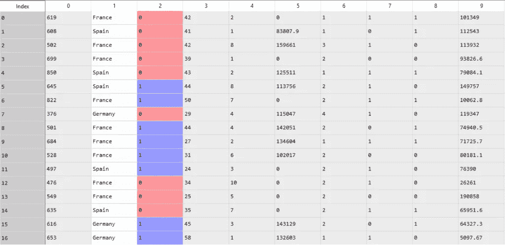

o 代表女性，1 代表男性。现在我们又多了一个分类变量，那就是地理。现在，我们将执行一个热编码，将法国、西班牙和德国转换为 0 和 1 形式。

**一个热编码-**

首先，我们需要像在性别变量中一样应用标签编码。然后我们将应用一键编码。所以，让我们来看看-

```
labelencoder_X_1 = LabelEncoder()
X.loc[:, 1] = labelencoder_X_1.fit_transform(X.iloc[:, 1])
```

在应用了标签编码之后，现在是时候应用一个热门编码了

```
onehotencoder = OneHotEncoder(categorical_features = [1])
labelencoder_X_1 = LabelEncoder()
X.loc[:, 1] = labelencoder_X_1.fit_transform(X.iloc[:, 1])
X = onehotencoder.fit_transform(X).toarray()
X = X[:, 1:]
```

所以，当你运行这段代码时，你会得到类似这样的输出-

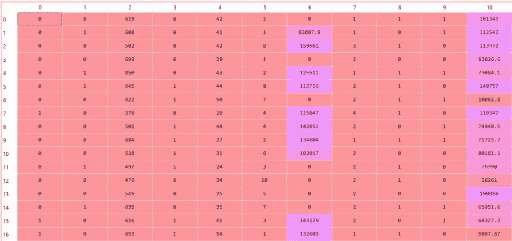

看到数据集后很迷茫…？

让我解释一下，

这里**【0 0】的意思是——法国。**

**【0 1】意为西班牙，**

**【1 0】意为德国**

因此，**的前两列**代表**地理变量**。我希望你现在明白了。

下一步是将数据集分成训练集和测试集。

## 1.5 将 X 和 Y 数据集分成训练集和测试集

为了建立机器学习模型，我们需要在训练集上训练我们的模型。为了检查我们模型的性能，我们使用了一个测试集。这就是为什么我们必须将 X 和 Y 数据集分成**训练集和**测试集。

```
from sklearn.model_selection import train_test_split
X_train, X_test, y_train, y_test = train_test_split(X, y, test_size = 0.2, random_state = 0)
```

当分成训练集和测试集时，你必须记住，80%-90%的数据应该在训练测试中。这也是我写 **test_size = 0.2** 的原因。

现在我们已经将数据集分成了 **X_train、X_test、y-train 和 y_test。**

所以下一步是**特征缩放。**

## 1.6 执行特征缩放

正如您在数据集中看到的，所有值都不在同一范围内，尤其是 **Balance 和 Estimated_salary。这需要大量的计算时间。因此，为了克服这个问题，我们执行**特征缩放。****

你需要确保的一件事是，无论你已经在 0 个表格中有值，都要在深度学习中执行特征缩放。

特征缩放有助于我们**在特定范围内标准化数据。**

```
from sklearn.preprocessing import StandardScaler
sc = StandardScaler()
X_train = sc.fit_transform(X_train)
X_test = sc.transform(X_test)
```

执行要素缩放后，所有值都被归一化，如下所示

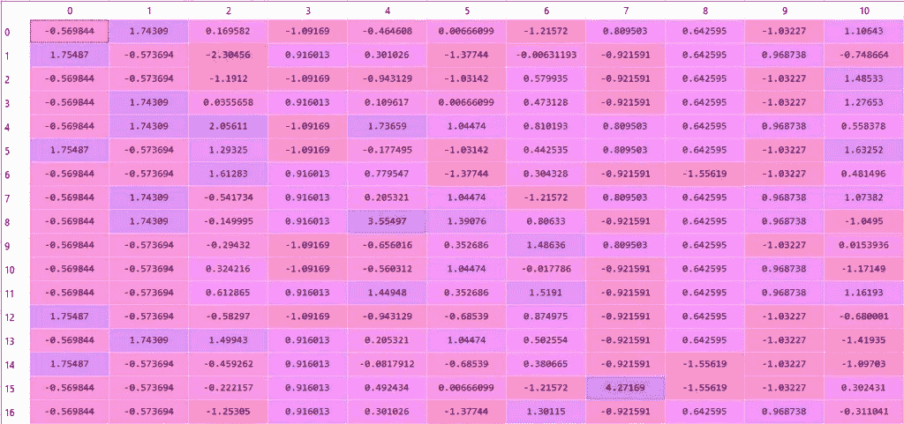

现在，我们完成了数据预处理步骤。现在是时候进入第二部分了，那就是建立人工神经网络。

## 2.建立人工神经网络

第一步是-

## 2.1 导入 Keras 库和包

```
import keras
from keras.models import Sequential
from keras.layers import Dense
```

## 2.2 初始化人工神经网络

```
classifier = Sequential()
```

顺序类允许我们构建人工神经网络，但作为一个层序列。正如我在理论部分告诉你的，人工神经网络是由完全连接的层构成的。初始化人工神经网络后，是时候-

## 2.3 添加输入层和第一个隐藏层

```
classifier.add(Dense(output_dim = 6, init = 'uniform', activation = 'relu', input_dim = 11))
```

Dense 是 Tensorflow 中的一个著名类。密集用于在 ANN 中添加完全连接的层。

**“add”**是**顺序类中的方法。** output_dim 表示隐藏层中隐藏神经元的个数。但是这没有经验法则。所以我用了 6。您可以使用任何其他号码进行检查。

对于全连接神经网络，隐含层中的 [**激活函数**](https://www.mltut.com/activation-function-and-its-types-which-one-is-better/) 应为**整流器激活函数**。所以我用**‘relu’**。

我们的输入层有 11 个神经元。为什么…？

因为我们有 11 个自变量(包括 2 列地理)。

这就是为什么 **input_dim = 11。现在我们已经建立了第一个输入层和一个隐藏层。下一步，我们将通过复制这段代码来构建下一个隐藏层**

## 2.4 添加第二个隐藏层

```
classifier.add(Dense(output_dim = 6, init = 'uniform', activation = 'relu'))
```

同样，我们在第二个隐藏层中使用了 6 个隐藏神经元。现在我们已经添加了一个输入层和两个隐藏层。是时候添加我们的输出层了。

## 2.5 添加输出层

```
classifier.add(Dense(output_dim = 1, init = 'uniform', activation = 'sigmoid'))
```

在输出层，我们需要 1 个神经元。为什么…？

因为正如你在数据集中看到的，我们有一个二进制形式的因变量。这意味着我们必须以 0 或 1 的形式来预测。这就是为什么输出层只需要一个神经元的原因。

我写 **output_dim = 1。**

接下来的事情是**激活功能**。在输出层，应该有一个 Sigmoid 激活函数。为什么…？

因为 Sigmoid 激活函数不仅可以预测，还可以提供客户是否离开银行的概率。

关于激活函数的更多细节，我推荐你阅读这个解释- [**激活函数及其类型-哪个更好？**](https://www.mltut.com/activation-function-and-its-types-which-one-is-better/)

现在我们终于完成了第一个人工神经网络的创建。下一步，我们将训练我们的人工神经网络。

## 3.训练人工神经网络

训练部分需要两个步骤-编译人工神经网络，并使人工神经网络适合训练集。所以让我们从第一步开始-

## 3.1 编译人工神经网络

```
classifier.compile(optimizer = 'adam', loss = 'binary_crossentropy', metrics = ['accuracy'])
```

**编译**是 Tensorflow 的一种方法。**“Adam”**是可以执行 [**随机梯度下降**](https://www.mltut.com/stochastic-gradient-descent-a-super-easy-complete-guide/) 的优化器。优化器在训练期间更新权重并减少损失。为了理解梯度下降背后的理论，可以查看一下这个解释——[**随机梯度下降——一个超级容易的完全指南！**](https://www.mltut.com/stochastic-gradient-descent-a-super-easy-complete-guide/) 。

你需要确定的一件事是，当你做类似的二元预测时，总是使用损失函数作为**二元交叉熵**。

为了评估我们的人工神经网络模型，我将使用准确性指标。这就是为什么 **metrics = ['accuracy']** 。现在我们已经编译了我们的 ANN 模型。下一步是-

## 3.2 使 ANN 适合训练集

```
classifier.fit(X_train, y_train, batch_size = 10, nb_epoch = 100)
```

与其把我们的预测和真实结果一个一个对比，不如批量执行。所以我才写 **batch_size = 10** 。

神经网络必须在一定数量的历元上进行训练，以随着时间的推移提高精确度。于是我决定了 **nb_epoch = 100** 。所以当你运行这段代码时，你可以看到每个时期的精度。

在第一个纪元，精确度是-

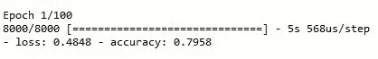

那是 79%，但是在运行所有 100 个历元之后，精度增加，我们得到最终精度-

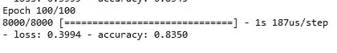

那是 83%。挺好的。现在，我们已经完成了培训部分。最后但并非最不重要的部分是预测测试集结果-

## 4.预测测试集结果-

```
y_pred = classifier.predict(X_test)
y_pred = (y_pred > 0.5)
```

**y_pred > 0.5** 表示如果 y-pred 在 0 到 0.5 之间，那么这个新的 y_pred 将变成 **0(假)**。如果 y_pred 大于 0.5，那么新的 y_pred 将变成 **1(真)。**

所以在运行这段代码后，你会得到 y_pred，类似这样的结果-

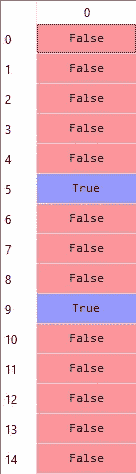

但是你能通过看这些预测值解释一下，有多少值预测对了，有多少值预测错了吗？

对于小型数据集，您可以。但是当我们有一个大的数据集时，这是不可能的。这就是为什么我们使用一个 [**混淆矩阵**](https://www.mltut.com/what-is-the-confusion-matrix-in-machine-learning/) ，来清除我们的混淆。

所以，下一步是-

## 5.制作混淆矩阵

```
from sklearn.metrics import confusion_matrix, accuracy_score
cm = confusion_matrix(y_test, y_pred)
print(cm)
accuracy_score(y_test,y_pred)
```

我们得到了 84.2%的准确率。

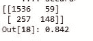

那还不错。现在，我建议您尝试一些值，并让我知道您获得了多少精度？

我们开始吧。恭喜你！

你已经成功地建立了你的第一个人工神经网络。现在是总结的时候了。

# 结论

我试图用简单易懂的方式从零开始讲解人工神经网络以及人工神经网络在 Python 中的实现。希望你能理解。

我建议你自己试试。如果你有任何疑问，欢迎在评论区问我。我愿意帮助你。

快乐学习！