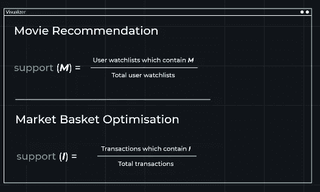
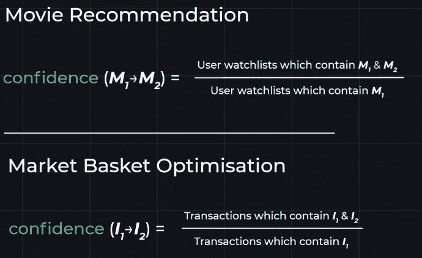
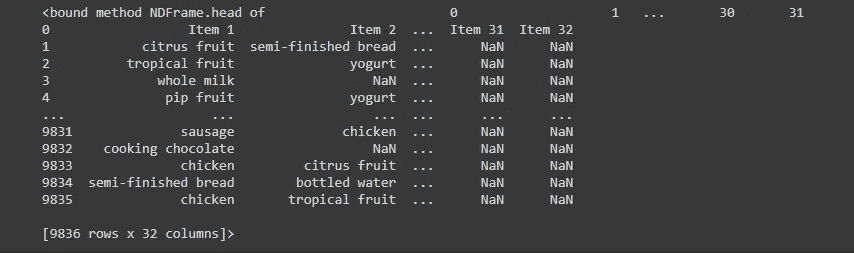
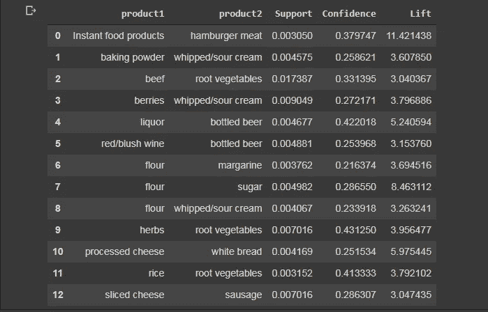
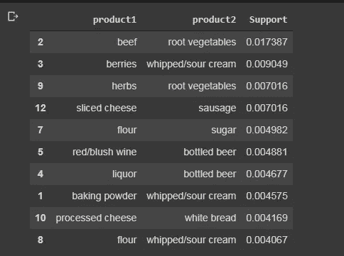
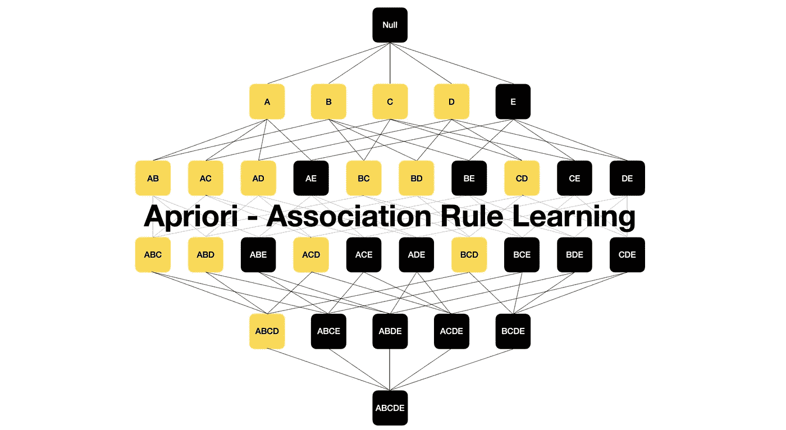

# 基于关联规则的学习在杂货上的实现

> 原文：<https://medium.com/analytics-vidhya/implementation-of-association-rule-based-learning-on-groceries-bfd4ef87ef1a?source=collection_archive---------3----------------------->


使用 [python](https://www.python.org/) ， [Numpy](https://numpy.org/) ，[熊猫](https://pandas.pydata.org/)， [Matplotlib](https://matplotlib.org/) ， [Seaborn](https://seaborn.pydata.org/) ， [apyori](https://pypi.org/project/apyori/)

关联规则学习是一种基于规则的机器学习方法，用于发现大型数据库中变量之间的有趣关系。它旨在使用一些感兴趣的度量来识别在数据库中发现的强规则。

基于强规则的概念，Rakesh Agrawal、Tomasz Imieliński 和 Arun Swami 引入了关联规则，用于发现超市销售点(POS)系统记录的大规模交易数据中产品之间的规律性。例如，在超市的销售数据中找到的规则右箭头右箭头表示，如果客户一起购买洋葱和土豆，他们很可能也会购买汉堡肉。此类信息可用作营销活动决策的基础，例如促销定价或产品放置。

除了上面来自购物篮分析的例子之外，关联规则现在还被用于许多应用领域，包括 Web 使用挖掘、入侵检测、连续生产和生物信息学。与序列挖掘相比，关联规则学习通常不考虑事务内或跨事务的项目顺序。

# 数据集:

这个数据集是基于杂货的。这个数据集中总共有 9836 行和 32 列。通过使用这个数据集，创建了这个机器学习项目。

这里我们使用 google COLAB 来运行这些代码并分析数据集，但是您也可以使用其他平台来运行代码。

现在让我们开始这个项目包含什么。

# 先验分析:

Apriori 是一种在关系数据库上进行频繁项集挖掘和关联规则学习的算法。它通过识别数据库中频繁出现的单个项目，并将其扩展到越来越大的项目集，只要这些项目集在数据库中出现得足够频繁。由 Apriori 确定的频繁项集可以用来确定关联规则，这些规则突出了数据库中的一般趋势:这在诸如市场购物篮分析的领域中有应用。

# **支持:**



# **信心:**



# **电梯:**


# **Apriori 算法:**

1.  设定最低支持和信心。
2.  收集支持度高于最小支持度的事务中的所有子集。
3.  收集这些具有比最小置信度更高置信度的子集的所有规则。
4.  按适合度递减对规则进行排序。

# **安装先验库:**

```
!pip install apyori
```

# 导入库:

```
import numpy as npimport matplotlib.pyplot as pltimport pandas as pd
```

# 正在加载数据集:

```
import iodf2=pd.read_csv("groceries - groceries.csv", header = None)
```

# 显示数据:

```
df2.head
```



# 数据的形状:

```
df2.shape
```


# 数据集上的先验训练:

```
from apyori import apriorirules = apriori(transactions = transactions, min_support = 0.003, min_confidence = 0.2, min_lift = 3, min_length = 2, max_length = 2)
```

# 可视化结果:

```
def inspect(results):product1         = [tuple(result[2][0][0])[0] for result in results]product2         = [tuple(result[2][0][1])[0] for result in results]supports    = [result[1] for result in results]confidences = [result[2][0][2] for result in results]lifts       = [result[2][0][3] for result in results]return list(zip(product1, product2, supports, confidences, lifts))DataFrame_intelligence = pd.DataFrame(inspect(results), columns = ['product1', 'product2', 'Support', 'Confidence', 'Lift'])
```



# ECLAT 分析:

ECLAT 算法代表等价类聚类和自底向上的格遍历。它是流行的关联规则挖掘方法之一。它是 Apriori 算法的一个更有效和可扩展的版本。Apriori 算法以模拟图的宽度优先搜索的水平方式工作，而 ECLAT 算法以垂直方式工作，就像图的深度优先搜索一样。ECLAT 算法的这种垂直方法使其成为比 Apriori 算法更快的算法。

# ECLAT 算法

1.  设置最小支撑。
2.  接受支持度高于最小支持度的事务中的所有子集。
3.  按支持度递减对这些子集进行排序。

```
def inspect(results):product1         = [tuple(result[2][0][0])[0] for result in results]product2         = [tuple(result[2][0][1])[0] for result in results]supports    = [result[1] for result in results]confidences = [result[2][0][2] for result in results]lifts       = [result[2][0][3] for result in results]return list(zip(product1, product2, supports))DataFrame_intelligence1 = pd.DataFrame(inspect(results), columns = ['product1', 'product2', 'Support'])
```



从上面的结果可以看出，牛肉和根菜肉是支持度最高的推荐对(. 017)。支持值越高，产品之间的相关性越高。

# **讨论:**

1.  先验基础分析对应于支持度、置信度和提升值。
2.  在基于先验的分析中，提升值越高，产品之间的相关性越高。
3.  ECLAT 基础分析只对应于支持值。
4.  在基于 ECLAT 的分析中，支持值越高，产品之间的相关性越高。
5.  在基于 ECLAT 的分析中，我们创建数据子集，并通过关联算法对其进行预测。
6.  基于关联规则学习的主要目标是创建一个好的推荐系统。

