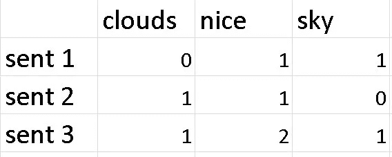
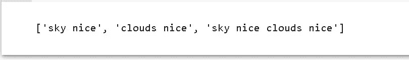
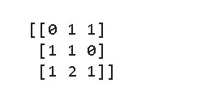

# 单词袋(NLP)的实现

> 原文：<https://medium.com/analytics-vidhya/implementation-of-bag-of-words-nlp-397f4cf67970?source=collection_archive---------5----------------------->

## 自然语言处理中词袋的实现和一般视图。

在这个博客中，让我们看看 bows，它的实现和缺点。

# 什么是单词袋(蝴蝶结)？

当用机器学习算法对文本建模时，单词包是 NLP 中表示文本数据的一种方式。这是一种简单的方法，在建模中使用非常灵活。

通常，单词包用于通过提取其特征将文本中的单词转换为矩阵表示，即，它向我们显示哪个单词在句子中出现及其频率，用于建模，如机器学习算法。

## 弓实际上有两种类型:

> **单词的二进制包**:它只表示单词是否存在(即，如果单词存在则为‘1’，如果不存在则为‘0’)，但不表示它的频率。因此，我们大多使用弓。
> 
> **Bag-of-words (BOWs)** :描述一个文档内出现的单词，涉及两件事:
> 
> 1.已知单词的词汇表。
> 
> 2.对单词存在的一种度量。

例如:

让我们来看 3 个句子

> *发了 1 个*:天很好。
> 
> *发了 2* :云好看。
> 
> *发了 3* :天很好，云很好。

在这三个句子中，主要有三个单词(云，天空，美好)，它们出现在三个句子中，我们用单词袋来表示它们，在使用蝴蝶结后，它看起来有点像这样。

1 表示单词在句子中出现过一次，2 表示出现过两次，0 表示没有出现在句子中。

**现在让我们开始编码吧…..**

我想你已经知道 nltk 了。

我们导入实际上包含正常单词列表的停用词(如语言英语:“is”、“was”、“they”等)。，)，这对我们的句子没有多大价值，所以我们可以过滤掉它们。

输出:

正如我们在上面看到的，我们通过删除停用词预处理了 3 个句子

> 注意:如果你愿意，你可以使用词法分析或者词干分析。

输出:

sklearn 中有一个“计数矢量器”,它为我们完成了所有的词汇处理。基本上，我们可以把它当作一个创建单词包的函数。

此外，最大特征包括要提取的特征数量，即尺寸/列。

## 弓的一些缺点:

>它不会提供关于单词的任何语义信息。它只给出单词在句子中出现的次数，而不给出它在句子中的位置或与其他单词的相关性。

>它给予句子中所有单词同等的重要性。因此，它对简单的过程最有用。

>还有其他方法，如 Tfidf、word2Vec，它们比 BOWs 更复杂、更有用。

在这里了解更多关于弓的知识[https://en.wikipedia.org/wiki/Bag-of-words_model](https://en.wikipedia.org/wiki/Bag-of-words_model)

有用就留个掌声