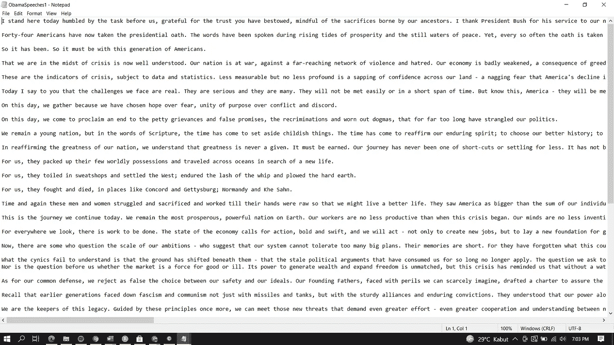
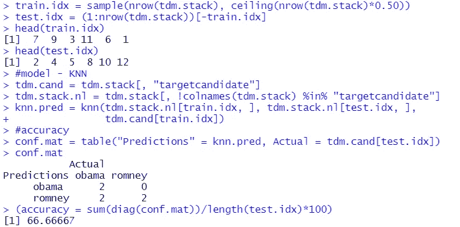

# 实现 k-NN 和机器学习构建 R 语言文档分类系统

> 原文：<https://medium.com/analytics-vidhya/implementation-of-k-nn-machine-learning-to-build-document-classification-system-in-r-10e28e56c657?source=collection_archive---------3----------------------->

资料来源:多中心 AX

***各位数据爱好者好！***

*前几天，当我在 YouTube 上寻找关于 k-NN 的有趣话题时，我看到了 Tim D'Auria 的一个很酷的教程，题为“* [***如何用 R 语言构建一个文本挖掘、机器学习文档分类系统！***](https://www.youtube.com/watch?v=j1V2McKbkLo) *“就在那时，我决定把它付诸实践！*

*这次我们将尝试实现 K-Nearest neighborhood(K-NN)算法和机器学习，在 R/RStudio 中构建一个文档分类系统。首先，让我们与这项技术结合起来！*

# *k-最近邻(k-NN)*

*k-最近邻算法是一种监督学习算法，其中新实例的结果根据大多数 k-最近邻类别进行分类。该算法的目的是根据训练数据的属性和样本对新对象进行分类。k-最近邻算法使用邻域分类作为新实例值的预测值。*

例如，假设我的数据集中有 20 名青少年的尺寸，那么我需要确定哪件衣服最适合他们。他们的学校只想要 3 种不同的尺寸，它们是小号(S)，中号(M)和大号(L)。所说的尺寸是身高和体重，然后我根据他们的尺寸将这些青少年分为 3 组。两天后，我发现一名青少年在测量时迟到了，现在我需要在不破坏现有数据的情况下将他归入其中一组。在这里，我可以使用 k-NN 来找到他在身体测量方面最近的邻居。

*k-NN 有 3 个步骤:(1)首先，我们必须确定我们将要计数的邻居的数量(k)，(2)计算每个邻居到对象的距离，然后按距离对结果排序，从最小到最大，(3)取(k)个最近的邻居，然后我们看每个邻居是否都包含在分类中。*

*在确定 k 的值时，* ***如果我们的分类数是偶数*** *那么我们应该使用 k 的奇数值***，而 i* ***f 我们的分类数是奇数*** *那么我们应该使用 k 的偶数值**

# **机器学习**

**机器学习(ML)技术是一种被开发成能够在没有用户指导的情况下自我学习的机器。机器学习是基于统计、数学和数据挖掘等其他学科发展起来的，因此机器可以通过分析数据进行学习，而无需重新编程或排序。**

***在这种情况下，机器学习有能力用自己的命令获取现有数据。ML 还可以研究现有的数据和它获得的数据，以便它可以执行某些任务。ML 能做的任务也很多样，看他学什么。***

**A.监督学习**

***监督学习技术(Supervised learning technique)是一种可以应用于机器学习的技术，它可以通过给定某些标签来接收已经存在于数据中的信息。人们希望这种技术能为通过比较过去的学习经验而得出的结果提供一个目标。***

**B.无监督学习**

***无监督学习技术是可以应用于机器学习的技术，这些机器学习用于没有可以直接应用的信息的数据。预计这种技术可以帮助发现未标记数据中隐藏的结构或模式。这与监督学习略有不同，因为你事先没有任何数据作为参考。***

# **实现 k-NN 和机器学习构建文档分类系统**

***现在我们已经掌握了 k-NN & ML 的初步思路，让我们进入正题吧！我们要输入文档，建立系统，分类/预测文档属于谁(作者姓名)。通过识别文档的模式，该系统有望识别未标记的总统竞选演讲的发言者。***

**答:我们要用巴拉克·欧巴马&米特·罗姆尼的演讲作为我要分类的文件。您可以在此处获取演讲稿: [***奥巴马***](http://obamaspeeches.com/) ***，*** [***罗姆尼 1***](https://s3.documentcloud.org/documents/6768911/Romney-RemarksPreparedForDelivery.pdf) **，** [***罗姆尼 2******(您也可以添加/替换其他候选人已有的演讲稿)。我们会把演讲内容复制到我的记事本上，然后以文本形式保存下来。txt)格式。***](https://www.pri.org/stories/2012-01-11/mitt-romney-new-hampshire-primary-victory-speech)**

**b .为每个脚本创建一个目录，并将它们存储到两个不同的文件夹中(一个给奥巴马&一个给罗姆尼)。下面是我得到的:**

****

**示例:记事本显示“ObamaSpeeches1.txt”**

****

**例子:在奥巴马的文件夹里**

****

**例如:罗姆尼的文件夹**

****

**文件夹的示例**

**初始化我们的环境。我们需要向系统提供我们将要使用的库或目录的信息。从“tm”、“plyr”和“class”加载我们想要使用的库**

***库“tm”来自 R 的一个同名包，tm 本身代表* [***文本挖掘***](https://cran.r-project.org/web/packages/tm/vignettes/tm.pdf) ***。****TM 中管理文档的主要结构是所谓的语料库，代表文本文档的集合。语料库是一个抽象的概念，可以同时存在多个实现。库“plyr”来自于*[***PLYR***](https://cran.r-project.org/web/packages/plyr/plyr.pdf)*包。这是一套解决一系列常见问题的工具:*你需要将一个大问题分解成可管理的部分，对每一部分进行操作，然后将所有部分重新组合在一起。然后，我们还需要激活“* [***类***](https://cran.r-project.org/web/packages/class/class.pdf) *”库，该库包含用于分类的各种函数，包括 k 近邻、学习矢量量化和自组织映射。****

> *# initialize environment
> libs = c(" TM "，" plyr "，" class")
> lapply(libs，require，character.only = TRUE)*

***d. *当你把文本数据读入 R 时，它偶尔会把它从文本/字符串/字符转换成名义/分类变量。我们不希望这种情况在这里发生，我们要保持现状。于是我们设置了参数“string as factors”*。***

> *#set options
> 选项(stringsAsFactors = FALSE)*

*继续，让我们指定我们之前创建的目录的名称以及到达那里的路径。*

> *#设置参数
> 候选人= c(“罗姆尼”、“奥巴马”)*
> 
> *#获取我们目录的路径示例
> pathname = " D:/Ahsana ' s Archive/Peng antar DATA MINING/Text MINING&class ification "*

***f. *然后我们会清理文字，因为发短信本来就很“脏”。为了让系统很好地运行，很多东西需要被“清理”。因为我们有两个候选人(奥巴马&罗姆尼)，不妨做一个函数，这样它可以适用于几个候选人。****

****这个函数从我们所有的目录中提取所有的演讲，并将它们合并到每个语料库的一个候选中。****

> *# clean text function
> clean corpus = function(corpus){ # pass in corpus
> corpus . tmp = TM _ map(corpus，remove punctuations 删除标点符号
> corpus . tmp = TM _ map(corpus . tmp，strip white space)#删除空格
> corpus . tmp = TM _ map(corpus . tmp，content _ transformer(to lower))#小写*
> 
> *#去掉没有太大意义的演讲部分
> corpus . tmp = TM _ map(corpus . tmp，removeWords，stopwords("english "))*
> 
> *#给出结果
> 返回(corpus.tmp)
> }*

***g. *当我们清理完文本后，我们将构建一个术语文档矩阵(TDM)，这个东西可以神奇地将文本转换成定量格式(我们可以分析它！)****

> *# build TDM
> generate TDM = function(cand，path){
> s . dir = sprintf(" % s/% s "，path，cand)# print to variables together
> s . cor = VCorpus(DirSource(directory = s . dir)，reader control = list(reader = read plain))
> s . cor . cl = clean Corpus(s . cor)#对 corpus 应用清理函数
> s . TDM = TermDocumentMatrix(s . cor . cl)*
> 
> *#设置一个可接受的稀疏级别，并删除剩余的内容
> s . TDM = removeSparseTerms(s . TDM，0.7)
> result = list(name = cand，tdm = s.tdm)
> }*
> 
> *tdm = lapply(候选项，生成项 dm，路径=路径名)*

*将每位候选人的名字附在 TDM 上。*

> *# attach name
> bindcindicadatetodtm = function(TDM){*
> 
> *#将 TDM 转换为数字，每个语音为一行，每个术语为一列
> s . mat = t(data . matrix(TDM[[" TDM "]]))*
> 
> *#将矩阵转换为数据帧
> s.df = as.data.frame(s.mat，stringsas factors = FALSE)
> 
> s . df = cbind(s . df，rep(tdm[["name"]]，nrow(s . df)))
> colnames(s . df)[ncol(s . df)]= " target candidate "
> return(s . df)
> }*
> 
> *candTDM = lapply(tdm，bindccandidatetodtm)
> str(cand TDM)*

**

*str(时分复用)*

*我们在这里看到的是每个术语的结构列表，它们在哪里，重复了多少次。*

***i. *将之前的矩阵堆叠在另一个之上，因为我们要将它们一次性放入我们的模型中。****

> *# stack
> TDM . stack = do . call(r bind . fill，candTDM)*
> 
> *#替换 NA 或将 NA 设置为零
> TDM . stack[is . NA(TDM . stack)]= 0
> head(TDM . stack)*

**

*TDM.stack 中的几个热门词汇*

> *nrow(tdm 堆栈)
> ncol(tdm 堆栈)*

**

*TDM.stack 的行数和列数*

*因此，现在我们知道我们总共有 12 篇演讲，共有 552 个术语。*

***j. *接下来，我们将创建一个保留样本。保留样本是来自数据集的随机样本，它被保留并且不用于模型拟合过程。在模型拟合到主要数据(“训练”数据)之后，它被应用到拒不接受的样本。这就对模型应用于新数据时的表现给出了一个公正的评估。****

*   ****注意:*** ***您实际上可以更改您希望包含在训练集中的行的百分比。列车组:测试组的常见组合为 70% : 30%、80% : 20%或 75% : 25%。对我来说，我将它设置为 75%(稍后我会解释为什么)****

> *#拒绝*
> 
> *#我们取 75%的行来训练模型
> train . idx = sample(nrow(TDM . stack)，ceiling(nrow(TDM . stack)* 0.75))
> test . idx =(1:nrow(TDM . stack))[-train . idx]*
> 
> *头(train.idx)
> 头(test.idx)*

***k. *建立 k-NN 模型。****

> *#k-NN 模型
> tdm.cand = tdm.stack[，" target candidate "]
> TDM . stack . nl = TDM . stack[，！% "targetcandidate"]中的 colnames(TDM . stack)%值*
> 
> *KNN . pred = KNN(TDM . stack . nl[train . idx，]，tdm.stack.nl[test.idx，]，
> tdm.cand[train.idx])*

*为了提高我们模型预测的准确性，我们建立了一个混淆矩阵。它基本上是一个矩阵，显示了我们的模型如何预测测试集与进行演讲的实际候选人。*

> *#准确性*
> 
> *#混淆矩阵，由预测结果和实际候选者组成
> conf . mat = table(" Predictions " = KNN . pred，Actual = TDM . cand[test . idx])
> conf . mat*
> 
> *(精确度=总和(诊断(确认材料))/长度(测试. idx)*100)*

**

*混淆矩阵的输出与模型的准确性*

**上面的混淆矩阵解释了我们的模型成功地预测了一个属于奥巴马的演讲& 2 个属于罗姆尼的演讲。如果我们计算一下，我们从测试集中总共 3 个语音中得到 3 个正确预测的语音，那么我们有(3/3)*100，这当然意味着 100。我们模型的预测准确率是 100%！找到了。**

***有人解释*(【十指交叉】)****

*关于我为什么选择 75% : 25%的训练集:测试集组合，我需要说一点。我也试过其他组合:*

*   **50% : 50%给出了这个结果:**

**

**让我们计算一下，在测试集中，我们从总共 6 个演讲中得到 4 个正确预测的演讲，那么我们有(4/6)*100 = 66，67(或大约这个数)。该模型预测的准确率为 66，67%**

*   **80% : 20%给出了这个结果:**

**

*再次拿出你的计算器，我们从测试集中总共 3 个语音中得到 2 个正确预测的语音，那么我们有(2/3)*100 = 66，67。该模型预测的准确率为 66，67%*

****我选择****75%:25%组合的唯一原因是，与其他两个相比，它给出了* ***最高的精确度*** *。不一定说明其他组合不好。它只是没有在我的设备上给出最好的结果(当然，它可能会在不同的设备上给出不同的结果)。**

***结论***

**基于这个试验，结合 ML 的分类方法的一个弱点是它在不同设备上的表现可能不同。为了获得类似的结果，我们可以使用 set.seed()设置一些随机数，然后将这些随机数作为训练集或测试集的索引。如果这仍然不能保证您得到类似的结果，请尝试检查您的 R/RStudio 的随机数生成器。另一个结果可能不同的方法的例子是安& NNET。以下是 k-NN 的弱点:**

*   **准确性取决于数据的质量**
*   **对于大量数据，预测阶段可能会很慢**
*   **对数据的规模和无关特性敏感**
*   **要求高内存(需要存储所有的训练数据)**
*   **假设它存储了所有的训练，那么它的计算量可能会很大**

*然而，k-NN 使用邻域分类作为新查询的预测值。它有优点:非参数架构， ***简单强大*** *，不需要训练时间。**

****本文就到此，希望对数据爱好者有所帮助！^^****

***大大感谢:***

* [## 卡拉克尔贾算法 k-最近邻(k-NN)

### 尽管我们已经认识到了这一点，但我们比 k-NN 更清楚。

medium.com](/bee-solution-partners/cara-kerja-algoritma-k-nearest-neighbor-k-nn-389297de543e)  [## KNN 算法简介|什么是 KNN 算法？

### 你在尝试机器学习吗？这里有一个最简单的机器语言算法的快速介绍- KNN…

www.mygreatlearning.com](https://www.mygreatlearning.com/blog/knn-algorithm-introduction/)  [## KNN-K 最近邻 OldKiwi - Rhea

### 在 ECE662 课程背景下创建的页面。k 最近邻(KNN)分类器不使用任何模型来拟合…

www.projectrhea.org](https://www.projectrhea.org/rhea/index.php/KNN-K_Nearest_Neighbor_OldKiwi#:~:text=K%20Nearest%20Neighbors%20%28KNN%29&text=The%20KNN%20uses%20neighborhood%20classification,classification%20and%20estimation%20are%20slow.)  [## 这在 lme4 中意味着什么:程序包' Rcpp '不提供函数' dataptr '

### 感谢贡献一个堆栈溢出的答案！请务必回答问题。提供详细信息并分享…

stackoverflow.com](https://stackoverflow.com/questions/21657575/what-does-this-mean-in-lme4-function-dataptr-not-provided-by-package-rcpp)*