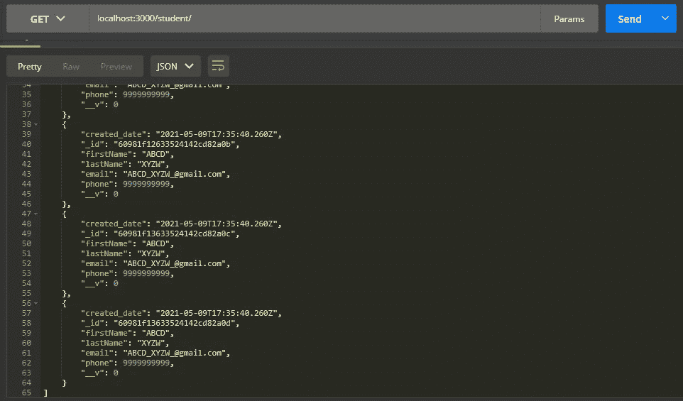

# ExpressJS 中 MVC 和 REST APIs 的实现

> 原文：<https://medium.com/analytics-vidhya/implementation-of-mvc-rest-apis-in-expressjs-c7eb6a097b9f?source=collection_archive---------0----------------------->


萨法尔·萨法罗夫在 [Unsplash](https://unsplash.com?utm_source=medium&utm_medium=referral) 上拍摄的照片

转到后端开发，我们有很多选择。更具体的针对 web 开发或者 REST APIs，我们有一些技术。在当前时代，无论是 web 开发还是移动应用程序开发，JavaScript 都在驱动着几乎每一个平台。

在 JavaScript 开发领域，主要有两种开发栈被开发者大量使用，它们是 MEAN 栈和 MERN 栈。

```
**MEAN**
**||||___ NodeJS** 
**|||**____ **AngularJS**
**||**_____ **ExpressJS**
**|**______ **MongoDB****MERN
||||**___ **NodeJS**
**|||**____ **ReactJS**
**||**_____ **ExpressJS**
**|**______ **MongoDB**
```

这里，正如您所看到的，ExpressJS 在两个栈中都是通用的。ExpressJS 是一个基于节点的后端框架，现在被广泛使用。

> **但是等等，什么是 MVC 呢？为什么需要它？**

**MVC** 代表模型视图控制器。现在人们正朝着并行处理的方向发展，以节省资源和提高工作效率。这种方法在应用程序的编程中也被接受，在这种情况下，来自不同模块的开发人员应该尽可能少地相互依赖。因此 MVC 出现了。

基本上，MVC 框架是一种架构模式，它将应用程序分成三个逻辑组件:模型、视图和控制器。这些组件中的每一个都是为了完成特定的任务。这里表示层与业务逻辑是分离的，所以它确保在表示层工作的人不应该依赖于业务逻辑部分。


作者图片:MVC 架构

如上图所示，我们有一个模型、视图和控制器，其中任何用户都只能与视图组件(即网页)进行交互。当用户触发特定事件时，视图将调用控制器，例如，用户想要更新他/她在数据库中的电子邮件。然后，控制器调用该流程的模型 API，它将更新数据库中的数据。一旦数据更新，视图将不得不重新呈现更新的网页，因此应用程序显示最新的视图。

MVC 在 ExpressJS 中的实现如下。首先，通过运行下面的命令确保您的系统中已经安装了 NodeJS，该命令将为您提供已安装节点的版本。关于节点的安装，请参考 [***本***](https://www.guru99.com/download-install-node-js.html) 网站。

```
$ node -v
```

为此项目创建一个新文件夹，并在此文件夹中打开命令提示符。现在键入下面的命令，这将帮助您创建一个 package.json 文件。为此，您必须使用 npm(节点包管理器)。要了解更多关于 npm 的信息，请参考[](https://docs.npmjs.com/)*网站。*

```
*$ npm init*
```

*这将创建一个 package.json 文件。现在我们需要通过运行下面的命令来安装 express。*

```
*$ npm install express*
```

*现在，由于我们的应用程序的入口点是 index.js，我们需要在项目文件夹中创建该文件，此外，我们需要创建三个文件夹，即模型、视图和控制器。需要知道的一点是，我们使用 MongoDB 作为我们的数据库服务，因此将它安装在您的系统中，您可以参考此 站点进行安装。现在，为了与数据库交互，我们需要通过运行以下命令来安装一些依赖项。*

```
*$ npm install mongodb
$ npm install mongoose*
```

*因此，运行这些命令后，我们的目录结构将如下所示。其中 *package.json* 文件是我们项目的元数据，而 *package-lock.json* 文件非常有用，尤其是当不同的人在同一个项目上工作时。*

```
***ExpressMVC**
 **|___models**  #model files lie here
 **|     |___**Student.js
 **|___views**  #view files lie here
 **|___controllers**  #controller files lie here
 **|     |___studentController.js**
 **|___node_modules**  #npm installs modules inside this folder
 **|     |___.bin**
 **|     |___**[**@sindresorhus**](http://twitter.com/sindresorhus)
 **|     |**
 **|      .    .    .**
 **|      .    .    .
 |     |
 |     |___xdg-basedir
 |___index.js**  #main express server file to run application
 **|___package.json**  #project metadata file
 **|___package-lock.json***
```

> *现在让我们转向 REST APIs*

*基本上，REST 代表表示的传输，API 代表应用程序，是信息提供者和信息使用者之间的接口。为此，API 遵循基于请求-响应的体系结构，并向用户提供信息。当客户机需要来自服务器的数据时，它将以 XML、HTML、Python、PHP 或 JSON 的形式共享状态。如今，JSON 的意思是,**J**ava**S**script**O**object**N**rotation，因为它容易被人和计算机阅读，所以被广泛使用。*

**

*作者图片:REST API 架构*

*REST APIs 也称为 RESTful APIs。REST APIs 使用 GET、POST、PUT、DELETE 等 HTTP 方法。因此，为了创建 REST APIs 端点，有必要在我们的 ExpressJS 服务器中实现 HTTP 方法。这些端点将能够通过一些功能与数据库进行交互，并能够将结果返回给用户。对于交互，我们将为数据库表创建一个模型，它将负责执行与数据库相关的操作。这里，我们将创建一个基本的学生模式，如下所述。*

*现在，函数将使用这个模式来执行与数据库相关的操作。现在控制器将进入画面，因为它包含与数据库查询相关的重要功能。*

*在这里，我为操作定义了函数，例如在数据库中创建一个新的用户条目、获取所有学生的详细信息、获取特定学生的详细信息、更新学生的详细信息以及从数据库中删除学生数据。这些函数将被导入到我们的主应用程序文件 index.js 中，并按照如下所示的要求被调用。*

*因此，我们的应用程序已经准备就绪。为了测试基于 REST APIs 的应用程序，我们需要一个 Postman 应用程序，它非常容易使用，并且在测试中也很重要。你可以从 [***这个***](https://www.postman.com/downloads/) 链接下载邮差。现在，我们将通过运行以下命令来启动我们的服务器。*

```
*$ npm start*
```

*现在我们准备开始我们的应用程序。启动 postman，选择请求类型 POST，输入 URL，输入数据，然后按 send，如下图所示，您将得到回复。*

**

*作者图片:向数据库添加新学生*

*在这里，当我们按下 send 时，请求的主体中会有数据，它将被传递给函数，然后函数将被传递给我们的模型学生，最后，这个对象将被存储在数据库中。现在，我们可以通过调用 get 方法来获取学生列表，如下所示。*

**

*作者图片:从数据库中获取学生列表*

*我们可以从 id 中得到一个特定的学生，如下所述。*

**

*作者图片:通过 id 获取特定学生*

*我们可以使用 HTTP 的 PUT 方法来更新数据库中的数据，绕过用户的特定 id，如下所示。*

**

*作者图片:按 id 更新学生信息*

*也可以通过调用 HTTP 的 DELETE 方法进行删除，特定学生的数据将从数据库中删除，如下所示。*

**

*作者图片:按 id 删除学生信息*

*由于前端部分不是本文讨论的一部分，您可以自己创建它。通过将前端文件放在视图文件夹中，您可以获得对 REST APIs 的响应，并在您的前端漂亮地格式化它们，这看起来很酷。*

# ***结论***

*该应用程序可以作为后端集成到任何项目中，无论是 web 应用程序还是移动应用程序，因为该应用程序基于 API 调用为客户端提供服务，因此两种方式都是可行的。更多参考，可以从 [***这里***](https://github.com/IndianCoder25/Implementation-of-REST-APIs-MVC-in-ExpressJS) ***访问我的 GitHub 回购。****