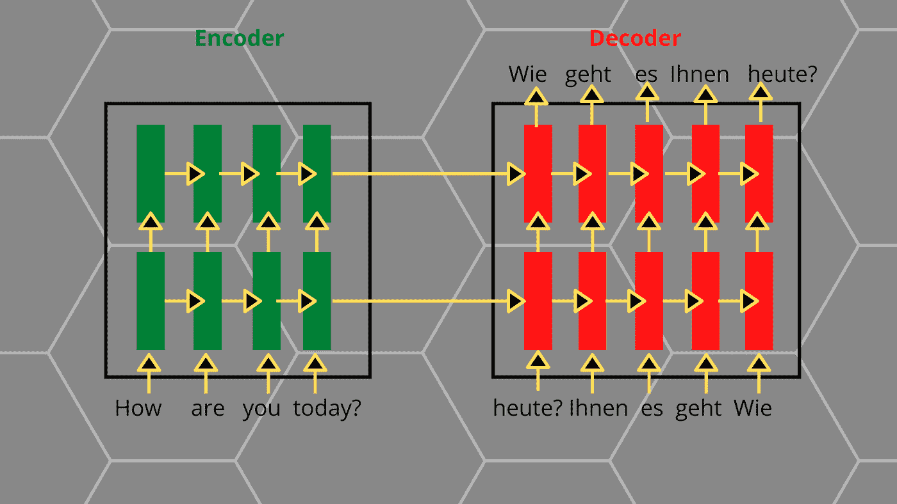
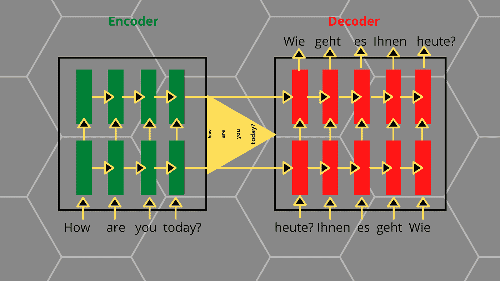
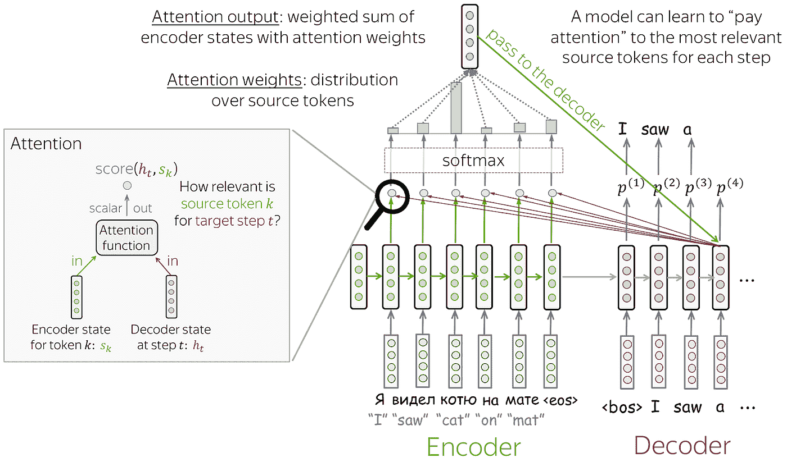
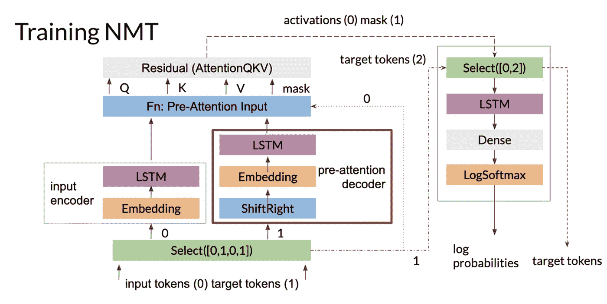

# 利用注意力实现神经机器翻译

> 原文：<https://medium.com/analytics-vidhya/implementation-of-neural-machine-translation-using-attentions-3b36337a5b23?source=collection_archive---------6----------------------->

# 什么是 NMT？

NMT 代表神经机器翻译，它来源于机器翻译。在这里，使用神经网络完成了从一种语言到另一种语言的机器翻译。

NMT 帮助翻译使用语法，词类，词汇的语言，以找到正确的替代在其他语言。

示例:

1.你今天好吗？

翻译成德语

你今天怎么样？

以下是 JFK 在冷战期间制造混乱的演讲的历史性翻译。

“我是柏林人”，这也意味着“我是一个果冻甜甜圈”。

可选阅读的链接

" [Https://Www。theatlantic . Com/Magazine/Archive/2013/08/The-Real-Meaning-Of-Ich-Bin-Ein-Berliner/309500/](https://www.theatlantic.com/magazine/archive/2013/08/the-real-meaning-of-ich-bin-ein-berliner/309500/)"

上面的例子让我们不仅需要找到正确的单词来替换，还需要匹配单词之间的关系，这样我们就不会最终做出错误的翻译。

# 神经机器翻译的体系结构

NMT 由帮助翻译的编码器和解码器组成。编码器将一个序列作为一种语言的输入，而解码器对给定的输入进行解码，并试图在模型正在翻译的语言中找到合适的替换单词。

编码器和解码器只不过是两个 LSTM-RNN 模型，它们的功能是变化的。

然而，编码器采用序列到矢量编码，而解码器采用矢量到序列解码。

# NMT 的数据准备

数据集包含格式的语言翻译对。

类似这样的话“我可以借这本书吗？“这是自由吗？”

这里有一个获得预格式化数据集的链接“【Http://Www.Manythings.Org/Anki/】T2”。

因此，上面的链接有许多可用于 NMT 模型的 Zip 包。

从上面的链接下载数据集后，需要一些步骤来准备数据:

1.  给每个句子添加一个开始和结束标记，看起来像<sos>和<eos>。</eos></sos>
2.  通过删除特殊字符和不必要的字符来清理句子。
3.  创建单词索引和倒排单词索引(字典从单词→ Id 和 Id →单词映射)。
4.  每个句子的填充必须符合最大长度的句子。

# 利用注意力实现神经机器翻译

注意前训练的 NMT 模型使用 Seq2seq 结构。这种结构有一个被称为固定编码器表示的问题，它导致了输出向量的瓶颈。

这里你可以看到最新的单词比之前的单词有更高的优先级，这使得 NMT 模型很难维持这些单词之间的关系。这就是注意力发挥作用的地方。

# 什么是注意力？

注意力顾名思义，它允许模型“关注句子的重要部分”。

术语“注意力”最初是在论文[神经机器翻译中引入的，通过联合学习对齐和翻译](https://arxiv.org/abs/1409.0473)，其唯一目的是解决固定表示问题。

注意机制是神经网络的一部分，它使网络只关注重要的数据。在每个解码步骤中，它决定句子的哪个部分更重要。因此，编码器不必将句子中的所有标记都放入一个向量中。

如前所述，编码器和解码器部分是相同的，解码器的输出被发送到 Softmax 激活函数，以获得 NMT 模型的最终结果。

基于句子的重要部分，有各种计算参与每个关注值的计算。

# 培训 NMT 模型

在这里，我们将使用编码器和解码器结构来创建 NMT 模型，并额外注意。

在这个例子中，我们将英语单词翻译成德语单词。输入用 0 表示，目标用 1 表示。输入令牌的一个副本被馈送到输入编码器，以被转换成键向量和值向量。目标令牌的另一个副本进入预注意解码器。这里需要注意的是，预注意解码器不是我们之前看到的产生解码输出的解码器。

预注意力解码器将预测目标转换到称为查询向量的各种向量空间中。更具体地说，预注意解码器获取目标标记并将它们向右移动一个位置。这就是老师强迫发生的地方。

然而，当我们预测时，我们可以只输入正确的目标词(即教师强迫)。

输入编码器为您提供键和值。一旦有了查询、键和值，就可以计算关注度了。在获得关注层的输出后，剩余块将关注前解码器中生成的查询添加到关注层的结果中。

然后激活进入第二阶段，使用先前创建的掩码。我们现在在图像的右上角。选择用于删除掩码。它从注意力层(0)和目标令牌的第二个副本(2)获取激活。这些是解码器需要与预测进行比较的真实目标。

最后，你只需通过一个解码器 LSTM/密集层或一个简单的线性层与你的目标 Vocab 大小的一切。这使您的输出大小合适。我们使用 Log Softmax 来计算概率。真正的目标令牌仍然挂在这里，我们将把它与对数概率一起传递，以便与预测相匹配。

关于 NMT 的完整代码的链接将在参考资料部分给出。

# 结论:

在 NMT 模型上工作有点棘手，因为需要首先理解背后发生的计算，以提高模型性能。

参考资料:

1.  NMT 论文 n [欧洲机器翻译通过联合学习对齐和翻译](https://arxiv.org/abs/1409.0473)。
2.  这里有一个获取数据集的链接“h[TTP://www . many things . org/anki/](http://www.manythings.org/anki/)”。
3.  code Link " h[ttps://www . tensor flow . org/tutorials/text/NMT _ with _ attention # training](https://www.tensorflow.org/tutorials/text/nmt_with_attention#training)
4.  NMT 车型详解" h[ttps://Lena-voita . github . io/NLP _ course/seq 2 seq _ and _ attention . html # attention _ intro](https://lena-voita.github.io/nlp_course/)