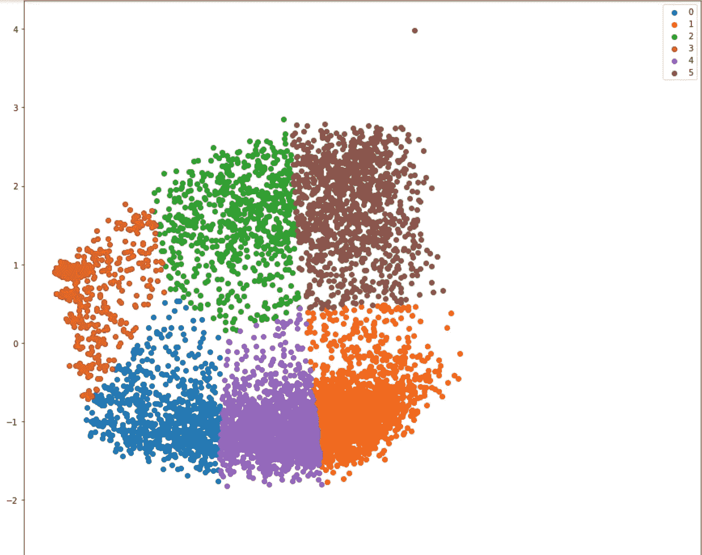
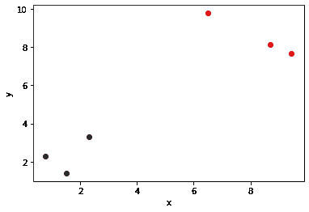
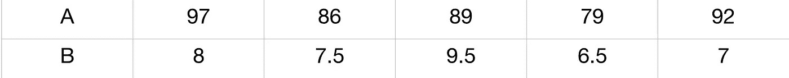
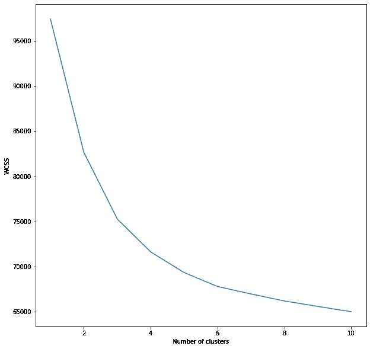
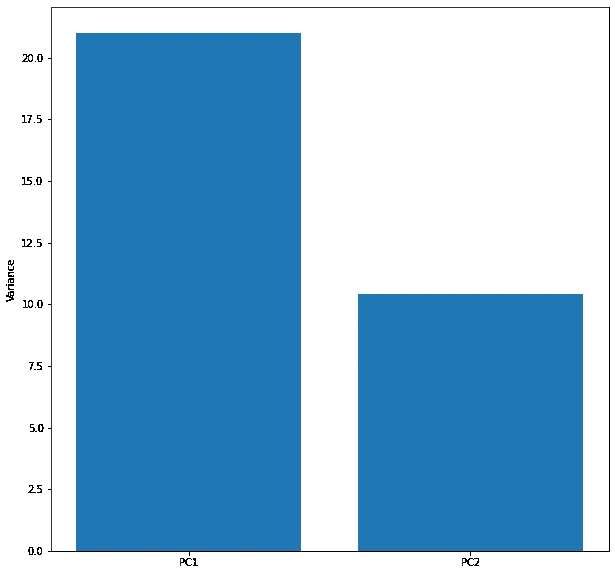
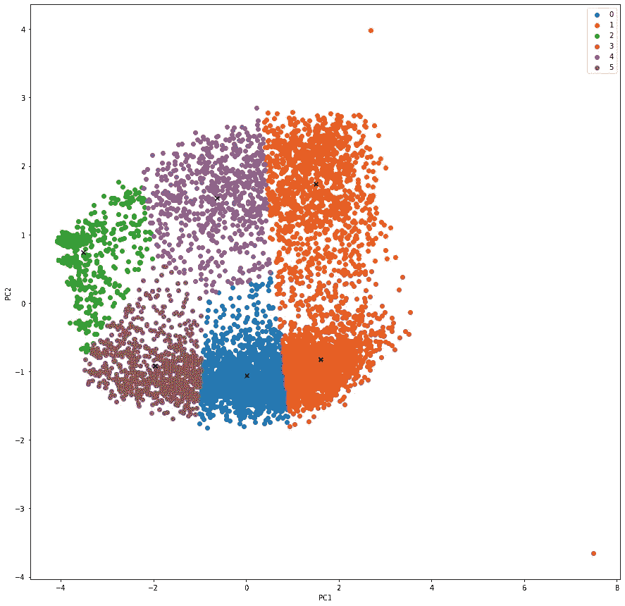

# 主成分分析在 K 均值聚类中的实现

> 原文：<https://medium.com/analytics-vidhya/implementation-of-principal-component-analysis-pca-in-k-means-clustering-b4bc0aa79cb6?source=collection_archive---------0----------------------->

## 初学者使用 Python 及其库将使用 2 个组件的 PCA 应用于 K 均值聚类算法的方法。



K 表示聚类后的结果

**先决条件**

本文假设你熟悉 PCA 背后的基本理论，K 表示算法，并了解 Python 编程语言。

k 均值聚类是最简单而有效的无监督算法之一。首先让我们简单描述一下这个算法的作用。

**K 表示算法** 假设我们有一个数据集，有两个特征 x1 和 x2。这是未标记的数据，我们的目标是找到 K 个彼此相似的组或“*簇*”。假设我们的训练集如下所示



简单的 K 表示集群

我们可以清楚地看到有两个集群，让我们将它们命名为*集群 0* 和*集群 1* 。每个聚类与每个聚类唯一的**质心**相关联。这个算法迭代直到质心不改变它的位置。

既然我们已经简要描述了 K 的含义，让我们继续进行主成分分析，以下简称 PCA。

**主成分分析**

我们可以很容易地看到前一个例子中的集群，因为它包含两个特征。比如说，1000 个特性呢？我不知道你怎么想，但是我绝对不能想象 1000 维！

因此，主成分分析开始发挥作用。这背后的基本思想是，它允许我们将数据集的维度(或特征)减少到小于当前特征数量的任何数量。

PCA 的另一个用途是压缩数据，从而节省计算时间。在下面的文章中，我们将使用 PCA 来解决这两个问题。

为了检查哪个主成分(PC)比其他成分更重要，也就是说哪个分量更重，我们计算每个成分的方差，然后绘制屏幕图来比较这些值。需要注意的一点是，如果您的数据具有不同的比例，如下所示



那么最好在继续之前进行特征缩放或均值归一化，因为如果不进行缩放，结果会偏向 a。

我不会深入研究每件事背后的数学原理，但是在本文结束时，您一定能够编写代码。我假设你熟悉 python 及其著名的库——**pandas**、 **numpy** 、 **matplotlib** 和 **sklearn** 。

# 让我们编码吧！

**关于数据集**:包含 217 列爱好，其中 1 表示是。

因此，第一步将是导入所有必要的库。

```
import numpy as np
import pandas as pd
import matplotlib.pyplot as plt
from sklearn.cluster import KMeans
from sklearn.decomposition import PCA
```

下一步是加载我们的数据集。我从 [Kaggle 下载了一个数据集。](https://www.kaggle.com/rainbowgirl/clustering-categorical-peoples-interests)

```
df = pd.read_csv("kaggle_Interests_group.csv")
```

下一步是数据预处理。数据有很多 NaN 值，因此我们无法训练模型。所以我们简单地用这些代码把它们替换成 0。

```
df.fillna(0, inplace = True)
```

正如我们在数据集中看到的，我们不需要前两列，所以我们将把剩余的 217 列赋给变量 x。

```
x = df.iloc[:,2:]
```

现在让我们继续构建和训练模型。尽管在数据集中指定了包含 4 个组，但是我们仍然要实现“*肘方法*来确定聚类的数量。这可以通过使用 WCSS(数据点距离的平方和)来完成

```
wcss = []
for i in range(1,11):
   model = KMeans(n_clusters = i, init = "k-means++")
   model.fit(x)
   wcss.append(model.inertia_)
plt.figure(figsize=(10,10))
plt.plot(range(1,11), wcss)
plt.xlabel('Number of clusters')
plt.ylabel('WCSS')
plt.show()
```

这将给出下图作为输出



图表找出适当的集群数量

很明显，这个数据集没有特别的界限，所以在本文中，我将使用 6 个集群。作为练习，您可以使用 4 个集群来实现它。

下一步是将我们的数据集从多维转换成二维。

```
pca = PCA(2)
data = pca.fit_transform(x)
```

在初始化 PCA()函数时，可以指定任意数量的维数/特征，但是为了简单起见，我使用了 2。如果您使用 2 个以上的组件，您可以使用前两个具有最高方差值的组件来训练和可视化数据集。

这里我们使用了 fit_transform()函数来拟合数据集 x 并对其进行降维。这将返回一个 2x2 维度的 ndarray。

接下来，我们绘制并检查组件的方差。

```
plt.figure(figsize=(10,10))
var = np.round(pca.explained_variance_ratio_*100, decimals = 1)
lbls = [str(x) for x in range(1,len(var)+1)]
plt.bar(x=range(1,len(var)+1), height = var, tick_label = lbls)
plt.show()
```

这将返回以下屏幕截图



不同成分的差异水平

现在，我们将根据 PCA()生成的新特征来训练我们的模型。由于我们只有 2 个主成分(PC1 和 PC2)，我们将得到一个有 6 个聚类的 2D 图。

```
centers = np.array(model2.cluster_centers_)
model = KMeans(n_clusters = 6, init = "k-means++")
label = model.fit_predict(data)
plt.figure(figsize=(10,10))
uniq = np.unique(label)
for i in uniq:
   plt.scatter(data[label == i , 0] , data[label == i , 1] , label = i)plt.scatter(centers[:,0], centers[:,1], marker="x", color='k')
#This is done to find the centroid for each clusters.
plt.legend()
plt.show()
```

这是我们得到的散点图。



PC1 与 PC2 图，标有质心

万岁！我们已经成功地用 PCA 编码并实现了 K 均值聚类。拍拍自己的背；)

你可以在这个 [GitHub](https://github.com/wamz101/K-Means-Cluster) 链接上查看 python 笔记本和数据集。

这里是上面文章中使用的数据集的 [Kaggle](https://www.kaggle.com/rainbowgirl/clustering-categorical-peoples-interests) 链接。

感谢您的阅读！