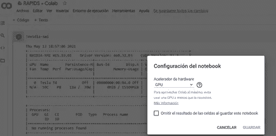
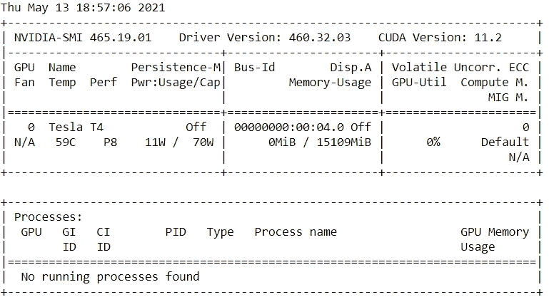
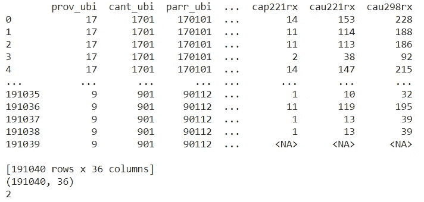
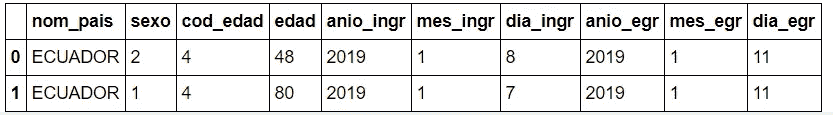
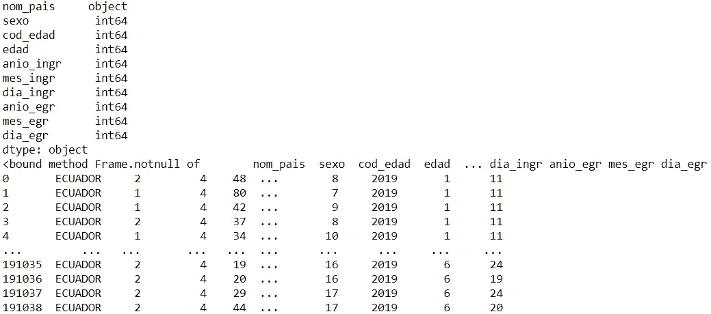
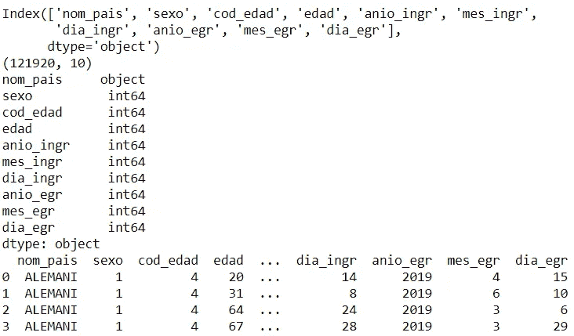

# 对厄瓜多尔 2019 年医院出院对应的一组开放数据实施 RAPIDS + Google Colabority

> 原文：<https://medium.com/analytics-vidhya/implementation-of-rapids-google-colabority-for-a-set-of-open-data-corresponding-to-hospital-5b84d49077ab?source=collection_archive---------5----------------------->


这个博客的想法是了解 RAPIDS 图书馆和 Google Colabority (Colab)平台的一部分是如何工作的，以便能够使用专注于数据科学的新技术，以及我们如何利用它们。

Google Colabority 是一个基于 Jupyter Notebook 的免费 Google 环境平台，允许在像 Google Chrome 这样的浏览器中编写和执行 python 代码，它不需要任何所需的配置，它具有免费的 GPU 访问和代码共享的便利性，并预装了 linux 操作系统。

Google Colabority 允许创建数据科学、机器学习和深度学习的模型，它将个人机器从过于繁重、耗时耗力的工作中解放出来。

RAPIDS 开源库提供了在 GPU 上运行端到端分析和数据管道的能力，专注于常见的数据科学和数据准备任务。包括一个熟悉的 dataframe API，它集成了各种机器学习算法，用于端到端流水线加速，而无需支付典型的序列化成本

RAPIDS 大大加快了对更大规模数据集的处理和训练，使数据科学家在解决最复杂的业务挑战方面实现了巨大的性能飞跃，例如预测信用卡欺诈、预测零售库存和了解客户行为等。

对于 RAPIDS 的安装，执行环境必须启用 GPU，进行这种更改对使用库很重要，因为它与 GPU 一起工作。



GPU Google Colabority 运行时环境

通过编写下面一行代码来验证 Colab 正在使用的 GPU 的类型；通常最适合的预装 GPU 是特斯拉 T4。

```
!nvidia-smi
```



Colab 中的 GPU 类型

接下来，它使用以下代码行安装完整的 RAPIDS 库，它对应于与 Colab 的 Python 版本兼容的 Miniconda 的最新版本，并安装 RAPIDS stable 0.19 库，其中包括 cuDF、cuML、cuSpatial、cuSignal 和 xgboost。

```
*# Install RAPIDS*
!git clone https://github.com/rapidsai/rapidsai-csp-utils.git
!bash rapidsai-csp-utils/colab/rapids-colab.sh stable

**import** **sys**, **os**, **shutil**

sys.path.append('/usr/local/lib/python3.7/site-packages/')
os.environ['NUMBAPRO_NVVM'] = '/usr/local/cuda/nvvm/lib64/libnvvm.so'
os.environ['NUMBAPRO_LIBDEVICE'] = '/usr/local/cuda/nvvm/libdevice/'
os.environ["CONDA_PREFIX"] = "/usr/local"
**for** so **in** ['cudf', 'rmm', 'nccl', 'cuml', 'cugraph', 'xgboost', 'cuspatial']:
  fn = 'lib'+so+'.so'
  source_fn = '/usr/local/lib/'+fn
  dest_fn = '/usr/lib/'+fn
  **if** os.path.exists(source_fn):
    print(f'Copying **{**source_fn**}** to **{**dest_fn**}**')
    shutil.copyfile(source_fn, dest_fn)
*# fix for BlazingSQL import issue*
*# ImportError: /usr/lib/x86_64-linux-gnu/libstdc++.so.6: version `GLIBCXX_3.4.26' not found (required by /usr/local/lib/python3.7/site-packages/../../libblazingsql-engine.so)*
**if** **not** os.path.exists('/usr/lib64'):
    os.makedirs('/usr/lib64')
**for** so_file **in** os.listdir('/usr/local/lib'):
  **if** 'libstdc' **in** so_file:
    shutil.copyfile('/usr/local/lib/'+so_file, '/usr/lib64/'+so_file)
    shutil.copyfile('/usr/local/lib/'+so_file, '/usr/lib/x86_64-linux-gnu/'+so_file)
```

在这个例子中，我们将只使用 RAPIDS cuDF 库，它将允许我们执行 ETL 过程(提取、转换和加载),以便理解我们正在处理的数据并对其进行整形，同时使其对一般用户来说是可理解的。

首先，我们开始在 Colab 中添加数据，这几行代码对于添加 CSV、JSON 等文件是必不可少的，数据大小为 136 MB，包含 1048576 行信息，这显然是很大的数据，因此我们可以更好地利用 RAPIDS 进行 ETL 过程。

```
**from** **google.colab** **import** filesdataEgresos = files.upload()
```

导入用于 ETL 的 RAPIDS cuDF 库，并加入各自的特性，允许读取 CSV 文件和 sep 函数，用“；”分隔每一列并对信息留下印象，以确定它是否能够脱颖而出。

```
**import** **cudf**

gdfData = cudf.read_csv('dataEgresos.csv', sep=';')*#Data information*
print(gdfData) #Data information
print(gdfData.shape) #How many rows and columns of the data
print(gdfData.ndim) #Data dimension
```



数据信息

它所处理的数据对应于厄瓜多尔 2019 年的医院出院人数，由[国家统计和人口普查研究所提供。](https://www.ecuadorencifras.gob.ec/institucional/home/)

在这种情况下，它总是取决于您正在处理的数据的类型，以确定一个可行的结论，允许您给予数据最大的重要性。

现在，我们继续转换数据，即清除空值，如果信息是可理解的，则消除重复值。

```
*#Start to carry out the data transformation process*

*#Remove columns of the data that have no relevance*
gdfNewEgresos = gdfData.drop(columns=['prov_ubi', 'cant_ubi', 'parr_ubi', 'area_ubi', 'clase', 'tipo', 'entidad', 'sector', 'mes_inv', 'nac_pac', 'cod_pais', 'etnia', 'prov_res', 'cant_res', 'parr_res', 'area_res', 'fecha_ingr','dia_estad', 'fecha_egr', 'con_egrpa', 'esp_egrpa', 'cau_cie10','causa3', 'cap221rx', 'cau221rx', 'cau298rx'])

*#View the data again and print two rows of information*
gdfNewEgresos.head(2)
```



*再次查看数据并打印两行信息*

使用 cuDF 特性:dtypes 和 notnull 检查每一列的数据类型，并详细说明数据中是否有 null 值。

```
*#verify the data type of the data*
print(gdfNewEgresos.dtypes)

*#check for null or empty values*
print(gdfNewEgresos.notnull)
```



数据类型和空值

我强调，就空值和每列的数据类型而言，数据是正确的，因此没有进行修改，但当发现不清楚的数据时，这些是验证我们正在处理的内容以及未来可以做什么的主要步骤。

现在我们可以做的是消除重复值，这样我就可以看到数据中有重复值，所以有必要完成这一步并重置索引(不要取数据的一般值，如果不重新开始从 0 到最后一行进行计数)。

```
*#Delete rows with duplicate values*
gdfNewEgresos = gdfNewEgresos.drop_duplicates()

*#reset the index*
gdfNewEgresos = gdfNewEgresos.reset_index()
gdfEgresos =  gdfNewEgresos.drop('index', axis=1)
```

在这种情况下，由于我们已经完成了数据转换过程，我们要做的是再次探索信息并验证结果。

```
*#Explore the already transformed data*
print(gdfEgresos.columns) #data columns
print(gdfEgresos.shape) #How many rows and columns of the data
print(gdfEgresos.dtypes) #data type of each column
print(gdfEgresos.head(4)) #data information only with 4 rows
```



数据探索

我强调，cuDF 库有许多功能可以使用和探索，它类似于熊猫，如果你熟悉这个库，cuDF 会让你很容易学会。

最后，我们要做的是将转换后的数据加载到一个新的数据集(CSV)中。在这一步中，我们使用 cuDF to_csv 特性完成了 ETL 过程，该特性允许我们将数据转换为新的 csv 文件，并继续将该文件下载到我们的个人计算机上。

```
*#Load the data to a new CSV*
Egresos_Data = 'Ecuador_Egresos.csv'
gdfEgresos.to_csv(Egresos_Data)*#Download the data*
**from** **google.colab** **import** files

files.download('Ecuador_Egresos.csv')
```

# **结论**

目前，数据科学的一个关键部分是数据探索，随着信息的增加，在 CPU 上运行的 ETL(提取、转换、加载)过程变得缓慢而繁琐。RAPIDS 为用户提供了一种简化的方法，在这种方法中，数据最初被加载到 GPU 上，计算任务可以直接在其上执行，随着数据的增长，该库获得了用户体验和性能的重要组合。Colab 是一个出色的平台，允许在云中使用 GPU 的能力，这使得那些在个人计算机上没有 GPU 的开发人员更容易使用它，到目前为止，Colab 我正在使用它来翻译一些项目以及练习数据科学。

一些参考资料:

[激流](https://rapids.ai/index.html)，[协作室](https://colab.research.google.com/notebooks/intro.ipynb?hl=es-419)。RAPIDS 开源库，Google 合作实验室

GitHub:

【https://github.com/JoseGuarnizo/RAPIDS-COLAB 