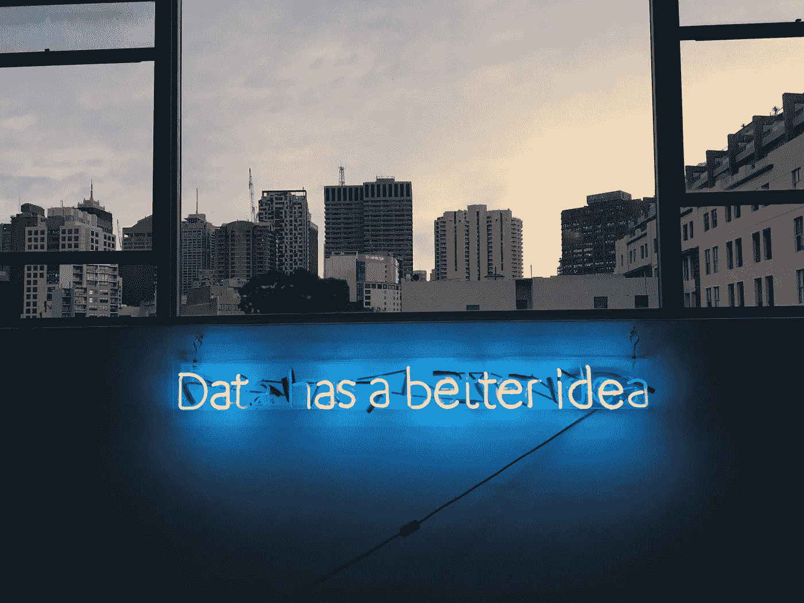

# 使用 Keras 实现正则化技术(L1 和 L2)

> 原文：<https://medium.com/analytics-vidhya/implementation-of-regularization-techniques-l1-l2-in-keras-e0b39cb6a81d?source=collection_archive---------5----------------------->

弗兰基·查马基在 [Unsplash](https://unsplash.com/s/photos/ai?utm_source=unsplash&utm_medium=referral&utm_content=creditCopyText) 上拍摄的照片

构建最佳性能人工智能解决方案的一般思想是访问高质量的数据集并选择最佳算法。然而，为大银行解决现实世界的问题教会了我构建智能系统时经常被忽视的一个方面——优化机器学习模型。