# 从头开始实现深度神经网络

> 原文：<https://medium.com/analytics-vidhya/implementing-a-deep-neural-network-from-scratch-8ed9988d2e4d?source=collection_archive---------4----------------------->

# 介绍

在我写的前一篇文章([https://medium . com/analytics-vid hya/new-to-Neural-Networks-544 ca 4d 6 dacd](/analytics-vidhya/new-to-neural-networks-544ca4d6dacd))中，我回顾了神经网络的语义，并简要地谈到了深度神经网络的概念。这一次我将讨论用代码实现一个深度神经网络的实际实现，所以预计这将需要更多的动手操作。我再次假设读者提供了 Python、Matplotlib、Keras 和 Numpy 的基础知识。然而，我会尽可能地描述代码。

这个实现的目标是建立一个可以对对象进行分类的深度神经网络。选择对象分类作为使用 DNN 解决的第一个问题的原因是，对象分类是人工智能领域中一些更复杂的用例及问题的重要基础。此外，在过去的十年中，对象分类已经成为神经网络新手入门应用的一个主要部分。

我将只使用 Numpy 来实现它，以便让您能够一窥究竟，并更仔细地了解事情实际上是如何工作的，但是还有更优化和更有效的方式来构建库和框架形式的模型，如 Tensorflow 和 PyTorch(我们将在这里简单地使用 Keras 的 Tensorflow 实现来加载数据集，我将在以后的文章中仅使用 Tensorflow 或 PyTorch 来实现更健壮的模型)。

我有很多东西要看，我们在这里仅仅触及了 DL 或 AI 的皮毛，所以请耐心等待！

# 导入库，加载和浏览数据集

第一步是加载数据集来训练我们的算法。为了简单起见，我们将通过 Keras 使用 CIFAR-10 数据集。

根据 Keras 文件:

> 这是一个由 50，000 张 32x32 颜色训练图像和 10，000 张测试图像组成的数据集，分为 10 个类别。

数据集中可用的 10 个对象类(标签)是:

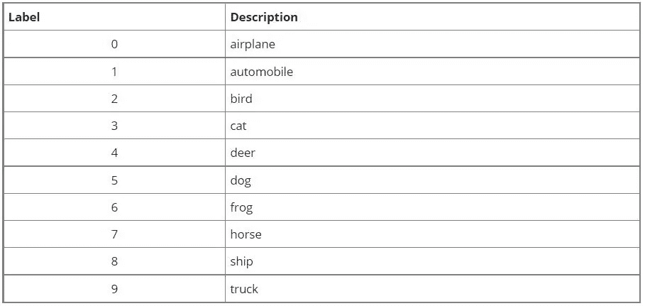

现在，让我们创建一个 Jupyter 笔记本并导入 numpy、matplotlib 和 tensorflow-keras 的数据集模块:

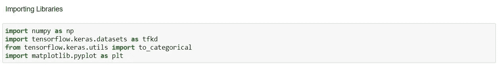

图 1:导入库

接下来，让我们从 Keras 加载数据集，并使用 matplotlib 从我们的训练数据中绘制一幅图像:

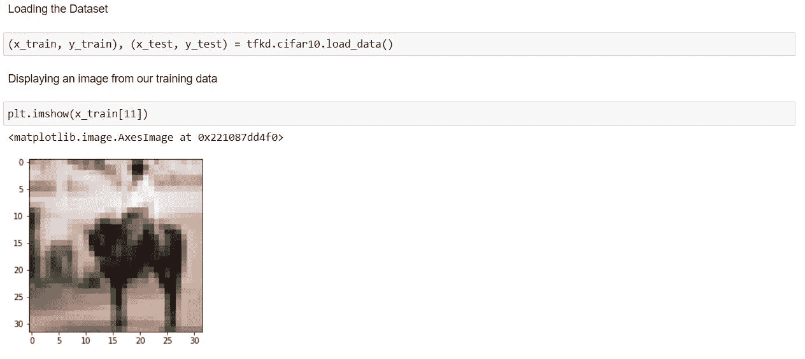

图 2:加载数据集并将其可视化

请注意，该图像是一个对象(在本例中，是一匹马或标签 7)的低分辨率表示。

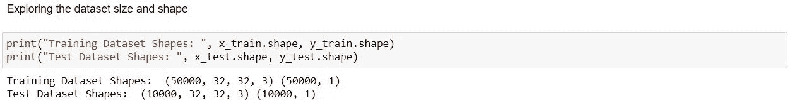

图 3:数据集形状

我们的训练数据包含 50000 张 32x32 像素和 3 个通道的图像，而测试数据集包含 10000 张图像——正如文档中提到的。

这不是我们想要的数据，也就是说，图像的形式不适合输入到我们的算法中，我们希望将图像展平为一个矢量，并希望归一化数据集中的像素值。

让我们为此创建一个效用函数:

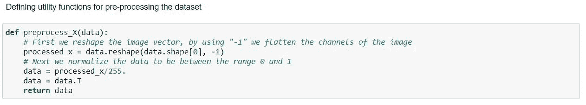

图 4:预处理效用函数

现在让我们使用这个函数来处理我们的数据集:

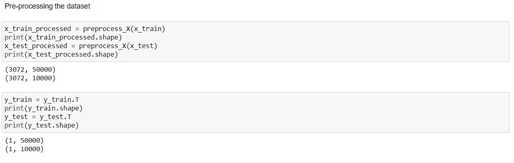

图 5:数据预处理

# 构建我们的 DNN 模型

我们将使用的深度神经网络架构基本上是:

***输入* →( *线性*→*RELU)*×*(L-1)*→*线性* → *乙状结肠* → *输出***

## **初始化我们的参数:**

作为构建 DNN 的第一步，我们需要初始化稍后在模型中学习的参数。

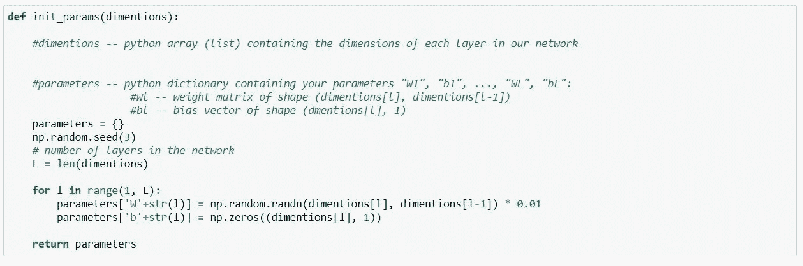

图 6:初始化参数

上面的函数将所有层的尺寸作为一个参数，然后返回一个字典“parameters ”,其中包含:

1.  随机初始化的权重“w”
2.  初始化为零偏差“b”

接下来，让我们定义一个效用函数来为我们计算激活函数，这在后面会非常有用:

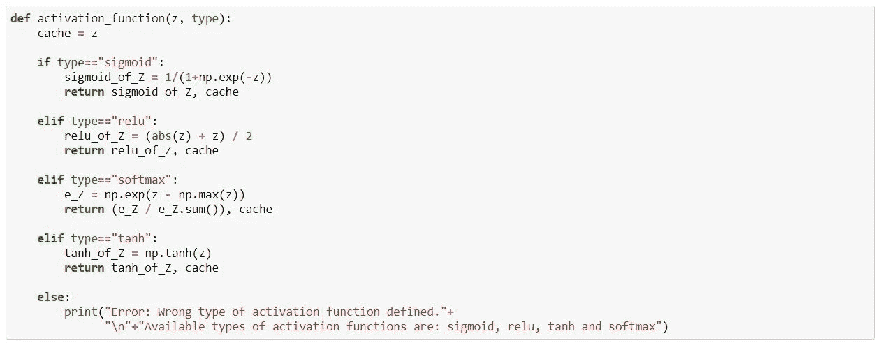

图 7:激活功能效用函数

上面的这个函数将预激活“z”和一个字符串“type”作为输入参数，并基于给定的类型，简单地计算 z 上的激活并返回它。

## **实现正向传播:**

现在，在我们编写正向传播函数之前，我们需要编写两个辅助函数，一个用于计算预激活，另一个用于计算激活。

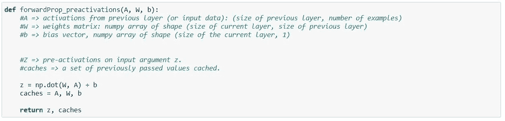

图 8:预激活计算

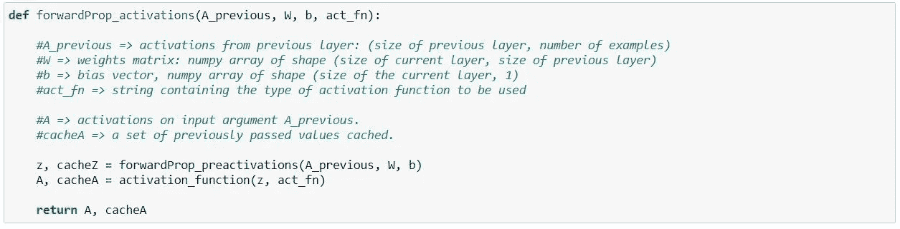

图 9:激活计算

现在我们已经准备好了这些助手函数，我们可以编写我们的正向传播函数了。

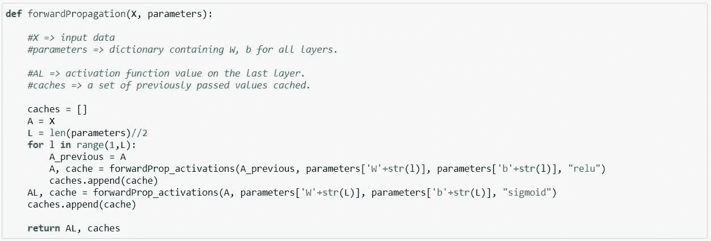

图 10:正向传播函数

## 计算损失:

现在我们已经实现了正向传播，我们需要计算正向传递的开销。我们将对此使用交叉熵损失，然后对数据进行平均以获得成本。

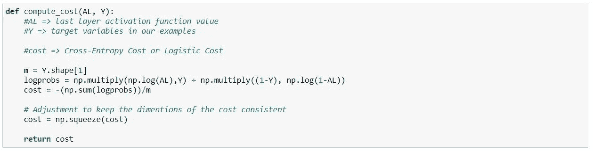

图 11:计算成本

## 实现反向传播:

我们需要写一个函数来反向计算激活，也就是说，利用我们将要计算的导数。这是一个效用函数:

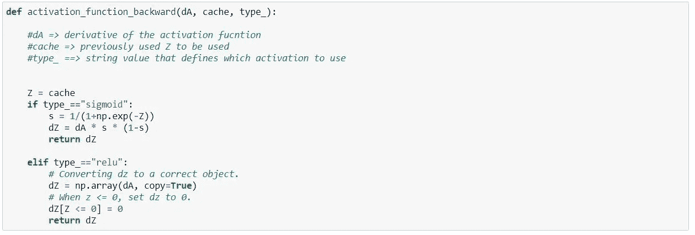

图 12:反向激活

正如我们对前向传播所做的那样，在我们编写反向传播函数之前，让我们先编写一些辅助函数，将代码分成几段，使其更加健壮和易于理解。

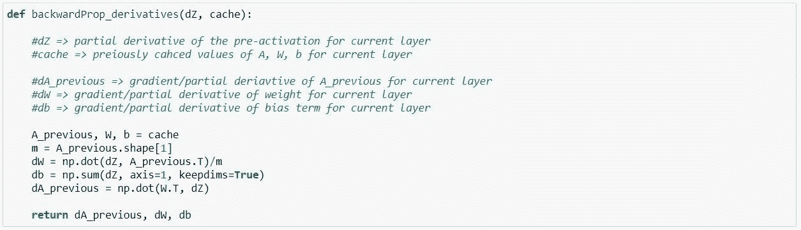

图 13:计算导数

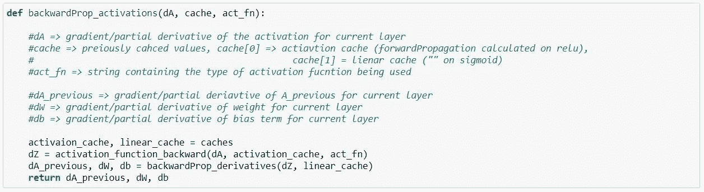

图 14:计算反向激活

最后，让我们用我们写的这三个函数来实现反向投影

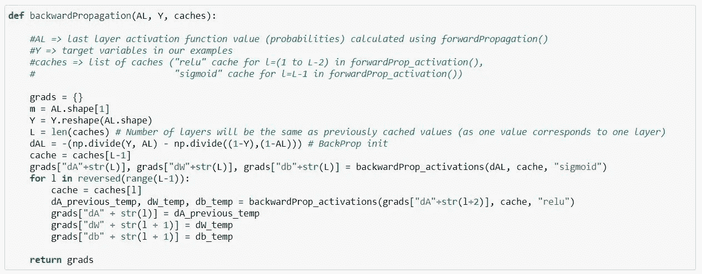

图 15:反向传播

我们现在已经计算出梯度并存储在名为“梯度”的字典中。让我们用这些梯度来更新参数。

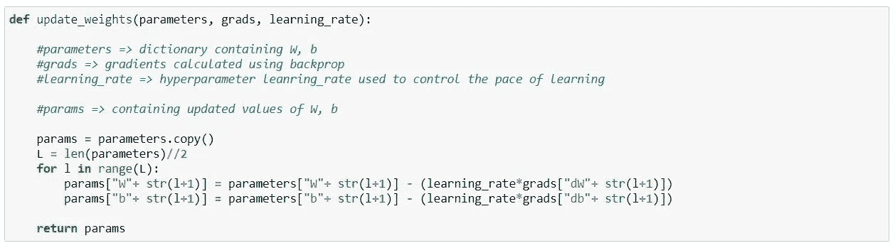

图 16:更新参数

## 型号:

现在，我们已经将所有的拼图放在了一起，准备放在一起——所以让我们在主模型函数中使用所有这些函数来生成深度神经网络。

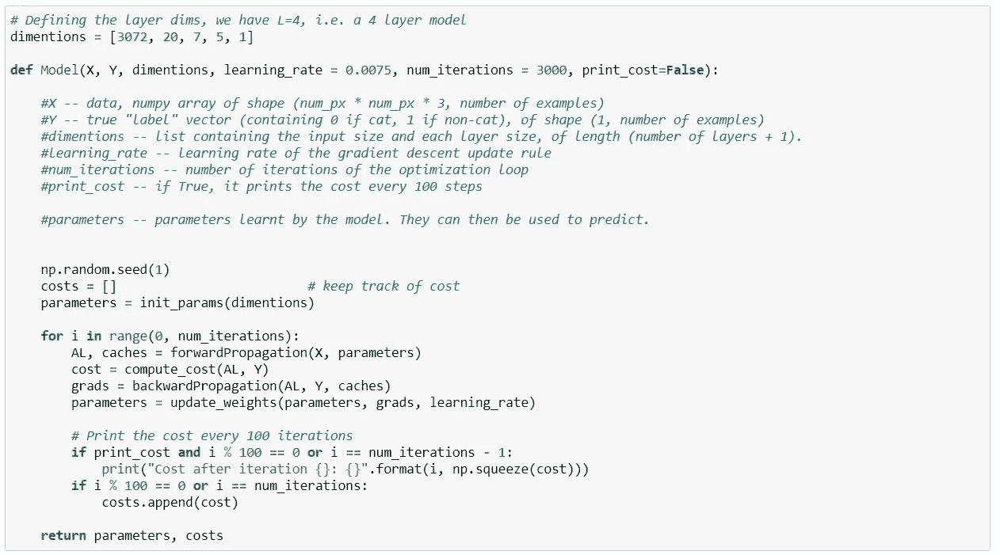

图 17:四层 DNN 模型

接下来，我们训练模型进行 2000 次迭代:

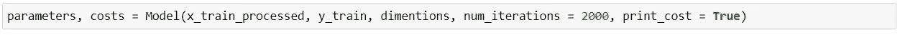

图 18:训练模型

一旦模型完成训练，我们最终可以继续进行预测。

# 预言

我们将使用从上一节中定义的 Model()函数返回的训练参数来预测图像中的对象(标签)。

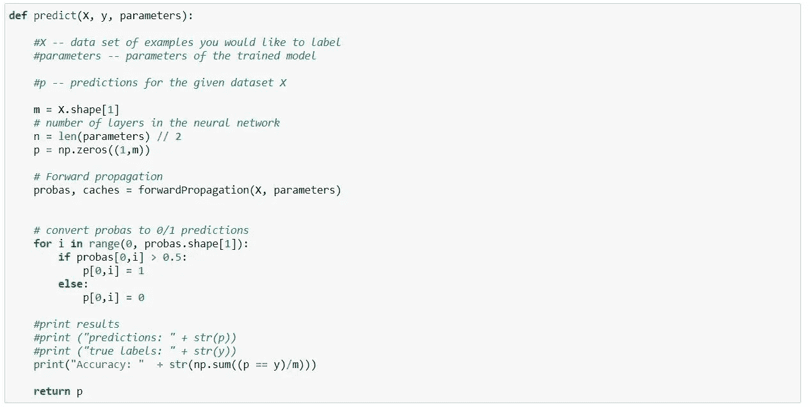

图 19:做出预测

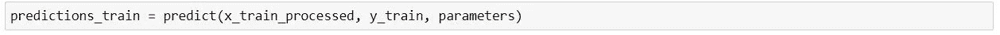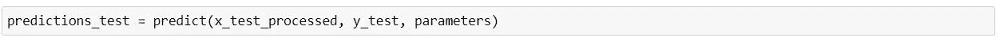

# 结论

我们已经实现了一个 4 层 DNN，看到了如何训练它，并使用训练值进行预测。

然而，当你自己尝试时，你会发现准确率达到了 80% +-5%左右的上限，这不一定是坏的，但还有很大的改进空间。这可以通过超参数优化来实现。

此外，计算机视觉任务更适合更强大的算法，如 CNN。它们有些复杂，从头开始训练需要更多的计算。这就是为什么通常的做法是使用预训练权重进行微调(迁移学习)，而不是自己从头开始训练模型。

我们将通过开源实现和预先训练的模型权重来回顾迁移学习的使用。就这样吧，我大概一个月后回来。