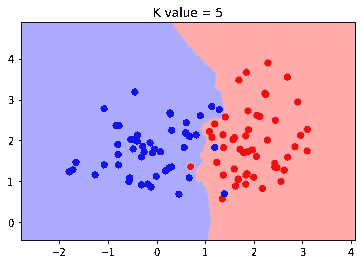

# 从头开始实现 K-最近邻

> 原文：<https://medium.com/analytics-vidhya/implementing-k-nearest-neighbours-from-scratch-1c5d62503067?source=collection_archive---------20----------------------->

KNN 是实践中最简单、最常用的算法之一。您以前一定听说过或实现过这种技术。在任何领域，直观地理解技术总是更好的，因此在本文中，我尝试在只知道理论知识的情况下从头实现 KNN。

对于不知道什么是 KNN 的人，我将用几句话来总结一下。

假设您有一个包含两个数字要素和两个分类标签的 2D 数据集。假设你绘制了这些数据的散点图，你会得到这样的结果。



从图中，你可以很容易地将它分为两类，如果我问你，在蓝色星团附近给出一个新的点 Q，你能告诉我它属于哪一类吗？

你会很快说蓝课。我们可以说，只看新数据点的位置。但是你能告诉我们你是如何得出这个结论的吗？是的，你的答案是 KNN！

所以 KNN 主要做的是计算给定查询数据点的 K 个最近邻(在这个例子中是 Q)。在找到邻居之后，Q 被认为是在它的大多数邻居所属的类中。我们可以根据数据集取最适合的 K 值。我们通常选择奇数值。

KNN 被广泛用于 ML 目的，但它主要依赖于我们正在处理的数据。特定的模型不是在 KNN 创建的，但是训练数据集就是模型！这就是为什么 KNN 被称为基于实例的学习。

为了从头开始实施 KNN，我们将完成以下任务:

1.  为测试目的导入虚拟数据。
2.  创建类 KNN 并为其实现方法。
3.  最终确定结果

让我们开始一步一步地实现我们的算法。

1.  **为测试目的导入数据。**

为了检查我们的模型之前和之间的工作情况，我们将使用著名的 Iris 数据集。Iris 数据集是通过考虑花瓣和萼片的长度和宽度对三种花进行分类。导入数据后，我们将按照 80-20 的比例对数据进行分类，以便进行培训和测试。

```
from sklearn *import* datasetsfrom sklearn.model_selection *import* train_test_splitiris = datasets.load_iris()
X, y = iris.data, iris.targetX_train, X_test, y_train, y_test = train_test_split(X, y, *test_size*=0.2, *random_state*=1)
```

**2。创建类 KNN 并为其实现方法。**

首先，我们将创建一个接受 k 值的 KNN 类

```
class KNN: def **__init__**(*self*,*K*=5): super().__init__() self.K=K
```

在创建了 KNN 类之后，我们需要为它创建两个在实践中常用的方法。这些方法是。适合和。预测

Fit-特定于 KNN fit 方法的作用是将训练数据和目标存储在模型中。正如我前面所说，KNN 是一个基于实例的学习模型，这意味着它只在运行时学习特定查询点的数据。这意味着我们的 fit 方法将只包含存储特定对象的数据。

```
def **fit**(*self*,*X*,*y*): self.XTrain=X self.yTrain=y
```

predict——我们算法的关键就在于这个函数。我们想要得到的是所有点离查询点的距离。我们可能有一个单一的查询点或多个查询的可迭代数据，我们将处理这两种类型的数据。首先，我们将迭代这些查询，找到所有的距离并将它们存储在一个列表中。

```
def **predict**(*self*,*X*): predicted=[] #To store final results *for* single_X in X: distances=[dist(single_X,tP) *for* tP in self.XTrain] minimum=np.argsort(distances)[:self.K]
```

在上面的代码中，我调用了一个名为 dist()的函数来计算欧几里德距离，您将需要创建这个简单的函数，它将两个点作为输入，并给出它们之间的距离。你可以自己创建这个函数，也可以参考我的全部代码。您可能会想上面代码中的最后一行是做什么的。argsort()函数基本上返回我们作为参数传入的排序列表中的原始索引。此外，我们已经完成了列表切片。简而言之，这一行将返回距离列表中最小的 K 个距离的索引。

现在，我们要做的最后一件事是找到列表中的大多数点。我们将从存在于我们的 yTrain 中的点的索引中找到点的类别，并在我们的最终输出列表中附加最常出现的类别标签。这个最常见的类标签只是我们处理的单点的输出。

```
labels=[self.yTrain[i] *for* i in minimum]predicted.append(Counter(labels).most_common()[0][0])
```

现在我们将返回最终的输出列表。

嘭！！我们刚刚完成了算法的编码！

**3。最终确定结果**

现在是时候检查它是如何工作的了！请记住，我们已经将数据分成了 4 部分，现在是使用 y_train 和 y_test 的时候了。我们将 y_train 传递给我们的模型，我们的模型将给出预测值，稍后我们将检查有多少值实际上是正确预测的。

```
KNNmodel = KNN(*K*=5)KNNmodel.fit(X_train, y_train)predictions = KNNmodel.predict(X_test)print("Accuracy-", accuracy(y_test, predictions))
```

我已经创建了一个简单的 accuracy()函数，它告诉我们两个列表中相似值的百分比。

在第一次尝试中，我获得了 96.66%的准确度，但是后来我发现对于 K=3，准确度总是 100%，所以我们将只使用 K=3 的值。

这就是我们成功实现 K 近邻的方法。这是我们遵循的最简单的方法。我们仍然可以改进我们的算法，例如我们可以更精确地处理错误。接下来，我将尝试从头开始实现 KNN 的变体。我已经提供了完整代码的 Github 链接。非常感谢你方的任何建议或修改。

谢谢大家！

完整代码-[https://github . com/MautKaFarishta/Simple-Data-Scince-Projects/tree/master/ML _ From _ Scratch/KNN](https://github.com/MautKaFarishta/Simple-Data-Scince-Projects/tree/master/ML_From_Scratch/KNN)