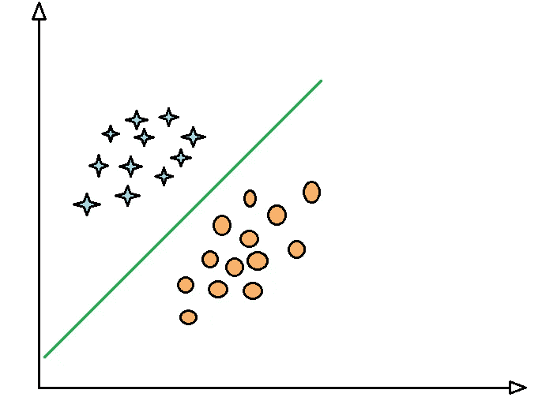
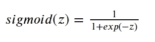
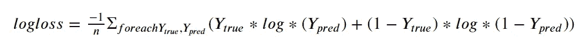
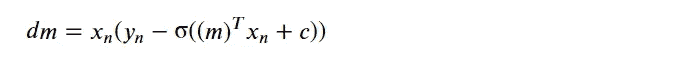
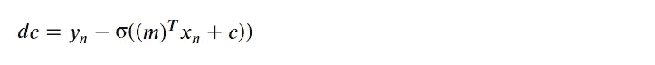

# 从零开始用 SGD 实现逻辑回归

> 原文：<https://medium.com/analytics-vidhya/implementing-logistic-regression-with-sgd-from-scratch-5e46c1c54c35?source=collection_archive---------1----------------------->

python 中逻辑回归的自定义实现。


[https://无量纲. in/逻辑回归-概念-应用/](https://dimensionless.in/logistic-regression-concept-application/)

大家好，

由于你只是出于好奇，在这里停下来看了一下逻辑回归这个标题，所以我将在整篇文章中满足你的好奇心。读完这篇文章后，你将对逻辑回归充满信心，你将能够自己实现它，当然你也能够向任何人解释它。不浪费你一点时间，我会慢慢满足你的好奇心，继续读下去。

你一定听说过**逻辑回归**，它是最著名的机器学习算法。逻辑回归是一种用于解决分类任务的机器学习算法。是的，即使它的名字包含“回归”术语，它也是一种**分类**算法，而不是**回归**算法，这基本上意味着当我们有任务将图像分类时，我们使用这种算法，例如将图像分为两类，比如它是属于猫还是狗。


好了，我们现在对什么是逻辑回归有了一些了解，LR 的另一个流行之处是它主要用于二分类问题，即有两个类别的问题。但是这也可以扩展到多类分类问题。逻辑回归假设我们将用于训练的数据点几乎或完全是线性可分的。请看下图，我们必须找到那条分隔蓝色星星和橙色圆圈的绿线。请记住，它可以是二维空间中的一条线，也可以是三维空间中的一个平面。



就像逻辑回归中的线性回归一样，我们试图找到斜率和截距项。因此，这里的平面/直线方程是相似的。

y = mx + c

但是，在逻辑回归的情况下，我们使用该方程的方式是不同的，不是将线拟合到点，而是试图找到正确分隔两种类型的数据点的线/平面。如果我们认为上图中的蓝色星星为 1，橙色圆圈为 0，我们必须预测数据点属于 0 或 1。所以为了这个目的有一个东西叫做 S **igmoid Function** ，这么一个花哨的名字。我们对我们的方程 **" *y=mx + c* "** 应用 Sigmoid 函数，即**Sigmoid(*y = MX+c*)**，这就是逻辑回归的核心。但是这个 sigmoid 函数在里面做什么，让我们看看，



这里，z = mx+c

我们使用这个函数来预测值属于类 0 还是类 1。但在此之前我们需要' ***m*** '和' ***c*** *'，*的广义值来对新的数据点进行预测。为此，我们使用优化算法来找到' ***m*** '和' ***c*** '的最佳值。我们将使用随机梯度下降(SGD)算法来执行优化。如果你没有太多接触渐变下降 [***点击这里***](/analytics-vidhya/gradient-descent-part-1-the-intuition-a154a6d43c2e)*阅读一下。*

*首先，让我们定义损失函数，*

**

*这里，' *Ytrue'* 为真值，' *Ypred'* 为预测值，*

**Ypred* =乙状结肠(mx+c)*

*现在，我们根据我们想要优化的参数来区分这个损失函数。所以这里我们要区分 w . r . t .*‘m’*和*‘c’*。*

****

*完成后，最重要的需求现在都满足了。让我们开始用 python 代码编写实现上述等式的代码，*

```
*# first let's import required libraries
**import numpy as np** # for mathematical operations**X =** # data points with some features which we want to train
**y =** # labels of all datapoints
# Initialize the weights and bias i.e. 'm' and 'c'
**m = np.zeros_like(X[0])** # array with shape equal to no. of features
**c = 0**
**LR = 0.0001**  # The learning Rate
**epochs = 50** # no. of iterations for optimization# Define sigmoid function
**def sigmoid(z):
 sig = 1/(1+np.exp(-z))
 return sig**# Performing Gradient Descent Optimization
# for every epoch
**for epoch in range(1,epochs+1):**
    # for every data point(X_train,y_train)
    **for i in range(len(X)):**
        #compute gradient w.r.t 'm' 
        **gr_wrt_m = X[i] * (y[i] - sigmoid(np.dot(m.T, X[i]) + c))**

        #compute gradient w.r.t 'c'
        **gr_wrt_c = y[i] - sigmoid(np.dot(m.T, X[i]) + c)** #update m, c
        **m = m - LR * gr_wrt_m**
        **c = c - LR * gr_wrt_c**# At the end of all epochs we will be having optimum values of '**m**' and '**c**'
# So by using those optimum values of 'm' and 'c' we can perform predictions**predictions = []****for i in range(len(X)):
 z = np.dot(m, X[i]) + c
 y_pred = sigmoid(z)
 if y_pred>=0.5:
  predictions.append(1)
 else:
  predictions.append(0)**# 'predictions' list will contain all the predicted class labels using optimum 'm' and 'c'*
```

*这就是我们如何使用 python 从头开始实现逻辑回归。我希望您一定喜欢这篇文章，并且一定很高兴自己尝试一下，所以不要浪费时间，去实现您自己的逻辑回归分类器，并使用它来执行预测任务。*

*非常感谢你一直坚持到最后，下一篇文章再见，到那时你会过得很愉快，继续学习。*