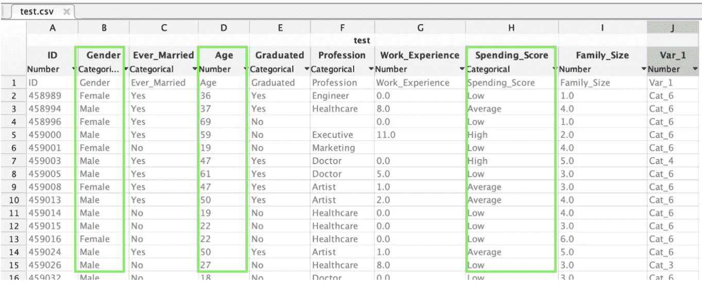
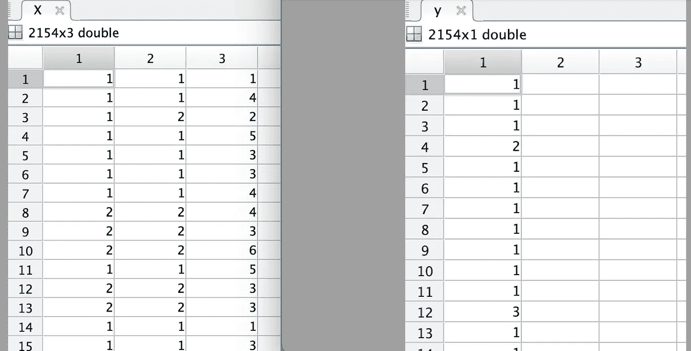
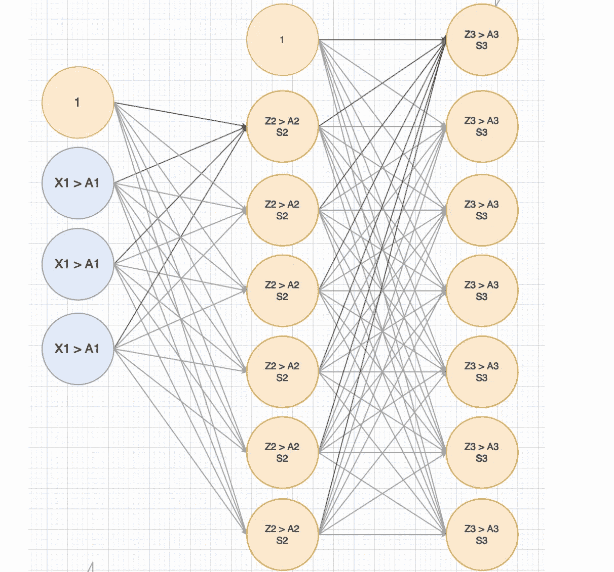
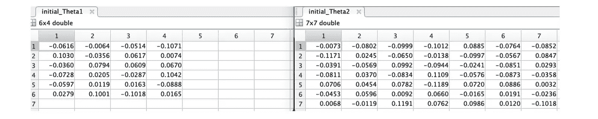
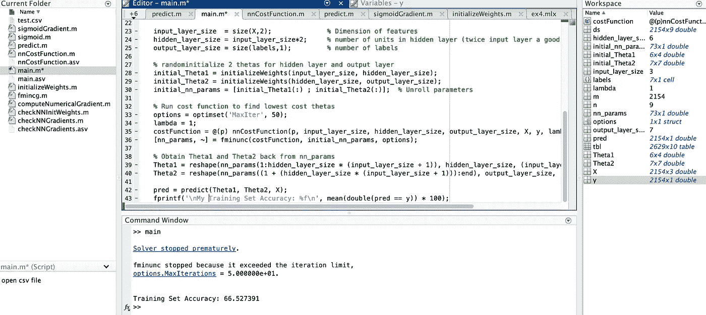
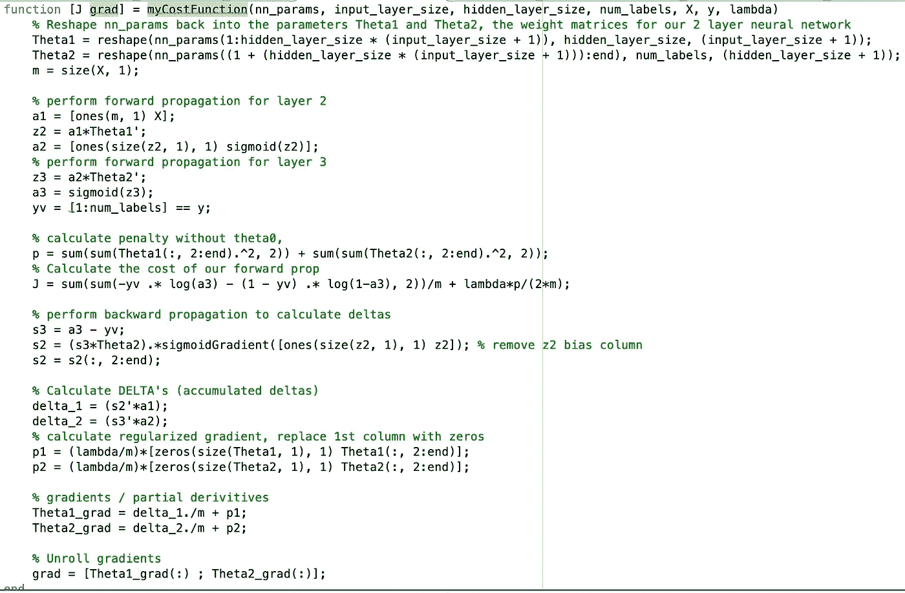

# 在 matlab 105 中实现神经网络

> 原文：<https://medium.com/analytics-vidhya/implementing-neural-networks-in-matlab-105-6b71c5872b3c?source=collection_archive---------8----------------------->


让我们实现一个神经网络，根据客户的关键特征对他们进行分类。一旦你理解了方程式，在 matlab 中运行神经网络就很容易理解了。

这是我的神经网络系列的第 5 部分。欢迎从 [part 1](https://shaun-enslin.medium.com/explaining-neural-networks-101-a36356113cbd) 开始。以下是之前解释成本函数的文章。

1.  [正向传播](https://shaun-enslin.medium.com/forward-propagation-deep-dive-102-bbeabe4d2fb2)
2.  [反向传播](https://shaun-enslin.medium.com/backward-propagation-deep-dive-103-60390714d2b0)
3.  [计算成本&坡度](https://shaun-enslin.medium.com/cost-and-gradient-calculation-in-neural-networks-deep-dive-104-2e16f26ce3f3)
4.  [计算坡度](https://shaun-enslin.medium.com/cost-and-gradient-calculation-in-neural-networks-deep-dive-104-2e16f26ce3f3)

这里用到的源代码可以从 [github](https://github.com/shaunenslin/machinelearning/tree/master/matlab/neuralnetworks/classification) 下载。剧透一下，我们只能得到 66%的准确率，但是，这是我们现有的数据；-)

提醒一下，这是我们从 [kaggle](https://www.kaggle.com/abisheksudarshan/customer-segmentation) 下载的数据集，你可以看这篇[文章](/geekculture/classifying-customers-with-logistics-regression-one-vs-all-f34ed2e5f042)来了解我们为什么选择下面的 3 个特性。



图 1

# 主程序

我们将有一些实用功能，但这些将被单独涵盖。让我们首先讨论主程序，它将有以下步骤:

1.  加载数据
2.  将我们的字符串字段标记为数值
3.  设置我们的神经网络大小
4.  初始化θ/重量
5.  成本优化以找到最佳 theta
6.  使用我们的最佳 theta 进行预测，以计算我们的训练集准确性

让我们一个一个地讨论这些

```
clear;% open csv file
tbl = readtable(‘test.csv’);% replace strings fields with labels and create dataset matrix
ds(:,1) = grp2idx(tbl{:,2});
ds(:,2) = grp2idx(tbl{:,3});
ds(:,3) = tbl{:,4};
ds(:,4) = grp2idx(tbl{:,5});
ds(:,5) = grp2idx(tbl{:,6});
ds(:,6) = tbl{:,7};
ds(:,7) = grp2idx(tbl{:,8});
ds(:,8) = tbl{:,9};
[ds(:,9),labels] = grp2idx(tbl{:,10});% remove rows with NaN in any field values
ds = rmmissing(ds);
[m,n] = size(ds);% Create X and y matrix
X = ds(:,[2 4 8]);
y = ds(:,n);
```

运行此步骤后，您应该会在 X 和 Y 矩阵中看到以下结果。



图 2

然后，我们可以设置我们的神经网络的大小，首先，下面是我们要放在一起的神经网络。



图 3

在下面的初始化中，确保实现了上述网络。

```
input_layer_size = size(X,2);           % Dimension of features
hidden_layer_size = input_layer_size*2; % # of units in hidden layer 
output_layer_size = size(labels,1);     % number of labels
```

现在，我们可以将θ初始化为随机的小值*(记住这些也叫做权重)*，你可以在图 4 中看到结果。

```
% initialise 2 thetas for hidden layer and output layer
initial_Theta1 = initializeWeights(input_layer_size, hidden_layer_size);
initial_Theta2 = initializeWeights(hidden_layer_size, output_layer_size);% Unroll parametersinitial_nn_params = [initial_Theta1(:) ; initial_Theta2(:)];
```



图 4

现在，我们可以运行我们的 fminunc 成本优化来找到最佳的 theta。 ***我们稍后会创建 myCostFunction。***

```
% Run cost function to find lowest cost thetas
options = optimset(‘MaxIter’, 50);
lambda = 1;costFunction = @(p) myCostFunction(p, input_layer_size, hidden_layer_size, output_layer_size, X, y, lambda);
[nn_params, ~] = fminunc(costFunction, initial_nn_params, options);
```

现在我们有了最好的θ值，让我们把它重新整形成 2 组θ值，这样我们就可以检查准确性了。

```
% Obtain Theta1 and Theta2 back from nn_params
Theta1 = reshape(nn_params(1:hidden_layer_size * (input_layer_size + 1)), hidden_layer_size, (input_layer_size + 1));Theta2 = reshape(nn_params((1 + (hidden_layer_size * (input_layer_size + 1))):end), output_layer_size, (hidden_layer_size + 1));
```

现在我们有了θ，我们可以保留它们用于以后的预测，但是让我们使用它们，现在检查我们的训练集准确性。

```
pred = predict(Theta1, Theta2, X);
fprintf(‘\nTraining Set Accuracy: %f\n’, mean(double(pred == y)) * 100);
```

运行您的解决方案后，您现在应该看到以下内容:



# 霉菌功能

我将在这里粘贴代码以供参考，但请阅读本系列的第 2、3 和 4 部分，以获得关于向前传播**、向后传播**以及计算成本和梯度的**的详细解释。代码也可以在 [github](https://github.com/shaunenslin/machinelearning/tree/master/matlab/neuralnetworks/classification) 中找到。**



# 其他实用功能

我不会详细讨论其他的实用函数，因为在本系列的前几篇文章中已经介绍了很多。同样，它们的代码在 [github](https://github.com/shaunenslin/machinelearning/tree/master/matlab/neuralnetworks/classification) 中，列表如下:

1.  乙状结肠梯度
2.  乙状结肠的
3.  初始化权重

# **结论**

我希望本系列已经为您提供了实现神经网络的良好概述。我已经给了你结果的截屏，让你看到每一步，希望有所帮助。

最后一句话，这个[课程](https://www.coursera.org/learn/machine-learning/home/welcome)非常棒。如果你想成为一名专家，那么这是你的课程。